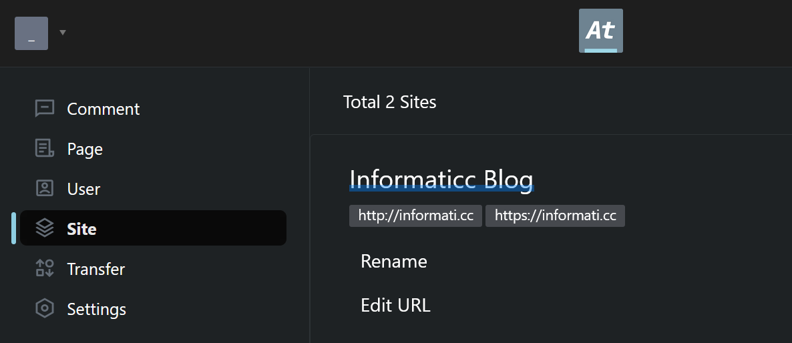

# Website

Hey! There are the files of https://informati.cc blog.

## Comments Setup

> Powered by [Artalk](https://github.com/ArtalkJS/Artalk)

### Frontend Setup

The configuration related to comments are stored in the `./src/components/Comments.jsx` file.

Look for the dictionary/object inside `Artalk.init({ ... })`. This is where you have the main configuration related to comments.

```javascript
Artalk.init({
  server: 'https://comments.informati.cc/',
  site: 'Informaticc Blog',
});
```

- `server` is the url of the self-hosted Artalk server.
- `site` should be the name of the project/site added via the web ui of Artalk.

The Artalk web dashboard should look like this:



Make sure to change the URL. This is for CORS. Just add it as follows:

```
http://informati.cc,https://informati.cc
```

If you want this to work while testing, temporarily add `http://localhost:3000` BUT make sure to remove it after testing. Or maybe have another **site** made in the web ui seperately for testing purposes.

### Backend Setup

`docker-compose.yml` file:

```yml
services:
  artalk:
    container_name: hirusha-informaticc-artalk
    image: artalk/artalk-go
    restart: unless-stopped
#    ports:
#      - 8080:23366
    volumes:
      - ./data:/data
    environment:
      - TZ=Australia/Melbourne
      - ATK_LOCALE=en
      - ATK_SITE_DEFAULT=informaticc
      - ATK_SITE_URL=https://comments.informati.cc
    networks:
      - intranet_1

networks:
  intranet_1:
    external: true
```

And the `Caddyfile` should look something like this assuming caddy also has access to that same (shared) network (`intranet_1` in this case).

```caddyfile
comments.informati.cc {
    reverse_proxy hirusha-informaticc-artalk:23366
}
```
