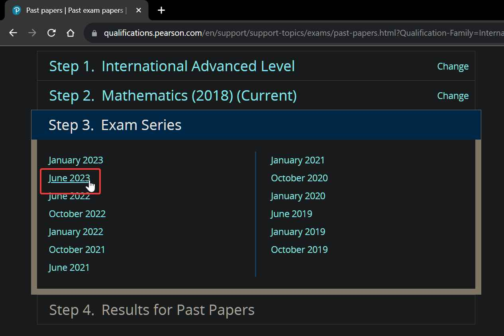
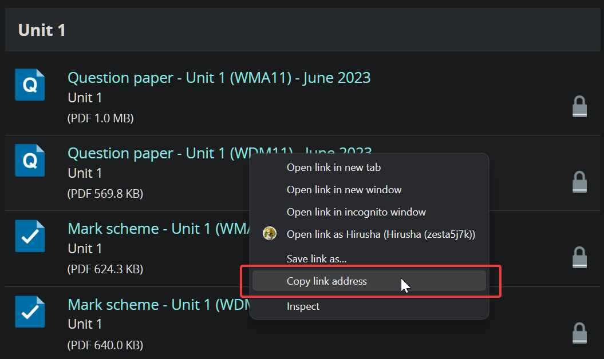
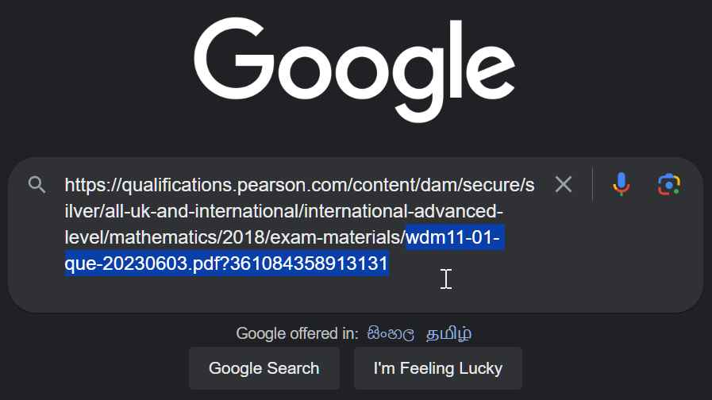
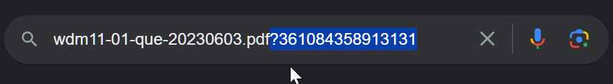
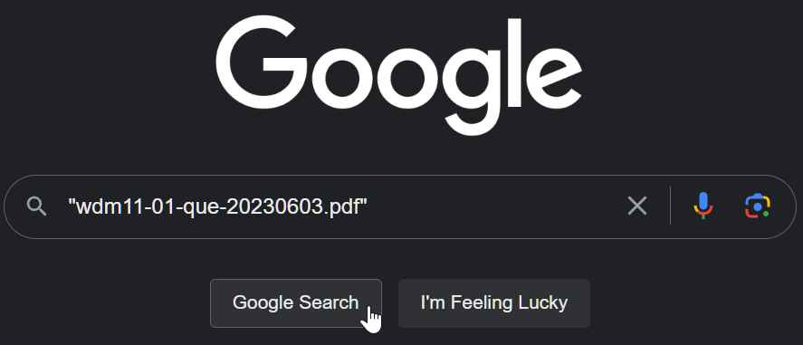
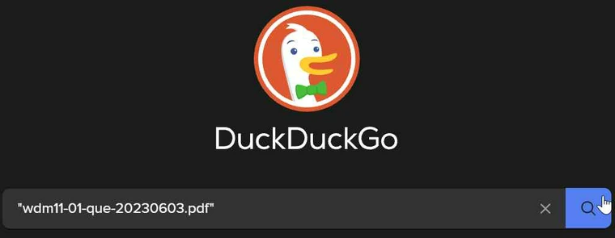
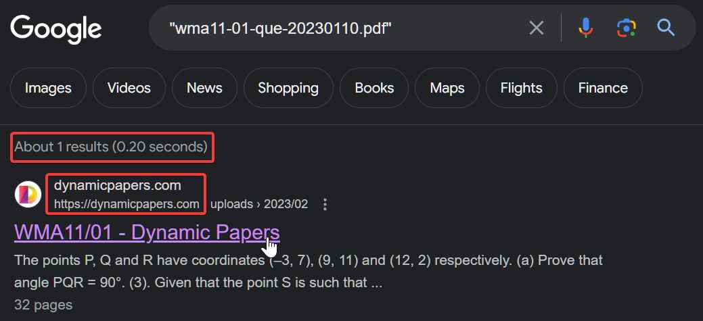

This guide explains how to access Edexcel past papers by analyzing URL structures and website configurations. It explores direct link access, potential misconfigurations, and ethical considerations. While the method may work under certain conditions, users are reminded to respect copyright laws and website terms of service.

<!--truncate-->

:::danger NOTE

Accessing past papers through methods that violate the terms and services of a website may be illegal and unethical. The following guide demonstrates a method that relies on certain website configurations and may not always work. It's important to respect copyright and usage terms.

:::


:::caution Note

This method has been tested with IGCSE and IAL past papers.

:::


## Method

1. Visit the official website of Pearson by [clicking here](https://qualifications.pearson.com/en/support/support-topics/exams/past-papers.html).

2. Select your qualification.

3. Choose your subject.


4. Select the exam series. For example, choose the latest June 2023 papers.



5. Right-click on the locked paper you want to access and copy the link address.



6. Paste the copied link somewhere you can easily select and manipulate its parts. Keep everything that comes after the last `/`.



7. Delete everything after the `?` in the link.



8. Put the `<filename>.pdf` into quotation marks and search for it either on [Google](https://google.com) or [DuckDuckGo](https://duckduckgo.com).





9. You will get a search result that includes the PDF file.



10. Open the PDF and enjoy studying. Good luck!

Please remember to use this method responsibly and respect the terms and conditions of the websites you visit.


## Analyzing the URL

```
https://qualifications.pearson.com/content/dam/secure/silver/all-uk-and-international/international-advanced-level/mathematics/2018/exam-materials/wma11-01-que-20230110.pdf?139251129265111
```

1. **Protocol:** `https` - This indicates that the URL uses the Hypertext Transfer Protocol Secure, which is a secure and encrypted version of HTTP used for web communications.

2. **Domain/Host:** `qualifications.pearson.com` - This is the domain name of the website where the resource is hosted. In this case, it's Pearson Qualifications, a well-known educational publisher and assessment service provider.

3. **Path:** `/content/dam/secure/silver/all-uk-and-international/international-advanced-level/mathematics/2018/exam-materials/wma11-01-que-20230110.pdf` - This represents the specific path to the resource on the server. It's a hierarchical structure that likely leads to the PDF file you mentioned, which appears to be an International Advanced Level Mathematics exam paper from 2023 from the 2018 Mathematics Syllabus.

4. **Query Parameter:** `139251129265111` - This is a query parameter appended to the URL. It could serve various purposes, but without context, it's unclear what it represents. It might be a unique identifier or timestamp, but its exact meaning depends on the website's functionality, which I have no idea of.

## Why it is accessible?

1. **Direct Link Access**: When you access the PDF file directly using its full URL (`https://dynamicpapers.com/wp-content/uploads/2023/02/wma11-01-que-20230110.pdf`), you can successfully open and view the file. This suggests that the file itself is publicly accessible.

2. **Access via Website**: When you visit the website's homepage (`https://dynamicpapers.com/`) and attempt to access the same PDF file through the website's navigation or links, you encounter restrictions or find it locked from public access.


This issue can be attributed to a misconfiguration in the website's access control settings or possibly a misconfigured link on their website.

- **Access Control Misconfiguration**: The website may have set up access control rules or permissions for different parts of the site. It's possible that the PDF file is intended to be accessible only via direct links, and the website's navigation system hasn't been properly configured to allow public access to the file.

- **Broken or Incomplete Links**: The links on the website may be broken or incomplete, leading to restrictions on accessing the file through the website's navigation. This could happen if the links are not correctly configured to point to the PDF file.

- **Authentication or Authorization Issue**: There could be a problem with the website's authentication or authorization system. If the website is supposed to restrict access to certain content to registered or authorized users, this system may not be functioning as intended.
