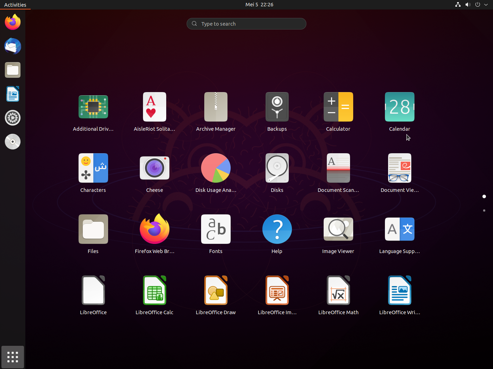

This guide covers essential Ubuntu packages and installation methods, including system updates, browsers, utilities, messaging apps, remote desktop tools, and development environments. It provides step-by-step installation for Docker, VS Code, and MongoDB Compass. Follow these instructions to optimize your Ubuntu setup for work, development, and daily use.

<!--truncate-->

import UbuntuManualSetup from './ubuntu_manual';



## Initial Setup

### Update & Upgrade Your System

It’s always a good idea to start by making sure your system is up to date. Run the following commands:

```bash
sudo apt update && sudo apt upgrade -y
```

### Install Required Packages

Install the essential packages that you’ll need:

```bash
sudo apt install python3 git curl wget -y
```

## Packages not available with `apt`

#### Browsers

If you prefer browsers like Google Chrome or Brave, you can install them without relying on `snap`.

- **Google Chrome**

```bash
wget "https://dl.google.com/linux/direct/google-chrome-stable_current_amd64.deb" -O "google-chrome-stable_current_amd64.deb" && sudo dpkg -i ./google-chrome-stable_current_amd64.deb && sudo apt install --fix-broken -y
```

- **Brave Browser**

```bash
sudo curl -fsSLo /usr/share/keyrings/brave-browser-archive-keyring.gpg https://brave-browser-apt-release.s3.brave.com/brave-browser-archive-keyring.gpg && echo "deb [signed-by=/usr/share/keyrings/brave-browser-archive-keyring.gpg arch=amd64] https://brave-browser-apt-release.s3.brave.com/ stable main" | sudo tee /etc/apt/sources.list.d/brave-browser-release.list && sudo apt update && sudo apt install brave-browser -y
```

#### Utilities

Most of the utilities I use can be easily installed with `apt`. For example, Spotify, Stacer (for system monitoring), Bitwarden (password manager), and messaging apps like Telegram and Discord can all be installed with just a few commands.

- **Spotify**

```bash
curl -sS https://download.spotify.com/debian/pubkey_5E3C45D7B312C643.gpg | sudo apt-key add - && echo "deb http://repository.spotify.com stable non-free" | sudo tee /etc/apt/sources.list.d/spotify.list && sudo apt-get update && sudo apt-get install spotify-client -y
```

- **Stacer** (System Monitor)

```bash
wget "https://github.com/oguzhaninan/Stacer/releases/download/v1.1.0/stacer_1.1.0_amd64.deb" -O "stacer_1.1.0_amd64.deb" && sudo dpkg -i ./stacer_1.1.0_amd64.deb && sudo apt install --fix-broken -y
```

#### Messaging Apps

- **Telegram Desktop**

```bash
sudo add-apt-repository ppa:atareao/telegram && sudo apt update && sudo apt install telegram -y
```

- **Discord**

```bash
wget "https://discord.com/api/download?platform=linux&format=deb" -O "discord.deb" && sudo dpkg -i ./discord.deb && sudo apt install --fix-broken -y
```

### Step 4: Remote Desktop Setup

If you need to access other systems remotely, tools like TeamViewer and AnyDesk can help you set up remote access.

- **TeamViewer**

```bash
wget "https://download.teamviewer.com/download/linux/teamviewer_amd64.deb" -O "teamviewer_amd64.deb" && sudo dpkg -i ./teamviewer_amd64.deb && sudo apt install --fix-broken -y
```

- **AnyDesk**

```bash
wget -qO - https://keys.anydesk.com/repos/DEB-GPG-KEY | sudo apt-key add - && echo "deb http://deb.anydesk.com/ all main" | sudo tee /etc/apt/sources.list.d/anydesk-stable.list && sudo apt update && sudo apt install anydesk -y
```

### Step 5: Development Tools

For developers, setting up tools like Docker, GitHub Desktop, and Visual Studio Code is essential. Here’s how you can set them up:

- **Docker**

Start by removing any old versions of Docker, then install the latest stable version:

```bash
sudo apt-get remove docker docker-engine docker.io containerd runc -y
sudo apt-get update && sudo apt-get install ca-certificates curl gnupg lsb-release -y
```

Then, proceed with the Docker installation:

```bash
sudo mkdir -p /etc/apt/keyrings
curl -fsSL https://download.docker.com/linux/ubuntu/gpg | sudo gpg --dearmor -o /etc/apt/keyrings/docker.gpg
echo "deb [arch=$(dpkg --print-architecture) signed-by=/etc/apt/keyrings/docker.gpg] https://download.docker.com/linux/ubuntu $(lsb_release -cs) stable" | sudo tee /etc/apt/sources.list.d/docker.list > /dev/null
sudo apt-get update
sudo apt-get install docker-ce docker-ce-cli containerd.io docker-compose-plugin docker-compose -y
```

- **Visual Studio Code**

```bash
sudo apt-get install wget gpg && wget -qO- https://packages.microsoft.com/keys/microsoft.asc | gpg --dearmor > packages.microsoft.gpg
sudo install -o root -g root -m 644 packages.microsoft.gpg /etc/apt/trusted.gpg.d/
```

Then add the repository and install:

```bash
sudo sh -c 'echo "deb [arch=amd64,arm64,armhf signed-by=/etc/apt/trusted.gpg.d/packages.microsoft.gpg] https://packages.microsoft.com/repos/code stable main" > /etc/apt/sources.list.d/vscode.list'
rm -f packages.microsoft.gpg
sudo apt install apt-transport-https -y && sudo apt update
sudo apt install code -y
```

### Step 6: More Development Tools

- **MongoDB Compass**

```bash
wget "https://downloads.mongodb.com/compass/mongodb-compass_1.35.0_amd64.deb" -o "mongodb-compass_1.35.0_amd64.deb" && sudo dpkg -i ./mongodb-compass_1.35.0_amd64.deb && sudo apt install --fix-broken -y
```

With all these tools and applications installed, your Ubuntu setup should be fully functional and ready for both work and play.

### Final Thoughts

Ubuntu is a powerful and flexible operating system. With the right setup, it can handle everything from basic desktop tasks to development and system administration. Whether you choose to use the auto-setup script or go through the manual process, this guide should help you get started with the essentials.

## Packages available with `apt`

<UbuntuManualSetup />
