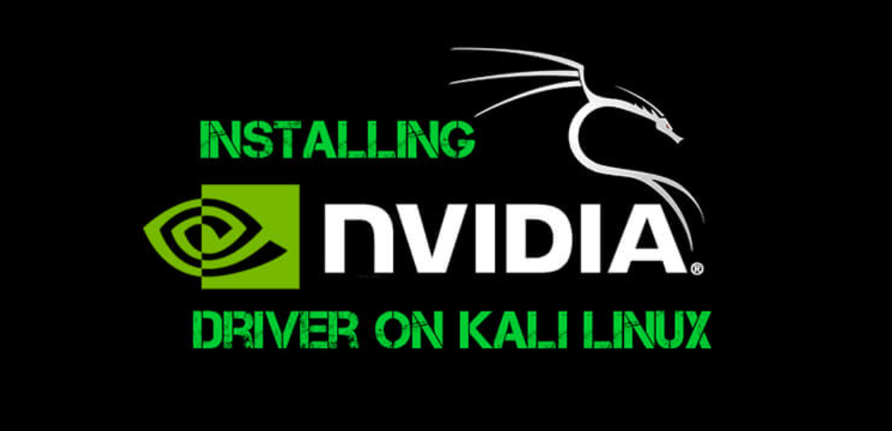

If you're running Kali Linux on bare metal and want to get your Nvidia graphics card up and running, here's a straightforward guide to help you install the necessary drivers. Don't worry, I'll walk you through the process step by step.



<!--truncate-->

## 1. Upgrade Your System

Before we start with the Nvidia driver installation, let’s make sure your system is up-to-date. Open up a terminal and run:

```bash
sudo apt update && sudo apt upgrade -y
```

This ensures all your packages are fresh and updated.

## 2. Install Nvidia Drivers

Now that your system is up-to-date, it's time to install the Nvidia drivers. You can do this by running the following command:

```bash
sudo apt-get install nvidia-driver -y
```

During installation, you might see a conflict warning. Don’t stress about it—just continue with the installation.

## 3. Disable the Open Source Nouveau Driver

Kali Linux might come with the open-source `nouveau` driver, which can conflict with the Nvidia proprietary driver. We need to disable it. To do this:

1. Open the modprobe blacklist file:

   ```bash
   sudo nano /etc/modprobe.d/blacklist-nouveau.conf
   ```

2. Add these lines to the file:

   ```bash
   blacklist nouveau
   options nouveau modeset=0
   alias nouveau off
   ```

3. Save and exit the editor (Ctrl+X, then press Y to confirm).

## 4. Update Initial Ramdisk

After blacklisting the Nouveau driver, we need to update the initramfs so the changes take effect:

```bash
sudo update-initramfs -u
```

## 5. Reboot

Finally, reboot your system to apply all the changes:

```bash
sudo reboot
```

Once your system restarts, you should have the Nvidia drivers running on your Kali Linux installation. You can confirm everything’s working by checking the Nvidia settings or running the `nvidia-smi` command.

And that's it! You're all set to enjoy the full power of your Nvidia graphics card on Kali Linux. Happy hacking!
