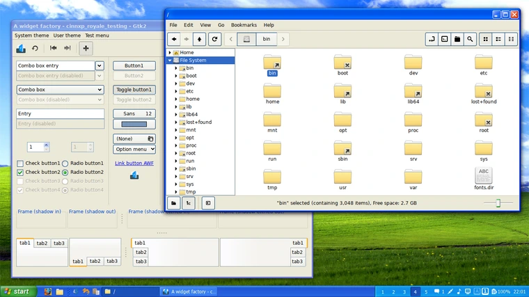

Miss the good old Windows XP look? This guide shows you how to bring it back on Linux Mint with a simple one-liner, an easy script, or manual steps 🚀.



<!--truncate-->

:::warning Note
This has only been tested on Linux Mint. These customizations are not made by me and might break your system.
:::

## Run as a One-Liner

This section provides a one-liner command to perform all the necessary setup steps in a single line. Users can copy and paste this command into their terminal to execute the setup process.

```bash
wget https://archive.org/download/bliss-600dpi/bliss-600dpi.png -P ~/Pictures && git clone https://github.com/B00merang-Project/Windows-XP.git Windows-XP-Themes && git clone https://github.com/B00merang-Artwork/Windows-XP.git Windows-XP-Icons && mkdir -p ~/.themes ~/.icons && cp -r 'Windows-XP-Themes/Windows XP Luna' ~/.themes && cp -r 'Windows-XP-Icons/' ~/.icons && sleep 3 && dconf load / < windowsXP.conf
```

## Run as a Script

This section provides a script that combines the above steps for ease of use. Users can save the following content into a file named `windowsXP.sh`, make it executable with `chmod +x ./windowsXP.sh`, and then run it with `./windowsXP.sh`.

- `windowsXP.conf` contents:
    ```conf
    # [org/cinnamon/desktop/background]
    # picture-options='zoom'
    # picture-uri='file://~/Pictures/bliss-600dpi.png'

    [org/cinnamon/desktop/background/slideshow]
    delay=15
    image-source='xml:///usr/share/cinnamon-background-properties/linuxmint.xml'

    [org/cinnamon/desktop/interface]
    cursor-theme='DMZ-White'
    gtk-theme='Windows XP Luna'
    icon-theme='Windows-XP-Icons'

    [org/cinnamon/desktop/wm/preferences]
    min-window-opacity=30
    num-workspaces=3
    theme='Mint-Y'
    workspace-names=@as []

    [org/cinnamon/theme]
    name='Windows XP Luna'
    ```

- `windowsXP.sh` script:
   ```bash
   #!/bin/bash
   wget https://archive.org/download/bliss-600dpi/bliss-600dpi.png -P ~/Pictures
   git clone https://github.com/B00merang-Project/Windows-XP.git Windows-XP-Themes
   git clone https://github.com/B00merang-Artwork/Windows-XP.git Windows-XP-Icons
   mkdir -p ~/.themes ~/.icons
   cp -r 'Windows-XP-Themes/Windows XP Luna' ~/.themes
   cp -r 'Windows-XP-Icons/' ~/.icons
   sleep 3
   dconf load / < windowsXP.conf
   ```

## Run Manually

This section breaks down the setup process into individual manual steps for users who prefer to execute each command separately.

1. Download the Bliss background image to the user's Pictures folder manually:
   ```bash
   wget https://archive.org/download/bliss-600dpi/bliss-600dpi.png -P ~/Pictures
   ```

2. Clone the Windows XP theme repository manually:
   ```bash
   git clone https://github.com/B00merang-Project/Windows-XP.git Windows-XP-Themes
   ```

3. Clone the Windows XP icon repository manually:
   ```bash
   git clone https://github.com/B00merang-Artwork/Windows-XP.git Windows-XP-Icons
   ```

4. Create the directories `~/.themes` and `~/.icons` if they don't already exist manually:
   ```bash
   mkdir -p ~/.themes ~/.icons
   ```

5. Copy the Windows XP Luna theme to the user's themes directory manually:
   ```bash
   cp -r 'Windows-XP-Themes/Windows XP Luna' ~/.themes
   ```

6. Copy the Windows XP icons to the user's icons directory manually:
   ```bash
   cp -r 'Windows-XP-Icons/' ~/.icons
   ```

7. Download the `windowsXP.conf` file manually:
   ```bash
   wget https://raw.githubusercontent.com/hirusha-adi/myLinuxSetup/main/desktop/cinnamon/windowsXP.conf
   ```

8. Open the dconf config file and edit it to suit your needs (optional):
   ```bash
   nano ./windowsXP.conf
   ```

9. Load custom desktop configuration settings from the `windowsXP.conf` file into the Cinnamon desktop environment manually using `dconf`:
   ```bash
   dconf load / < windowsXP.conf
   ```
