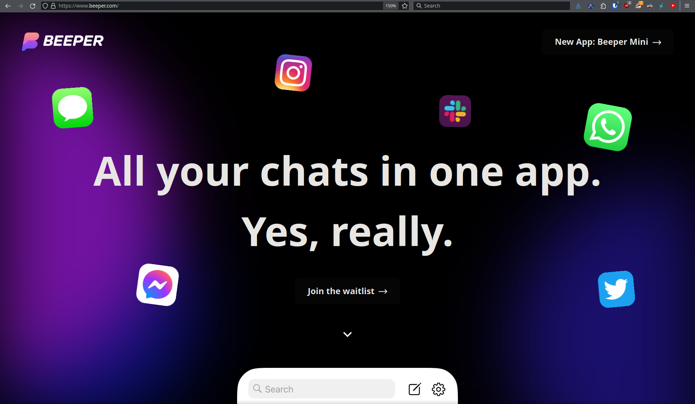
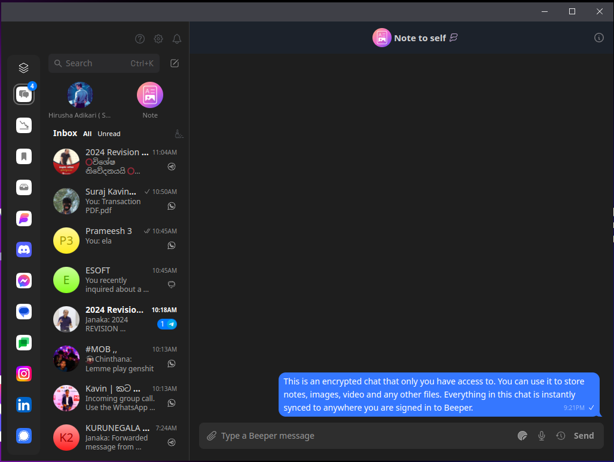
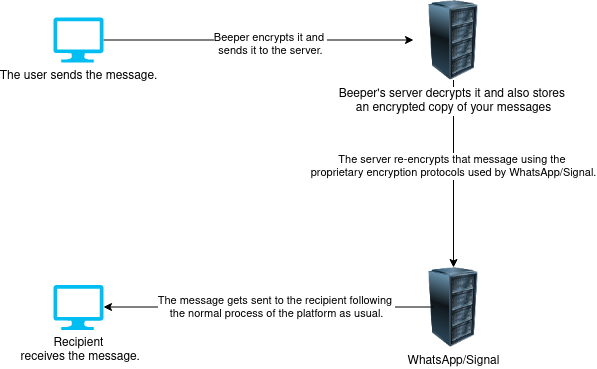

An all-in-one messaging platform that's too good to be true!

<!--truncate-->

:::warning NOTE

This is completely my personal opinion.

:::

I was trying to find a good client for WhatsApp for Linux, and that's when I came across [Beeper (All your chats in one app. Yes, really.)](https://www.beeper.com/). However, it is still not released publicly, and you will have to join the waitlist to use it. After some digging around in the [r/beeper](https://www.reddit.com/r/beeper/) subreddit, I was able to find a working redeem key in this [post](https://www.reddit.com/r/beeper/comments/18ep74x/beeper_cloud_referrals_thread/).

## What is Beeper?

This app allows you to combine all of your messaging apps into one place. You can log in to each and every platform provided by Beeper and manage all of your chats within one application easily. You can also use iMessage on Android (and even on Windows Computers) after some setup. I don't have any comments about it since I'm completely in the Android ecosystem.

Watch this video to understand how the iMessage thing works:

<iframe width="560" height="315" src="https://www.youtube.com/embed/S24TDRxEna4?si=lkXB06hKlz4M25qJ" title="YouTube video player" frameborder="0" allow="accelerometer; autoplay; clipboard-write; encrypted-media; gyroscope; picture-in-picture; web-share" allowfullscreen></iframe>

According to this video, it seems pretty reliable and secure as no intermediate relay is being used for iMessage by Beeper Mini.

For me, what's interesting in it is combining all of my third-party messaging apps and using all of them in one application.

## How Beeper Cloud works?

From this section onwards, I'll be referring to "Beeper Cloud" when I say "Beeper".

It's fairly simple. We have the proprietary client application (I guess it's fine) and an [open-source backend](https://github.com/beeper). Beeper is built upon Matrix, Matrix Bridges to be specific. "Bridges allow you to connect Matrix to a third-party platform and interact seamlessly" ([Click here](https://matrix.org/ecosystem/bridges/) to learn more). Beeper basically helps you to easily use these community-hosted matrix bridges and the matrix bridges maintained by Beeper themselves using their proprietary client application.

## Security Concerns

### Bridges

"The bridge can optionally encrypt messages between Matrix users and the bridge to hide messages from the homeserver." - Source: [Official mautrix-bridges documentation](https://docs.mau.fi/bridges/general/end-to-bridge-encryption.html)

Matrix servers are decentralized and mostly anonymous, so, even if they wanted to grab your data, they'd have a hard time doing so.

But of course, you can [self-host it](https://github.com/beeper/bridge-manager) if you do not trust them with your data. It's well-documented and it should be fairly easy.

"for complete control over your data on Beeper, you always have the option of self hosting the 'bridge' component on your own computer or server" - by [the CEO of Beeper](https://www.reddit.com/r/beeper/comments/14nmt5c/data_security/) 

### Signal & Whatsapp

Signal is possibly one of the most secure messengers out there; everything is End-to-End Encrypted (E2EE), and the messages aren't stored anywhere except on your device, locally. Only you and your message recipient can see the message.

Beeper introduces an additional layer of riskiness.

"For example, if you send a message from Beeper to a friend on WhatsApp, the message is encrypted on your Beeper Cloud client, sent to the Beeper Cloud web service, which decrypts and re-encrypts the message with WhatsApp's proprietary encryption protocol." - Source: [FAQ Page](https://www.beeper.com/faq#how-does-beeper-cloud-connect-to-encrypted-chat-networks-like-imessage-signal-whatsapp):

Not only are your messages being decrypted by Beeper and then re-encrypted, but a copy of messages is also stored by Beeper to provide a chat history, which is "encrypted".

"Beeper Cloud backs up an encrypted copy of all your Beeper Cloud chat history on Beeper servers. This allows you to install Beeper Cloud on a new device and view your entire past chat history." - Source: [FAQ Page](https://www.beeper.com/faq#how-does-beeper-cloud-keep-my-data-safe)

This literally destroys the main security and privacy-related features of Signal. Not only are they being stored online by a third party, but the messages will also be visible in clear text during the decrypting and re-encrypting process. It only takes one single service to be compromised, for the attackers to easily monitor all of your activity in all of these platforms easily.

This destroys the whole purpose of E2EE.

It's the same story for WhatsApp as well.

In the worst-case scenario, they are keeping a plaintext copy of our conversations. They don't say that they don't do it. Even if they have stated it somewhere, I was not able to find it.

### Other chat platforms

Instagram chats and all the other chat platforms available here are not encrypted. For your privacy, stay away from these chat platforms even if you are not using Beeper.

### Privacy Policy

Their privacy policy is much less worse, even than that of chat platforms provided by them. lol.

## There's Hope

"There’s also hope for the future: Beeper mentions that new EU legislation will compel companies like Apple and Meta to create interoperable end-to-end-encrypted APIs" - Source: [Lifehacker.com Article](https://lifehacker.com/beeper-isnt-a-safe-solution-for-imessaging-on-android-1850734981)

Hopefully, if this happens, and if Beeper introduces a 100% secure model to work with these message platforms without requiring to "re-encrypt" the messages, you should definitely ditch all the apps and use this instead, but for now, wait.

## Finally

The real question arises, how and why can this be free to use?

For now, stay away from this!

And hopefully soon enough this will come to true: [WhatsApp Chats Will Soon Work With Other Encrypted Messaging Apps](https://www.wired.com/story/whatsapp-interoperability-messaging/)

## Alternatives for now

I tried it by linking a couple of my services, and the experience was extremely smooth and easy. I unlinked everything due to security concerns, but once you experience the "everything in one app," there's no going back.

For now, the only secure alternative I was able to find was [Station](https://getstation.com/). It's basically like a web browser but built specifically for this task and it's completely open-source. This has no server-side component and is far behind the experience with Beeper, but it works, and it's better than manually opening an additional 3-10 tabs in your web browser.

