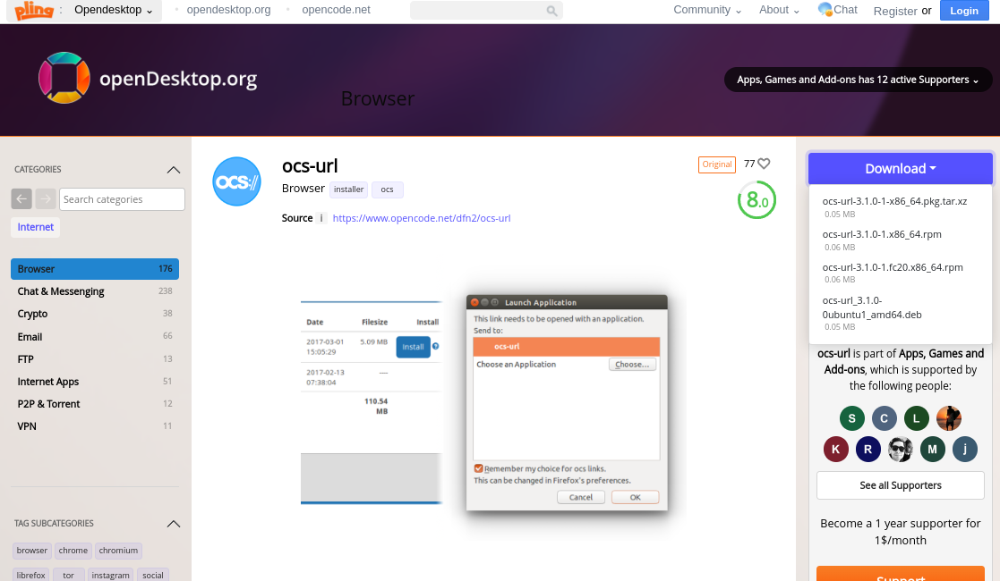
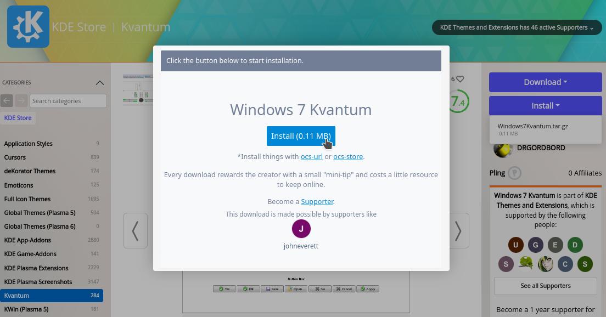
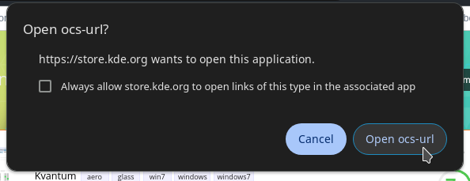
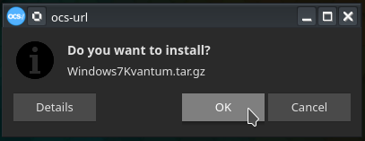

ocs-url is an install helper program for items served on OpenCollaborationServices (OCS) that lets you easily install themes & plugins. This tool will download and extract them to the required directories automatically.



<!--truncate-->

## Install

Visit [this url](https://www.opendesktop.org/p/1136805/) and download the latest package. Download the `.deb` file if you are usuing debian/ubuntu and the `.rmp` for fedora/rhel. This guide will focus on installing it on Ubuntu.

Open your terminal inside the folder you saved the `.deb` file and run the command below:

```bash
sudo dpkg -i ./ocs-url*.deb
```

Enter your password for root permissions for the installation to occur.

You should see something similiar to:

```
$ sudo dpkg -i ./ocs-url*.deb
[sudo] password for hirusha: 
(Reading database ... 366432 files and directories currently installed.)
Preparing to unpack .../ocs-url_3.1.0-0ubuntu1_amd64.deb ...
Unpacking ocs-url (3.1.0-0ubuntu1) over (3.1.0-0ubuntu1) ...
Setting up ocs-url (3.1.0-0ubuntu1) ...
Processing triggers for hicolor-icon-theme (0.17-2) ...
Processing triggers for desktop-file-utils (0.26-1ubuntu3) ...
Processing triggers for gnome-menus (3.36.0-1ubuntu3) ...

$
```

But, if it have an error related to dependencies, running the command below should fix it:

```
sudo apt install --fix-broken
```

The installation is now complete. You can go ahead to use this tool.

## Usage Example

I primarily use KDE as my Deskotp Environment in my main computer. For example, lets install [this theme (Windows 7 Kvantum)](https://store.kde.org/p/1679903) from [store.kde.org](https://store.kde.org).

Visit the store page of your required theme/plugin/extension, click on Install.



Your browser will request for permission for the store to open `ocs-url://` type of a URL. This URL is what the package we installed earlier is looking for. Click on 'Open ocs-url'.



Click on Install and this will download it, and extract it to the (default) required directory.



To verify the installation location, you can click on "Open" after it has been installed to check where the files are.  In this case, the files have been installed successfully to: `~/.themes/Windows7Kvantum/`. Just as we want it 
