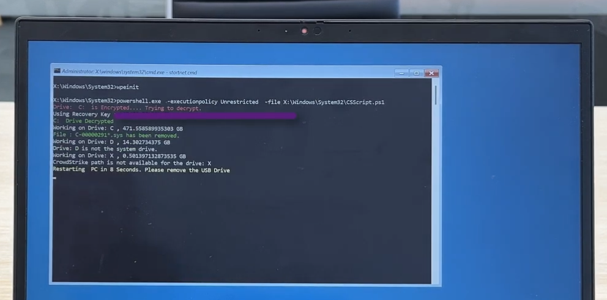

Build a Windows-PE image to delete the required files that caused CrowdStrike's Falcon Scanner to break and crash Windows installations on boot. You can also export all of the recovery keys from the Active Directory to a CSV file and use them to recover devices quickly - with almost a plug and play experience.

<!--truncate-->

## Intro

To easily fix the issue that arose in 7/19/2024.

### [Fix with Windows PE (+ BitLocker support)](https://github.com/hirusha-adi/crowdstrike-fix/tree/main/winpe-bitlocker)

[Click here](https://github.com/hirusha-adi/crowdstrike-fix/tree/main/winpe-bitlocker) to learn more. Made with the help of Tiraj Adikari.

### [Fix with Windows PE (no BitLocker support)](https://github.com/hirusha-adi/crowdstrike-fix/tree/main/winpe)

[Click here](https://github.com/hirusha-adi/crowdstrike-fix/tree/main/winpe) to learn more. Made by Hirusha Adikari.

### [Fix with a custom Windows image (+ optional BitcLocker support)](https://github.com/hirusha-adi/crowdstrike-fix/tree/main/win)

[Click here](https://github.com/hirusha-adi/crowdstrike-fix/tree/main/win) to learn more. This is different from Windows PE, you will have an interactive envrionment with a graphical user interface. Made by Hirusha Adikari.

### Other Fixes

- [Fix manually](https://github.com/hirusha-adi/crowdstrike-fix/tree/main/other#fix-manually)
- [Fix with a batch script](https://github.com/hirusha-adi/crowdstrike-fix/tree/main/other#fix-with-a-batch-script)
- [Fix with a powershell script](https://github.com/hirusha-adi/crowdstrike-fix/tree/main/other#fix-with-a-powershell-script)
- [Fix with a bash script (by booting into a linux distribuion)](https://github.com/hirusha-adi/crowdstrike-fix/tree/main/other#fix-by-booting-from-a-linux-distribution)

## Note

A detailed usage guide followed by great explanation is included this project's github repository: https://github.com/hirusha-adi/crowdstrike-fix/

Additional information can also be found [here (docs/projects/crowdstrike_fix)](http://localhost:3000/docs/projects/crowdstrike_fix/).

This is just an abstraction of what happend.

## Introduction

Last week, travelers were left stranded at airports, patients left waiting in hospitals and customers left cash-strapped in front of banks after a software update gone awry disrupted major sectors of the global economy. 

The historic outage was the result of a faulty update from the cybersecurity company CrowdStrike that affected millions of computers running the Microsoft Windows operating system.

Cybersecurity firm CrowdStrike pushed out a routine software update that inadvertently crashed customers’ Windows systems. The very purpose of the update involved a core cybersecurity mission of detecting emerging threats and, specifically, gathering data “on possible novel threat techniques.” Instead, an error in the software update triggered a problem that gave customers the Window’s “Blue Screen of Death.”

As CrowdStrike immediately explained to customers and the world, the problem was not a cyberattack but an error in the software update. Because the bug was in CrowdStrike’s Falcon platform update for Microsoft Windows, computers using other operating systems (e.g. Mac and Linux) were not impacted. Because so many core systems in society rely upon CrowdStrike, the outage was widespread and disruptive across critical sectors: flights canceled, medical procedures delayed or canceled and many other routine societal systems affected. 

## Fix

Listed below are the original manual fixes:

### If BitLocker is not enabled

Based on this [Reddit post](https://www.reddit.com/r/crowdstrike/comments/1e6vmkf/comment/ldvxx62/?utm_source=share&utm_medium=web3x&utm_name=web3xcss&utm_term=1&utm_content=share_button).

1. Boot Windows into safe mode
2. Go to `C:\Windows\System32\drivers\CrowdStrike`
3. Delete files matching the `C-00000291*.sys` pattern
4. Reboot

### If BitLocker is enabled

Based on this [Twitter post](https://x.com/Syndikalist/status/1814281141265846772/photo/1).

1. Cycle through BSODs until you get the recovery screen.
2. Navigate to Troubleshoot > Advanced Options > Startup Settings
3. Press "Restart"
4. Skip the first Bitlocker recovery key prompt by pressing Esc
5. Skip the second Bitlocker recovery key prompt by selecting Skip This Device in the bottom right
6. Navigate to Troubleshoot > Advanced Options > Command Prompt
7. Type `bcdedit /set {default} safeboot minimal`, then press enter
8. Go back to the WinRE main menu and select Continue
9. It may cycle 2-3 times
10. If you booted into safe mode, log in per normal
11. Open Windows Explorer, navigate to `C:\Windows\System32\drivers\CrowdStrike`
12. Delete the offending file (STARTS with `C-00000291*`, .sys file extension)
13. Open command prompt as administrator
14. Type `bcdedit /deletevalue {default} safeboot`, then press enter
15. Restart as normal, confirm normal behaviour

## Automated Fix

Doing this manually for thousands of computers costs an unnecessarily large amount of time.

Tiraj Adikari called me on the day of the incident and gave me an idea to build a recovery image to fix this.

### Linux based fix

Demonstration:

<iframe width="560" height="315" src="https://www.youtube.com/embed/UnnPh6e8-dY?si=fi6vQ6WH7WLdp1Um" title="YouTube video player" frameborder="0" allow="accelerometer; autoplay; clipboard-write; encrypted-media; gyroscope; picture-in-picture; web-share" referrerpolicy="strict-origin-when-cross-origin" allowfullscreen></iframe>

My first idea was to build a Linux image that, when booted, would run a bash script and then shut itself down.

I first wrote the script. It mounts all volumes to a temporary directory and checks for a `Windows/System32/drivers/CrowdStrike` folder. If it exists, the script will try to delete the files matching the aforementioned pattern. The script will perform this for all mountable storage volumes.

My initial idea was to use archiso, but the image size was too big, and I did not have any Arch-based installation at that time (I was using Pop!_OS with Windows LTSC 2021 (dual booted) on both my desktop and laptop). Using Cubic to build an Ubuntu image was possible, but the image size would be extremely large, about 3GB approximately.

So, I tried TinyCoreLinux, but its file structure is extremely weird. Then, I tried to build an Alpine image, but it's even weirder. So, back to archiso.

I tried starting it as a systemd service, but it didn't go well. Since archiso directly boots into a command-line interface, I simply edited the `.zshlogin` file to run the script.

The script now autoruns successfully on boot.

Everything looked good, but when I executed it, the volume failed to mount, and after I booted back up, it outright failed to mount. My script was breaking the volume. This was a huge disaster.

At first, I thought it was an issue with NTFS, so I checked the `packages.conf`, and the `ntfs-3g` was included, leaving me with no other ideas.

I tried for a fix the next day but couldn't get it to work. Additionally, the built image is approximately 1.1GB in size - which is too large for running a simple recovery script.

VIDEO_GOES_HERE

In the end, I just deleted the files.

### Win10XPE based fix

Demonstration:

<iframe width="560" height="315" src="https://www.youtube.com/embed/2F-rhVMHQfE?si=TArKBK_8C9a5jSqt" title="YouTube video player" frameborder="0" allow="accelerometer; autoplay; clipboard-write; encrypted-media; gyroscope; picture-in-picture; web-share" referrerpolicy="strict-origin-when-cross-origin" allowfullscreen></iframe>

I wrote both a PowerShell script and a batch script that would delete the required files and restart.

Then, I stumbled upon another project called Win10XPE, which easily lets you create custom stripped-down versions from Windows images.
I properly set it up and built my first image, while also making the script autostart.

This worked, but the image was approximately 850MB - yes, it's smaller than archiso.

Note that this is different from Windows PE. This is basically a live environment of a Windows installation where you can also use the graphical user interface and access the internet if needed.

Of course, this script does not support BitLocker-encrypted devices because I do not have a proper test environment to test anything.

### WindowsPE based fix

Demonstration (when BitLocker is enabled):

<iframe width="560" height="315" src="https://www.youtube.com/embed/eIsE5G4tihY?si=j_TsgvHZ9FWDf8gK" title="YouTube video player" frameborder="0" allow="accelerometer; autoplay; clipboard-write; encrypted-media; gyroscope; picture-in-picture; web-share" referrerpolicy="strict-origin-when-cross-origin" allowfullscreen></iframe>

Demonstration (when BitLocker is disabled):

<iframe width="560" height="315" src="https://www.youtube.com/embed/2F-rhVMHQfE?si=MysqU_7YM3KKuvhc" title="YouTube video player" frameborder="0" allow="accelerometer; autoplay; clipboard-write; encrypted-media; gyroscope; picture-in-picture; web-share" referrerpolicy="strict-origin-when-cross-origin" allowfullscreen></iframe>

Following the [official documentation](https://learn.microsoft.com/en-us/windows-hardware/manufacture/desktop/winpe-adding-powershell-support-to-windows-pe?view=windows-11), I was able to build a custom Windows PE image. The stock Windows PE image is approximately 380MB, but to execute my script properly, I needed to add PowerShell support. I followed this guide, and the built image was approximately 550MB.

Then, Tiraj Adikari came up with a script that also supports BitLocker-encrypted devices. I wrote documentation for it and added it to the same repository.

This fixing approach is interesting. First, you have to export the recovery keys from the Active Directory to a CSV file by running a script. Then, you can follow the documentation, add the exported CSV and the script to the system32 folder, make it autorun on startup, and build the image. Yes, you have to build the image because you need to include the CSV file. Make sure you do not share this image as it includes the BitLocker recovery keys of the devices.

## References
- https://www.georgetown.edu/news/ask-a-professor-crowdstrike-outage
- https://github.com/hirusha-adi/crowdstrike-fix/

and, special thanks to [Tiraj Adikari](https://www.linkedin.com/in/tiraj-adikari-a1686229/)
