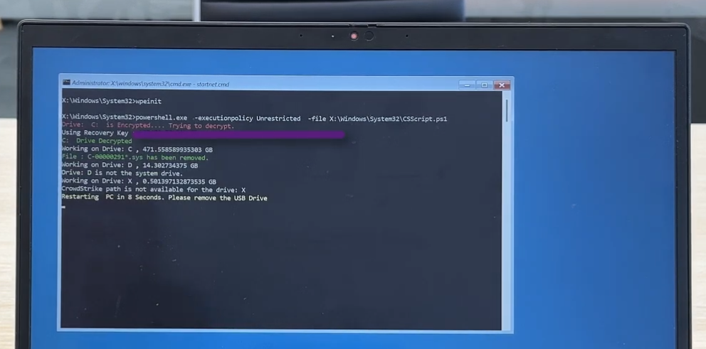
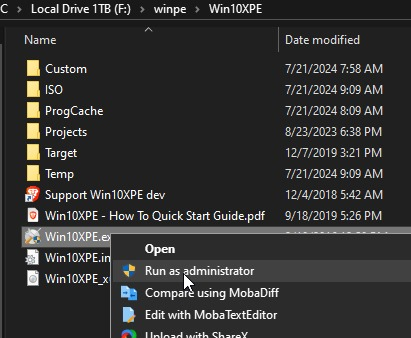
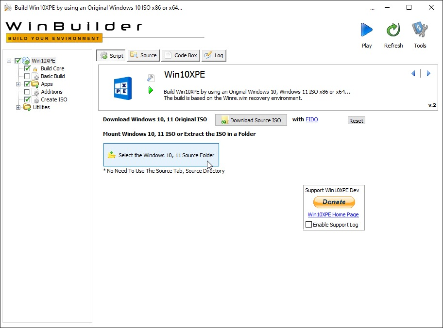
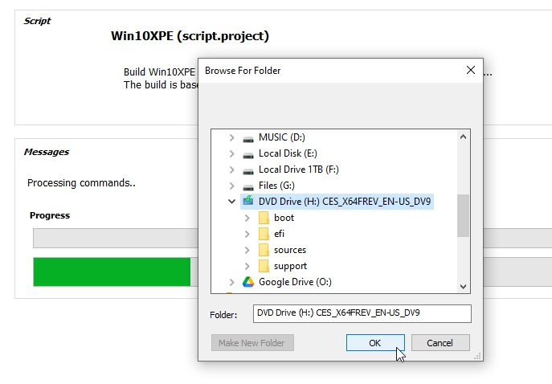
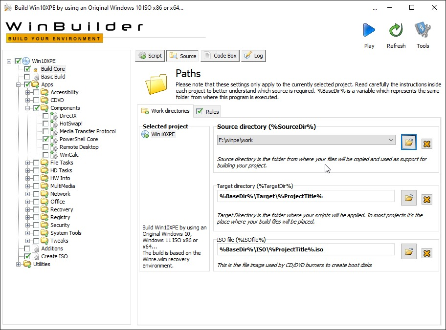
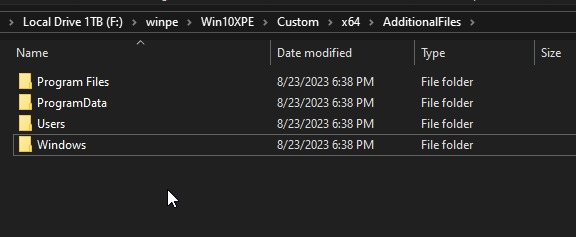
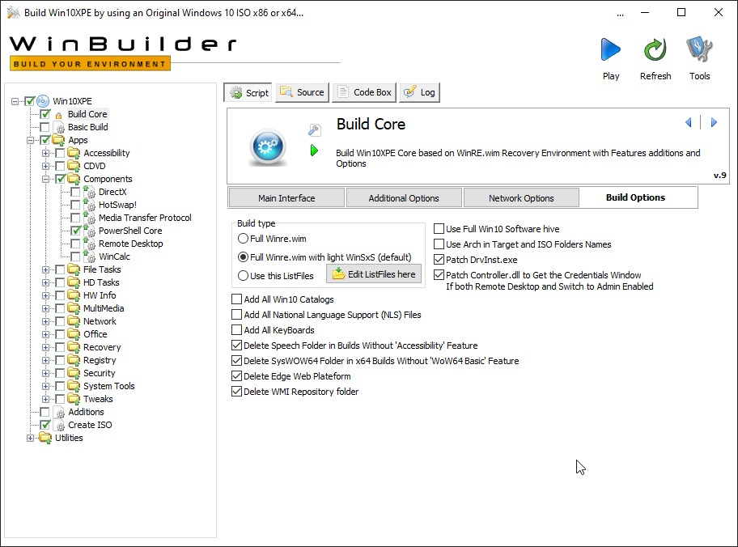
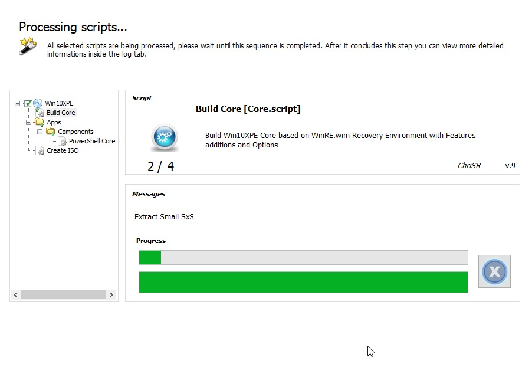

Build a Windows-PE image to delete the required files that caused CrowdStrike's Falcon Scanner to break and crash Windows installations on boot. You can also export all of the recovery keys from the Active Directory to a CSV file and use them to recover devices quickly - with almost a plug and play experience.


<!--truncate-->

## Introduction

### Intro

To easily fix the issue that arose in 7/19/2024.

#### [Fix with Windows PE (+ BitLocker support)](https://github.com/hirusha-adi/crowdstrike-fix/tree/main/winpe-bitlocker)


[Click here](https://github.com/hirusha-adi/crowdstrike-fix/tree/main/winpe-bitlocker) to learn more. Made with the help of Tiraj Adikari.

#### [Fix with Windows PE (no BitLocker support)](https://github.com/hirusha-adi/crowdstrike-fix/tree/main/winpe)

[Click here](https://github.com/hirusha-adi/crowdstrike-fix/tree/main/winpe) to learn more. Made by Hirusha Adikari.

#### [Fix with a custom Windows image (+ optional BitcLocker support)](https://github.com/hirusha-adi/crowdstrike-fix/tree/main/win)


[Click here](https://github.com/hirusha-adi/crowdstrike-fix/tree/main/win) to learn more. This is different from Windows PE, you will have an interactive envrionment with a graphical user interface. Made by Hirusha Adikari.

#### Other Fixes

- [Fix manually](https://github.com/hirusha-adi/crowdstrike-fix/tree/main/other#fix-manually)
- [Fix with a batch script](https://github.com/hirusha-adi/crowdstrike-fix/tree/main/other#fix-with-a-batch-script)
- [Fix with a powershell script](https://github.com/hirusha-adi/crowdstrike-fix/tree/main/other#fix-with-a-powershell-script)
- [Fix with a bash script (by booting into a linux distribuion)](https://github.com/hirusha-adi/crowdstrike-fix/tree/main/other#fix-by-booting-from-a-linux-distribution)


### Note

A detailed usage guide followed by great explanation is included this project's github repository: https://github.com/hirusha-adi/crowdstrike-fix/

Additional information can also be found [here (docs/projects/crowdstrike_fix)](http://localhost:3000/docs/projects/crowdstrike_fix/).

This is just an abstraction of what happend.

### Introduction


Last week, travelers were left stranded at airports, patients left waiting in hospitals and customers left cash-strapped in front of banks after a software update gone awry disrupted major sectors of the global economy. 

The historic outage was the result of a faulty update from the cybersecurity company CrowdStrike that affected millions of computers running the Microsoft Windows operating system.

Cybersecurity firm CrowdStrike pushed out a routine software update that inadvertently crashed customers’ Windows systems. The very purpose of the update involved a core cybersecurity mission of detecting emerging threats and, specifically, gathering data “on possible novel threat techniques.” Instead, an error in the software update triggered a problem that gave customers the Window’s “Blue Screen of Death.”

As CrowdStrike immediately explained to customers and the world, the problem was not a cyberattack but an error in the software update. Because the bug was in CrowdStrike’s Falcon platform update for Microsoft Windows, computers using other operating systems (e.g. Mac and Linux) were not impacted. Because so many core systems in society rely upon CrowdStrike, the outage was widespread and disruptive across critical sectors: flights canceled, medical procedures delayed or canceled and many other routine societal systems affected. 

### Fix

Listed below are the original manual fixes:

#### If BitLocker is not enabled

Based on this [Reddit post](https://www.reddit.com/r/crowdstrike/comments/1e6vmkf/comment/ldvxx62/?utm_source=share&utm_medium=web3x&utm_name=web3xcss&utm_term=1&utm_content=share_button).

1. Boot Windows into safe mode
2. Go to `C:\Windows\System32\drivers\CrowdStrike`
3. Delete files matching the `C-00000291*.sys` pattern
4. Reboot

#### If BitLocker is enabled

Based on this [Twitter post](https://x.com/Syndikalist/status/1814281141265846772/photo/1).

1. Cycle through BSODs until you get the recovery screen.
2. Navigate to Troubleshoot > Advanced Options > Startup Settings
3. Press "Restart"
4. Skip the first Bitlocker recovery key prompt by pressing Esc
5. Skip the second Bitlocker recovery key prompt by selecting Skip This Device in the bottom right
6. Navigate to Troubleshoot > Advanced Options > Command Prompt
7. Type `bcdedit /set {default} safeboot minimal`, then press enter
8. Go back to the WinRE main menu and select Continue
9. It may cycle 2-3 times
10. If you booted into safe mode, log in per normal
11. Open Windows Explorer, navigate to `C:\Windows\System32\drivers\CrowdStrike`
12. Delete the offending file (STARTS with `C-00000291*`, .sys file extension)
13. Open command prompt as administrator
14. Type `bcdedit /deletevalue {default} safeboot`, then press enter
15. Restart as normal, confirm normal behaviour


### Automated Fix

Doing this manually for thousands of computers costs an unnecessarily large amount of time.

Tiraj Adikari called me on the day of the incident and gave me an idea to build a recovery image to fix this.

#### Linux based fix

Demonstration:

<iframe width="560" height="315" src="https://www.youtube.com/embed/UnnPh6e8-dY?si=fi6vQ6WH7WLdp1Um" title="YouTube video player" frameborder="0" allow="accelerometer; autoplay; clipboard-write; encrypted-media; gyroscope; picture-in-picture; web-share" referrerpolicy="strict-origin-when-cross-origin" allowfullscreen></iframe>

My first idea was to build a Linux image that, when booted, would run a bash script and then shut itself down.

I first wrote the script. It mounts all volumes to a temporary directory and checks for a `Windows/System32/drivers/CrowdStrike` folder. If it exists, the script will try to delete the files matching the aforementioned pattern. The script will perform this for all mountable storage volumes.

My initial idea was to use archiso, but the image size was too big, and I did not have any Arch-based installation at that time (I was using Pop!_OS with Windows LTSC 2021 (dual booted) on both my desktop and laptop). Using Cubic to build an Ubuntu image was possible, but the image size would be extremely large, about 3GB approximately.

So, I tried TinyCoreLinux, but its file structure is extremely weird. Then, I tried to build an Alpine image, but it's even weirder. So, back to archiso.

I tried starting it as a systemd service, but it didn't go well. Since archiso directly boots into a command-line interface, I simply edited the `.zshlogin` file to run the script.

The script now autoruns successfully on boot.

Everything looked good, but when I executed it, the volume failed to mount, and after I booted back up, it outright failed to mount. My script was breaking the volume. This was a huge disaster.

At first, I thought it was an issue with NTFS, so I checked the `packages.conf`, and the `ntfs-3g` was included, leaving me with no other ideas.

I tried for a fix the next day but couldn't get it to work. Additionally, the built image is approximately 1.1GB in size - which is too large for running a simple recovery script.

VIDEO_GOES_HERE

In the end, I just deleted the files.

#### Win10XPE based fix

Demonstration:

<iframe width="560" height="315" src="https://www.youtube.com/embed/2F-rhVMHQfE?si=TArKBK_8C9a5jSqt" title="YouTube video player" frameborder="0" allow="accelerometer; autoplay; clipboard-write; encrypted-media; gyroscope; picture-in-picture; web-share" referrerpolicy="strict-origin-when-cross-origin" allowfullscreen></iframe>

I wrote both a PowerShell script and a batch script that would delete the required files and restart.

Then, I stumbled upon another project called Win10XPE, which easily lets you create custom stripped-down versions from Windows images.
I properly set it up and built my first image, while also making the script autostart.

This worked, but the image was approximately 850MB - yes, it's smaller than archiso.

Note that this is different from Windows PE. This is basically a live environment of a Windows installation where you can also use the graphical user interface and access the internet if needed.

Of course, this script does not support BitLocker-encrypted devices because I do not have a proper test environment to test anything.

#### WindowsPE based fix

Demonstration (when BitLocker is enabled):

<iframe width="560" height="315" src="https://www.youtube.com/embed/eIsE5G4tihY?si=j_TsgvHZ9FWDf8gK" title="YouTube video player" frameborder="0" allow="accelerometer; autoplay; clipboard-write; encrypted-media; gyroscope; picture-in-picture; web-share" referrerpolicy="strict-origin-when-cross-origin" allowfullscreen></iframe>

Demonstration (when BitLocker is disabled):

<iframe width="560" height="315" src="https://www.youtube.com/embed/2F-rhVMHQfE?si=MysqU_7YM3KKuvhc" title="YouTube video player" frameborder="0" allow="accelerometer; autoplay; clipboard-write; encrypted-media; gyroscope; picture-in-picture; web-share" referrerpolicy="strict-origin-when-cross-origin" allowfullscreen></iframe>

Following the [official documentation](https://learn.microsoft.com/en-us/windows-hardware/manufacture/desktop/winpe-adding-powershell-support-to-windows-pe?view=windows-11), I was able to build a custom Windows PE image. The stock Windows PE image is approximately 380MB, but to execute my script properly, I needed to add PowerShell support. I followed this guide, and the built image was approximately 550MB.

Then, Tiraj Adikari came up with a script that also supports BitLocker-encrypted devices. I wrote documentation for it and added it to the same repository.

This fixing approach is interesting. First, you have to export the recovery keys from the Active Directory to a CSV file by running a script. Then, you can follow the documentation, add the exported CSV and the script to the system32 folder, make it autorun on startup, and build the image. Yes, you have to build the image because you need to include the CSV file. Make sure you do not share this image as it includes the BitLocker recovery keys of the devices.


### References
- https://www.georgetown.edu/news/ask-a-professor-crowdstrike-outage
- https://github.com/hirusha-adi/crowdstrike-fix/

and, special thanks to [Tiraj Adikari](https://www.linkedin.com/in/tiraj-adikari-a1686229/)

## Manual Fix


Fix the issue caused by CrowdStrike in 2024 manully using many different methods.

### If BitLocker is not enabled

Based on this [Reddit post](https://www.reddit.com/r/crowdstrike/comments/1e6vmkf/comment/ldvxx62/?utm_source=share&utm_medium=web3x&utm_name=web3xcss&utm_term=1&utm_content=share_button).

1. Boot Windows into safe mode
2. Go to `C:\Windows\System32\drivers\CrowdStrike`
3. Delete files matching the `C-00000291*.sys` pattern
4. Reboot

### If BitLocker is enabled

Based on this [Twitter post](https://x.com/Syndikalist/status/1814281141265846772/photo/1).

1. Cycle through BSODs until you get the recovery screen.
2. Navigate to Troubleshoot > Advanced Options > Startup Settings
3. Press "Restart"
4. Skip the first Bitlocker recovery key prompt by pressing Esc
5. Skip the second Bitlocker recovery key prompt by selecting Skip This Device in the bottom right
6. Navigate to Troubleshoot > Advanced Options > Command Prompt
7. Type `bcdedit /set {default} safeboot minimal`, then press enter
8. Go back to the WinRE main menu and select Continue
9. It may cycle 2-3 times
10. If you booted into safe mode, log in per normal
11. Open Windows Explorer, navigate to `C:\Windows\System32\drivers\CrowdStrike`
12. Delete the offending file (STARTS with `C-00000291*`, .sys file extension)
13. Open command prompt as administrator
14. Type `bcdedit /deletevalue {default} safeboot`, then press enter
15. Restart as normal, confirm normal behaviour

### Fix with a Batch script

Summary:

- A batch script that you can run in safemode to fix the issue

Supports Bitlocker Encryption?: No

Demonstration: [Youtube Video](https://youtu.be/xmKCybmhjNA)

https://github.com/user-attachments/assets/e4301b83-46f7-4ce0-a508-51f3c3ce9919

### One Liner

- NOTE that an internet connection and powershell is required to do this
- Open CMD as an administrator and run the command below

```bat
powershell -Command "Invoke-WebRequest -Uri https://raw.githubusercontent.com/hirusha-adi/crowdstrike-fix/main/other/fix.bat -OutFile fix.bat; Start-Process fix.bat -Wait; Remove-Item fix.bat"
```

- It will download the script, execute it, and remove it

### Via the GUI

- [Click here](https://raw.githubusercontent.com/hirusha-adi/crowdstrike-fix/main/other/fix.bat) to download the file.
- Right click and Run as administrator.


- The script should work as intended.


### Fix with a Powershell script

Summary:

- A powershell script that you can run in safemode to fix the issue

Supports Bitlocker Encryption?: No

Demonstration: scroll down...

##### One Liner (internet required)

- NOTE that an internet connection is required to do this
- Open powershell as an administrator and run the command below

```ps1
iwr -useb https://raw.githubusercontent.com/hirusha-adi/crowdstrike-fix/main/other/fix.ps1 | iex
```

- It will download the script, execute it, and remove it
- Demonstration: [Youtube](https://youtu.be/NfoXMKk4aZg)

https://github.com/user-attachments/assets/692f218c-d8b7-4af6-9d53-b682eb7fcc90

##### One Liner (works offline)

- NO internet connection is required for this one-liner to work
- Open powershell as an administrator and run the command below

```ps1
Write-Output "====="; Write-Output "Starting script."; Write-Output "====="; $path = Join-Path -Path $env:WINDIR -ChildPath "System32\drivers\CrowdStrike"; if (Test-Path -Path $path) { Write-Output "Found CrowdStrike folder in $path"; Write-Output "====="; Get-ChildItem -Path $path; $filesToDelete = Get-ChildItem -Path $path -Filter "C-00000291*.sys"; foreach ($file in $filesToDelete) { try { Write-Output "Deleting: $($file.FullName)"; Remove-Item -Path $file.FullName -Force } catch { Write-Output "Failed to delete file: $($file.FullName) - $($_.Exception.Message)" } }; Get-ChildItem -Path $path; Write-Output "====="; } else { Write-Output "CrowdStrike folder not found in $($env:WINDIR)\System32\drivers" }; Write-Output "====="; Write-Output "Script completed."; Write-Output "=====";
```

- Demonstration: [Youtube](https://youtu.be/7SXNT6lTb_4)

https://github.com/user-attachments/assets/fa7d4b69-e741-40d5-8d5a-d8793cb755fa

### Fix by booting from a Linux distribution

Summary:

- (live) boot into a Linux distribution from the affected computer and execute a the fix script.

Supports Bitlocker Encryption?: No

### Usage Guide

```bash
## get the script
wget https://raw.githubusercontent.com/hirusha-adi/crowdstrike-fix/main/other/fix.sh

## make it executable
chmod +x fix.sh

## run the script
./fix.sh
```


## Fix with Windows PE

Fix the issue caused by CrowdStrike in 2024 using WinPE for computers that doesn't use BitLocker.

### Usage Guide

Versions:

- Bypass Version
  - Download: Click Here
  - Details: Script runs as `-ExecutionPolicy Bypass`
- Unrestricted Version
  - Download: Click Here
  - Details: Script runs as `-ExecutionPolicy Unrestricted`

1. Download the ISO file according to your need from the above section
2. Make your pendrive bootable with this file
3. Plug-in the bootable pendrive to your device and boot from it.
4. Wait for it to load and fix the disk.
5. Once the script has finished its execution, your device will be shutdown automatically.
6. You can then eject the pendrive and boot to Windows.

### Building the Image

#### Setting up the envrionment

- Download and install the [Windows Assessment and Deployment Kit (ADK)](https://learn.microsoft.com/en-us/windows-hardware/get-started/adk-install) and matching WinPE add-on.

- For ADK versions prior to Windows 10, version 1809, WinPE is part of the ADK and isn't a separate add-on.

- Start the Deployment and Imaging Tools Environment as an administrator.

#### Initial Setup

- Create a working copy of the Windows PE files

```
copype amd64 C:\WinPEImg
```

- Mount your WinPE image

```
Dism /Mount-Image /ImageFile:"C:\WinPEImg\media\sources\boot.wim" /Index:1 /MountDir:"C:\WinPEImg\mount"
```

#### Add powershell

- Add powershell and it's dependencies

```
Dism /Add-Package /Image:"C:\WinPEImg\mount" /PackagePath:"C:\Program Files (x86)\Windows Kits\10\Assessment and Deployment Kit\Windows Preinstallation Environment\amd64\WinPE_OCs\WinPE-WMI.cab"
Dism /Add-Package /Image:"C:\WinPEImg\mount" /PackagePath:"C:\Program Files (x86)\Windows Kits\10\Assessment and Deployment Kit\Windows Preinstallation Environment\amd64\WinPE_OCs\en-us\WinPE-WMI_en-us.cab"
Dism /Add-Package /Image:"C:\WinPEImg\mount" /PackagePath:"C:\Program Files (x86)\Windows Kits\10\Assessment and Deployment Kit\Windows Preinstallation Environment\amd64\WinPE_OCs\WinPE-NetFX.cab"
Dism /Add-Package /Image:"C:\WinPEImg\mount" /PackagePath:"C:\Program Files (x86)\Windows Kits\10\Assessment and Deployment Kit\Windows Preinstallation Environment\amd64\WinPE_OCs\en-us\WinPE-NetFX_en-us.cab"
Dism /Add-Package /Image:"C:\WinPEImg\mount" /PackagePath:"C:\Program Files (x86)\Windows Kits\10\Assessment and Deployment Kit\Windows Preinstallation Environment\amd64\WinPE_OCs\WinPE-Scripting.cab"
Dism /Add-Package /Image:"C:\WinPEImg\mount" /PackagePath:"C:\Program Files (x86)\Windows Kits\10\Assessment and Deployment Kit\Windows Preinstallation Environment\amd64\WinPE_OCs\en-us\WinPE-Scripting_en-us.cab"
Dism /Add-Package /Image:"C:\WinPEImg\mount" /PackagePath:"C:\Program Files (x86)\Windows Kits\10\Assessment and Deployment Kit\Windows Preinstallation Environment\amd64\WinPE_OCs\WinPE-PowerShell.cab"
Dism /Add-Package /Image:"C:\WinPEImg\mount" /PackagePath:"C:\Program Files (x86)\Windows Kits\10\Assessment and Deployment Kit\Windows Preinstallation Environment\amd64\WinPE_OCs\en-us\WinPE-PowerShell_en-us.cab"
Dism /Add-Package /Image:"C:\WinPEImg\mount" /PackagePath:"C:\Program Files (x86)\Windows Kits\10\Assessment and Deployment Kit\Windows Preinstallation Environment\amd64\WinPE_OCs\WinPE-StorageWMI.cab"
Dism /Add-Package /Image:"C:\WinPEImg\mount" /PackagePath:"C:\Program Files (x86)\Windows Kits\10\Assessment and Deployment Kit\Windows Preinstallation Environment\amd64\WinPE_OCs\en-us\WinPE-StorageWMI_en-us.cab"
Dism /Add-Package /Image:"C:\WinPEImg\mount" /PackagePath:"C:\Program Files (x86)\Windows Kits\10\Assessment and Deployment Kit\Windows Preinstallation Environment\amd64\WinPE_OCs\WinPE-DismCmdlets.cab"
Dism /Add-Package /Image:"C:\WinPEImg\mount" /PackagePath:"C:\Program Files (x86)\Windows Kits\10\Assessment and Deployment Kit\Windows Preinstallation Environment\amd64\WinPE_OCs\en-us\WinPE-DismCmdlets_en-us.cab"
```

#### Setup startup script

- Open target System32 folder

```
explorer C:\WinPEImg\mount\Windows\System32
```

- Update `startnet.cmd` to:

```
wpeinit
powershell.exe -ExecutionPolicy Bypass -File .\fix-script.ps1
```

- Copy the `fix-script.ps1` to that same directory

#### Build the image

- Save the changes and unmount the image

```
Dism /Unmount-Image /MountDir:C:\WinPEImg\mount /Commit
```

- Build the ISO

```
MakeWinPEMedia /ISO C:\WinPEImg C:\WinPEImg\WinPE_ISO.iso
```

#### Errors

- Incase if something fails (eg: failed to unmount), you can discard the mounted images manually:

  - list currently all mounted images

  ```
  dism /Get-MountedWimInfo
  ```

  - discard them manually

  ```
  dism /Unmount-Wim /MountDir:"C:\path\to\mount\directory" /Discard
  ```

  - examples (discarding):

  ```
  dism /Unmount-Wim /MountDir:"F:\$RECYCLE.BIN\S-1-5-21-2354160538-1415017437-1919434616-1001\$RLCKGKP\mount" /Discard
  dism /Unmount-Wim /MountDir:"F:\winpe\mount" /Discard
  ```

  - cleanup the dism Environment

  ```
  dism /Cleanup-Wim
  ```

  - and now, you can retry

### References

- https://learn.microsoft.com/en-us/windows-hardware/manufacture/desktop/winpe-adding-powershell-support-to-windows-pe?view=windows-11
- https://stackoverflow.com/questions/10906990/winpe-auto-scripts

## Fix with WindowsPE with Bitlocker Support


Fix the issue caused by CrowdStrike in 2024 using WinPE for computers that uses BitLocker.



<!--truncate-->


Credits: [Tiraj Adikari](https://www.linkedin.com/in/tiraj-adikari-a1686229/?originalSubdomain=au)

Supports Bitlocker Encryption?: Yes.

Demonstration: [Youtube](https://www.youtube.com/watch?v=eIsE5G4tihY)

### Usage Guide

1. Export BitcLoker keys from the Active Directory ([click here](#exporting-bitlocker-keys)).
2. Build the Windows PE Image ([click here](#building-the-image)).
3. Make your pendrive bootable with this file.
4. Plug-in the bootable pendrive to your device and boot from it.
5. Wait for it to load and fix the disk.
6. Once the script has finished its execution, your device will be shutdown automatically.
7. You can then eject the pendrive and boot to Windows.

### Exporting BitLocker keys

- Execute the `export-keys-from-ad.ps1` script and export the bitcloker keys from the Active Directory

```
powershell.exe  -ExecutionPolicy Unrestricted  -file export-keys-from-ad.ps1
```

- The `.csv` file will be saved at: `C:\bitlocker-list.csv`

### Building the Image

#### Setting up the envrionment

- Download and install the [Windows Assessment and Deployment Kit (ADK)](https://learn.microsoft.com/en-us/windows-hardware/get-started/adk-install) and matching WinPE add-on.

- For ADK versions prior to Windows 10, version 1809, WinPE is part of the ADK and isn't a separate add-on.

- Start the Deployment and Imaging Tools Environment as an administrator.

#### Initial Setup

- Create a working copy of the Windows PE files

```
copype amd64 C:\WinPEImg
```

- Mount your WinPE image

```
Dism /Mount-Image /ImageFile:"C:\WinPEImg\media\sources\boot.wim" /Index:1 /MountDir:"C:\WinPEImg\mount"
```

#### Add BitLocker support

- Add BitLocker support and it's dependencies

```
Dism /Image:"C:\WinPEImg\mount" /Add-Package /PackagePath:"C:\Program Files (x86)\Windows Kits\10\Assessment and Deployment Kit\Windows Preinstallation Environment\amd64\WinPE_OCs\WinPE-WMI.cab"
Dism /Image:"C:\WinPEImg\mount" /add-package /packagepath:"C:\Program Files (x86)\Windows Kits\10\Assessment and Deployment Kit\Windows Preinstallation Environment\amd64\WinPE_OCs\en-us\WinPE-WMI_en-us.cab"
Dism /Image:"C:\WinPEImg\mount" /Add-Package /PackagePath:"C:\Program Files (x86)\Windows Kits\10\Assessment and Deployment Kit\Windows Preinstallation Environment\amd64\WinPE_OCs\WinPE-NetFx.cab"
Dism /Image:"C:\WinPEImg\mount" /add-package /packagepath:"C:\Program Files (x86)\Windows Kits\10\Assessment and Deployment Kit\Windows Preinstallation Environment\amd64\WinPE_OCs\en-us\WinPE-NetFx_en-us.cab"
Dism /Image:"C:\WinPEImg\mount" /add-package /packagepath:"C:\Program Files (x86)\Windows Kits\10\Assessment and Deployment Kit\Windows Preinstallation Environment\amd64\WinPE_OCs\WinPE-EnhancedStorage.cab"
Dism /Image:"C:\WinPEImg\mount" /add-package /packagepath:"C:\Program Files (x86)\Windows Kits\10\Assessment and Deployment Kit\Windows Preinstallation Environment\amd64\WinPE_OCs\en-us\WinPE-EnhancedStorage_en-us.cab"
Dism /Image:"C:\WinPEImg\mount" /add-package /packagepath:"C:\Program Files (x86)\Windows Kits\10\Assessment and Deployment Kit\Windows Preinstallation Environment\amd64\WinPE_OCs\WinPE-Scripting.cab"
Dism /Image:"C:\WinPEImg\mount" /add-package /packagepath:"C:\Program Files (x86)\Windows Kits\10\Assessment and Deployment Kit\Windows Preinstallation Environment\amd64\WinPE_OCs\en-us\WinPE-Scripting_en-us.cab"
Dism /Image:"C:\WinPEImg\mount" /add-package /packagepath:"C:\Program Files (x86)\Windows Kits\10\Assessment and Deployment Kit\Windows Preinstallation Environment\amd64\WinPE_OCs\WinPE-FMAPI.cab"
Dism /Image:"C:\WinPEImg\mount" /add-package /packagepath:"C:\Program Files (x86)\Windows Kits\10\Assessment and Deployment Kit\Windows Preinstallation Environment\amd64\WinPE_OCs\WinPE-SecureStartup.cab"
Dism /Image:"C:\WinPEImg\mount" /add-package /packagepath:"C:\Program Files (x86)\Windows Kits\10\Assessment and Deployment Kit\Windows Preinstallation Environment\amd64\WinPE_OCs\en-us\WinPE-SecureStartup_en-us.cab"
```

#### Add PowerShell

- Add powershell and it's dependencies

```
Dism /Add-Package /Image:"C:\WinPEImg\mount" /PackagePath:"C:\Program Files (x86)\Windows Kits\10\Assessment and Deployment Kit\Windows Preinstallation Environment\amd64\WinPE_OCs\WinPE-WMI.cab"
Dism /Add-Package /Image:"C:\WinPEImg\mount" /PackagePath:"C:\Program Files (x86)\Windows Kits\10\Assessment and Deployment Kit\Windows Preinstallation Environment\amd64\WinPE_OCs\en-us\WinPE-WMI_en-us.cab"
Dism /Add-Package /Image:"C:\WinPEImg\mount" /PackagePath:"C:\Program Files (x86)\Windows Kits\10\Assessment and Deployment Kit\Windows Preinstallation Environment\amd64\WinPE_OCs\WinPE-NetFX.cab"
Dism /Add-Package /Image:"C:\WinPEImg\mount" /PackagePath:"C:\Program Files (x86)\Windows Kits\10\Assessment and Deployment Kit\Windows Preinstallation Environment\amd64\WinPE_OCs\en-us\WinPE-NetFX_en-us.cab"
Dism /Add-Package /Image:"C:\WinPEImg\mount" /PackagePath:"C:\Program Files (x86)\Windows Kits\10\Assessment and Deployment Kit\Windows Preinstallation Environment\amd64\WinPE_OCs\WinPE-Scripting.cab"
Dism /Add-Package /Image:"C:\WinPEImg\mount" /PackagePath:"C:\Program Files (x86)\Windows Kits\10\Assessment and Deployment Kit\Windows Preinstallation Environment\amd64\WinPE_OCs\en-us\WinPE-Scripting_en-us.cab"
Dism /Add-Package /Image:"C:\WinPEImg\mount" /PackagePath:"C:\Program Files (x86)\Windows Kits\10\Assessment and Deployment Kit\Windows Preinstallation Environment\amd64\WinPE_OCs\WinPE-PowerShell.cab"
Dism /Add-Package /Image:"C:\WinPEImg\mount" /PackagePath:"C:\Program Files (x86)\Windows Kits\10\Assessment and Deployment Kit\Windows Preinstallation Environment\amd64\WinPE_OCs\en-us\WinPE-PowerShell_en-us.cab"
Dism /Add-Package /Image:"C:\WinPEImg\mount" /PackagePath:"C:\Program Files (x86)\Windows Kits\10\Assessment and Deployment Kit\Windows Preinstallation Environment\amd64\WinPE_OCs\WinPE-StorageWMI.cab"
Dism /Add-Package /Image:"C:\WinPEImg\mount" /PackagePath:"C:\Program Files (x86)\Windows Kits\10\Assessment and Deployment Kit\Windows Preinstallation Environment\amd64\WinPE_OCs\en-us\WinPE-StorageWMI_en-us.cab"
Dism /Add-Package /Image:"C:\WinPEImg\mount" /PackagePath:"C:\Program Files (x86)\Windows Kits\10\Assessment and Deployment Kit\Windows Preinstallation Environment\amd64\WinPE_OCs\WinPE-DismCmdlets.cab"
Dism /Add-Package /Image:"C:\WinPEImg\mount" /PackagePath:"C:\Program Files (x86)\Windows Kits\10\Assessment and Deployment Kit\Windows Preinstallation Environment\amd64\WinPE_OCs\en-us\WinPE-DismCmdlets_en-us.cab"
```

#### Setup fix script

- Open target System32 folder

```
explorer C:\WinPEImg\mount\Windows\System32
```

- Copy and replace the `startnet.cmd` in the target System32 folder (you can also change the `-ExecutionPolicy` to `Unrestricted` or add any other arguments when autostarting the script my modifying this file).
- Copy the `fix-script.ps1` to the target System32 folder.
- Copy the [exported](#exporting-bitlocker-keys) bitlocker keys at `C:\bitlocker-list.csv` to the target System32 folder.

#### Build the image

- Save the changes and unmount the image

```
Dism /Unmount-Image /MountDir:C:\WinPEImg\mount /Commit
```

- Build the ISO

```
MakeWinPEMedia /ISO C:\WinPEImg C:\WinPEImg\WinPE_ISO.iso
```

#### Errors

- Incase if something fails (eg: failed to unmount), you can discard the mounted images manually:

  - list currently all mounted images

  ```
  dism /Get-MountedWimInfo
  ```

  - discard them manually

  ```
  dism /Unmount-Wim /MountDir:"C:\path\to\mount\directory" /Discard
  ```

  - examples (discarding):

  ```
  dism /Unmount-Wim /MountDir:"F:\$RECYCLE.BIN\S-1-5-21-2354160538-1415017437-1919434616-1001\$RLCKGKP\mount" /Discard
  dism /Unmount-Wim /MountDir:"F:\winpe\mount" /Discard
  ```

  - cleanup the dism Environment

  ```
  dism /Cleanup-Wim
  ```

  - and now, you can retry

### References

- https://learn.microsoft.com/en-us/windows-hardware/manufacture/desktop/winpe-adding-powershell-support-to-windows-pe?view=windows-11
- https://stackoverflow.com/questions/10906990/winpe-auto-scripts
- https://medium.com/@dbilanoski/how-to-get-bitlocker-recovery-passwords-from-active-directory-using-powershell-with-30a93e8dd8f2
- https://lazyexchangeadmin.cyou/bitlocker-winpe/
- https://stackoverflow.com/questions/77462449/how-to-get-bitlocker-recovery-keys-for-intune-device-with-ms-graph
- https://learn.microsoft.com/en-us/windows-hardware/manufacture/desktop/winpe-adding-powershell-support-to-windows-pe?view=windows-11

## Fix with Windows 10XPE


Fix the issue caused by CrowdStrike in 2024 using Win10XPE, a customized & slimmed down version of the regular Windows image.

<!--truncate-->

Summary:

- A custom Windows image (made with [this tool](https://github.com/ChrisRfr/Win10XPE)) which will fix the issue and restart the computer

Directory: `winpe`

Supports Bitlocker Encryption?: No by default BUT you can build your own image following this guide that does support Bitlocker.

Download ISO File: [Click here](https://drive.google.com/file/d/1DpG4rdgNYhquszO324B6rgw-LDlEMyzi/view?usp=sharing) (approx. 850MB) (this is based on the `install.wim` file of WIndows 10 Enteprise LTSC 2021)

Demonstration: [Youtube Video](https://youtu.be/2F-rhVMHQfE)

https://github.com/user-attachments/assets/e703600f-9b48-45be-8531-96a8018cc211

### Usage Guide

1. [Click here](https://drive.google.com/file/d/1DpG4rdgNYhquszO324B6rgw-LDlEMyzi/view?usp=sharing) to download the ISO file
2. Make your pendrive bootable with this file
3. Plug-in the bootable pendrive to your device and boot from it.
4. Wait for it to load and fix the disk.
5. Once the script has finished its execution, your device will be shutdown automatically.
6. You can then eject the pendrive and boot to Windows.

### Development Guide

#### Building the Image

- Mount your original windows 10 iso file


- Download [this tool](https://github.com/ChrisRfr/Win10XPE), extract it and set it up, and run it as an administrator



- Click on Select Source Folder



- And select the mounted original windows volume



- Come to the Source tab in the Build Core section and set the Source Directory to a drive with atleast 10GB of free storage



- Come back to the Script section and under Main Interface, update the settings and displayed here, enable "Add Your Custom Folder", and click on "Open Custom Folder",


- Update the files as required, you can copy the files in this directory if this github repository to it, you can also go to upper levels of this directory and find the Wallpapers directory, this is where you can update the Wallpaper.

- If you want Bitlocker support, you can use files from the `winpe-bitlocker` directory of this repository to get the two required files (the script and the csv of exported bitlocker keys) and place it inside the target System32 directory and continue with the other steps mentioned in this guide.



- Go to the Build Options section and update the settings as displayed here



- Expand the sidebar and go to Win10XPE -> Apps -> Components -> PowerShell Core and press on Launch to get the required files (approx 100MB) and test it


- You can now come to the Create ISO section in the sidebar, set the settings to whats displayed here and press on "Play" to start building the image


- Wait for it to complete,



- You should now find your `Win10XPE_x64.iso` inside the same directory with `Win10XPE.exe`


