Fix the issue caused by CrowdStrike in 2024 using Win10XPE, a customized & slimmed down version of the regular Windows image.

<!--truncate-->

Summary:

- A custom Windows image (made with [this tool](https://github.com/ChrisRfr/Win10XPE)) which will fix the issue and restart the computer

Directory: `winpe`

Supports Bitlocker Encryption?: No by default BUT you can build your own image following this guide that does support Bitlocker.

Download ISO File: [Click here](https://drive.google.com/file/d/1DpG4rdgNYhquszO324B6rgw-LDlEMyzi/view?usp=sharing) (approx. 850MB) (this is based on the `install.wim` file of WIndows 10 Enteprise LTSC 2021)

Demonstration: [Youtube Video](https://youtu.be/2F-rhVMHQfE)

https://github.com/user-attachments/assets/e703600f-9b48-45be-8531-96a8018cc211

## Usage Guide

1. [Click here](https://drive.google.com/file/d/1DpG4rdgNYhquszO324B6rgw-LDlEMyzi/view?usp=sharing) to download the ISO file
2. Make your pendrive bootable with this file
3. Plug-in the bootable pendrive to your device and boot from it.
4. Wait for it to load and fix the disk.
5. Once the script has finished its execution, your device will be shutdown automatically.
6. You can then eject the pendrive and boot to Windows.

## Development Guide

### Building the Image

- Mount your original windows 10 iso file

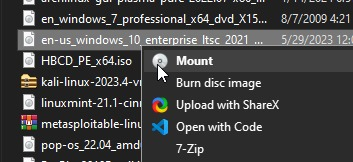

- Download [this tool](https://github.com/ChrisRfr/Win10XPE), extract it and set it up, and run it as an administrator

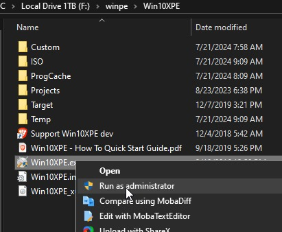

- Click on Select Source Folder

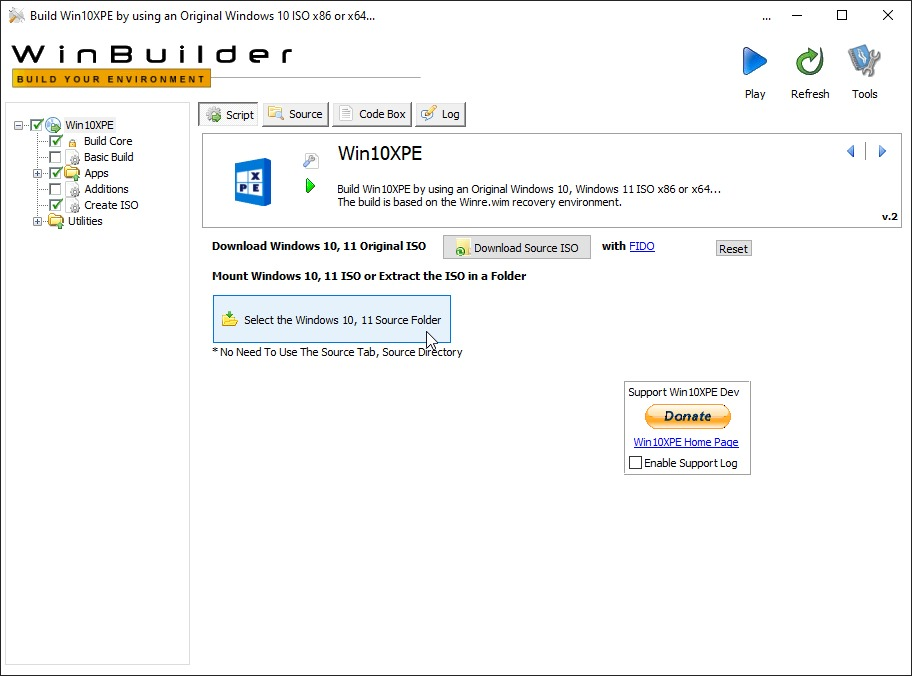

- And select the mounted original windows volume

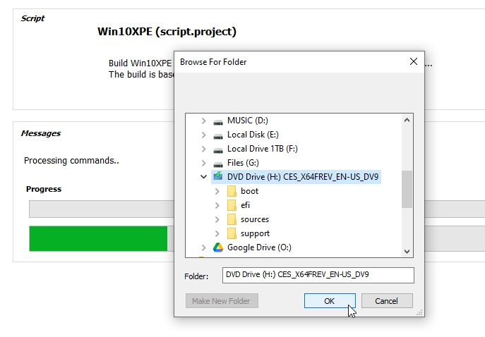

- Come to the Source tab in the Build Core section and set the Source Directory to a drive with atleast 10GB of free storage

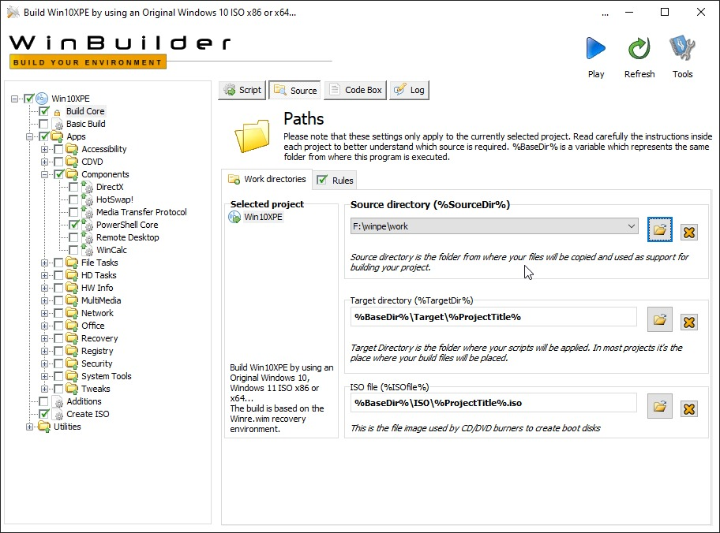

- Come back to the Script section and under Main Interface, update the settings and displayed here, enable "Add Your Custom Folder", and click on "Open Custom Folder",

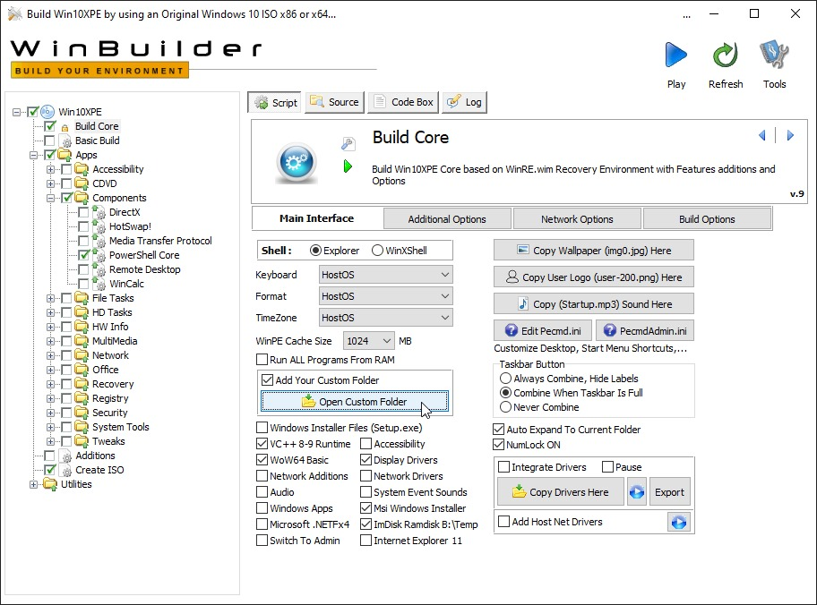

- Update the files as required, you can copy the files in this directory if this github repository to it, you can also go to upper levels of this directory and find the Wallpapers directory, this is where you can update the Wallpaper.

- If you want Bitlocker support, you can use files from the `winpe-bitlocker` directory of this repository to get the two required files (the script and the csv of exported bitlocker keys) and place it inside the target System32 directory and continue with the other steps mentioned in this guide.

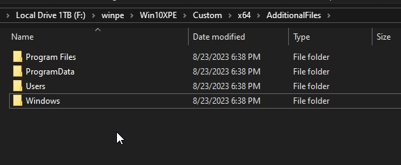

- Go to the Build Options section and update the settings as displayed here

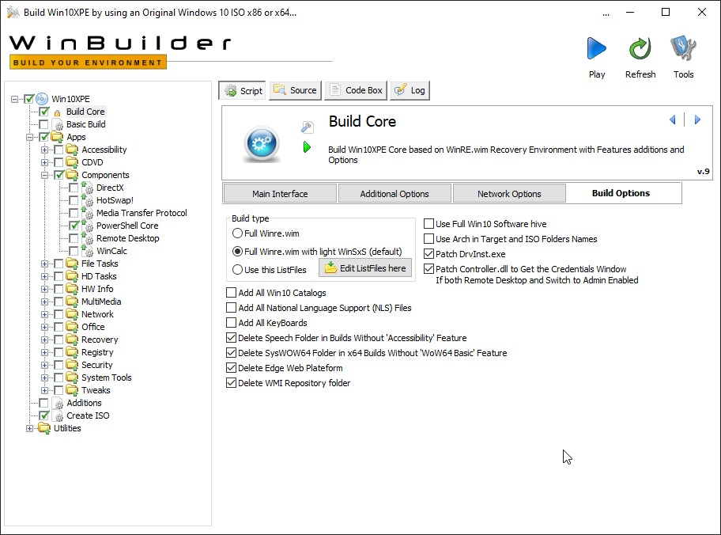

- Expand the sidebar and go to Win10XPE -> Apps -> Components -> PowerShell Core and press on Launch to get the required files (approx 100MB) and test it

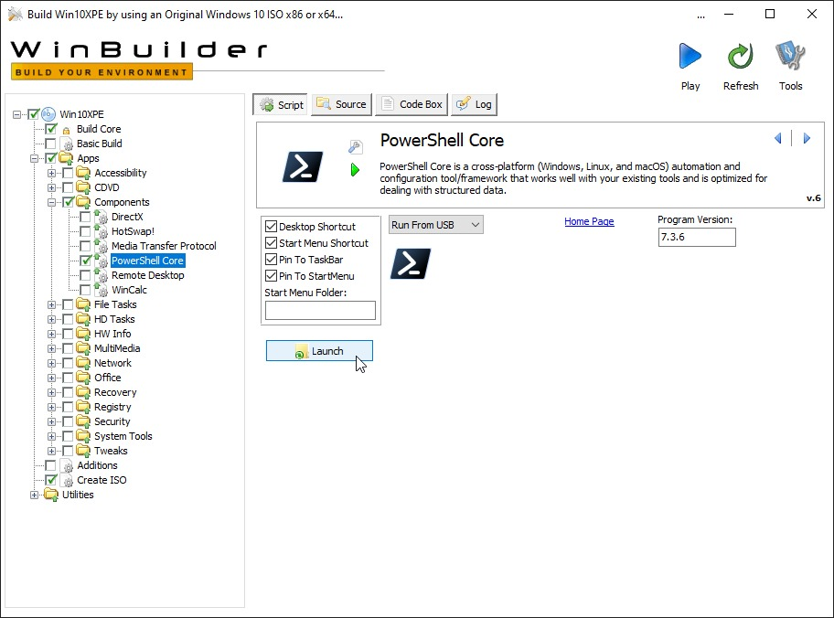

- You can now come to the Create ISO section in the sidebar, set the settings to whats displayed here and press on "Play" to start building the image

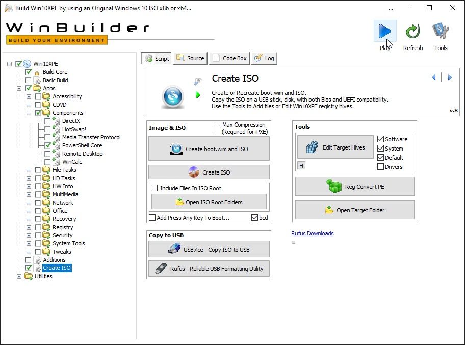

- Wait for it to complete,

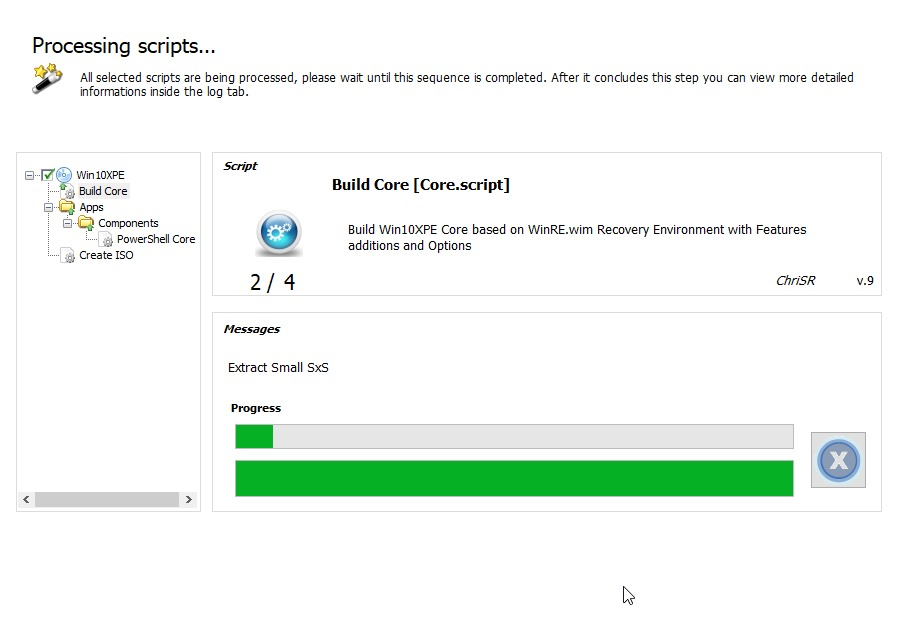

- You should now find your `Win10XPE_x64.iso` inside the same directory with `Win10XPE.exe`
