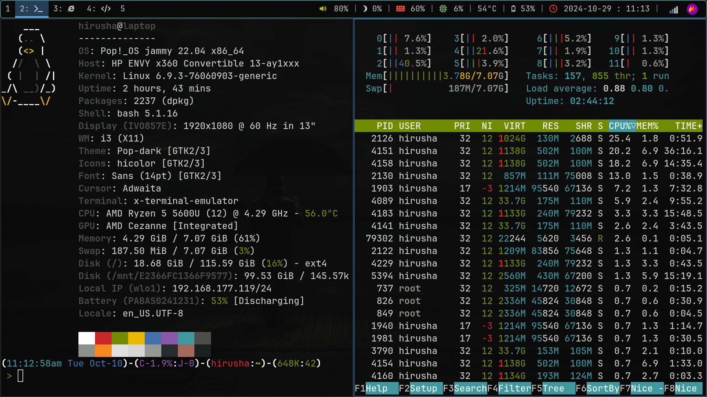
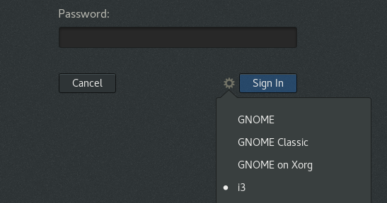
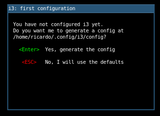
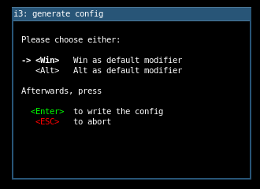
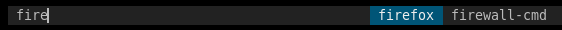
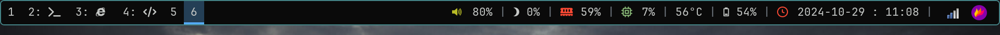
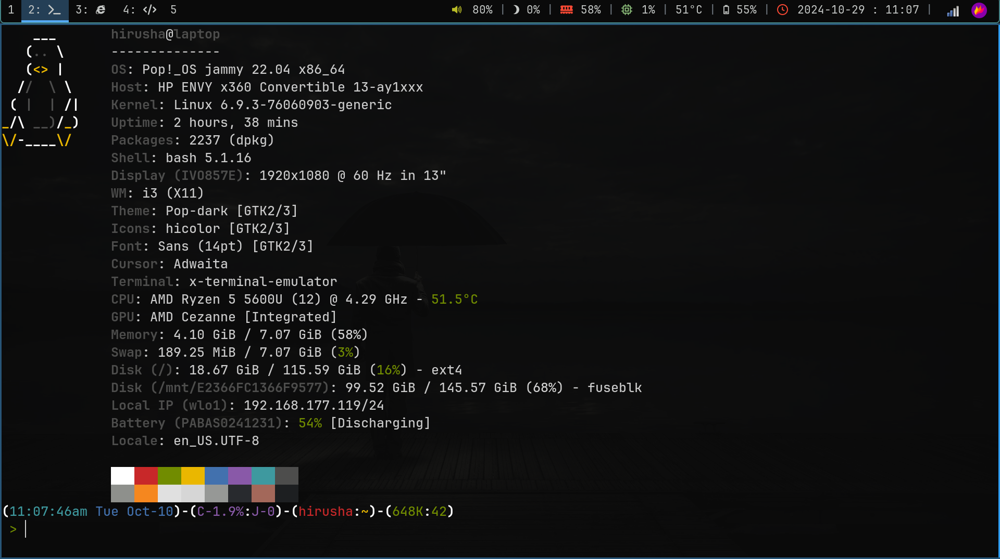

If you're looking for a lightweight, highly customizable, and keyboard-driven window manager, i3wm is one of the best choices out there. Whether you're a beginner exploring tiling window managers or an advanced user wanting to fine-tune your workflow, this ultimate guide to i3wm will walk you through everything—from installation and configuration to productivity tips and essential scripts. Get ready to take full control of your Linux desktop like never before!



<!--truncate-->

If you’re looking to dive into a new way of managing your desktop, i3wm might be just what you need! This guide will help you get started with i3wm, particularly if you're using Ubuntu 22.04 (although there may be some slight differences in setup). I've tested everything on Pop!_OS 22.04 (non-NVIDIA edition) on my laptop, so it should work smoothly with similar setups.

:::danger WARNING

Only proceed if you’re up for reading some documentation along the way. i3wm isn’t for everyone - it requires some patience and a willingness to tinker a bit.

:::

## Why i3wm?

i3wm is well-documented and widely supported, which makes it a solid choice if you’re looking to switch to a tiling window manager. Unlike some alternatives, it’s not based on Wayland, so there’s no hassle with NVIDIA GPUs - everything just works.

Once you get the basics down and spend just 30 minutes with i3wm, you’ll probably wonder why you didn’t switch sooner! No more endlessly pressing Alt+Tab to find a specific window; you can manage your workspace with a few quick key combinations. Launching apps is fast, system information is readily visible, and the entire setup is incredibly lightweight and customizable. It’s efficient, saves time, and, with a bit of practice, navigating through i3wm will feel intuitive in no time.

## i3wm

### Installation

On Pop!_OS, you can install i3wm with its default dependencies using the following command:

```bash
sudo apt install i3
```

### Initial Setup

After the installation completes, log out of your system (you can use the GUI or run `logout` in the terminal). When logging back in, select "i3(wm)" as your session and enter your password.



Once logged in, you’ll see a blank screen and be presented with the i3 configuration setup prompt.



Press `ENTER` to create the default configuration file at `~/.config/i3/config`. We’ll revisit this file later for customizations. This is the file I will be referring to as the i3 config(aration) file. 

Next, you’ll be asked to choose a modifier key this "`Mod`" key is crucial as it’s used in most of i3’s keyboard shortcuts.



Use the arrow keys to select your preferred modifier. Personally, I prefer to use `<Alt>`, as it's easier for me access.

Press `ENTER` to confirm your choice.


:::info NOTE

Since i selected the `Alt` key as my `Mod` key, in this blog post, form here onwards, wheren i say `Alt+x`, what is actually means is `Mod+x` where `Mod` is your modifier key.

:::


You’ll now be looking at a blank screen, ready to start configuring your i3 workspace.

### Looking Around

To open an application, press `Alt+D` to launch i3’s `dmenu`, where you can type the application’s name (e.g., `firefox`) to start it. Note that the application must be in your system’s `PATH` for `dmenu` to locate it.



Now, open your browser and check out the [introduction section](https://i3wm.org/docs/userguide.html#_using_i3) of the official i3 documentation for a quick overview.

Optionally, you can also watch this [YouTube video](https://youtu.be/j1I63wGcvU4?si=KS20xtV5_UcEtttC) for a visual guide.

Try the key bindings out yourself and practice the basics for like 10-15 minutes.

From this point onwards, i will assume that you are familiar with the key bindings.

### Lightdm

:::note Note

This section is optional.

:::

For a lighter, more resource-efficient display manager, you can switch from GDM to LightDM.

To install LightDM, run:

```bash
sudo apt install lightdm
```

If you’re not prompted to set it as the default display manager, you can manually configure it with:

```bash
sudo dpkg-reconfigure lightdm
```

Restart your computer for the changes to take effect:

```bash
sudo reboot
```

## Fonts

### Installation

First, download the "[JetBrainsMono Nerd Font](https://www.nerdfonts.com/font-downloads)" from the Nerd Fonts website.


Then, install the font by running:

```bash
mkdir tmp-fonts && cd tmp-fonts
mv ../JetBrainsMono.zip .
unzip ./JetBrainsMono.zip
mv ./* ~/.fonts/
cd ..
rm -rf tmp-fonts
```

Next, refresh the font cache by removing any existing cache and rebuilding it:

```bash
rm -rf ~/.cache/fontconfig
sudo fc-cache -r -v
```

### Update Fonts (i3)

To apply the font in i3, open the i3 configuration file and edit:

```
font pango:JetBrainsMono Nerd Font 14
```

This line will set the font for i3 to `JetBrainsMono Nerd Font` at size `14`.

## Custom Wallapers

To set a custom wallpaper, start by installing `feh`, a command-line utility for managing wallpapers:

```bash
sudo apt install feh
``` 

Use the command below to set your wallpaper to an image located at: `/mnt/E2366FC1366F9577/Pictures/wallpaper.jpg`

```bash
feh --bg-fill /mnt/E2366FC1366F9577/Pictures/wallpaper.jpg
```

### Set on Startup

In i3’s configuration file, you can use `exec` to specify commands that i3 runs at startup. To have a command also run when i3 restarts, use exec_always. The commands in the config file execute sequentially. For more details, refer to [i3’s startup applications documentation](https://i3wm.org/docs/userguide.html#_automatically_starting_applications_on_i3_startups).

To set your wallpaper each time i3 starts or restarts, add the following to your i3 configuration file:

```
exec_always feh --bg-fill /mnt/E2366FC1366F9577/Pictures/wallpaper.jpg
```

This command ensures your wallpaper is applied both at startup and whenever you restart the i3 session.

## Color Scheme

:::note Note

This section is optional.

:::

You can customize the color scheme of borders and other elements in i3 by editing your configuration file. Here’s an example of how you might set up colors:

```
# class                 border  backgr. text    indicator child_border
client.focused          #4c7899 #285577 #ffffff #2e9ef4   #285577
client.focused_inactive #333333 #5f676a #ffffff #484e50   #5f676a
client.unfocused        #333333 #222222 #888888 #292d2e   #222222
client.urgent           #2f343a #900000 #ffffff #900000   #900000
client.placeholder      #000000 #0c0c0c #ffffff #000000   #0c0c0c

client.background       #ffffff
```

Feel free to update these colors with any palette you like. I’m using a slightly adjusted version of the default blue theme available in the [i3 user guide](https://i3wm.org/docs/userguide.html#client_colors).

## Title Bar

:::note Note

This section is optional.

:::

If you find the title bar unnecessary, you can remove it by modifying your configuration file. To keep a minimal border for better window distinction, use the following line:

```
for_window [class="^.*"] border pixel 2
```

In this setup, `border pixel 2` sets the border width to 2 pixels for all windows (selected by `for_window [class="^.*"]`). If you prefer no border at all, you can change `2` to `0`, but a light border helps distinguish between multiple open windows in each workspace.

## Laptop User Experience

### Volume Controls

If you're using PulseAudio, you likely have `pactl` installed as well. You can add the following lines to your i3 configuration file to manage volume controls. Note that in newer versions of i3wm, these may already be included in the default config.

```
set $refresh_i3status killall -SIGUSR1 i3status
bindsym XF86AudioRaiseVolume exec --no-startup-id pactl set-sink-volume @DEFAULT_SINK@ +10% && $refresh_i3status
bindsym XF86AudioLowerVolume exec --no-startup-id pactl set-sink-volume @DEFAULT_SINK@ -10% && $refresh_i3status
bindsym XF86AudioMute exec --no-startup-id pactl set-sink-mute @DEFAULT_SINK@ toggle && $refresh_i3status
bindsym XF86AudioMicMute exec --no-startup-id pactl set-source-mute @DEFAULT_SOURCE@ toggle && $refresh_i3status
```

### Audio Controls

PopOS 22.04 typically comes with `playerctl` pre-installed and configured. To control audio playback, you can add these lines to your i3 config. If `playerctl` isn't already installed, you will need to install it and start the daemon manually. For more details, visit the [Playerctl Github Page](https://github.com/altdesktop/playerctl)

```
bindsym XF86AudioPlay exec playerctl play
bindsym XF86AudioPause exec playerctl pause
bindsym XF86AudioNext exec playerctl next
bindsym XF86AudioPrev exec playerctl previous
```

These bindings will give you convenient keyboard shortcuts to manage audio playback directly from your laptop.

### Brightness Controls

To manage screen brightness in i3wm, you can use the `brightnessctl` utility. First, install it with the following command:

#### Installation

First, install brightnessctl with the following command:

```
sudo apt install brightnessctl
```

#### Test

To adjust brightness by 5%, use the commands below:

- To increase brightness:
  ```bash
  sudo brightnessctl set +5%
  ```

- To decrease brightness:
  ```bash
  sudo brightnessctl set 5%-
  ```

#### i3 Configuration

Initially, you may find that the above commands do not work without sudo. It's only only me that faced [this issue](https://github.com/i3/i3/discussions/4763). If it does work without `sudo` / root, you can add the following lines to your i3 configuration file:

```
bindsym XF86MonBrightnessUp exec --no-startup-id brightnessctl set +5%
bindsym XF86MonBrightnessDown exec --no-startup-id brightnessctl set 5%-
```

#### Edit Sudoers

However, if it only works with sudo, you will need to configure sudo to allow running brightnessctl without a password prompt.

To do this, you'll need to edit the sudoers file. Open it with the following command to edit it safely:

```bash
sudo visudo
```

Then, add the following line at the end of the file, replacing hirusha with your actual username:

```bash
hirusha ALL=(ALL) NOPASSWD: /usr/bin/brightnessctl
```

This configuration allows your user to execute brightnessctl without being prompted for a password.

:::danger NOTE

Note: I am no expert and this workaround may not be suitable if there are multiple user accounts using the same configuration, as it could lead to functionality issues.

:::

#### Finalize i3 Configuration

After configuring the sudoers file, you can add the key bindings to your i3 config file to use brightnessctl with sudo:

```
bindsym XF86MonBrightnessUp exec --no-startup-id sudo brightnessctl set +5%
bindsym XF86MonBrightnessDown exec --no-startup-id sudo brightnessctl set 5%-
```

With these configurations in place, you should now be able to adjust your screen brightness using the dedicated function keys on your laptop without breaking the functionality.


### Touchpad Controls

To enable advanced touchpad gestures on your laptop (such as two-finger tap for right-clicking), you can use [`libinput-gestures`](https://github.com/bulletmark/libinput-gestures). Here’s how to set it up:


#### Requirements

Ensure you have the following:
- Python 3.7 or later (Python 2 is not supported).
- libinput release 1.0 or later.

#### Add User to Input Group

You need to be a member of the `input` group to read the touchpad device. Run the following command to add your user to the group:

```bash
sudo gpasswd -a $USER input
```

After executing this command, reboot your system for the changes to take effect.

#### Dependencies

You will need to install `wmctrl` and `xdotool`, which are necessary for simulating keyboard and mouse actions for Xorg or XWayland apps. Run the following commands:

```bash
sudo apt-get install wmctrl xdotool
sudo apt-get install libinput-tools
```

#### Install

To install `libinput-gestures`, you'll need to clone the repository and run the installation script manually:

```bash
# Clone the repository
git clone https://github.com/bulletmark/libinput-gestures.git

# Navigate to the cloned folder
cd ./libinput-gestures

# Run the installation script
sudo ./libinput-gestures-setup install
```

#### i3 Configuration

To ensure that `libinput-gestures` starts automatically with your i3 session, add the following line to your i3 configuration file:

```bash
exec --no-startup-id "sudo libinput-gestures-setup start"
```

#### 6. Customizing Gestures

:::note Note

This section is optional. I'm happy with the default configuration.

:::

You can customize your gestures by editing the configuration file located at `~/.config/libinput-gestures.conf`. You can find example gestures and their configuration in the documentation.

With these steps completed, you should now have enhanced touchpad controls, allowing for a more intuitive and efficient experience on your laptop.


## The Bar



### Remove Default Bar

To remove the default status bar in i3, locate the `bar` section in your i3 config file and either delete or comment it out:


```
bar {
  ...
}
```

After making this change, restart i3 by pressing `Alt+Shift+r`. The status bar will be gone, but you can still launch the terminal using `Alt+Return`.


### Install [Polybar](https://github.com/polybar/polybar)

The versions of Polybar available in the Ubuntu/Debian package repositories are often outdated. To ensure you have the latest features and customization options, you'll want to build Polybar from source. Refer to the [official documentation](https://github.com/polybar/polybar/wiki/Compiling#building) for further details.

To download the latest sources directly from the repository, run the following commands:

```bash
# make sure to type the `git' command as-is to clone all git submodules too
git clone --recursive https://github.com/polybar/polybar

# go into the cloned folder
cd polybar
```

**Warning**: Compiling Polybar from the latest source may include unreleased changes that could introduce bugs and affect your configuration.

Before compiling, ensure that any Python environments (like Anaconda or pyenv) are deactivated or set to use the system Python. [Click here](https://github.com/polybar/polybar/wiki/Known-Issues#building-with-anaconda-installed) to view know issues.

Then, run the following commands to compile and install Polybar:

```bash
mkdir build
cd build
cmake ..
make -j$(nproc)

# to install polybar into /usr/bin
sudo make install
```

### Initial Configuration

After installation, copy the default configuration file (`config.ini`) to your home directory so you can customize it:


```bash
cp /etc/polybar/config.ini ~/.config/polybar/config.ini
```

Open the copied configuration file in your preferred text editor and change the name of the bar to `bar`. The relevant section should look like this:

```ini
...

[bar/bar]

...
```

You can now manually start Polybar by running the `polybar` command in your terminal. However, to integrate it with your i3 window manager, you’ll want to add it to your i3 startup routine.

#### Startup Script

Create a new script at `~/.config/i3/launch-polybar.sh` with the following content:

```bash
#!/usr/bin/env bash

# Terminate already running bar instances
# If all your bars have ipc enabled, you can use 
polybar-msg cmd quit
# Otherwise you can use the nuclear option:
# killall -q polybar

# Launch the bar named: bar
echo "---" | tee -a /tmp/polybar1.log
polybar bar 2>&1 | tee -a /tmp/polybar1.log & disown

echo "Bars launched..."
```

Make sure the name `bar` matches the name you set in your Polybar configuration.

#### i3 Configuration

To start the Polybar automatically with i3, add the following line to your i3 configuration file:

```
exec_always ~/.config/i3/launch.sh
```

### How it Works?

Polybar operates using modules, which are essentially blocks of text or icons displayed on the bar. You can utilize a variety of pre-written modules or create your own easily. For more detailed information, you can refer to the [Polybar module documentation](https://github.com/polybar/polybar/wiki/Module:-script).

### Modules Introduction

Each module is defined in your Polybar configuration file and can include various parameters to customize its appearance and behavior. Here’s a basic template for a module:

```ini
[module/module_name]                ; `module_name` is the name of the module       
type = ...                          ; type of the module. refer to docs for more info
interval = 5                        ; how often to update this? `5` means update each 5 seconds
format-prefix = "  "               ; icon (LHS) of the module text/content
format-prefix-foreground = #ff0000  ; color of the icon
format-margin = 8pt                 ; margin of the icon
```

### My Modules

Here are some modules I use with my Polybar:

####  Workspace Indicator

This module shows the workspaces that are currently in use:

```ini
[module/xworkspaces]
type = internal/xworkspaces
label-active = %name%
label-active-background = ${colors.background-alt}
label-active-underline= ${colors.primary}
label-active-padding = 1
label-occupied = %name%
label-occupied-padding = 1
label-urgent = %name%
label-urgent-background = ${colors.alert}
label-urgent-padding = 1
label-empty = %name%
label-empty-foreground = ${colors.disabled}
label-empty-padding = 1
```

#### Audio Volume Control

This module displays the audio volume level and allows you to control it by scrolling over it:

```ini
[module/pulseaudio]
type = internal/pulseaudio
format-volume-prefix = "  "
format-volume-prefix-foreground = ${colors.green}
format-volume = <label-volume>
label-volume = %percentage%%
label-muted = muted
label-muted-foreground = ${colors.disabled}
```

#### Date and Time

This module shows the current date and time:

```ini
[module/datetime]
type = internal/date
interval = 5
date = "%Y-%m-%d%"
time = "%H:%M"
label = "%date% : %time%"
format-prefix = "  "
format-prefix-foreground = ${colors.red}
```

#### Memory Usage

This module displays the current memory usage:

```ini
[module/memory]
type = internal/memory
interval = 2
format-prefix = "  "
format-prefix-foreground = ${colors.red}
label = %percentage_used:2%%
```

#### CPU Usage

This module shows the current CPU usage:

```ini
[module/cpu]
type = internal/cpu
interval = 2
format-prefix = " "
format-prefix-foreground = ${colors.aqua}
label = %percentage:2%%
```

#### System Tray

This module is very useful for displaying system tray icons:

```ini
; This module is not active by default (to enable it, add it to one of the
; modules-* list above).
; Please note that only a single tray can exist at any time. If you launch
; multiple bars with this module, only a single one will show it, the others
; will produce a warning. Which bar gets the module is timing dependent and can
; be quite random.
; For more information, see the documentation page for this module:
; https://polybar.readthedocs.io/en/stable/user/modules/tray.html
[module/systray]
type = internal/tray
format-margin = 8pt
tray-spacing = 16pt
```


### Modules (Advanced)

#### CPU Temperature

To set up the CPU temperature module, you'll need to edit the `thermal-zone`, `zone-type`, and `hwmon-path` settings to match your system configuration. Follow the instructions provided in the comments to identify the correct settings by running specific commands.

1. **List Thermal Zones**: Run the following command to see the available thermal zones on your system:

  ```bash
   for i in /sys/class/thermal/thermal_zone*; do echo "$i: $(<$i/type)"; done
   ```

   Example output:
   ```
   /sys/class/thermal/thermal_zone0: acpitz
   /sys/class/thermal/thermal_zone1: acpitz
   ```

   From this output, you can choose the appropriate `thermal-zone`. For instance, if `thermal_zone0` corresponds to `acpitz`, you can set `thermal-zone = 0` in your Polybar configuration.

2. **Find HWMon Path**: Next, run the following command to find the path to the desired temperature input:

  ```bash
   for i in /sys/class/hwmon/hwmon*/temp*_input; do echo "$(<$(dirname $i)/name): $(cat ${i%_*}_label 2>/dev/null || echo $(basename ${i%_*})) $(readlink -f $i)"; done
   ```

   Example output:
   ```
   acpitz: temp1 /sys/devices/virtual/thermal/thermal_zone0/hwmon1/temp1_input
   acpitz: temp2 /sys/devices/virtual/thermal/thermal_zone0/hwmon1/temp2_input
   nvme: Composite /sys/devices/pci0000:00/0000:00:02.3/0000:03:00.0/nvme/nvme0/hwmon5/temp1_input
   amdgpu: edge /sys/devices/pci0000:00/0000:00:08.1/0000:04:00.0/hwmon/hwmon6/temp1_input
   ```

   In this case, you might select `hwmon-path = /sys/devices/virtual/thermal/thermal_zone0/hwmon1/temp1_input`.

3. **Polybar Configuration**: Here’s the configuration for the CPU temperature module:


```ini
[module/cpu-temperature]
type = internal/temperature
interval = 3

; Thermal zone to use
; To list all the zone types, run 
; $ for i in /sys/class/thermal/thermal_zone*; do echo "$i: $(<$i/type)"; done
; Default: 0
thermal-zone = 0

; Select thermal zone by name
; The name has to match the contents of /sys/class/thermal/thermal_zone*/type
; for the desired thermal zone.
; New in version 3.7.0
; Default: "" / x86_pkg_temp
zone-type = acpitz

; Full path of temperature sysfs path
; Use `sensors` to find preferred temperature source, then run
; $ for i in /sys/class/hwmon/hwmon*/temp*_input; do echo "$(<$(dirname $i)/name): $(cat ${i%_*}_label 2>/dev/null || echo $(basename ${i%_*})) $(readlink -f $i)"; done
; to find path to desired file
; Default reverts to thermal zone setting
hwmon-path = /sys/devices/virtual/thermal/thermal_zone0/hwmon1/temp1_input

; Base temperature for where to start the ramp (in degrees celsius)
; Default: 0
base-temperature = 20

; Threshold temperature to display warning label (in degrees celsius)
; Default: 80
warn-temperature = 60
```

Make sure to replace `thermal-zone`, `zone-type`, and `hwmon-path` with the values you found from running the commands. Otherwise, the module will not work correctly.


#### Battery

To display your device's battery status, you'll need to adjust the `battery` and `adapter` settings according to your system. Use the command below to see the available power supply devices:

Run the command below to see the list:

```bash
ls -1 /sys/class/power_supply/
```

Here's the configuration for the battery module:


```ini
[module/battery]
type = internal/battery
full-at = 99
low-at = 5
battery = BAT1
adapter = ACAD
poll-interval = 10
label-charging = " %percentage%%"
label-discharging = "󱊡 %percentage%%"
label-full = "󰁹 %percentage%%"
label-low = "󰜺 %percentage%%"
format-prefix-foreground = ${colors.red}
```

For example, the output of the command might show something like:

```bash
> ls -1 /sys/class/power_supply/
 ACAD@ ⇒ ../../devices/pci0000:00/0000:00:14.3/ACPI0003:00/power_supply/ACAD
 BAT1@ ⇒ ../../devices/LNXSYSTM:00/LNXSYBUS:00/PNP0A08:00/device:2b/PNP0C0A:00/power_supply/BAT1
 hid-0018:04F3:2DDE.0004-battery@ ⇒ ../../devices/platform/AMDI0010:02/i2c-0/i2c-ELAN2513:00/0018:04F3:2DDE.0004/power_supply/hid-0018:04F3:2DDE.0004-battery
 ucsi-source-psy-USBC000:001@ ⇒ ../../devices/platform/USBC000:00/power_supply/ucsi-source-psy-USBC000:001
```

Here, `ACAD` and `BAT1` are the adapter and battery names for your system.

#### Brightness

If you have `brightnessctl` set up, you can create a script to display and adjust brightness. 

First, create a script at `~/.config/polybar/brightness.sh`:

```bash
#!/bin/bash
BRIGHTNESS_VALUE=`brightnessctl | grep -o "(.*" | tr -d "()"`
BRIGHTNESS_NR=${BRIGHTNESS_VALUE//%}

if [ $BRIGHTNESS_NR -lt 20 ]; then
	BRIGHTNESS_ICON='󰃜'
elif [ $BRIGHTNESS_NR -lt 50 ]; then
	BRIGHTNESS_ICON='󰃛'
elif [ $BRIGHTNESS_NR -lt 80 ]; then
	BRIGHTNESS_ICON='󰃚'
else
	BRIGHTNESS_ICON='󰃚'
fi

echo "$BRIGHTNESS_ICON $BRIGHTNESS_VALUE"
```

Then, configure the brightness module in your Polybar configuration:

```ini
[module/brightnessctl]
type = custom/script
exec = ~/.config/polybar/brightness.sh
scroll-up = exec sudo brightnessctl set +5%
scroll-down = exec sudo brightnessctl set 5%-
interval = 1
label = %output%
label-foreground = ${colors.foreground} 
```

With this setup, you can adjust your screen brightness directly from the Polybar and view the current brightness level by scrolling on top of the module.


### Using Modules

Modules appear in the order mentioned in your configuration file. 

```ini
[bar/bar]
modules-left = xworkspaces
modules-right = pulseaudio brightnessctl memory cpu cpu-temperature battery datetime systray
```
This layout organizes your modules into two sections: the left section contains `xworkspaces`, and the right section features a range of modules like `pulseaudio`, `brightnessctl`, `memory`, `cpu`, `cpu-temperature`, `battery`, `datetime`, and `systray`. The order matters; modules will appear in the sequence they are listed.

Note that each module can be customized further using various parameters available in the documentation. Refer to the [Polybar Wiki](https://github.com/polybar/polybar/wiki) for additional information.


### Customizations

#### Color Definitions

You can customize your Polybar by defining a color palette, which can be reused throughout your configuration:

```ini
[colors]
background = #0A0A0A
background-alt = #243f56
primary = #55abf7
foreground = #C5C8C6
secondary = #98971A
alert = #A54242
disabled = #707880
green = #b8bb26
yellow = #fabd2f
blue = #458588
aqua = #8ec07c
red = #fb4934
```

To use these colors in your modules, refer to them like this: `${colors.background}`.

#### Bar Separator and Size

You can customize the separator between modules and adjust the size and positioning of your bar:

```ini
[bar/bar]
separator = |
separator-foreground = ${colors.disabled}
```

You can also define the dimensions of the bar:

```ini
[bar/bar]
width = 100%
height = 35pt
radius = 6
line-size = 3pt
border-size = 4pt
border-color = #00000000
```

Setting `border-color = #00000000` effectively makes the border transparent, creating a seamless look between the bar and any applications running below it.

#### Font Configuration

To ensure that your icons display correctly, make sure to set the font in your configuration:

```ini
font-0 = "JetBrainsMono Nerd Font:size=16;2"
```

This font choice not only provides a good aesthetic but also supports the various icons used in your Polybar modules.

#### Other

Polybar offers extensive customization options, allowing you to tailor your experience to suit your workflow. For detailed guidance on modules and configurations, refer to the [Polybar Wiki](https://github.com/polybar/polybar/wiki).

## Compositor

To enable transparency effects and ensure your bar works as intended, you'll need to install a compositor. For this, you can use [`compton`](https://github.com/chjj/compton), which is suitable for X11.

Run the following command to install it:

```bash
sudo apt install compton
```

After the installation is complete, add it to your i3 configuration:

```
exec_always compton -f
```

Alternatively, you can use `picom`, which is more actively maintained and up-to-date. To learn more about it, visit [this link](https://github.com/yshui/picom).


## Application Launcher

### Installation

For your application launcher, we will use **rofi** instead of **dmenu**. You can build the latest version from the source by following [this guide](https://github.com/davatorium/rofi/blob/next/INSTALL.md#dependency), or you can install it using your distribution's default package manager. Here’s how to install it via `apt`:

```bash
sudo apt install rofi
```

To show the launcher, run the following command:

```bash
rofi -show run
```

### Configuration

You can type the application name here, similar to how you would with **dmenu**. If you have installed a compositor, the transparency effects when customizing this should work without any issues.

While you can heavily customize **rofi** using command line arguments, we will use the configuration file instead. 

To create a default config file, run:

```
rofi -dump-config > ~/.config/rofi/config.rasi
```

This saves the configuration in the directory where **rofi** looks for config files by default.

To bind this launcher to `Alt+d`, add the following line to your i3 config file:

```
bindsym $mod+d exec rofi -show run
```

### Basic Customization

By default, rofi offers three modes: `window`, `run`, and `ssh`. While you can keep track of your SSH connections and quickly make connections, we won't be adding the SSH mode here.

We will increase the font size and change the font. The `timeout` and `filebrowser` settings can be left as they are. Refer to the [documentation](https://davatorium.github.io/rofi/CONFIG/) for more customization options.

You will see a lot of configuration commented out, these are the default settings. Feel free to customize anything.

```rasi
configuration {
  modi: "window,run";
  font: "JetBrainsMono Nerd Font 17.5";
  timeout {
      action: "kb-cancel";
      delay:  0;
  }
  filebrowser {
      directories-first: true;
      sorting-method:    "name";
  }
}
```

### Themes

You can find documentation related to theming [here](https://github.com/davatorium/rofi/blob/next/doc/rofi-theme.5.markdown). All officially supported themes are available [here](https://github.com/davatorium/rofi/tree/next/themes).

To begin, change your current working directory to the rofi config directory:

```bash
cd ~/.config/rofi/
```

Next, download the required theme(s) using `wget` or `curl`. Be aware that some themes might depend on other themes or configs. 

For example, `gruvbox-dark-hard` depends on `gruvbox-common.rasinc`, so you will need to download both:

```bash
wget "https://raw.githubusercontent.com/davatorium/rofi/refs/heads/next/themes/gruvbox-common.rasinc"
wget "https://raw.githubusercontent.com/davatorium/rofi/refs/heads/next/themes/gruvbox-dark-hard.rasi"
```

Finally, set the theme by editing your **rofi** config file:

```rasi
@theme "gruvbox-dark-hard"
```

Note that the theme name is `gruvbox-dark-hard`, and **rofi** will look for `gruvbox-dark-hard.rasi` in the config directory. For all themes you download, you can simply omit the `.rasi` extension when mentioning the theme name.

## Clipboard Manager

None of the tutorials, blog posts, or official documentation worked for me, but the guidance provided by the Arch Wiki was successful. Here’s how to set up greenclip, a clipboard manager that integrates well with your system.

### Installation

First, we’ll place the greenclip binary in a directory that is included in your system's PATH. We will use `~/.local/bin/`. If the directory doesn’t exist, let’s create it and navigate into it:

```bash
mkdir -p ~/.local/bin/  && cd ~/.local/bin/
```

If this directory is not already in your PATH, add it to the end of your `.bashrc` file located at `~/.bashrc`:

```bash
export PATH="~/.local/bin:$PATH"
```

After updating your `.bashrc`, restart your shell or run:

```bash
source ~/.bashrc
```

Now, you can download the greenclip executable binary:

```bash
wget "https://github.com/erebe/greenclip/releases/download/v4.2/greenclip"
```

Next, set the permissions to make it executable:

```bash
chmod +x ./greenclip
```

Your installation is now complete! You can refer to the [official documentation](https://github.com/erebe/greenclip) for more information.

### Setup

To monitor the clipboard effectively, the greenclip daemon should be running in the background. 

Add the following lines to your i3 config file to automatically start the daemon and to show greenclip using rofi:

```
exec --no-startup-id greenclip daemon & > /dev/null
bindsym Mod4+c exec --no-startup-id rofi -modi "clipboard:greenclip print" -show clipboard
bindsym Mod4+v exec --no-startup-id rofi -modi "clipboard:greenclip print" -show clipboard
```

Here, `Mod4` refers to the "Super"/"Win"/"Start" key. This means you can display the clipboard manager by pressing `Super+c` and paste it with `Super+v`.

### Configuration

The default configuration file for greenclip is located at `~/.config/greenclip.toml`. You can modify it to suit your needs:

```toml
[greenclip]
  blacklisted_applications = []
  enable_image_support = true
  history_file = "/home/hirusha/.cache/greenclip.history"
  image_cache_directory = "/tmp/greenclip"
  max_history_length = 50
  max_selection_size_bytes = 0
  static_history = ["GClipboard managed by greenclip"]
  trim_space_from_selection = true
  use_primary_selection_as_input = false
```

- `static_history` is a list of strings that will always be preserved in the clipboard history.
- The configuration above specifies that images (e.g., screenshots taken with Flameshot) copied to the clipboard will be saved in `image_cache_directory = "/tmp/greenclip"`. 
- Ensure you update the `history_file` to a directory specific to your system.
- You can adjust the number of items greenclip keeps track of by editing `max_history_length` (the default is 50).

For additional information about configuring greenclip, refer to the [documentation](https://github.com/erebe/greenclip).

You may need to restart the *greenclip daemon* or your system for the changes to take effect. 

## Terminal



This section is optional and purely for aesthetics and minimalism. While `gnome-terminal` could suffice, its menu bar doesn't blend well with a tiling window manager. Therefore, we'll be using **Alacritty** for its speed and graphics acceleration.

### Installation

To install Alacritty, run the following command:

```bash
sudo apt install alacritty
```

To set Alacritty to start with `Alt+Return`, you can either keep your i3 config file as it is:

```
bindsym $mod+Return exec i3-sensible-terminal
```

or explicitly specify Alacritty:

```
bindsym $mod+Return exec alacritty
```

### Configuration File

Please note that this section may become outdated quickly. As I am using Pop!_OS 22.04, the repositories contain a centuries old version of Alacritty that hasn't been updated. The default configuration is now a `.toml` file in the latest version, but the Ubuntu repository still uses the older `.yml` config file. Classic Ubuntu.

To find a suitable configuration file, I discovered the old `.yml` file [here](https://github.com/tmcdonell/config-alacritty/blob/master/alacritty.yml) after considering building the latest version from source. However, I opted for the easier route.

Let's create the default configuration directory and navigate to it. This is where Alacritty will look for its configuration files by default:

```bash
mkdir -p ~/.config/alacritty && ~/.config/alacritty
```

Now, download the default configuration file:

```
wget "https://raw.githubusercontent.com/tmcdonell/config-alacritty/refs/heads/master/alacritty.yml"
```

If you don't modify the `~/.config/alacritty/alacritty.yml`, Alacritty will revert to its hardcoded defaults.

### Customization

I won’t be making extensive customizations. If you're interested, consider building the latest version from source and configuring it according to the [official documentation](https://github.com/alacritty/alacritty/tree/master/extra/man) by editing the `*.toml` configuration file. Here, I will edit the old deprecated `.yml` config file.


#### Transparency

To achieve a slightly translucent effect, set the opacity to 95%. Ensure you have a compositor installed for this to work:

```yml
window:
  opacity: 0.95
```

#### Font Configuration

Specify the default font and font size as follows:

```yml
font:
  size: 15
  normal:
    family: JetBrainsMono Nerd Font
    style: Medium
  bold:
    family: JetBrainsMono Nerd Font
    style: Bold
  italic:
    family: JetBrainsMono Nerd Font
    style: "Light Italic"
```

#### Color Scheme

Here’s how to configure the color scheme:

```yml
colors:
  # Default colors
  primary:
    background: '0x0A0A0A'
    foreground: '0xCCCCCC'
  # Normal colors
  normal:
    black:   '0xffffff'
    red:     '0xc82829'
    green:   '0x718c00'
    yellow:  '0xeab700'
    blue:    '0x4271ae'
    magenta: '0x8959a8'
    cyan:    '0x3e999f'
    white:   '0x4d4d4c'
  # Bright colors
  bright:
    black:   '0x8e908c'
    red:     '0xf5871f'
    green:   '0xe0e0e0'
    yellow:  '0xd6d6d6'
    blue:    '0x969896'
    magenta: '0x282a2e'
    cyan:    '0xa3685a'
    white:   '0x1d1f21'
```

#### Cursor Style

Change the cursor style from a block to a beam for a modern look:

```yml
cursor:
  style: Beam
  unfocused_hollow: true
```

#### Debug Level

Set the debug level to OFF to minimize unnecessary logging:

```yml
debug:
  log_level: OFF
```

Thats it! Congratulations for making it here! If you have any more questions, feel free to reach out. Enjoy your minimalistic setup!

## References

- Some images / screenshots taken from: https://opensource.com/article/18/8/getting-started-i3-window-manager
- Polybar `brightnessctl` module: https://github.com/pim-n/brightnessctl-polybar
- Polybar documentation: https://github.com/polybar/polybar/wiki
- Enabling multimedia keys: https://faq.i3wm.org/question/3747/enabling-multimedia-keys/?answer=3759#post-id-3759
- Rofi documentation: https://davatorium.github.io/rofi/
- Setup greenclip with rofi on i3wm: https://wiki.archlinux.org/title/Greenclip
- Greenclip: https://github.com/erebe/greenclip
- Alacritty: https://github.com/alacritty/alacritty
- Old alacritty .yml config: https://github.com/tmcdonell/config-alacritty/blob/master/alacritty.yml
- Remove i3wm border: https://www.reddit.com/r/i3wm/comments/87kclz/comment/dwdhtql/?utm_source=share&utm_medium=web3x&utm_name=web3xcss&utm_term=1&utm_content=share_button
