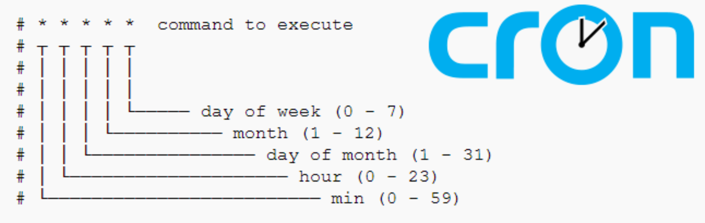

This guide covers the basics of using Cron, a time-based job scheduler in Unix-like systems. You'll learn how to set up and manage cron jobs, understand cron syntax, and explore practical examples for automating system tasks efficiently.



<!--truncate-->

**Cron** is a time-based job scheduler in Unix-like operating systems. It allows users to schedule tasks (known as "cron jobs") to run at specific times or intervals. These tasks are defined in a **crontab** (cron table) file.

This guide will walk you through the basics of using `cron`, setting up cron jobs, and providing examples.

## Introduction

### Key Components

- **Cron Daemon (`crond`)**: A background process that continuously checks the schedule and executes tasks.
- **Crontab File**: A configuration file where users define tasks to run and their schedule.

### Cron Time Syntax

The time format for cron jobs is:

```plaintext
* * * * * /path/to/command
- - - - -
| | | | |
| | | | +--- Day of the week (0 - 7) [Sunday = 0 or 7]
| | | +----- Month (1 - 12)
| | +------- Day of the month (1 - 31)
| +--------- Hour (0 - 23)
+----------- Minute (0 - 59)
```

- Use `*` to represent "any value."
- Use commas (`,`) to specify multiple values (e.g., `1,15,30`).
- Use hyphens (`-`) to specify ranges (e.g., `9-17` for 9 AM to 5 PM).
- Use `/` for intervals (e.g., `*/5` for every 5 minutes).

### Accessing Cron

- To edit the crontab file:
  ```bash
  crontab -e
  ```
- To list existing cron jobs:
  ```bash
  crontab -l
  ```
- To remove all cron jobs:
  ```bash
  crontab -r
  ```

## Setting Up a Cron Job

1. Open the crontab editor:
   ```bash
   crontab -e
   ```

2. Add a line for your task. For example:
   ```bash
   30 9 * * 1 /path/to/backup.sh
   ```
   This runs the script `backup.sh` at 9:30 AM every Monday.

3. Save the file and exit. Cron will automatically load the new configuration.

## Examples of Cron Jobs

Here are several example cron job entries:

1. **Running a Script Every Hour**

```bash
0 * * * * /path/to/hourly_script.sh
```
This runs `hourly_script.sh` at the start of every hour.

2. **Running a Command Every Day at 6 AM**

```bash
0 6 * * * /path/to/daily_task.sh
```
This runs `daily_task.sh` at 6:00 AM daily.

3. **Deleting Temporary Files Every Week**

```bash
0 3 * * 0 rm -rf /tmp/*
```
This deletes all files in the `/tmp` directory every Sunday at 3:00 AM.

4. **Running a Task on Specific Days**

```bash
0 7 1,15 * * /path/to/fortnightly_task.sh
```
This runs `fortnightly_task.sh` at 7:00 AM on the 1st and 15th of every month.

5. **Running a Task During Work Hours (9 AM to 5 PM)**

```bash
*/30 9-17 * * 1-5 /path/to/work_task.sh
```
This runs `work_task.sh` every 30 minutes from 9:00 AM to 5:00 PM, Monday through Friday.

6. **Running a Task Every 10 Minutes**
   
```bash
*/10 * * * * /path/to/ten_minute_task.sh
```
This runs `ten_minute_task.sh` every 10 minutes.

7. **Backing Up a Database Daily at Midnight**
   
```bash
0 0 * * * mysqldump -u user -p'password' database_name > /backup/db_backup.sql
```
This creates a backup of a MySQL database every day at midnight.

8. **Logging System Information Hourly**
   
```bash
0 * * * * echo "$(date): $(uptime)" >> /var/log/system_info.log
```
This appends the current date and system uptime to a log file every hour.

9. **Restarting a Service Weekly**

```bash
0 2 * * 1 systemctl restart myservice
```
This restarts a service named `myservice` every Monday at 2:00 AM.

10.  **Running a Python Script**

```bash
15 14 * * * /usr/bin/python3 /path/to/script.py
```
This runs a Python script at 2:15 PM daily.

## Advanced Usage

#### Redirecting Output to a File

To log the output of a cron job, redirect it to a file:
```bash
0 4 * * * /path/to/task.sh > /var/log/task_output.log 2>&1
```

#### Environment Variables

You can set environment variables in the crontab:
```bash
SHELL=/bin/bash
PATH=/usr/local/bin:/usr/bin:/bin

0 5 * * * /path/to/script.sh
```

#### Email Notifications

Cron can send email notifications of job output. To enable this, set the `MAILTO` variable in your crontab:
```bash
MAILTO=your-email@example.com
0 6 * * * /path/to/task.sh
```

## Viewing Logs

Cron logs are usually stored in `/var/log/syslog` or `/var/log/cron`. To view the logs, run:
```bash
grep CRON /var/log/syslog
```

## Notes

1. Ensure the user running the cron job has the necessary permissions to execute the task.
2. Always test your commands/scripts before scheduling them with `cron`.
3. Use absolute paths for scripts and executables to avoid issues with `cron`’s limited environment.

For more information, refer to the [Cron Man Page](https://man7.org/linux/man-pages/man5/crontab.5.html).
