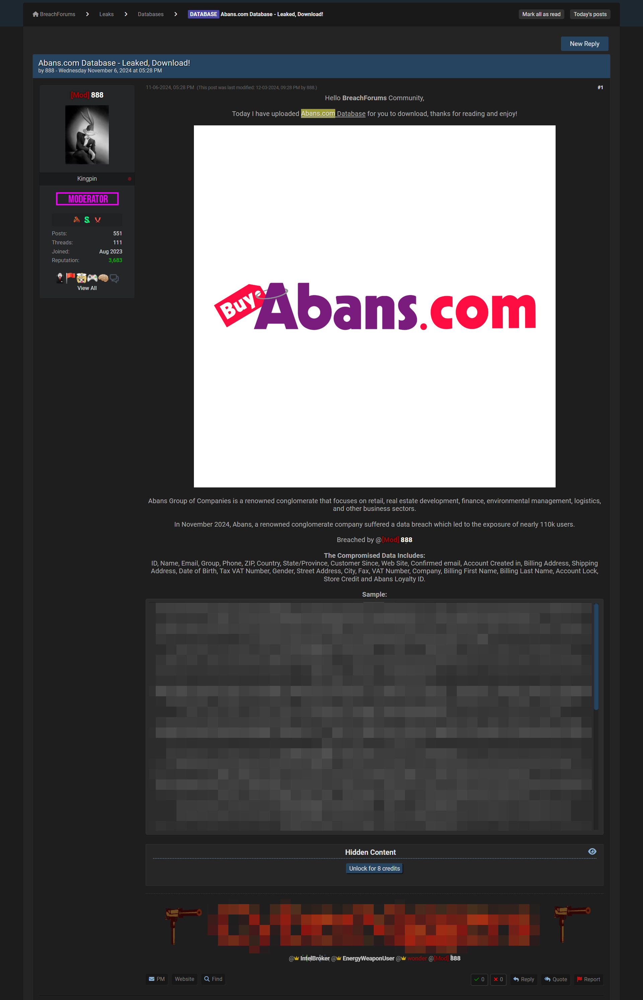
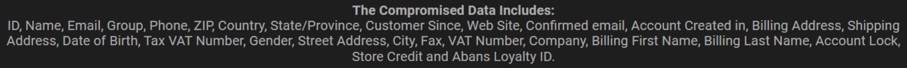

A threat actor on a popular dark web forum has leaked the personal data of approximately 110,000 users of the Abans Group in Sri Lanka. Abans PLC, also known as Abans Group, is a Sri Lankan public limited company and a diversified conglomerate engaged in ICT, retail, manufacturing, logistics, commercial real estate, and financial services.

<!--truncate-->

This leak was posted on [brachforums.st](https://breachforums.st/Thread-DATABASE-Abans-com-Database-Leaked-Download?highlight=Abans.com). However, this forum is now most likely a honeypot operated by a three-letter agency following the [arrest](https://cyble.com/blog/wave-of-arrests-hits-cybercriminals/) of Pompompurin (Conor Brian Fitzpatrick) in late 2023.

The leaked data includes highly sensitive information such as IDs, names, emails, phone numbers, addresses, account details, and tax numbers of its users.

Below is the original post made by a forum moderator known as "Kingpin":

Unfortunately, I cannot include the sample data here. However, according to the post, the following types of information can be found in the breached records:

Looking at the sample data, it looks like the source of this breach is from [buyabans.com](https://buyabans.com/).

**What can be done now?**

If you had an account on this website, consider changing your information immediately.

As always, shopping in person at a physical store is more secure than making purchases online, especially on smaller websites. While Abans isn’t exactly a small business, compared to platforms like Amazon and the resources they invest in securing their data, it is.

So, whenever possible, try to do things the old fashioned way, physically. No matter what big tech says, it has always been, and will always be, the most secure way to do things.
