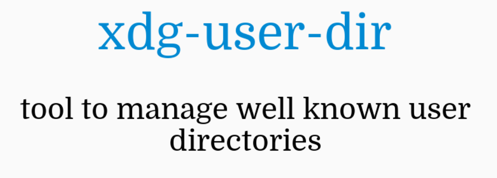

Whether you are setting up a computer for yourself or someone else, it's always better to have the user's files on a separate disk (or at least a partition) for easy recovery and management. Doing this also allows directories (like Desktop) to be shared among multiple operating systems if you dual boot. 



<!--truncate-->

Above all, this helps you easily recover or retain your files even if you break your operating system. This is my case - I distro hop every now and then or do a fresh install after breaking something. So, it's easier for me to have everything set up on a separate disk, with proper organization, to switch between them seamlessly. Moreover, I dual boot, so, for instance, this allows me to share the same Desktop and Downloads folders across different operating systems.

## Linux Setup

### X Desktop Group

XDG stands for "X Desktop Group" but recently, it was renamed to freedesktop. This is a set of standards and specifications for different desktop environments (DE) to follow to Linux.This goal to allow consistency among different DE's  like KDE, XFCE, GNOME, etc...

XDG Base Directory Specification is what defines where to store the systemm configuration files in a standardized way. Click [here](https://wiki.archlinux.org/title/XDG_Base_Directory) or [here](https://specifications.freedesktop.org/basedir-spec/latest/) to learn more. Although this is not what we will be focussing on this post.

### XDG User Directories

*"xdg-user-dirs is a tool to help manage "well known" user directories like the desktop folder and the music folder. It also handles localization (i.e. translation) of the filenames."* - [Source](https://www.freedesktop.org/wiki/Software/xdg-user-dirs/)

These are a set of environment variables that define where common folders are. Some examples of common folders are: Desktop, Documents, Downloads, Music, Pictures, Videos, etc...

Click here to read the article in [Arch Wiki](https://wiki.archlinux.org/title/XDG_user_directories) - which i found better than the official documentation.

#### Editing the config

Each user in your linux system will have his own `~/.config/user-dirs.dirs` file. This is where these environment variables are set. In this tutorial, we will be updating this file to store the common folders elsewhere.

First, let's create the directories with similiar names on another drive. Then, we can get started to edit this config file.

```bash
nano ~/.config/user-dirs.dirs
```

If you want to edit the global file, it can be found at:

```bash
nano /etc/xdg/user-dirs.defaults
```

By default, this is what it will look like:

```bash
# This file is written by xdg-user-dirs-update
# If you want to change or add directories, just edit the line you're
# interested in. All local changes will be retained on the next run.

# Format is XDG_xxx_DIR="$HOME/yyy", where yyy is a shell-escaped
# homedir-relative path, or XDG_xxx_DIR="/yyy", where /yyy is an
# absolute path. No other format is supported.
XDG_DESKTOP_DIR="$HOME/Desktop"
XDG_DOWNLOAD_DIR="$HOME/Downloads"
XDG_DOCUMENTS_DIR="$HOME/Documents"
XDG_MUSIC_DIR="$HOME/Music"
XDG_PICTURES_DIR="$HOME/Pictures"
XDG_PUBLICSHARE_DIR="$HOME/Public"
XDG_TEMPLATES_DIR="$HOME/Templates"
XDG_VIDEOS_DIR="$HOME/Videos"
```

Here, the environment variable `$HOME` means `/home/<username>/` - which is relative to each user. Also, read the default generated comments so it will make more sense. 

Now, you can update them, below is my personal configuration just for you to get an idea:

```bash
# This file is written by xdg-user-dirs-update
# If you want to change or add directories, just edit the line you're
# interested in. All local changes will be retained on the next run.

# Format is XDG_xxx_DIR="$HOME/yyy", where yyy is a shell-escaped
# homedir-relative path, or XDG_xxx_DIR="/yyy", where /yyy is an
# absolute path. No other format is supported.

# these remains the same
XDG_TEMPLATES_DIR="$HOME/Templates"
XDG_PUBLICSHARE_DIR="$HOME/Public"

# from 250GB HDD and 500GB HDD 
XDG_DESKTOP_DIR="/mnt/5498F4E498F4C610/Desktop"
XDG_DOWNLOAD_DIR="/mnt/5498F4E498F4C610/Downloads"
XDG_DOCUMENTS_DIR="/mnt/5498F4E498F4C610/Documents"
XDG_MUSIC_DIR="/mnt/5D9037A9106244F3"
XDG_PICTURES_DIR="/mnt/5498F4E498F4C610/Pictures"
XDG_VIDEOS_DIR="/mnt/5498F4E498F4C610/Videos"
```

If were to look at what has happened to the `DESKTOP` and `DOWNLOAD` directoties: Initially, there were at `/home/<username>/Desktop` and `/home/<username>/Downloads`.

```bash
XDG_DESKTOP_DIR="$HOME/Desktop"
XDG_DOWNLOAD_DIR="$HOME/Downloads"
```

After changing this, these directories will be moved to `/mnt/5498F4E498F4C610/Desktop` and `/mnt/5498F4E498F4C610/Downloads` in this example.

```bash
XDG_DESKTOP_DIR="/mnt/5498F4E498F4C610/Desktop"
XDG_DOWNLOAD_DIR="/mnt/5498F4E498F4C610/Downloads"
```

Finally, you have to the command below to update this configuration. Otherwise, you can also logout and log back in, this is because of the `xdg-user-dirs-update.service` systemd service that will auto load everything on login.

```bash
xdg-user-dirs-update
```

Do note that this will not delete the original directories at `/home/<username>`, they will remain as it is. Moreover, the files in these directories won't move to the new directory. Make sure to copy everything to the new directory and delete the old directories to stop yourself from accidently saving things to the wrong directory. 

#### Using the command

You can also use `xdg-user-dirs-update` command with the `--set` command line argument to set these values to the user's config file. The syntax is as follows:

```bash
xdg-user-dirs-update --set COMMON_FOLDER_NAME /directory/here
```

If you want to edit the `XDG_DESKTOP_DIR`, the `COMMON_FOLDER_NAME` should be replaced with `DESKTOP` and the new directory that you want this to be in must replace `/directory/here`. So, the command will look something like:

```bash
xdg-user-dirs-update --set DESKTOP /mnt/5498F4E498F4C610/Desktop
```

Similiarly, setting up the `XDG_DOWNLOAD_DIR` directory would look something like this: 

```bash
xdg-user-dirs-update --set DOWNLOAD /mnt/5498F4E498F4C610/Downloads
```

#### Confirm

To confirm to see if you've set it and it has been updated properly, you can run the command below:

```bash
xdg-user-dir COMMON_FOLDER_NAME
```

Where `COMMON_FOLDER_NAME` is like `DESKTOP` and `DOWNLOAD`. For example, to query the `XDG_DESKTOP_DIR` directory, you can run the command below:

```bash
xdg-user-dir DESKTOP
```

You might also want to configure the paths to the pinned directories in your file manager. I use the Dolphine file manager, where the pins should be updated manually.

--- 

## References & Other Articles

- https://superuser.com/questions/1785789/how-to-find-xdg-user-directories-if-specified-system-wide
- https://cgit.freedesktop.org/xdg/xdg-user-dirs/
- https://www.freedesktop.org/wiki/Software/xdg-user-dirs/
- https://wiki.archlinux.org/title/XDG_user_directories
- https://specifications.freedesktop.org/basedir-spec/latest/
- https://wiki.archlinux.org/title/XDG_Base_Directory
