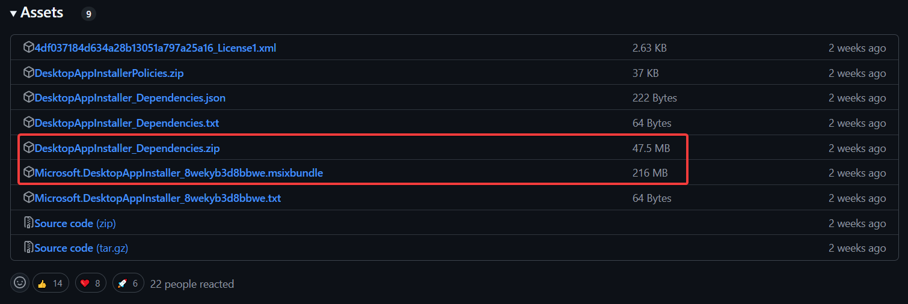
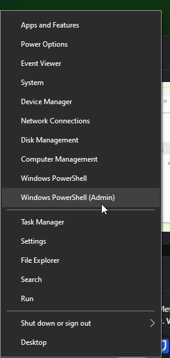
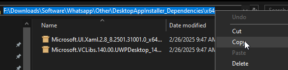
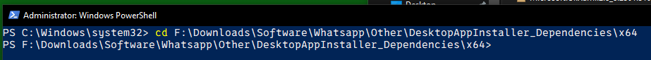
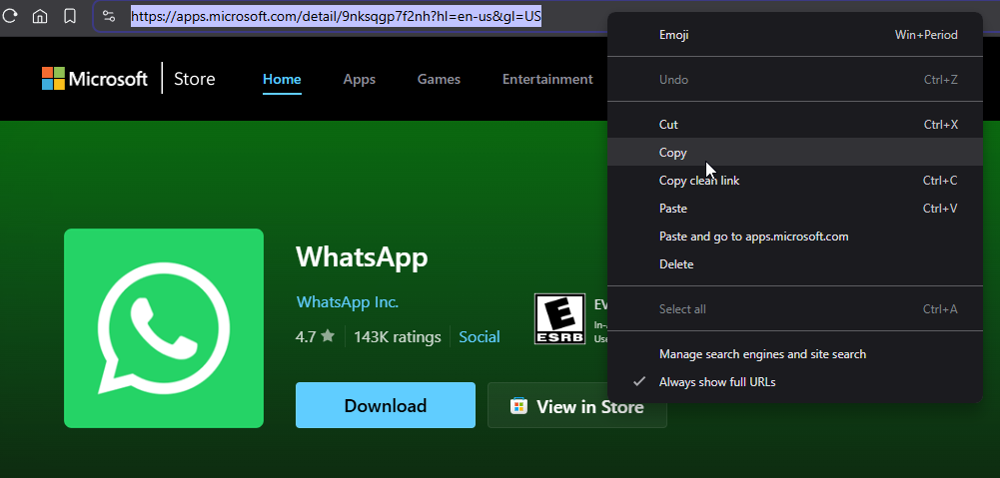
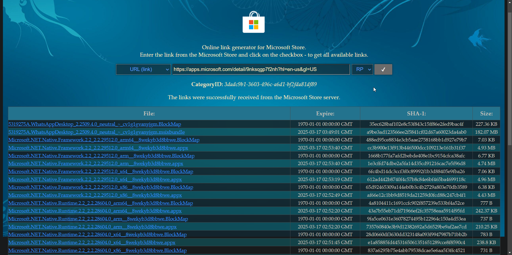
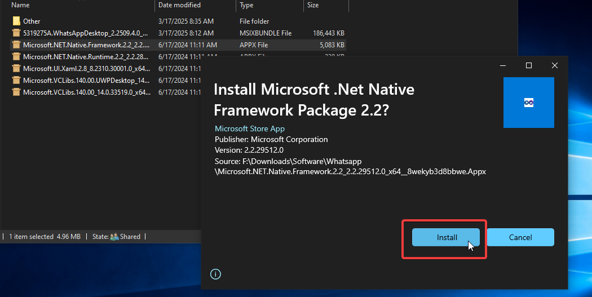

If you are a Windows LTSC user, you don't have Microsoft Store to installation applications. Most applications can be installed separately without an issue. However, apps like WhatsApp Desktop requires you to install them via the store.

In this tutorial, let's see how to install apps that are only available in microsoft store without store.

<!--truncate-->

## Desktop App Installer (dependency)

First, let's go to the [releases page](https://github.com/microsoft/winget-cli/releases/latest) of microsoft/winget-cli repository to download `Microsoft.DesktopAppInstaller`. This tool will help you to install other `.msix` packages easily. You should also download the dependencies and install them first.

As of writing this article, `v1.10.340` is the latest. The files I should download are:

- `DesktopAppInstaller_Dependencies.zip`
- `Microsoft.DesktopAppInstaller_8wekyb3d8bbwe.msixbundle`



You can also download the `*.txt` files which has the checksum to verify your download, but I wont be doing it here.

Extract the `DesktopAppInstaller_Dependencies.zip` file to install the dependencies first. Open that folder and find your relevant system architechture. In most cases, it should be `x64`.

Now, run Powershell as administrator. To do this easily, you can right click on the start button and select "Windows Powershell (Admin)".



Then let's copy the path of the folder containting the `*.appx` files.



Next, `cd` into this copied directory.



In my case, what I ran is:

```
cd F:\Downloads\Software\Whatsapp\Other\DesktopAppInstaller_Dependencies\x64
```

Then, for all `.appx` or `.msix` files in that foder, run the command below. Make sure to replace `package-file-name` with the acutal file name followed by it's extension.

```
Add-AppxPackage -Path package-file-name
```

So, since I have two files to be installed as dependencies, the commands I should run are:

```
Add-AppxPackage -Path Microsoft.UI.Xaml.2.8_8.2501.31001.0_x64.appx
Add-AppxPackage -Path Microsoft.VCLibs.140.00.UWPDesktop_14.0.33728.0_x64.appx
```

Once you are done installing the dependencies, navgiate back to the directory with `Microsoft.DesktopAppInstaller*.msixbundle` similiar to what we did above and install it as well.

```bash
# go to foler
cd F:\Downloads\Software\Whatsapp\Other

# install DesktopAppInstaller
Add-AppxPackage -Path Microsoft.DesktopAppInstaller_8wekyb3d8bbwe.msixbundle
```

You are all set now. You might have to restart your computer for the changes to take effect. You will now be able to install any windows package easily. (eg: `.appx`, `.msix`, `.appxbundle`, `.msixbundle` and more)

## Installing Any Application

### **1. Find the app you want to install**

Visit [apps.microsoft.com](https://apps.microsoft.com/) and search for the app you want to install. Then, open it and copy the URL of it.



### **2. Download the correct files**

Visit [store.rg-adguard.net](https://store.rg-adguard.net/), enter your copied url and press search with the default search settings.



Here, you will find multiple files with several file extensions. You are only required to download files ending with: `.appx`, `.msix`, `.appxbundle` and `.msixbundle` that matches your system architechture, as `.BlockMap` files aren't really useful to us right now.

What that means is, if your architechture is `x64`, you should download `Microsoft.NET.Native.Framework.2.2_2.2.29512.0_x64__8wekyb3d8bbwe.appx` instead of `Microsoft.NET.Native.Framework.2.2_2.2.29512.0_arm__8wekyb3d8bbwe.appx`. To find this, read the file name carefully. The first file has a `_x64_` in it while the second file has an `_arm_` in it.

So, in my case, the files I should download are:

- `5319275A.WhatsAppDesktop_2.2509.4.0_neutral_~_cv1g1gvanyjgm.msixbundle` (main application)
- `Microsoft.NET.Native.Framework.2.2_2.2.29512.0_x64__8wekyb3d8bbwe.appx` (dependency)
- `Microsoft.NET.Native.Runtime.2.2_2.2.28604.0_x64__8wekyb3d8bbwe.appx` (dependency)
- `Microsoft.UI.Xaml.2.8_8.2501.31001.0_x64__8wekyb3d8bbwe.appx` (dependency)
- `Microsoft.VCLibs.140.00.UWPDesktop_14.0.33728.0_x64__8wekyb3d8bbwe.appx` (dependency)
- `Microsoft.VCLibs.140.00_14.0.33519.0_x64__8wekyb3d8bbwe.appx` (dependency)

### **3. Install them**

You can either cd into this directory with powershell running as a administrators and install them using the `Add-AppxPackage` utility similiar to what we did above OR you can simple double click on it and press install using your Desktop App Installer that we installed in the first section of this article.

Before installing your main appplication, install all the dependencies first.



Below is a demonstration:

<iframe width="560" height="315" src="https://www.youtube.com/embed/9iFUNl-uxdI?si=mQkt0VK36Z5ehUhR" title="YouTube video player" frameborder="0" allow="accelerometer; autoplay; clipboard-write; encrypted-media; gyroscope; picture-in-picture; web-share" referrerpolicy="strict-origin-when-cross-origin" allowfullscreen></iframe>

Similiarly, you are now able to install any application in the microsoft store.
