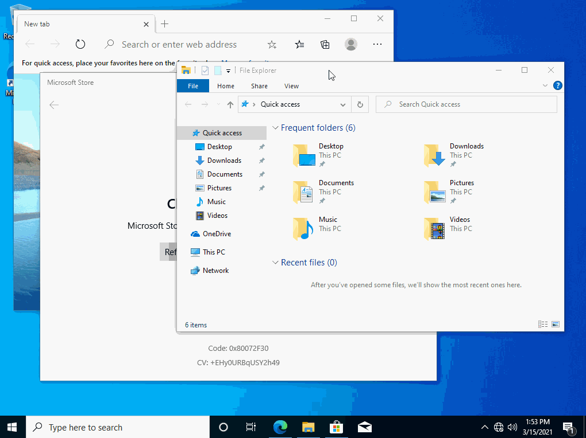
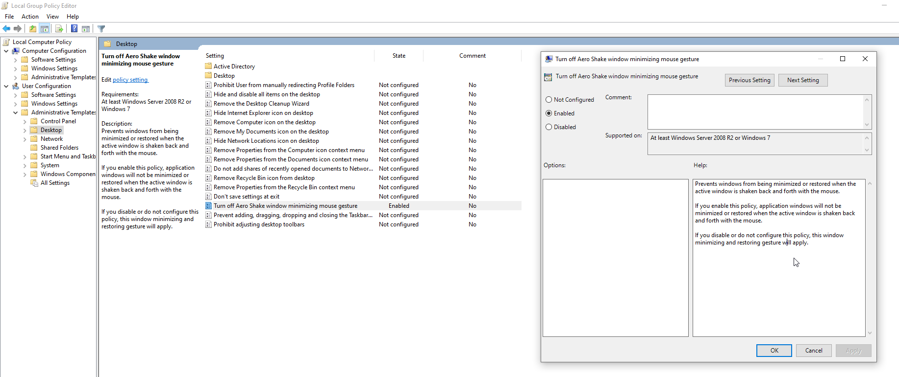

If you've ever dragged a window quickly on Windows 10 and suddenly found all your other windows minimized, congratulations—you've just encountered Aero Shake.



<!--truncate-->

### What is Aero Shake?

<iframe width="560" height="315" src="https://www.youtube.com/embed/okcBQ4ytDaU?si=WSI_c3bystyowBj4" title="YouTube video player" frameborder="0" allow="accelerometer; autoplay; clipboard-write; encrypted-media; gyroscope; picture-in-picture; web-share" referrerpolicy="strict-origin-when-cross-origin" allowfullscreen></iframe>

Aero Shake is a Windows feature designed to declutter your screen by minimizing all open windows except the one you're shaking. It sounds useful in theory, but in reality, it's more of an annoyance than a convenience.

### Why is this so annoying?

Imagine you're moving a window around quickly—maybe adjusting its position on your three monitors. Suddenly, every other open window vanishes. Now you have to restore them one by one. Who thought this was a good idea?

Luckily, you can turn it off. Here's how.


## Disable Aero Shake

### via Group Policy



1. Press `Win + R`, type `gpedit.msc`, and hit **Enter**.
2. Navigate to:
   ```
   User Configuration > Administrative Templates > Desktop
   ```
3. Find **Turn off Aero Shake window minimizing mouse gesture** and double-click it.
4. Select **Enabled**, click **OK**, and restart your PC.

If you want to re-enable this, edit this policy to be **Disabled**

### via Registry Editor

1. Press `Win + R`, type `regedit`, and hit **Enter**.
2. Navigate to:
    ```
    HKEY_CURRENT_USER\Software\Microsoft\Windows\CurrentVersion\Explorer\Advanced
    ```
3. Right-click on **Advanced**, select **New > DWORD (32-bit) Value**, and name it **DisallowShaking**.
4. Double-click on **DisallowShaking**, set the value to `1`, and click **OK**.
5. Restart your computer.

### by Merging a Registry File

Contents of `DisableAeroShake.reg`:

```reg
Windows Registry Editor Version 5.00

[HKEY_CURRENT_USER\Software\Microsoft\Windows\CurrentVersion\Explorer\Advanced]
"DisallowShaking"=dword:00000001
```

Contents of `EnableAeroShake.reg`:

```reg
Windows Registry Editor Version 5.00

[HKEY_CURRENT_USER\Software\Microsoft\Windows\CurrentVersion\Explorer\Advanced]
"DisallowShaking"=dword:00000000
```

Merge the file that you need and restart your computer for the changes the take effect.
