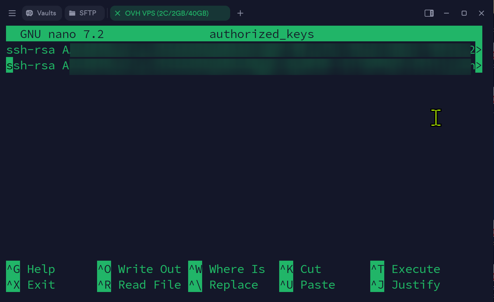
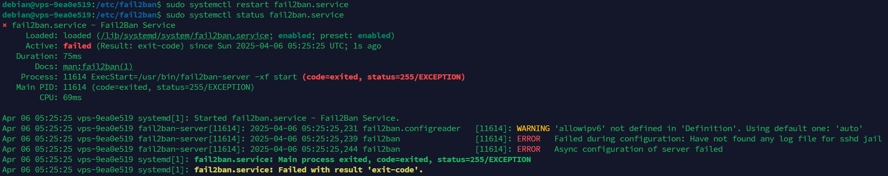
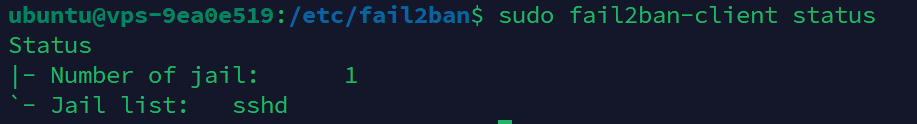

If you don't like big tech companies prying their eyes on your data, you might want to self host all the services either locally on-premise or on a cloud server (a Virtual Private Server or a Dedicated Server). 

When you are doing this, yes, you are safe from the eyes of big tech, and you actually get to have some privacy. HOWEVER, you will be in charge of your own data security. Therefore, hardening your server is essential to keep your data secure from bad actors and sometimes even automated scanners.

In this article, let's see how to do just that. This guide focuses on Debian 12 (not Ubuntu, since it's Canonical's bloat). Let's get started.

<!--truncate-->

After the server is up and running, log in as the `root` user to get started.

### Initial Setup

Let's get started by updating all the repositories and upgrading all the installed packages.

```bash
apt update 
apt upgrade
```

Then, let's create a new user called `debian`. It's always best practice to leave the `root` user alone. Then, we will log back in / or switch to the user `debian` before running all the other commands.

Let's first create the new user.

```bash
adduser debian
```

Lets also add the newly created user to the `sudo` group. This will allow the user to run commands as root without really having to switch the user.

```bash
usermod -aG sudo debian
```

Now, lets switch from `root` user to the newly created user.

```bash
su debian
```

Then, come to your home directory.

```bash
cd ~

# or cd into the absolute path
cd /home/debian/ 
```

### SSH Setup

Assuming that you've already logged using SSH, you have it up and running. 

Let's now copy the user's public key. Refer to my [old article](https://informati.cc/blog/2022/12/24/ssh-setup) about using SSH securely for more information.

```bash
# setup the ~/.ssh directory
mkdir -p /home/debian/.ssh
sudo chown -R debian:debian /home/debian/.ssh
sudo chmod 700 /home/debian/.ssh

# setup the `authorized_keys` file
touch /home/debian/.ssh/authorized_keys
sudo chmod 600 /home/debian/.ssh/authorized_keys
```

Now, add your public keys to the `authorized_keys` file since we will be disabling password login later.

```bash
nano /home/debian/.ssh/authorized_keys
```

It should now look something like this:



It should update automatically, but just to be safe - lets restart sshd service.

```bash
sudo systemctl restart sshd
```

To test this, try to log back in again as the user `debian` and if everything went correctly, you should be able to log in without entering the password.

Let's now make SSH secure by adjusting some settings of it's configuration file at `/etc/ssh/sshd_config`

```bash
sudo nano /etc/ssh/sshd_config
```

Change these options as follows:

```bash
# don't anyone to log in as the root user
PermitRootLogin no

# disable logging in using the password
PasswordAuthentication no

# enable public key authentication
PubkeyAuthentication yes

# prevents empty passwords
PermitEmptyPasswords no
```

Then, restart the ssh service again for the changes to apply.

```bash
sudo systemctl restart ssh
```

You can learn more about some other common options in this configuration file [here](https://www.redhat.com/en/blog/eight-ways-secure-ssh). OpenSSH is very flexible and customizable, but for the purpose of this basic hardening guide, these changes should be enough.

### Fail2Ban Setup

> *" Fail2Ban scans log files like /var/log/auth.log and bans IP addresses conducting too many failed login attempts. It does this by updating system firewall rules to reject new connections from those IP addresses, for a configurable amount of time. Fail2Ban comes out-of-the-box ready to read many standard log files, such as those for sshd and Apache, and is easily configured to read any log file of your choosing, for any error you wish. Though Fail2Ban is able to reduce the rate of incorrect authentication attempts, it cannot eliminate the risk presented by weak authentication. Set up services to use only two factor, or public/private authentication mechanisms if you really want to protect services. "* - [Fail2Ban Github Repository](https://github.com/fail2ban/fail2ban)

Let's first install fail2ban. 

```bash
sudo apt install fail2ban
```

Next, after installation, check if fail2ban is up and running.

```bash
sudo systemctl status fail2ban.service
```

In this case, with the current version of fail2ban and Debian I'm using, I get this error (it works fine with Ubuntu, this issue is only with Debian): `"Failed during configuration: Have not found any log file for sshd jail"`



Let's fix this later, but before that lets do the initial configuration.

```bash
cd /etc/fail2ban
head -20 jail.conf # just to confirm
sudo cp jail.conf jail.local
```

We will now edit the `jail.local` file. The reason we edit the `jail.local` file instead of the `jail.conf` file is that with certain updates, the `jail.conf` file might get overwritten - thus losing our configuration. To mitigate this issue, even fail2ban will first check for the `jail.local` and use that if it exists over `jail.conf`.

```bash
sudo nano jail.local
```

Scroll down to find this section:

```ini
[DEFAULT]
# ...

[sshd]
port    = ssh
logpath = %(sshd_log)s
backend = %(sshd_backend)s
```

Update it as follows:

```diff
[DEFAULT]
# ...

[sshd]
+ enabled = true
port    = ssh
logpath = %(sshd_log)s
- backend = %(sshd_backend)s
+ backend = systemd
```

Here, updating backend from `%(sshd_backend)s` to `systemd` will fix the aforementioned error. I found this solution [here](https://github.com/fail2ban/fail2ban/issues/3292#issuecomment-1142503461).

Now, restart the fail2ban service and check its status.

```bash
sudo systemctl restart fail2ban
sudo systemctl status fail2ban
```

If it's active and loaded, to verify the active/loaded number of jails, run the command below.

```bash
sudo fail2ban-client status
```

If you see something like this, it means your setup is successfull. 



Also, do note that fail2ban is a very powerful tool and it can be combined with a lot of services easily. To get started, you can see this [awesome guide](https://www.digitalocean.com/community/tutorials/how-to-protect-ssh-with-fail2ban-on-debian-11) and also the [official documentation](https://github.com/fail2ban/fail2ban/wiki).


## Docker (TODO)

### Rootless Setup (TODO)

### Best Practices (TODO)

## Firewalls (TODO)

## Kernel Hardnening (TODO)

## Lynis (TODO)

---

### References:

- https://www.digitalocean.com/community/tutorials/how-to-protect-ssh-with-fail2ban-on-debian-11
- https://github.com/fail2ban/fail2ban/issues/3292#issuecomment-1142503461
- https://github.com/fail2ban/fail2ban
- https://www.redhat.com/en/blog/eight-ways-secure-ssh
- https://github.com/fail2ban/fail2ban/wiki

