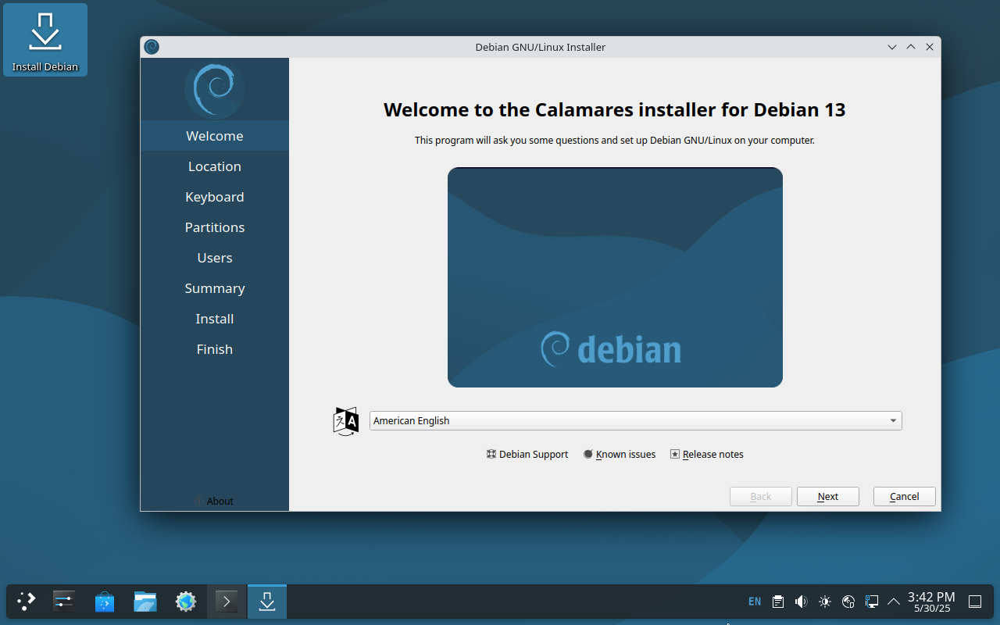
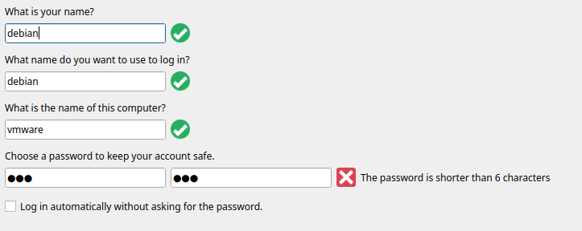
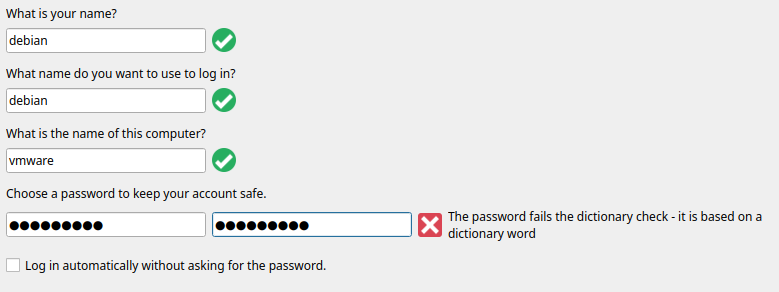
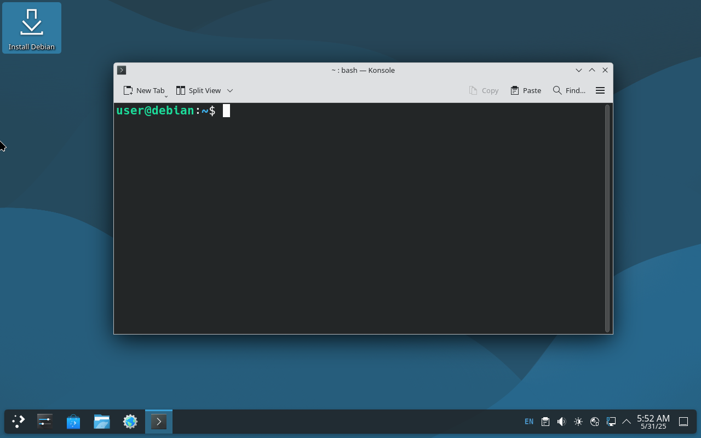
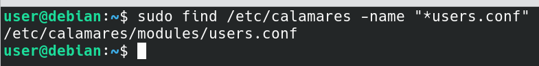
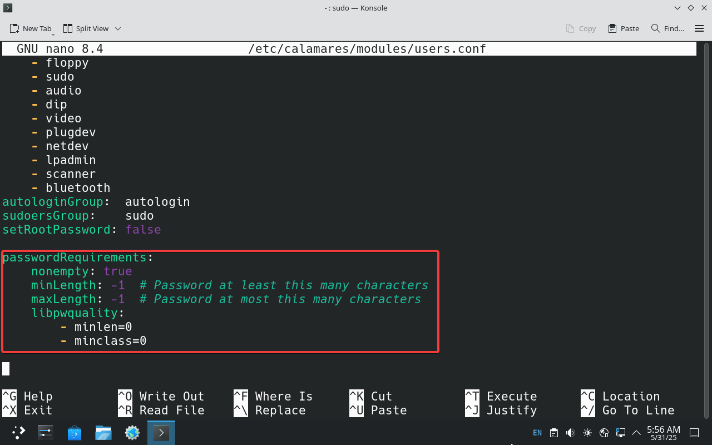
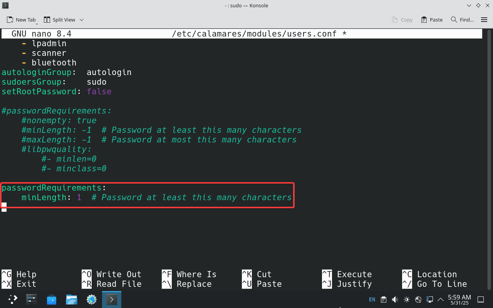
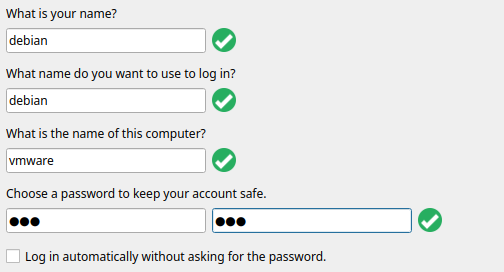

For those who don't find the default [Debian installer](https://www.debian.org/devel/debian-installer/) ("d-i") frustrating, you also have the option to install Debian using the [Calamares](https://calamares.io/) installer. Additionally, there's a lot to configure post-install. To avoid all of this trouble, you can use the [Debian Live installer](https://www.debian.org/CD/live/), which uses Calamares.

By default, Calamares configuration in Debian Live enforces some password policies to prevent users from entering weak passwords. This is a very important feature, but I find it too complicated for virtual machines and testing scenarios. Therefore, in this article, let's see how to disable it and use a simple password.



<!--truncate-->

## Issue

If I try to use a short password like `123`, it says the password shouldn't be less than 6 characters in length.



And a password like `Debian@VM` fails the dictionary check.



Even `Debian@VM` is already too much for a password of a virtual machine that I only use for testing purposes.

## Fix

We can disable this password policy easily.

To begin with, close the Calamares installer if you already have it opened.

Next, open any available terminal emulator. In this case, since I'm using the KDE Debian Live image - it's `konsole`.



Then, locate the files named like `*users.conf` inside the `/etc/calamares` directory, where the configuration files for the Calamares installer are stored.

```bash
sudo find /etc/calamares -name "*users.conf"
```

In my live boot, the relevant configuration file is stored at `/etc/calamares/modules/users.conf`.



The next step is to open it with your preffered text editor.

```bash
sudo nano /etc/calamares/modules/users.conf
```

Scroll down and locate the text that says:

```yaml
passwordRequirements:
  nonempty: true
  minLength: -1
  maxLength: 0
  libpwquality:
    - minlen=0
    - minclass=0
```

It is at the very bottom of my file.



You can then get rid of this and replace it with the following:

```yaml
passwordRequirements:
  minLength: 1
```

Or you can just comment it out and paste this underneath like I did.



Now, save the file, exit, and restart the Calamares installer.

Try entering a simple password now and it should work without any restrictions.



## Note!

I strongly suggest you **NOT** to do this on bare-metal installations.
