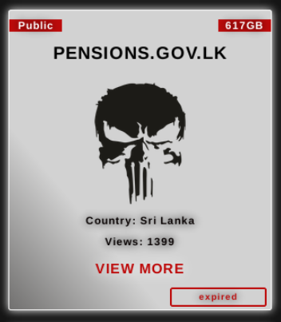
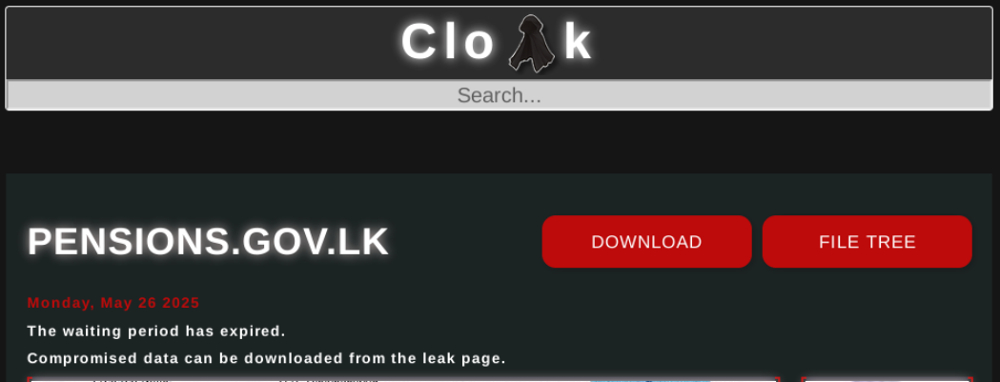
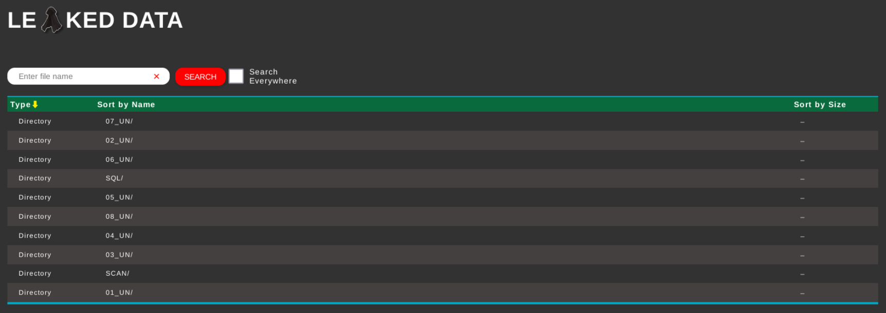
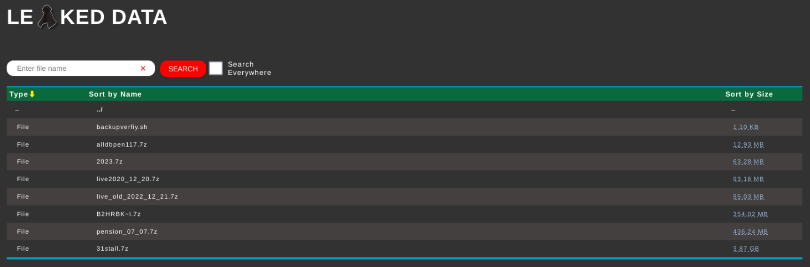

On April 2nd, 2025, the Sri Lanka Department of Pensions reportedly became the target of a ransomware incident attributed to a group identifying itself as "Cloak." According to publicly visible information, the group claimed responsibility and set a deadline of May 26th, 2025, allegedly demanding a ransom.

Following the deadline, the group published what they claim to be 617GB of data. It is currently unclear whether this data originated from the Department of Pensions, as no official confirmation has been issued regarding the authenticity or sensitivity of the leaked files.

As with any such case, it’s important to approach leaked materials with caution and avoid downloading or redistributing them, as doing so may violate data protection laws.

<!--truncate-->

A post referencing the incident was published on a site associated with the cybercriminal group called "Cloak".

As of June 30th, 2025, the site indicates that the page in question has been accessed 1,399 times.

Clicking on "VIEW MORE" leads to a detailed page related to the group’s claims.

Due to legal and ethical considerations, no specific sample data is shown here. However, based on the publicly visible folder structure and general descriptions, the following types of information appear to be referenced in the leaked dataset, reportedly connected to individuals associated with the pensions system, including military personnel:

- **Personal Details**  
  - Full Name  
  - Preferred Name  
  - National Identity Card (NIC) Numbers  
  - Images of NIC (front and back)  
  - Signatures (from NIC)  
  - Gender  
  - Date of Birth  
  - District  
  - Divisional Secretariat  
  - Grama Niladhari Division  
  - Interview Centre  
  - Address  
  - Landline Number  
  - Mobile Number  

- **Service-Related Details**  
  - Service (Job Position)  
  - Grade  
  - Designation  
  - W&OP / Soldier Number  
  - Appointment Date  
  - Confirmation Status  
  - Reason for Retirement  
  - Retirement Date  
  - Last Workplace  

- **Banking Details (as claimed)**  
  - Pension/Gratuity/Official Account Info  
  - Bank Name  
  - Branch  
  - Account Number  
  - Images of Bank Book’s First Page (may contain more personal information)

- And probably more personal & job related information

***Note**: This list is based on visible metadata, filenames, and folder structure and samples provided. The actual content has not been accessed or verified for legality and ethical reasons.*

An image below shows the general directory structure of the dataset that was allegedly leaked:

Folders marked `*_UN` appear to contain subdirectories, possibly storing PDF documents and images of the aforementioned data.

Within the `SQL` folder, a few filenames stand out:

The presence of `.7z` files may indicate compressed database backups, potentially generated using tools like `mysqldump` based on its naming.

Despite the scale of the data reportedly involved, there has been limited discussion by either the Department of Pensions or major Sri Lankan media outlets about the potential real-world impact of this incident.

Media coverage has largely emphasized that systems have been restored and are currently operational. The extent of the exposed data and its implications, however, appear to remain largely unaddressed in the public narrative.

(skip the quoted sections if you aren't interested in this)

> *"However, the Pensions Department's earlier statement claimed that its IT systems were being restored with no data loss or service disruption."* - [Hiru News](https://hirunews.lk/en/405711/sri-lankas-pensions-department-hit-by-cloak-ransomware-617gb-of-data-allegedly-leaked)

> *"The Department of Pensions has confirmed that a recent cyberattack targeting its IT infrastructure has not resulted in data loss or a disruption to services, stating that system functions have since been restored, based on current observations."* - [Derana News](https://www.newswire.lk/2025/05/28/cyber-attack-pension-dept-issues-clarification/)

> *"Technical teams worked around the clock to isolate the threat and restore access, coordinating closely with cybersecurity experts to secure the network and conduct a full system audit. The rapid response, according to authorities, played a crucial role in ensuring service continuity and safeguarding sensitive information belonging to thousands of pensioners."* - [Lanka News Web](https://lankanewsweb.net/archives/73947/pension-dept-recovers-from-cyberattack-with-systems-fully-restored/)

The only thing that's even close to mentioning that the data was released publicly was posted by Newswire and/or Derana News. Both of them looks exactly identical. I have no clue as to who copied from whom. 🤣

> *"Cybersecurity monitoring platform FalconFeeds.io has attributed the attack to the Cloak ransomware group, a known cybercriminal outfit that typically encrypts sensitive data and demands ransom payments for its release or non-disclosure."* - [Derana News](https://www.newswire.lk/2025/05/28/cyber-attack-pension-dept-issues-clarification/)

> *"Cybersecurity monitoring platform FalconFeeds.io has attributed the attack to the Cloak ransomware group, a known cybercriminal outfit that typically encrypts sensitive data and demands ransom payments for its release or non-disclosure."* - [Newswire](https://www.newswire.lk/2025/05/28/cyber-attack-pension-dept-issues-clarification/)

This situation highlights a concerning gap between the scale of the alleged data exposure and the response—or lack thereof—from both the local media and the institution involved.

Although ransomware reportedly affected systems at the Department of Pensions in early April, no public notice was issued to clients at the time. The first widely visible mention of the incident came through a third-party cybersecurity monitor, FalconFeeds.io, nearly a month later.

As of this writing, no formal acknowledgment appears to have been made regarding the nature or scope of the data that may have been compromised. Large volumes of personally identifiable information (PII) are now reportedly circulating online, and there remains little visible effort from authorities or institutions to address the concerns of those potentially affected.

Under **Section 23(2)(b)** of the [Personal Data Protection Act, No. 9 of 2022](https://www.parliament.lk/uploads/acts/gbills/english/6242.pdf), organizations are required to notify data subjects where their personal data has been affected—if applicable.

Additionally, **Section 23(2)(c)** mandates that such notifications be issued in the form and manner prescribed by rules established under the Act.

So far, there has been no public indication that these requirements have been followed in this case.

A similar lack of response has been observed in unrelated incidents, such as a data exposure involving the University of Colombo, where the personal information of an estimated 500–700 students was allegedly leaked. In that case too, neither public statements nor corrective actions were clearly communicated by the institution or relevant authorities.

**Can we change this information now?**  
Lol nope.

**What can be done to prevent incidents like this in the future?**

- Organizations, especially those handling sensitive data, must implement proper cybersecurity measures.  
- The use of unlicensed software, which remains an issue even in some government institutions, should be discontinued—particularly where critical infrastructure is involved.  
- Regular cybersecurity awareness training should be conducted to educate staff on common threats such as phishing, credential theft, and ransomware.  

While the push for digitization is commendable, it must be paired with a willingness to understand and address the cybersecurity responsibilities that come with it.

For the more technical audience, listed below are some articles about the analysis of this ransomware:

- https://www.halcyon.ai/blog/cloak-ransomware-variant-exhibits-advanced-persistence-evasion-and-vhd-extraction-capabilities
- https://www.beforecrypt.com/en/cloak-ransomware/
- https://www.watchguard.com/wgrd-security-hub/ransomware-tracker/cloak
- https://www.sentinelone.com/blog/threat-actor-interplay-good-days-victim-portals-and-their-ties-to-cloak/
- https://www.own.security/en/ressources/blog/click-clock-analyse-des-ttps-du-ransomware-cloak
- https://securitybuzz.com/cybersecurity-news/cloak-ransomware-the-rising-threat-with-advanced-disruption-techniques/
- https://ish.com.br/en/blog/ransomware-cloak-criptografa-dados-e-opera-com-outros-grupos-para-pressionar-o-pagamento-de-resgate/

Thank you for reading, as always, stay safe from malware. Bye bye!
