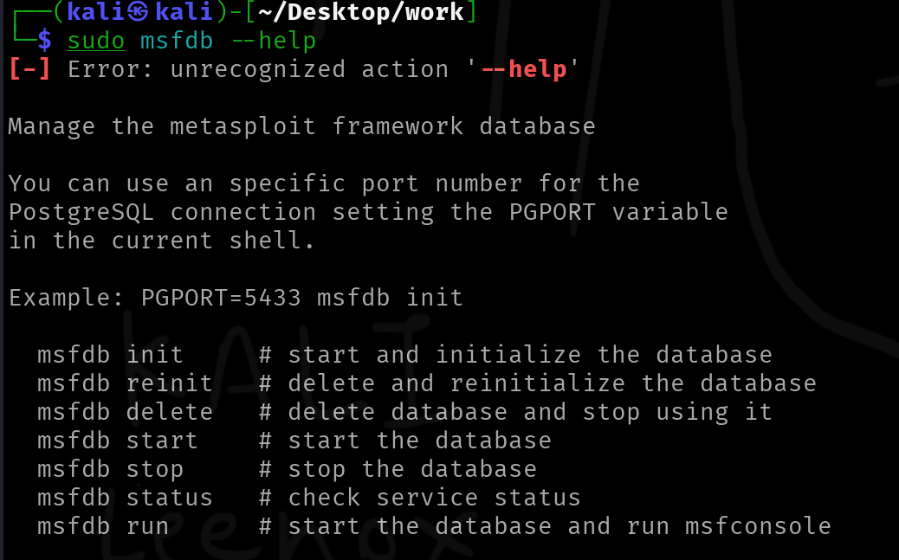

If you are just getting into the field of cyber security, you will quickly notice this one tool called "Metasploit" popping up everywhere. 
Metasploit a very popular tool among penetration testers, and is developed by [Rapid7](https://www.rapid7.com/). In fact, learning the basics of Metasploit is considered so important, that Rapid7 even made their own vulnerable virtual machine called [Metasploitable](https://docs.rapid7.com/metasploit/metasploitable-2/) for students to learn and play around with. 
If you were to look for books about Metasploit, you will easily be able to find hundreds... Among these, the Metasploit Cookbook ([Amazon](https://www.amazon.com.au/Metasploit-Penetration-Testing-Cookbook-Third/dp/1788623177), [PDF](https://edu.anarcho-copy.org/Against%20Security%20-%20Self%20Security/Metasploit%20Penetration%20Testing%20Cookbook.pdf)) is an excelled resource and is something that I can recommend personally.

With all the "snake oil" hype surrounding metasploit, it can be hard to know where to begin from and this article is to guide you through the basic, common concepts and to help you get up and running.

Also, at the very end, I'll share a hot take about Metasploit - one that many will probably agree with, but some definitely won't.

<!--truncate-->

:::warn

This article already expects you to know some basic cyber security related terms. All the jargon specific to Metasploit is explained in [The Jargon](#the-jargon) section.

:::

## Introduction

Metasploit is not just a single tool. It is a framework - basically, a big set of tools for finding vulnerabilities, exploiting then and also to help you with post exploitation tasks.

The Metasploit Framework (I will refer to this as "msf" from now on) has a set of individual tools to ensure it functions seamlessly. Let's look at what they are and what they do:

#### msfconsole

The msf console is what you use to interact with metasploit. It provides you a very interactive CLI shell to select modules, set parameters, run exploits and manage sessions. If you think of msf as a swiss army knife, the msfconsole is the handle that holds all of the blades. 

The image below shows you what it looks like when you launch it:

#### msfvenom

This is a standalone tool that can be used to generate payloads.This will let you generate payloads in a very straighforward way without dealing with the inteeactive shell that msfconsole provides you. Because of this, we can also use this tool with other custom scripts to automate certain staff, as everything required can be passed in as command line agruments.

The image below shows a practical example of using msfvenom. We will talk about it's usage later.

#### msfdb

This tool managed the PostgresSQL (psql) database that msf uses for storing hosts, services, vulnerabilities, etc...

You usually might need to run before launching msfconsole for the very first time, but the new versions usually handle it automatically. So, this command line tool is mostly used for exporting/importing data and it's also used for keeping track of scan results. 

This is what this tool looks like. We won't be talking about this tool in this article.

#### Other

Metasploit ships with a lot of other small tools (stored in directories like: `/usr/share/metasploit-framework/tools/`). We will look at some more common tools below:

- `msfupdate`: updates msf and it's modules
- `msfrpcd`: the RCP deamon for controlling msf remotely
- and many more...

## The Jargon

### Exploits

This is the actual attack code that takes advantage of a vulnerability in a target system. Think of it like a lockpick that only works on one very specific type of lock. Each exploit in Metasploit is written to abuse a known security flaw (CVE), whether it be a buffer overflow in an old Windows service, or a bad PHP script that lets you run system commands (command injection).

The `exploit/windows/smb/ms17_010_eternalblue` is one the most popular exploits out there that abuses the SMBv1 vulnerability.

### Payloads

This is the code that actually runs on the target once you've exploited it.

Another thing to keep in mind is, we do simple things to prove an exploit works. Usually, in PoCs (Proof of Concepts), we run something like `calc.exe` to pop open the Calculator - which is simple, safe and it proves the point.

There are four main types of payloads:

1. Adapters
    - Wrap an existing payload so it can be delivered in a different way or format.
    - Doesn't change what the payload does — just how it gets executed.
    - Handy for evasion, bypassing filters, or adapting to different delivery methods.
    - Example: Your normal payload bundled inside a PowerShell one-liner adapter which lets you run it via `powershell -encodedCommand ...` or similar.
2. Singles (aka Inline Payloads)
    - Fully self contained.
    - No extra downloads or network fetches as all logic is in one binary/script.
    - Bigger in size compared to staged payloads, but more reliable in environments where outbound fetches are blocked.
    - Example: a reverse TCP shell payload where the entire shell logic is embedded in what you send to the target.
3. Stagers
    - Tiny bootstrap payloads whose only job is to establish a comms channel between your machine (Metasploit handler) and the target.
    - Once the stager runs, it pulls down the actual heavy-duty payload (the “stage”).
    - They can be very small in size, therefore, they fit into tight exploit buffers or bypasses payload size restrictions.
    - However, they need a stable network path to fetch the stage. If connection fails mid-transfer, the payload will fail.
4. Stages
    - The "big payload" downloaded and executed by a stager.
    - Can be large and feature-packed (e.g., full Meterpreter shell, in-memory keyloggers, persistence modules).
    - Not size-constrained because they aren't shoved directly into the exploit — they ride over the established stager connection.

Msf follows a very easy to understand naming convention to tell us whether an exploit is staged or stageless. Let's look at it along with an example:

- `generic/shell_reverse_tcp`
    - his is an inline or stageless payload, meaning everything it needs is packed into one payload.
    - You can spot this by the underscore (`_`) between shell and reverse.
- `windows/x64/shell/reverse_tcp`
    - This one is a staged payload, which means it's split into two parts: a small stager and a larger stage downloaded afterward.
    - You'll notice the slash (`/`) between shell and reverse - that's the giveaway it's staged.

## Unpopular Opinion

Most of Metasploit's exploits work on stuff that's over a decade old. It's a great tool for CTFs and for students to get hands-on experience, but let's be honest — you're not pulling this off in a real-world environment.

With all the EDR solutions and SIEM dashboards out there logging every single fart, most of these exploits won't even get a chance to breathe before they're shut down.

Metasploit is awesome for learning. But in the real world? You'll need to get a lot more creative.

## References

- Image from https://musprodev.hashnode.dev/metasploit
- https://www.amazon.com.au/Metasploit-Penetration-Testing-Cookbook-Third/dp/1788623177

