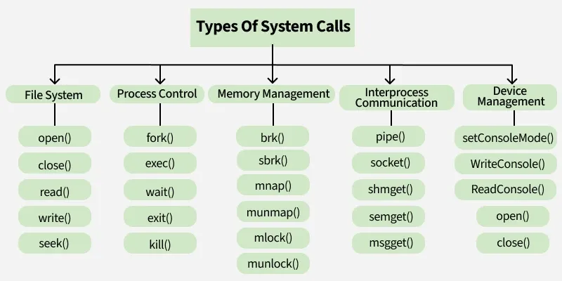

This post is to help you learn the basics of (mostly) everything so you can see the full picture. If you have no idea what you're doing or if you're new to Linux, this post is for you. There are a billion different misconceptions, misunderstandings, and incorrect interpretations of concepts related to Linux, and in this post, we'll debunk them. I'm disappointed by the fact that nobody has written something like this before. There are plenty of YouTubers and content creators who post multiple videos a week, but none of them talk about this stuff. Absolutely pathetic! This guide will assume you're a Windows user. If you're a macOS user, you shouldn't have made it to my blog.

Note that I'll only be touching the surface of every key highlight with very brief descriptions to keep things simple. The goal here is to help you see the full picture, not to learn/master everything.

<!--truncate-->

At the very low level, you have your hardware. 

## Linux Kernel

An operating system is not just one software. They consist of multiple major components. At the core is the kernel. The kernel has direct access to hardware and memory. Other "user space" applications are not allowed to communicate with the kernel directly. Instead, they have to call something called system calls (commonly referred to as "syscalls"). Every time a program needs to read a file, allocate memory, or send network data, it's the kernel that actually does it on behalf of that program.

Your "Windows 11 Operating System" uses Microsoft's proprietary Windows NT kernel, which you cannot legally or technically modify. In "Linux" systems, the kernel is Linux, created by Linus Torvalds in 1991. This is an open source project (licensed under GPLv2), meaning you can inspect its code, patch it, recompile it, and even redistribute own version.

On top of that, the kernel is what handles process scheduling, memory management, file systems, networking and all the other low level operating system related functions.

### Kernel Modules

This is a piece of code that can be dynamically loaded into or unloaded from the linux kernel at runtime without having to reboot the system. Kernel modules allow us to extend the functionality of the kernel in a very modular way. These modules are usually found inside the `/lib/modules/$(uname -r)/` directory.

Below is an awesome, more technical explanation of what these are.

> *"The quick and short way to explain kernel modules is that they are a binary file, kinda like a shared library, which the kernel will map into its address space. These modules can expand kernel functionality. This functionality can be different between different kinds of kernel modules. What people are mostly talking about in regards to kernel modules are drivers. However, kernel modules can be anything from that to filesystem interfaces and security mechanisms."* - [Reddit](https://www.reddit.com/r/osdev/comments/171m5kn/comment/k3rlo1x/)

`mod` is how you usually refer to kernel modules in short. The `lsmod` command will list all the loaded modules, `insmod` will insert a module and `modprobe` will insert a module but it will also resolve the dependencies, `rmmod` will remove a module and `modinfo` will show module information. These are some commands that you will eventually run in to (mostly when having to deal with drivers in a general purpose context)


You can learn more about kernel modules in [this Arch Wiki page](https://wiki.archlinux.org/title/Kernel_module).

### Kernel Headers

These are C header files (`.h`) that's usually placed inside `/usr/src/`. They define an "interface" which specifies how functions in the source files (`.c`) of the kernel are defined. They are used so that a compiler can check if the usage of a function is correct as the function signature (return value and parameters) is present in the header file. Yes, again, these are just C header files - all they do is define declerations of functions as shown below:

```c
int foo(double param);
```

They are used to
1. define interfaces between components of the kernel, and 
2. define interfaces between the kernel and user space

Or in simpler terms, they basically tell the c compiler how to recompile everything in a way that it will be able to communicate properly with the new kernel version. You need them for installing almost anything compiled against that kernel. In Arch Linux, these header files are managed by a seperate package named `linux-headers`. In Debian, this package takes the format: `linux-headers-$(uname -r)`.

You can learn more [here](https://unix.stackexchange.com/questions/47330/what-exactly-are-linux-kernel-headers) or [here](https://kernelnewbies.org/KernelHeaders).

## Device Drivers

Just above the kernel sits device drivers. These are small programs that tell the kernel how to talk to your specific hardware, like graphic cards, wifi adapaters and what not. In Linux, many drivers are built directly into the kernel or distributed as loadable kernel modules (LKMs) that can be dynamically added or removed (sometimes at runtime, without requiring restarts). The drivers that are distributed seperately and that has to be loaded by the user according to their requirement are sometimes also referred to as "out of tree drivers".

### Graphics Drivers

One commonly talked about topic related to drivers in Linux is the graphics drivers for NVIDIA and AMD GPUs. If your GPU is AMD, the built-in drivers should have you covered.

Back in the day, AMD's Linux driver support wasn't always great. Years ago, AMD provided a closed-source driver called `fglrx`, which was often buggy and hard to maintain. Eventually, AMD realized that open collaboration with the Linux community was the best way to go. Therefore, they open-sourced large parts of their driver stack, and today the `AMDGPU` driver (maintained directly in the Linux kernel) and Mesa's open-source 3D stack deliver fantastic performance. As a result of this, if you own an AMD GPU, most modern distributions should support it out of the box without you having to install anything. It will just work!

If you have an NVIDIA GPU, your life gets a little complicated. You have two options:
1. The proprietary NVIDIA driver provided by NVIDIA themselves.
2. The Nouveau open-source driver, maintained by the Linux community.

If you just want to get on with life, you should consider using the proprietary driver over the open-source one. If you have ethical or freedom-related reasons, use the open-source driver. But if you're new to Linux and you want to use your hardware to its fullest potential, use the proprietary driver (like I do). While the latest versions of Nouveau and the proprietary driver might seem similar, the proprietary driver still tends to perform better and gives you access to all the advanced features of your GPU like CUDA, NVENC and full 3D acceleration.

NVIDIA has refused to fully open-source their driver stack multiple times, and this has long been a pain in the pass in the Linux community. The situation between NVIDIA and Linux has been so frustrating that Linus Torvalds himself once famously said, "Fuck you, NVIDIA". This video can be found [here](https://youtu.be/iYWzMvlj2RQ).

While I was writing this, Nvidia released their 590.XX which drops comapitbility for GPU's based on architechtures older than Pascal and Maxwell (both ~10 year old chipsets). This breaks a lot of compatibility. I've written an article covering everything that happened and it can be [found here on my blog](https://informati.cc/blog/2025/12/25/arch-nvidia-support-lost) or on [medium](https://medium.com/@hirushaadi/nvidia-graphics-driver-broken-after-updating-arch-a-quick-solution-80798b351fda).

### Wi-Fi Adapters

Another commonly talked about area is WiFi adapters. Most of them should work out of the box with the generic drivers included in the Linux kernel. Modern distros ship with a wide range of wireless drivers pre installed, so in many cases your Wi-Fi will just work out of the box.

If it doesn't, your next step is to check whether there's a package available for your adapter (we'll talk more about packages later). Many vendors and community maintainers publish driver packages that can be installed directly using your distro's package manager. They are usually named like `broadcom-wl` or `rtl8821ce-dkms` and so on.

If you can't find an official package, try searching online (especially on GitHub) to see if someone from the community has written or ported a driver for your chipset. If you find one, you can usually compile it from source and pray for it to work.

If you've tried all that and still can't get it to work, just give up at this point. Buy a new WiFi adapter that supports linux out the box to use 

### DKMS

If you refer to the package name above (`rtl8821ce-dkms`), you can see the `-dkms` suffix. This means that this package is a DKMS package. DKMS stands for Dynamic Kernel Module Support. It basically means that it will help the kernel module (in this case, it's the wifi driver) to stay compatible after changes to your linux kernel like updates. Normally, kernel module (drivers) are compiled specifically for the version of the kernel you are running. If you update the kernel, it might break support for these kernel modules as they were built for the old kernel. Therefore, we have to rebuild the driver module using the new kernel headers. The packages that has the `-dkms` suffix by convention will take care of that building on its own - so that you don't have to worry about your drivers breaking in you update your kernel. A common example of this is the `nvidia-dkms` package. This will just re-build the driver automatically after you update your kernel to ensure everything is working smoothly. 

## Init System

In the boot process of a linux system, once the kernel loads, a special userspace program called the "init system" starts. The kernel launches this with a PID (Process ID) of a `1`. This acts like the root of all other processes. An init system is responsible for orchestrating the boot process. It starts all the other system services, handles shutdown and reboot sequences, and managed all the system services.

### Historical Init Systems

#### SysV Init

In linux systems, there are multiple init systems. At the very beginning, everything used the "SysV Init" system - short of System V Init. This was built to function like Unix System V. This uses 0-6 different run levels to define boot states and to make things simple, it is script based. All the init scripts are stored inside `/etc/init.d/`. Here, all the services launch sequencially (via those scripts) - therefore, resulting in a slower startup times. This init system is simple and easy to use but it lacks a lot of modern features like parallel startup of processes and the ability to monitor services.

#### Upstart

Around 2006, Canonical released Upstart - a modern alternative to SysV. This performed faster comparatively and was event based. This gave the ability to perform certain things when an event was triggered - such as "when a device appears". 

### Systemd

In late 2014, systemd was released. This is not just a basic init system, it is a complete system manager with modern highly sophisticated features.
It introduced features like parallel startup of processes, service supervision (auto restart and service dependency ordering/management), a unified centralized logging system, a consistent configuration file format, timers and socket activation. Canonical discontinued upstart and adopted systemd for their linux distribution named Ubuntu. Most modern linux distributions use systemd as their init system. 

Systemd works with service files, called units (basically configuration files). They define how a component behaves. By convention, each unit file is given a suffix to suggest the component type. Let's take a look at some of those.

- `.service`: These are used to contain information about individual services. They are also called daemons.
- `.timer`: These are used to perform shceduled jobs.
- `.mount`: These are used for file system mounts.
- `.target`: This is basically a group of services to start. An example is `graphics.target`, which starts all the graphics related services.

A simple `.service` unit file can be found below. As you can see below, using things like `After=`, you can handle dependencies easily. Here, the `After=network.target` will ensure that this service will start only after `network.target` component has been started. A list of all these directives can be found [here](https://man.archlinux.org/man/systemd.service.5#OPTIONS) in the official documentation.

```ini
[Unit]
Description=MyApp Service
After=network.target

[Service]
ExecStart=/apps/myapp/executable
WorkingDirectory=/apps/myapp
Restart=always
User=serviceuser
Group=servicegroup

[Install]
WantedBy=multi-user.target
```

To communicate with systemd, you should use the `systemctl` command line utility. [This blog post](https://informati.cc/blog/2025/10/2024-12-06-custom-systemd-services) covers the basic usage of services with systemd along with the basic usage of the `systemctl` command.

Covering everything about systemd is not the goal of this article. This is already too much. You can learn more about Systemd [here](https://systemd.io/) or [here](https://wiki.archlinux.org/title/Systemd).

### OpenRC

As you read above, systemd is a heavy and very feature rich. OpenRC was built as an alternative init system to systemd that is also dependency based. This is mainly used in Gentoo, Alpine and Artix Linux. It's simple, fast and unix like. This supports modern features like service dependency, parallel startup, SysV styled init scripts and many more. 

However, unlike systemd, openrc does not bring it's own ecosystem with it. This increases compatibility with existing tools but it might come at the cost of inconvenience.

### The Controversies

In saying that, since systemd is widely adopted, you will almost never run into compatibility issues. However, since systemd provides a more centralized interface and it tries to manage logging, network, timers, etc... - it breaks the [unix philosophy](https://cscie2x.dce.harvard.edu/hw/ch01s06.html) of "do one thing and do it well". Some people call it bloatware and prefer the simple nature of openrc. The haters have gone as far as hosting websites like these: [ihatesystemd.com](https://ihatesystemd.com/why/).

In my opinion, the shouting voices don't represent the majority here. Systemd saves a lot of time and work for developers, packages and administrators due to its' convenience. So, it's not surprising that it has been very widely adopted.

This video below titled "The Tragedy of systemd" should give you a very good understanding about the current situation of this controvery and systemd hate.

<iframe width="560" height="315" src="https://www.youtube.com/embed/o_AIw9bGogo?si=XMC88UtN7dbBYs5f" title="YouTube video player" frameborder="0" allow="accelerometer; autoplay; clipboard-write; encrypted-media; gyroscope; picture-in-picture; web-share" referrerpolicy="strict-origin-when-cross-origin" allowfullscreen></iframe>

## Userspace Libraries

The kernels, drivers and the init system might be running now but that's not enough for applications to be run. User applications need a stable and a consistent way to communicate with the kernel. This is where the userpace libraries and APIs come in.

Linux based operating systems scritcly seperate the kernel space and the user space. The kernel space is the kernel, drivers, etc... and has full access to hardware and memory. Userspace in the other hand are applications, shells, services, desktop environments, etc... running with restricted privileges. Again, these userspace applications are not allowed to call kernel code directly. Instead, they interact with the kernel through "system calls".

> *"In computing, a system call (syscall) is the programmatic way in which a computer program requests a service from the operating system[a] on which it is executed. This may include hardware-related services (for example, accessing a hard disk drive or accessing the device's camera), creation and execution of new processes, and communication with integral kernel services such as process scheduling. System calls provide an essential interface between a process and the operating system"* - [Wikipedia](https://en.wikipedia.org/wiki/System_call)

As mentioned above, they do everything. The image ([src](https://www.geeksforgeeks.org/operating-systems/introduction-of-system-call/)) below shows some of the common high level functionalities that the kernel allows you to call/access via syscalls.



And on top of these low level syscalls, higher level libraries have been built, forming a layered ecosystem.

### GNU is Not Unix

It's history time again! In 1960s, UNIX was developed in Bell Labs by Ken Thompson and Dennis Ritchie. This was one of the very first operating systems to be multi-user, mutli-tasking and portable. Most of it's codebase was written in C - a relatively high level programming language compared to what they used before that. This later evolved into multiple products like HP-UX (by Hewlett Packard), Solaris (by Oracle) and MacOS (via the BSD and POSIX heritage). UNIX introduced it's own philosophy, which also made it stand out back in the day. You can find the basics of the UNIX Philosophy [here](https://cscie2x.dce.harvard.edu/hw/ch01s06.html).

By the early 1980s, UNIX had become commercial and proprietary. Richard Stallman believed that this nature of software restricted the user freedom and collaboration and he launched the GNU Project back in 1983. GNU is pronounced as "GNOO" and is a recursive abbreviation for "GNU is Not Unix". His goal here was to create a completely free and open source, unix compatible operating system. Eventhough they reimplemented these tools and interfaces from scratch, to ensure compatibility, they stuck with the same unix philosphy and behaviour, so that the existing software could be ported/migrated easily. They developed compilers (gcc), shells (bash), libraries (glibc) and more importantly, the GNU Core Utilities (or GNU Coreutils for short).

Several ideas introduced by Unix are still being followed today, like:
- Everything is a file
- Heirarchial filesystem which starts at `/`
- Write programs that do one thing and do it well
- Write programs to work together
- Using text as a universal interface

Due to this nature, many simple tools that does one task can be chained together to perform complex actions, like:

```bash
ps aux | grep nginx | awk '{print $2}' | xargs kill
```

However, GNU did not initially have a working kernel. Back in 1991, Linus Torvalds got inspired to create a kernel from scratch, without re-using any of the UNIX source code and released it under the GPL license. This was in perfect timing for the GNU Project as Linux provided the missing kernel that GNU needed.

In simpler terms, GNU had a userspace but no kernel and Linux had a kernel but no complete userspace. When they were put together, they form a fully functional, free and open source operating system. What people refer to as Linux is actually a shorthand for the whole system which consists of GNU+Linux.

GNU is short for "GNU is Not Unix" right? But it is very identical, isn't it? Yes! GNU behaves like Unix, it's compatible with Unix, but in terms of code, licensing and ownership, it's different. The nature of the licensing and ownership is "Free as in Freedom" and not "Free and in Beer". The youtube video of the Ted talk given by Richard Stallman covers some of his basic idealogies regarding software "freedom".

<iframe width="560" height="315" src="https://www.youtube.com/embed/Ag1AKIl_2GM?si=GLtxo0KgOzSOnEEp" title="YouTube video player" frameborder="0" allow="accelerometer; autoplay; clipboard-write; encrypted-media; gyroscope; picture-in-picture; web-share" referrerpolicy="strict-origin-when-cross-origin" allowfullscreen></iframe>

When someone says "Linux, now you know that they actually refer to "GNU+Linux". Due to the technical inaccuracy when referring to "GNU+Linux" as just "Linux", it let to a huge copypasta:

> *"I'd just like to interject for a moment. What you're refering to as Linux, is in fact, GNU/Linux, or as I've recently taken to calling it, GNU plus Linux. Linux is not an operating system unto itself, but rather another free component of a fully functioning GNU system made useful by the GNU corelibs, shell utilities and vital system components comprising a full OS as defined by POSIX. ..."* - [Copypasta](https://stallman-copypasta.github.io/)

### Busybox

Now would be a good time to learn some basics about the linux file system's structure if you haven't already. Also, look into what [symbolic links](https://man.archlinux.org/man/symlink.7.en) are to avoid potential confusion.

<iframe width="560" height="315" src="https://www.youtube.com/embed/HbgzrKJvDRw?si=fsRnc8y5S3P_u-uc" title="YouTube video player" frameborder="0" allow="accelerometer; autoplay; clipboard-write; encrypted-media; gyroscope; picture-in-picture; web-share" referrerpolicy="strict-origin-when-cross-origin" allowfullscreen></iframe>

GNU+Linux is what runs on desktops, servers, etc... But for embedded systems with minimal resources, GNU might be too heavy. Busybox is a single lightweight executable. It provides many common unix utilities in one single binary. Instead of having seperate binaries for `ls`, `cp`, `mv`, `mount`, `ps`, etc..., busybox implements minimal versions of these tools and exposes them through symlinks. 

```
/bin/ls --> busybox
/bin/cp --> busybox
/bin/mv --> busybox
```

This basically means that everything is mapped to the same binary that handles all of it. The behaviour will change according to the name it is invoked as accordingly. Therefore, this technically can replace the GNU Coreutils entirely. Also, keep in mind that `glibc` is often replaced with `musl` - these are standard libraries for C. The `bash` shell will be replaced with [`ash`](https://unix.stackexchange.com/questions/692910/what-is-the-difference-between-ash-and-sh-shell-on-linux). Most of the complex and on essential flags found in commands / features will not exist. Due to the resulting small binary size, minimal feature set and it's optimized and lightweight nature, busybox is used a lot instead of GNU in many embedded systems.

## Package Managers

## GUI

### Greeter

### Window Manager

### Desktop Environment

## Applications

## Distribution
