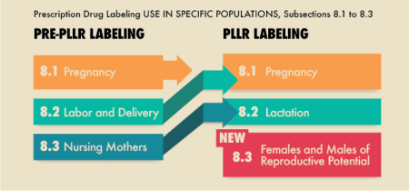

Well, first of all, I am the general folk and this is from some research I did in my free time.
Everytime time I google a drug, I get bombarded with these weird abbreviations and terms. 
I'm writing this to both remember stuff more and improve my understanding further.
This post is more of an index for my future self incase I forget something (which I definitely will!).

Note that in this post, whenever I use the term "drug", I refer to medicine / medicinal drugs.

<!--truncate-->

:::warning NOTE

This is still incomplete!

:::

## Drug Names

You can refer to medicine by using three different names. Two of these three names are the most commly used. The chemical name is not commonly seen, not even in the health sector.

To keep things easy, we will be sticking with a drug commonly referred to as Tylenol or Paracetamol.

### Chemical Name

Tylenol's chemical name is "*N-acetyl-para-aminophenol*".

This is how you read the chemical formula. This is the scientific name of the actual molecule / compound and its written following the rules from IUPAC (International Union of Pure and Applied Chemistry).

This is probably used by chemists and drug researchers. This is not commonly used by doctors or other healthcare workers on a daily basis.

### Generic Name

This is what's being used by healthcare workers on a daily basis.

Using the generic name instead of the brand name will avoid confusion and makes communication easier, specially if you are travelling. Doctors, pharmacists, and researchers use generic names because they describe the same active ingredient, no matter what brand or country.

### Types

Generic names are meant to be "generic" but as always, there are three popular standards. 

#### 1. INN (International Nonproprietary Name)

The generic name of Tylenol is Paracetamol, following the INN standard.

This is the global standard maintained by the WHO (World Health Organization). The goal here is to make sure that every drug has one unique name that is used internationally.

Most European countries, Australia, Sri Lanka, India and many others follow this standard.

#### 2. USAN (United States Adopted Name)

The generic name of Tylenol is Acetaminophen, following the USAN standard.

As usual, the US has it's own naming system. This is managed by the American Medical Association and the U.S. Adopted Names Council. Sometimes the USAN name of a drug is the same and the INN name, and sometimes it's not.

This standard is what I like to use as most of the modern research and online articles are from US based writers and researchers. 

#### 3. BAN (British Approved Name)

The UK stopped using the INN standard and swicthed to their own. In most cases, this is exactly the same as INN.

Just dont use this. Use either INN or USAN. 

### Trade Name

Some trade names of Acetaminophen are:
- Tylenol manufactured by Kenvue / Johnson & Johnson.
- Panadol manufactured by Haleon / GSK.
- [Click here](https://en.wikipedia.org/wiki/List_of_paracetamol_brand_names) to open a massive list.

The big pharmaceutical companies manufacture their drugs and they use a catchy name for marketing. This is called the trade name. This is done to make their drug stand out from the same drug manufactured by other manufacturers. 

Let's look at some other drugs.

| INN | USAN | Trade Name |
| - | - | - |
| Paracetamol | Acetaminophen | Tylenol |
| Adrenaline | Epinephrine | EpiPen |
| Salbutamol | Albuterol | Ventolin |

Now that the naming of drugs has been discussed, I will only use USAN generic name from here onwards.

Sometimes, multiple active ingredients are combined together. Let's look at some examples.
- Panadeine = Acetaminophen/Paracetamol + Codeine phosphate
    - Acetaminophen: An NSAID used an a mild analgesic and antipyretic.
    - Codeine phosphate: A weak opioid-based painkiller
- Augmentin = Amoxicillin + Clavulanate potassium acid
    - Amoxicillin: a β-lactam antibiotic that kills bacteria by interfering with cell-wall synthesis.
    - Clavulanate potassium: a β-lactamase inhibitor that prevents bacteria from destroying amoxicillin, making it more affective.
- Co-trimoxazole = Sulfamethoxazole + Trimethoprim
    - Sulfamethoxazole: a sulfonamide antibiotic that blocks one step in bacterial folic acid synthesis.
    - Trimethoprim: blocks a different step in the same pathway.
    - Both of them combined together gives a "one plus one equals more than two" action. This is called the "synergistic effect".
- Co-careldopa: = Carbidopa + Levodopa
    - Levodopa: A dopamine precursor used to treat Parkinson’s disease; it increases dopamine levels in the brain to improve movement
    - Carbidopa: Prevents the premature breakdown of levodopa before it reaches the brain, reducing side effects such as nausea and allowing even a smaller dose of levodopa to be effective.

## Drug Class

Ok, so... this is something that never ends and there are probably thousands of things to list here. 

Drugs can be categorized by their
- Chemical classes
- Mechanism of action
- Mode of alternative
- Therapautic class
- Amalgamated class
- and one of the many other classification systems

Listing out everything and explaining them in detail goes both beyond the scope of this post as well as my intellect.

Just look things up as you meet them. Google and [MDWiki](https://mdwiki.org/) are your friends. If you are already familiar with some basic terminology, some drug class names should make sense. However, I would always suggest you to read more into it just to confirm. An inaccurate assumption is worse than not assuming anything at all. 

## Pregnancy Risk Categories

Every drug has a side effects and is at least slightly toxic! Yes! Even Acetaminophen. That’s why it’s important to know how medications are classified when it comes to pregnancy. Pregnancy risk categories are a way of describing how safe or risky a medication is to use during pregnancy, based on the available scientific evidence of potential harm to the fetus.

These categories help doctors, pharmacists, and even patients quickly understand whether a medication is considered safe, risky, or somewhere in between. The idea is to balance the potential benefits of treating the mother against any possible risks to the fetus. Just like the drug names, there are multiple standards for this as well. We will focus on the main three.

Apart from pregnancy, drugs are also assessed for how they might affect labor and delivery ("Labor and Delivery") or whether they are safe during breastfeeding ("Lactation"). However, the pregnancy classification is the one you’ll see most often.

Keep in mind that "safe" might not always mean it's completely harmless as they are classified only from what we know.

### FDA System (Old)

This was the classic classification approach used until 2015. Eventhough this has been deprecated, this can still be seen almost everywhere. Each risk catgeory is given a letter from "A, B, C, D, X" and N with A being the safest and X being the most harmful. Let's break this down.

#### Catgeory A

TLDR: Safe to use

Adequate and well-controlled studies have failed to demonstrate a risk to the fetus in the first trimester of pregnancy (and there is no evidence of risk in later trimesters). 
Some examples includes Levothyroxine, Acetaminophen and many more...

#### Catgeory B

TLDR: Probably safe

Animal reproduction studies have failed to demonstrate a risk to the fetus and there are no adequate and well-controlled studies in pregnant women. 
Some examples includes Metformin, Amoxicillin, Cyclobenzaprine and many more...

#### Catgeory C

TLDR: Use only if necessary

Animal reproduction studies have shown an adverse effect on the fetus and there are no adequate and well-controlled studies in humans, but potential benefits may warrant use of the drug in pregnant women despite potential risks.
Some examples includes Gabapentin, Amlodipine, Trazodone and many more...

#### Catgeory D

TLDR: Usually avoid, unless life threatening situation to the mother.

There is positive evidence of human fetal risk based on adverse reaction data from investigational or marketing experience or studies in humans, but potential benefits may warrant use of the drug in pregnant women despite potential risks.
Some examples include Losartan Potassium and many more...

#### Catgeory X

TLDR: Contraindicated in pregnancy. Just dont!

Studies in animals or humans have demonstrated fetal abnormalities and/or there is positive evidence of human fetal risk based on adverse reaction data from investigational or marketing experience, and the risks involved in use of the drug in pregnant women clearly outweigh potential benefits.
Some examples include Losartan Potassium and many more...
Some examples include Finasteride, Methotrexate and many more... 

#### Catgeory N

TLDR: Unclassified

This means that the FDA has not assigned one of the standard letters yet, as the drug is still under research or due to the lack of insufficient data to classify it as safe or bad. Unclassified doesn't mean the drug is safe.

### FDA System (New, PLLR)

After the June 30th of 2015, all prescription drugs and biologic products submitted uses the new format. The already labelled and approved prescription drugs are also being converted to the new format gradually.

Apart from that, the catgeories has slightly changed and a new catgeory related to fertility has been introduced.

Now, instead of using simple labels, each drug should include detailed narrative summaries for all of the three categories mentioned above - Pregnancy, Lactation and Females and Males Reproductive Potential.

This information can be found in [NIH's DailyMed](https://dailymed.nlm.nih.gov/dailymed/) website. For example, [click here](https://dailymed.nlm.nih.gov/dailymed/drugInfo.cfm?setid=dd035a9f-cd40-4314-b9d8-2294b8a924e2) to open information about Methotrexate.

TODO: Not sure whether this is the best site ^^^

### TGA System

Therapeutic Goods Administration (TGA) regulated by the Australian Government has their own classification system. This is very similiar to the old FDA's classification system. The main difference is the catgeory types and their names, which are "A, B1, B2, B3, C, D, and X" with A being the safest and X being the most harmful. Let's break this down. [Click here](https://www.tga.gov.au/products/medicines/find-information-about-medicine/prescribing-medicines-pregnancy-database/) to learn more. Moreover, information/database about prescribing drugs in pregnancy can be found [here](https://www.tga.gov.au/resources/health-professional-information-and-resources/australian-categorisation-system-prescribing-medicines-pregnancy/prescribing-medicines-pregnancy-database).

#### Catgeory A

TLDR: Widely used and considered safe

Drugs which have been taken by a large number of pregnant women and women of childbearing age without any proven increase in the frequency of malformations or other direct or indirect harmful effects on the fetus having been observed.

#### Catgeory B1

TLDR: Probably safe. Animals showed no issues, but human data is limited.

Drugs which have been taken by only a limited number of pregnant women and women of childbearing age, without an increase in the frequency of malformation or other direct or indirect harmful effects on the human fetus having been observed.

Studies in animals have not shown evidence of an increased occurrence of fetal damage.

#### Catgeory B2

TLDR: Seems okay. Not much data available, no red flags

Drugs which have been taken by only a limited number of pregnant women and women of childbearing age, without an increase in the frequency of malformation or other direct or indirect harmful effects on the human fetus having been observed.

Studies in animals are inadequate or may be lacking, but available data show no evidence of an increased occurrence of fetal damage.

#### Catgeory B3

TLDR: Some risk seen in animals. Use only if really needed.

Drugs which have been taken by only a limited number of pregnant women and women of childbearing age, without an increase in the frequency of malformation or other direct or indirect harmful effects on the human fetus having been observed.

Studies in animals have shown evidence of an increased occurrence of fetal damage, the significance of which is considered uncertain in humans.

#### Catgeory C

TLDR: Can cause reversible side effects. Weigh risks vs benefits.

Drugs which, owing to their pharmacological effects, have caused or may be suspected of causing, harmful effects on the human fetus or neonate without causing malformations. These effects may be reversible. Accompanying texts should be consulted for further details.

#### Catgeory D

TLDR: Can cause birth defects. Avoid unless absolutely necessary.

Drugs which have caused, are suspected to have caused or may be expected to cause, an increased incidence of human fetal malformations or irreversible damage. These drugs may also have adverse pharmacological effects. Accompanying texts should be consulted for further details.

#### Catgeory X

TLDR: Extremely dangerous. Completely off limits in pregnancy.

Drugs which have such a high risk of causing permanent damage to the fetus that they should not be used in pregnancy or when there is a possibility of pregnancy.

## Legal Status

Just like the pregnancy categories tell you how safe a drug is to use during pregnancy, the legal status tells you how tightly controlled it is. These classifications determine who can buy it, who can sell it, whether you need a prescription, and many other factors.

This varies greatly from country to country due to differences in legal frameworks and regulatory systems. I will be focusing only on the US and Australia as that is what's relevant to me.

In this section, I'll be using two acronyms: 
- POM: Prescription Only Medicine and 
- OTC: Over the Counter.

### USA

#### Regulation Authorities

In the US, drugs are regulated by two authorities.

1. The FDA (Food and Drug Administration)
    - Decides which drugs to approve for use in humans.
    - Determines whether the drug should be POM or OTC.

2. The DEA (Drug Enforcement Administration)
    - Controls drugs that have potential for abuse or addiction under the Controlled Substances Act
    - Some examples include Oxymorphone as seen in [this official DEA document](https://www.deadiversion.usdoj.gov/drug_chem_info/oxymorphone.pdf)

#### Legal Levels

Drugs can either be issued over the counter or they can sometimes be prescription only.

1. Over the Counter (OTC)
    - Safe for self-use when directions are followed and the drug is used as intended.
    - Examples: Acetaminophen (NSAID), Chlorpheniramine (Antihistamine, H1 antagonist), etc...

2. Prescription Only (Rx Only)
    - Requires a prescription from a licensed medical practitioner because the drug may have stronger effects, significant side effects, or potential for misuse.
    - Examples: Amoxicillin (β-lactam Antibiotic), Sertraline (SSRI), Losartan (Angiotensin II Receptor Blocker), etc...

#### Controlled Substances

> A controlled substrance is "a drug or other substance that is tightly controlled by the government because it may be abused or cause addiction. The control applies to the way the substance is made, used, handled, stored, and distributed. Controlled substances include opioids, stimulants, depressants, hallucinogens, and anabolic steroids. Controlled substances with known medical use, such as morphine, Valium, and Ritalin, are available only by prescription from a licensed medical professional. Other controlled substances, such as heroin and LSD, have no known medical use and are illegal in the United States." - [NIH](https://www.cancer.gov/publications/dictionaries/cancer-terms/def/controlled-substance)

They are divided into give shedules with Schedule V being the lowest and Schedule I being the most strictly controlled.

- Schedule V
    - These drugs have the lowest risk of abuse, often used for mild pain, cough suppression, or neuropathic pain.
    - Still controlled, sometimes due to opioid content.
    - Can be purchased OTC in limited quantities. The limits vary from state to state.
    - Example: Pregabalin (Anticonvulsants)
- Schedule IV
    - These drugs have legitimate medical use and are less addictive comparatively to Schedule III-I, but misuse can still lead to dependence.
    - These are prescription only and refills are allowed upto 5 times in 6 months.
    - Examples: Diazepam (Benzodiazepines), Tramadol (Opiods)
- Schedule III
    - These drugs are useful but still pose a risk of misuse, especially when taken in large doses or for non-medical purposes.
    - These are prescription only and refills are allowed upto 5 times in 6 months.
    - Example: Nandrolone (Anabolic Androgenic Steroids)
- Schedule II
    - These drugs are medically useful but extremely addictive, requiring close monitoring and strict prescription control.
    - These require a written prescription and will not allow any refills.
    - Electronic orders are only allowed in emergencies.
    - Examples: Oxycodone, Hydromorphone (Strong Opiods), Amobarbital (Barbiturates)
- Schedule I
    - These substances have no accepted therapeutic use and are considered unsafe even under medical supervision.
    - Examples: Heroin (Opiods), Psilocybin (Hallucinogens)

:::info Fun Fact

However, in countries like Switzerland, Germany, and the Netherlands, diamorphine (aka heroin or diacetylmorphine) is used in medically supervised environments as part of their heroin assisted treatment programs for people with opioid dependence who have not responded to other treatments.

:::

### Australia

In Australia, drugs are controlled by the TGA (Therapeutic Goods Administration). However, the Poisons Standard (also called the Standard for the Uniform Scheduling of Medicines and Poisons or SUSMP) is what classifies the drugs legally.

Australia also has a "Schedule" system similiar to that of US.

#### Unscheduled

These drugs can be sold anywhere. 
Examples include NSAIDS like Aciteminophen and local analgesics like Lidocaine in cough medication.

#### S2 (Pharmacy Medicine)

These drugs are only sold in pharmacies, but no prescription is required.
Examples include antihistamines like Diphenhydramine or Chlorphenamine.

#### S3 (Pharmacist Only Medicine)

These drugs require no prescription, but they must be supplied by a pharmacist. They might ask questions before issuing them.
Examples include emergency OCP like Lovengerstrel.

#### S4 (Prescription Only Medicine)

These drugs require a prescription and must be issued by a pharmacist.
Examples include antibiotics like Cefalexin, antifungals like Clindamycin and antidepressants.

#### S8 (Controlled Drug)

These drugs are strictly regulated due to potential addiction and/or misuse.
These drugs are only used in hospital environments and only if required.
Examples include opiod based painkillers like Oxycodone and many more.

#### S9 (Prohibited Substance)

These drugs are illegal for general use and is used for research purposes only!
Examples include drugs such as Heroin and LSD.

#### Other Schedules

Shcedule 1, 5, 6, 7 and 10 are mostly used in industrial and checmical goods rather than medicine.

## Route of Administration

This refers to how a drug enters the body. Routes of administration are usually classified based on the site of application or the method of exposure. [Click here](https://www.fda.gov/drugs/data-standards-manual-monographs/route-administration) to open a list of all common routes of administration as classified by the FDA. [This artcle](https://mdwiki.org/wiki/Route_of_administration) also has a list of routes explained in detail. As seen in these lists, there are hundreds of possible routes through which a drug can be administered.

To keep things simple, we'll focus on some of the most common routes:

1. Oral: Administration to or by way of the mouth.

The oral route is the most common, convenient, and cost-effective way to take medication. Drugs are swallowed as tablets, capsules, or liquids and absorbed through the gastrointestinal (GI) tract. Once the drug has been swallowed, it will go through the stomach to the intestines, where it will be absorbed into the bloodstream through the intestinal wall. From there, the portal vein will carry this drug to the liver where a part of it may be broken down (first pass metabolism). Most of the drugs are taken this way.

2. Topical: Administration to a particular spot on the outer surface of the body.

The topical route is another common method of drug administration. Here, the drug is applied directly to a specific area of the skin or mucous membranes. This allows the drug to act locally at the site of application. This route is used with creams, ointments, gels, lotions, patches, and similar preparations designed to treat skin conditions, inflammation, infections, pain, or any condition requiring direct local treatment.

Some drugs can penetrate the outer layers of the skin and act on surface tissues; in some cases, they may also be absorbed into deeper layers. Transdermal patches are an example of this. They are designed to deliver medication into the bloodstream for systemic effects while bypassing the gastrointestinal tract and first-pass metabolism. However, this is a less common use case. The topical route is primarily used to target specific areas, avoid systemic effects, and provide a non-invasive, convenient method of administration.

Clindamycin is one such example. It is mostly used for acne, bacterial vaginosis, certain forms of MRSA, and even malaria when combined with quinine. The clindamycin ointment is commonly used for acne and is considered safer when applied topically. When taken orally for simple conditions, the side effects may outweigh the potential benefits. But when used topically, it effectively treats the targeted area by inhibiting bacterial protein synthesis at the site of application.

3. Intravenous (IV): Administration within or into a vein or veins.

## Pharmocokinetic Data

### Bioavailability

### Potein Binding

### Metabolism

### Elimination half-life

### Excretion

## Chemical Data

### Formula

### Molar Mass

### 3D Models from JSmol

### Smiles

## References:

- https://en.wikipedia.org/wiki/Paracetamol
- https://go.drugbank.com/drugs/DB00316
- https://mdwiki.org/wiki/Amoxicillin/clavulanic_acid
- https://mdwiki.org/wiki/Trimethoprim/sulfamethoxazole
- https://en.wikipedia.org/wiki/Carbidopa/levodopa
- https://en.wikipedia.org/wiki/Drug_class
- https://mothertobaby.org/baby-blog/fda-pregnancy-risk-categories-going-away-for-good/
- https://www.drugs.com/pregnancy-categories.html
- https://chemm.hhs.gov/pregnancycategories.htm
- https://www.medicinesinpregnancy.org/leaflets-a-z/methotrexate/
- https://www.fda.gov/drugs/labeling-information-drug-products/pregnancy-and-lactation-labeling-resources
- https://mdwiki.org/wiki/Methotrexate
- https://dailymed.nlm.nih.gov/dailymed/drugInfo.cfm?setid=dd035a9f-cd40-4314-b9d8-2294b8a924e2
- https://www.tga.gov.au/products/medicines/find-information-about-medicine/prescribing-medicines-pregnancy-database/australian-categorisation-system-prescribing-medicines-pregnancy
- https://www.tga.gov.au/products/medicines/find-information-about-medicine/prescribing-medicines-pregnancy-database
- https://www.deadiversion.usdoj.gov/drug_chem_info/oxymorphone.pdf
- https://www.fda.gov/drugs/data-standards-manual-monographs/route-administration
- https://mdwiki.org/wiki/Route_of_administration
- https://romanpub.com/resources/ijpsr%20v11-2020-7.pdf
- https://www.ncbi.nlm.nih.gov/books/NBK568677/
