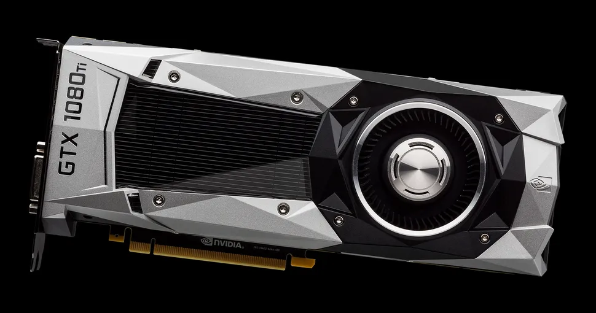

I just updated by Arch Linux installation after three days and it broke my graphics drivers. My graphics card is an Nvidia Quadro K1200, based on the Maxwell architecture. This article covers my approach to fixing it.



<!--truncate-->

## What's going on?

On the 3rd of December, NVIDIA officially announced that they are dropping support for Pascal, Maxwell and older GPUs with the release of Nvidia's 590.XX drivers.

Along with this, the package names in Arch related to the proprietary Nvidia drivers are renamed as follows:
- `nvidia` ---> `nvidia-open`
- `nvidia-dkms` ---> `nvidia-open-dkms`
- `nvidia-lts` ---> `nvidia-lts-open`

Turing GPU's and above will automatically transition to the open kernel modules on upgrade with no manual intervention required.

If you accidentally upgraded to 590.XX, your system would break.

## Solution

This section will assume that you have `base-devel` and other basic utilities like an AUR helper such as `yay` has been installed.

To fix it, open your terminal or a TTY by doing `Ctrl+Alt+F4` to get to a shell. Begin by installing the `linux-headers` package. Not having this installed might break things.

```bash
sudo pacman -S linux-headers
```

Then, force uninstall the packages. This might cause dependency breakage but it's fine as we will be replacing them with something right afterwards.

```bash
sudo pacman -Rdd nvidia-dkms nvidia-utils nvidia-settings lib32-nvidia-utils
```

Then, install the new packages. 

```bash
yay -S nvidia-580xx-dkms nvidia-580xx-utils nvidia-580xx-settings lib32-nvidia-580xx-utils
```

The rest of the `nvidia-580xx` packages can be found [here](https://aur.archlinux.org/packages?O=0&SeB=nd&K=nvidia-580xx&outdated=&SB=p&SO=d&PP=50&submit=Go) in the AUR. All of these packages are maintained by `ventureo` from the CachyOS team. I would like to mention a big thank you for them!


Install any other packages if you want them. Next is the moment of truth. Reboot your computer and see if it works!

## References

- https://www.youtube.com/watch?v=2-obijeo_bU
- https://lists.archlinux.org/archives/list/arch-announce@lists.archlinux.org/thread/AMPPOBL6ZQPEOQ722IE3O5BO3PPWCQNA/
- https://archlinux.org/news/nvidia-590-driver-drops-pascal-support-main-packages-switch-to-open-kernel-modules/
- https://gitlab.archlinux.org/archlinux/packaging/packages/nvidia-utils/-/commit/cc7ae772aec0b147f75c0aa4e148f1d97f2c1848
