So far, I have been copying all the images to one of my external hard disks from my phone on a weekly basis. I would have already wasted hours doing that. Also, if I accidentally delete an image (also from the Trash), it would be gone forever and I would not be able to back that image up. So, I wanted a one-way photos sync thing that checks and uploads images very regularly. Now that my requirement is clear, I went out to find a solution to this. In this article, I will talk about my journey in coming to the final solution.

Note that this is **not** a step by step guide for setting up Immich.

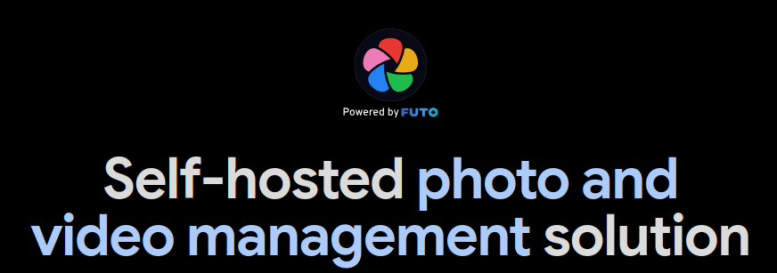

<!--truncate-->

I looked at good image servers that looked similiar to google photos and had the geolocation heatmap feature.


I found Ente Photos to be a good alternative, it's not self hostable but I find the pricing to be very reasonable - specially considering the fact that I wouldn't have to deal with the server stuff myself. I downloaded the android app, tested it out a little and it was very well built.

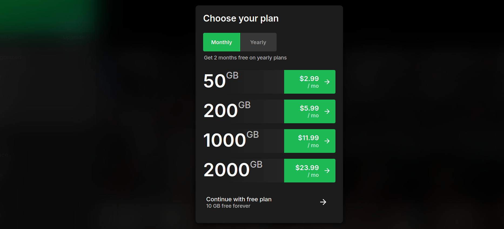

But I would love to have that extra amount of control I get when self hosting my own image server. I also love to set things like this up, I went out looking for more. I went through every solution mentioned in [awesome-selfhosted](https://github.com/awesome-selfhosted/awesome-selfhosted?tab=readme-ov-file#photo-galleries). [Nextcloud Memories](https://memories.gallery/) looked appealing but I'm not a huge fan of Nextcloud and I've had bad experiences with their synchronization on mobile. [PhotoPrism](https://www.photoprism.app/) also looked appealing but it doesn't look similiar to google photos or anything I'm used to based on their [live demo](https://demo.photoprism.app/library/browse).

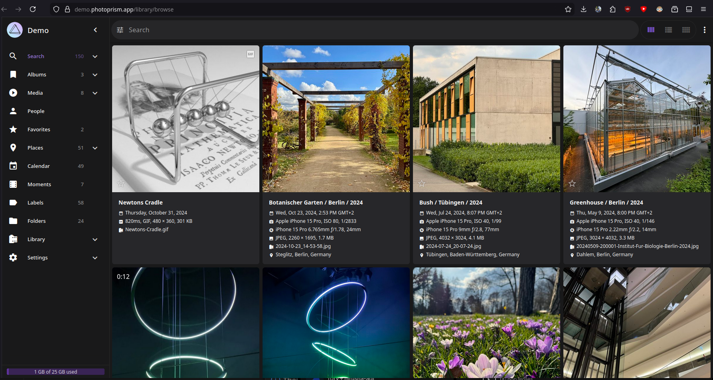

Finally, I found [Immich](https://immich.app/) ([Demo](https://demo.immich.app/auth/login)) to be almost identical if not better than google photos.

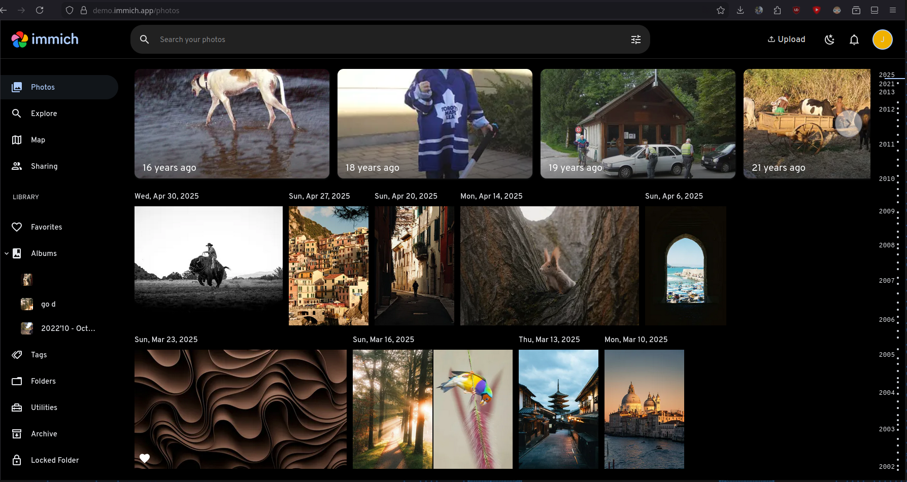

Now that I found a software, my very first idea was to self host it in my server. I currently have a VPS hosted from a german provider. It gives me a lot of CPU cores, RAM and 750+ GB of storage. However, it does not have enough storage for my needs and it costs ~18 AUD for 1 TB of storage to be attacthed.


This is not very affordabile to me right now. Therefore, I thought of hosting it my main computer that I almost never turn off. It runs arch btw.

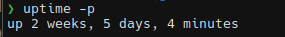

I went ahead to set it up. My desktop has a weird storage configuration. It has one 128GB SSD (ext4) running Arch, another 256GB SSD running Windows (NTFS) and a 1TB HDD (NTFS) for shared storage. PostgreSQL is used by Immich and it doesn't like NTFS file systems. Therefore, I had to use a docker volume from my 128GB SSD for the database. I added all of images and videos taken in the last 6 months to it.

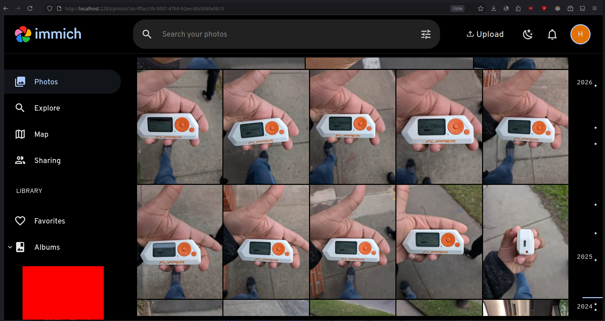

I then installed the mobile app and played around with it. Tested the auto image backup feature and with the sync timing. It all seemed to work great. I was able to access my computer while I was outside today via tailscale and it worked smoothly. 

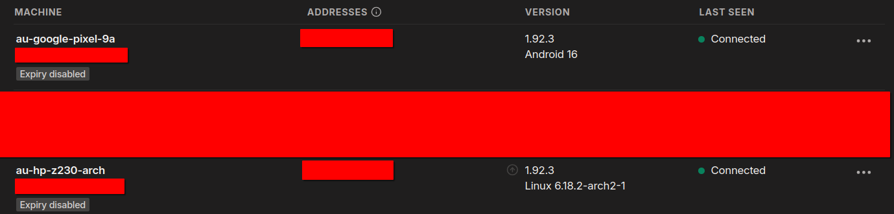

My home internet connection is just 50Mbps and it's shared with 7 other people. Therefore, it might not always be that smooth. Moreover, if I keep on doing this in the long term, I can see my SSD filling up easily, specially since it's also my main drive (containing `/home`) that I use on a daily basis. My computer is a very old HP Z230 and anything could fail anytime and I don't see myself keeping this it turned on when I am out from home away for days or weeks or even potentially months. Therefore, I need a cloud solution and it's more reliable if done correctly anyways.

I was back looking for cheap cloud storage solutions and I checked out Hetzner. Their [storage boxes](https://www.hetzner.com/storage/storage-box/) seemed to be the most ideal solution for me.

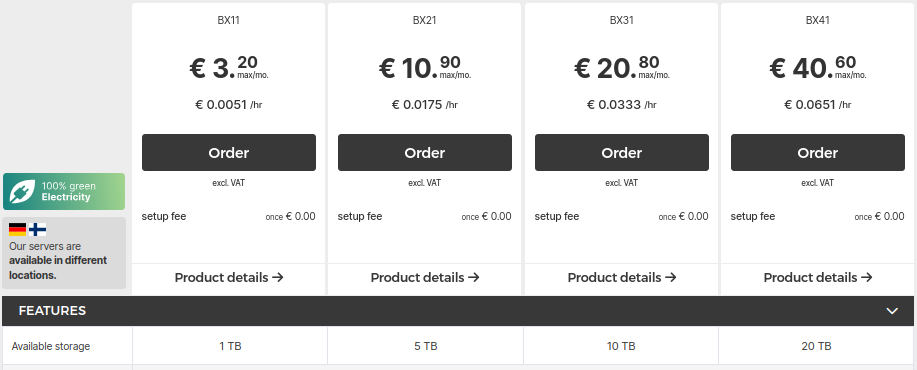

The pricing is extremely cheap compared to everything I found before.
- 1TB: €3.2 = 5.6 AU$
- 5TB: €10.9 = 19 AU$
- 10TB: €20.8 = 36.3 AU$
- 20TB: €40.6 = 70.8 AU$

BX11 is cheap enough and 1TB is a lot of space for jpegs taken from a mobile phone. I can easily store years worth of images here. I confirmed the order.

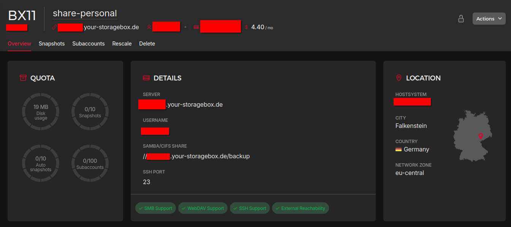

I made sure to enable SMB support. It will let me mount this storage box into my VPS easily. Usually, rsync is what I use but for this scenario SMB/CIFS seems to be the best solution as it will let me mount it to my docker container as a volume easily.

Next, to mount this storage box into my VPS, i followed Hetzner's [official documentation](https://docs.hetzner.com/storage/storage-box/access/access-samba-cifs/). Below is a summary of what I did.

- Begin by installing `cifs-utils`.

```bash
sudo apt-get install cifs-utils
```

- Create the file to store credentials to access this storage box.

```bash
nano /home/ubuntu/.storagebox-creds
```

- This file should contain:

```ini
username=YOUR_STORAGEBOX_USERNAME
password=YOUR_STORAGEBOX_PASSWORD
```

- Next, update the permissions and ownership of this credentials file.

```bash
chmod 600 /home/ubuntu/.storagebox-creds
chown ubuntu:ubuntu /home/ubuntu/.storagebox-creds
```

- Create a directory for the mount point

```bash
sudo mkdir -p /mnt/storagebox-share
```

- Mount the storage box with SMB/CIFS

```bash
sudo mount -t cifs \
  //uXXXXXX.your-storagebox.de/backup \
  /mnt/storagebox-share \
  -o credentials=/home/ubuntu/.storagebox-creds,vers=3.1.1,iocharset=utf8,serverino,_netdev,uid=1000,gid=1000
```

- Finally, verify that it has been added by checking it's disk space

```bash
$ df -h | grep storagebox

//uXXXXXX.your-storagebox.de/backup  1.0T   19M  1.0T   1% /mnt/storagebox-share
```

- To make sure that this storage box gets mounted when the VPS reboots, you can add it to `fstab`. Open your `/etc/fstab` file.

```bash
sudo nano /etc/fstab
```

- Add this line to `/etc/fstab`

```fstab
//uXXXXXX.your-storagebox.de/backup /mnt/storagebox-share cifs credentials=/home/ubuntu/.storagebox-creds,vers=3.1.1,iocharset=utf8,serverino,_netdev,uid=1000,gid=1000 0 0
```

- Finally, run this command to ensure it works.

```bash
sudo mount -a
```

After testing it out a little, I got into setting up immich ([Click here](https://docs.immich.app/install/docker-compose) to open the official documentation). I edited the docker compose file, the `.env` file and the other hardware acceleration related files to suit by requirement and the server's setup. For storage, all I did was edit the `UPLOAD_LOCATION` variable in the `.env` from `./library` to `/mnt/storagebox-share/immich`.

```diff
- UPLOAD_LOCATION=./library
+ UPLOAD_LOCATION=/mnt/storagebox-share/immich
```

This is being handled by the default `docker-compose.yml` file as follows:

```yml
...
services:
  immich-server:
    volumes:
        - ${UPLOAD_LOCATION}:/data
        ...
    env_file:
        - .env
    ...
...
```

Now that my immich instance was up and running reliably, I went ahead and updated the configuration on my mobile phone. I tested it and everything seemed to work flawlessly. 

The initial setup of the app is pretty straight forward. I went to the Backup section and selected the "Camera" folder to the backed up. The next step is to come to the backup page and enable the "Enable Backups" checkbox.

Next, inside the backup settings, I changed the network requirements to also backup photos using cellular data. I have left this turned off for videos. As I do not maintain albums in my mobile phone, I left it turned off. I also made sure to reduce the "Delay new assets backup: 5 seconds" from 60 seconds all the way down to 5 seconds. This way, I won't lose images even if I delete them accidentally.

In the advanced page, I ensured that "Sync remote deletions \[EXPERIMENTAL\]" is disabled so that I can have my desired feature set.

<details>
<summary>
  Screenshots of my mobile app's configuration.
</summary>


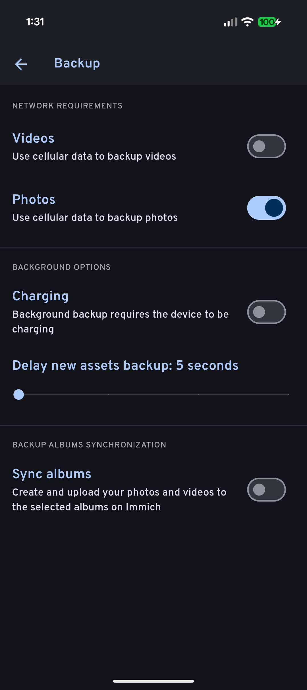

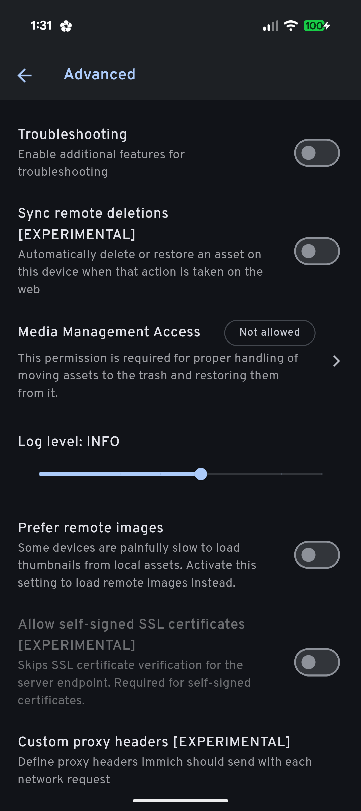

</details>

That's it. Everything seems to work. I can mount this storagebox via SMB/CIFS to both my Arch desktop and my Windows laptop and access/backup images whenever I want. If I run out of space on my phone while I'm outside, I can quickly delete the local copies of my images (that has been backuped up) and start shooting again. 

I would still maintain a local backup on my external hard disk. If the above scenario ever happens, I will just pull the images storagebox and copy it directly. It should be that straightfoward and simple. Also, now that I am certain that I won't lose any images even if I lose my phone, I can increase my local backup frequency from about a week to a month or two.

But of course, if I ever wanted to see the last terabyte or images I've taken, I just have to open Immich and scroll down. It's that simple! I've only managed to take ~55GB of images/video for the last 6 months. This means that I can have access to years of images all at once.

When I run out of space in the storagebox, my plan is to remove the old images from it permanently. I would still have copies of them in my local external hard disk.

In saying that, I might upgrade to the larger plan in the future. It depends on how interesting my life gets.

:::warning Warning!

The proper way to back up your important data/media is to follow a 3-2-1 backup strategy. You can [click here](https://www.backblaze.com/blog/the-3-2-1-backup-strategy/) to learn more about it. What I'm doing here is **NOT** the best way to backup your important data but under my current circumstanses, this is what I'll have to stick with. If anything, it's better than nothing.

:::

That's it for this article. I hope you enjoyed it and (maybe) learnt something. See you in the next one!
