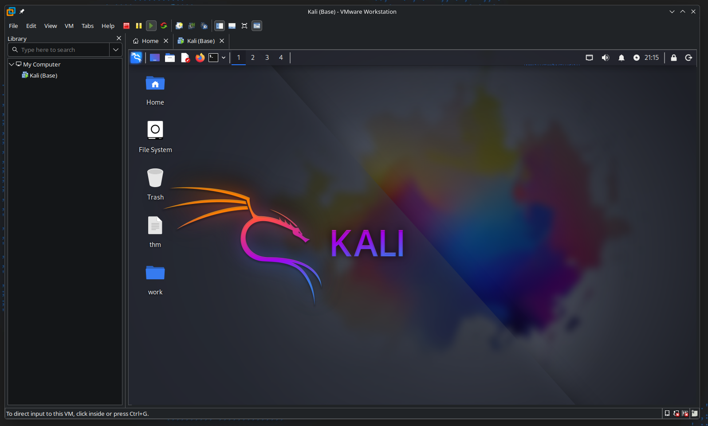

This is a step by step guide to setting up VMWare Workstation in Arch Linux as of February 2026. Usually, you would run into an issue where the window will crash when you press `Ctrl+Alt` to take the cursor our of a VM window. In this guide, we will see what causes that issue and how it can be fixed.



<!--truncate-->

Before you begin, please refer to the [official documentation](https://wiki.archlinux.org/title/VMware) in the Arch Wiki. That is the most upto-date resource. This article might have been outdated by the time you read it. This guide will assume that you are familiar with using Arch Linux to an extent and you use the `yay` AUR helper.

## Installation

First, ensure that virtualization support is enabled in your BIOS/UEFI settings. Look for options like "Intel VT-x" or "AMD-V" and enable them.

Then, install the requireed packages. The `linux-headers` package is required to build the VMWare kernel modules (uses `dkms`). The `vmware-workstation` package can be installed from the AUR using `yay`.

```bash
sudo pacman -S linux-headers
yay -S vmware-workstation
```

Once the installation is complete, you should start the services related to Networking and USB support for VMWare.

```bash
sudo systemctl enable --now vmware-networks-configuration.service
sudo systemctl enable --now vmware-networks.service
sudo systemctl enable --now vmware-usbarbitrator.service

# sudo systemctl enable vmware-hostd.service # deprecated
```

Then, you can load the kernel modules manually. If this fails (`Cannot load module vmmon`) or takes too long, try rebooting your system. If it still fails, please refer to relevant section in the Arch Wiki ([click here](https://wiki.archlinux.org/title/VMware)).

```bash
sudo modprobe -a vmw_vmci vmmon
```

You can now run `vmware` to launch VMWare Workstation Pro and `vmplayer` to launch VMWare Workstation Player. Since broadcom acquired VMWare, the Pro version (`vmware`) is now free for personal use. However, if you want to use a license key, you can run the command below to do that.

```bash
sudo /usr/lib/vmware/bin/vmware-vmx-debug --new-sn XXXXX-XXXXX-XXXXX-XXXXX-XXXXX
```

If this fails, you can launch the GUI utility for activation.

```bash
sudo /usr/lib/vmware/bin/vmware-enter-serial
```

## Fixing the crash issue

From early 2025 onwards, Arch Linux users have been experiencing an issue where the `vmware` GUI window suddenly crashes. This can also be triggered by pressing `Ctrl+Alt` to take the cursor out of a VM window. 

When you try to launch `vmware` from the console, you will see these two error messages caused by `vmware-tray` and `vmware` respectively.

```bash
$ vmware

(vmware-tray:3490362): Gdk-WARNING **: 13:00:16.662: The program 'vmware-tray' received an X Window System error.
This probably reflects a bug in the program.
The error was 'BadValue (integer parameter out of range for operation)'.
  (Details: serial 338 error_code 2 request_code 135 (XKEYBOARD) minor_code 8)
  (Note to programmers: normally, X errors are reported asynchronously;
   that is, you will receive the error a while after causing it.
   To debug your program, run it with the GDK_SYNCHRONIZE environment
   variable to change this behavior. You can then get a meaningful
   backtrace from your debugger if you break on the gdk_x_error() function.)

(vmware:3490253): Gdk-WARNING **: 13:00:18.826: The program 'vmware' received an X Window System error.
This probably reflects a bug in the program.
The error was 'BadValue (integer parameter out of range for operation)'.
  (Details: serial 3074 error_code 2 request_code 135 (XKEYBOARD) minor_code 8)
  (Note to programmers: normally, X errors are reported asynchronously;
   that is, you will receive the error a while after causing it.
   To debug your program, run it with the GDK_SYNCHRONIZE environment
   variable to change this behavior. You can then get a meaningful
   backtrace from your debugger if you break on the gdk_x_error() function.)
```

According to [this](https://community.broadcom.com/vmware-cloud-foundation/discussion/sudden-ui-exit-on-arch-linux) and [this](https://github.com/xkbcommon/libxkbcommon/issues/888) articles, the problem seems to have been caused by an X11 interaction error in newer versions of `libxkbcommon`. The VMware interface closes due to a `SIGSEGV` (segmentation fault) that occurs within this library as seen in the error messages above.

According to some users, the cause of this error is:

> “A bug in keyboard layout management in libxkbcommon-x11 version 1.11.1 and higher.”

These users have reported that downgrading `libxkbcommon` to version `1.11.0` resolves the issue. You can do this using `downgrade` command.

```bash
sudo downgrade libxkbcommon libxkbcommon-x11
```

However, it failed on my device and something about downgrading packages on Arch Linux doesn't feel right. After further research, I was able to discover [this reply](https://github.com/xkbcommon/libxkbcommon/issues/888#issuecomment-3478004721).

> "I make a package called [libx11-mr293](https://aur.archlinux.org/packages/libx11-mr293) on AUR, which applies the patch from merge request [293](https://gitlab.freedesktop.org/xorg/lib/libx11/-/merge_requests/293) for libX11. Anyone encounters the crash can use it until libX11 merges MR293 and releases a new version." - [Bryan2333](https://github.com/Bryan2333)

This package includes a `LD_PRELOAD` patch that temporarily bypasses this `libxkbcommon` error. After replacing `libx11` with `libx11-mr293`, the VMWare Workstation GUI no longer crashes when pressing `Ctrl+Alt` or launching the application. You can run the command below to install the package.

```bash
yay -S libx11-mr293

# libx11-1.8.12-2 [removal]  libx11-mr293-1.8.12-1
```

That's it! You can now run VMWare Workstation Pro/Player without any issues weird display manager related issues in 2026 on Arch Linux!
