This is not for extreme beginners. Please make sure that you know what you are doing and what your requirement is before following this guide. Note that the this is not an exact step-by-step guide. However, it will cover everything in an almost step-by-step way. This is based on [AlmaLinux 10](https://almalinux.org/blog/2025-11-24-almalinux_101_release/) - a redhat based, free, enterprise-grade operating system. This is my journey trying to harden this, while learning new things on the go!

<!--truncate-->

I will be doing this on a VMWare virtual machine. Therefore, I will begin by downloading the AlmaLinux installation image from their [official website](https://almalinux.org/get-almalinux/). Then, I can follow their [official documentation](https://wiki.almalinux.org/documentation/installation-guide.html) to verify the downloaded image and then install it. For this walkthrough, I downloaded the minimal edition.

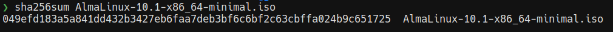

I began by verifying the file hashes (SHA265) and it's a match. This verifies the ISO file and ensures that it has not been tampered with.

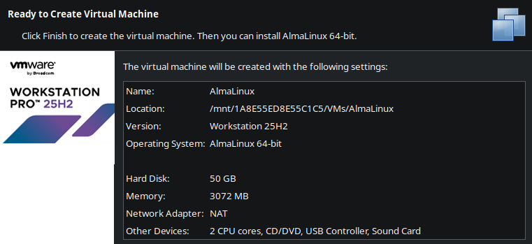

After adding it to VM Ware Workstation Pro (Personal) with "AlmaLinux (64-bit)" selected as the operating system, boot into it and select "Install AlmaLinux 10.1 in FIPS mode".

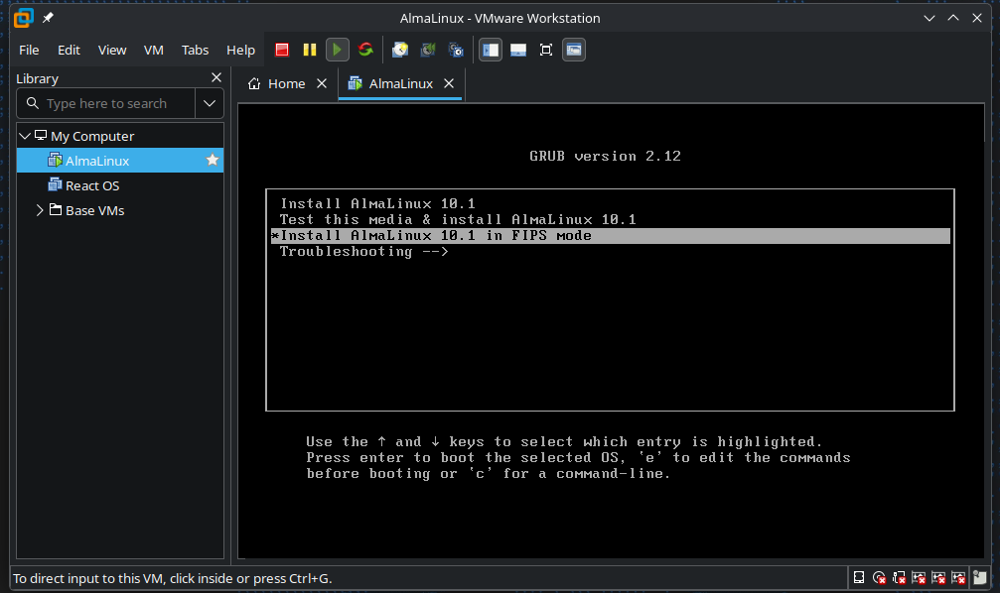

FIPS is short for "Federal Information Processing Standards". These are some U.S government standards developed by NIST that defines security controls, specifically for cryptographic modules. You can learn more about AlmaLinux and FIPS mode [here](https://almalinux.org/blog/2024-10-07-fips-validation-for-almalinux-update/). It seems to be just like the regular version, but more FIPS compliant - meaning, it will only use FIPS validated cryptopgraphic modules. Do note however that this might cause compatibility issues with certain software, specially if they rely on weaker algorithms like MD5, RC4, etc...

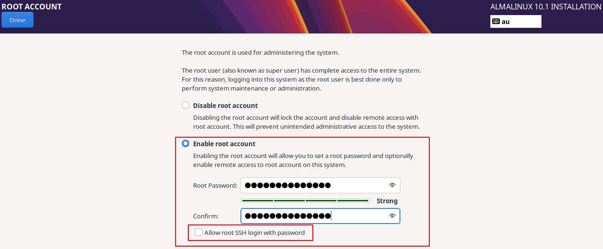

I made a new root account but I didn't allow root SSH login with password.

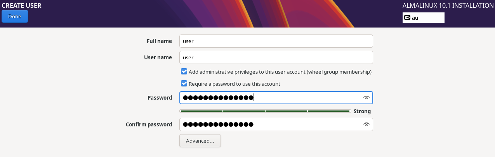

I made another user account with the username `user`. The very first checkbox will add `user` to the wheel group. This will allow them to use `sudo` to run commands as root.

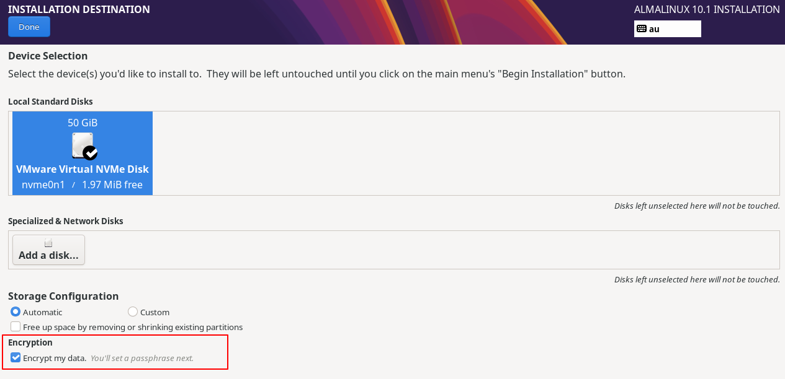

When you are selecting the installation destination, make sure to check "Encrypt my data". This will make sure that the data at rest will be encrypted. This is good for both security and compliance if you are after it.

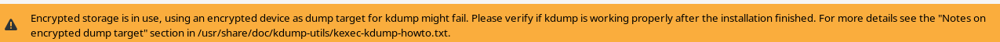

You will get a warning like this when you head towards the Kdump page. Let's keep this in mind and head forward.

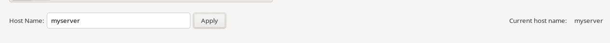

I then updated the hostname to `myserver` from the default `localhost`.

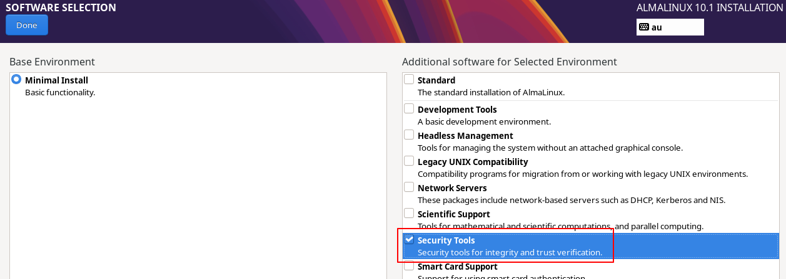

I adjusted the "Software Selection" to include the "Security Tools" as well.

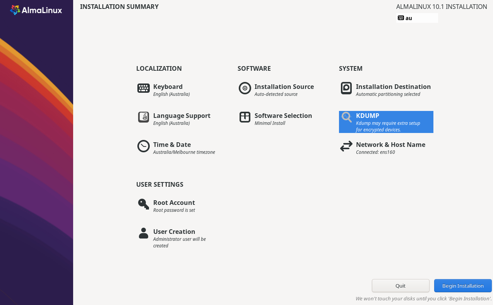

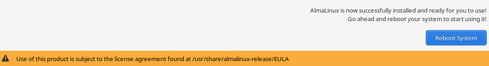

After the installation is complete, you can reboot the computer. You can read the EULA if you are interested. If this is for 

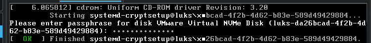

When you turn your computer on, it will now ask for the encryption passphrase that you used when encrypting your installation destination previously.

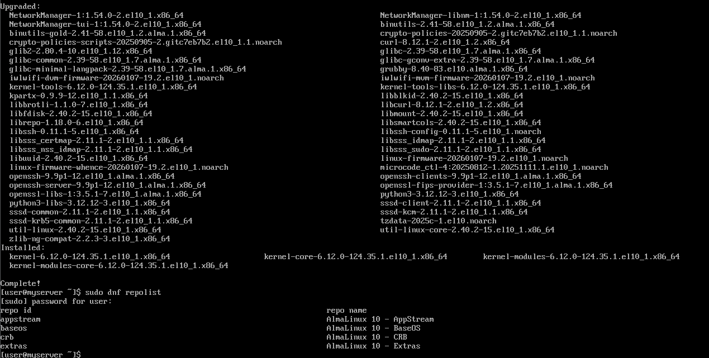

I then logged in the server and followed the [official documentation](https://wiki.almalinux.org/documentation/after-installation-guide.html#update-the-system-and-check-for-security-updates). I first ran `sudo dnf update` to upgrade all the packages in my system. Next, you can enable custom repositories with dnf. To see the repos that you already have, you can run `sudo dnf repolist`. If you want to add something, you can refer to [this](https://wiki.almalinux.org/repos/AlmaLinux.html) documentation.
 
I however didn't bother with enabling any repos right now. I will do it if it's required later.

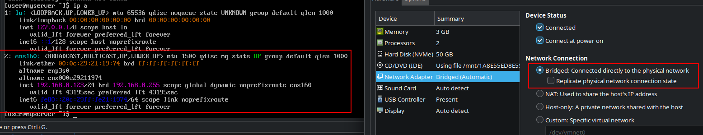

I then changed the network from NAT to Bridged. This will allow the VM to be on the same network as my host machine and get an IP address from the same DHCP server. This is important for me to be able to access the server from my host machine over SSH. The IP address my DHCP server assigned to my VM is `192.168.8.123`. Setting up a static IP address would be a good idea if you actually plan to use this. You can either do that from both the router's end as well as in the server using the `nmcli` or `nmtui` utilities.

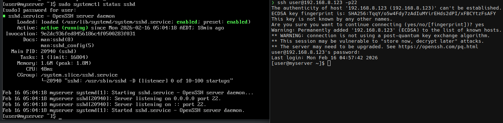

I then made sure that openssh-server is running in the server. After running `sudo systemctl status sshd`, it seems to be both running and active. I will connect over SSH and work from there.

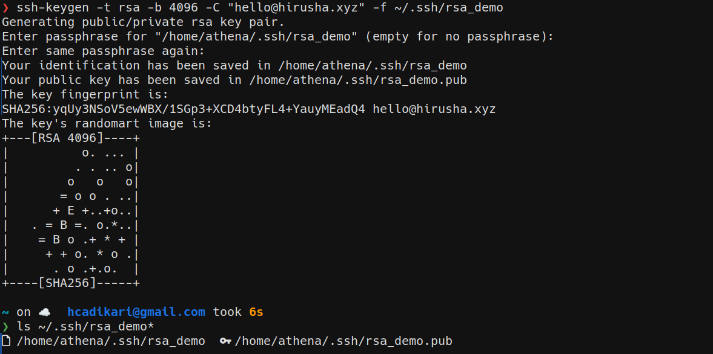

I then created a new pair of keys by running `ssh-keygen -t ed25519 -C "hello@hirusha.xyz" -f ~/.ssh/key_demo`. This would have created me the `key_demo` (private key) and the `key_demo.pub` (public key) files. I made sure to use a passphrase here. Note that almost every tutorial suggests you to use `ed25519` over RSA. However, when in FIPS mode, `ed25519` is not enabled. 

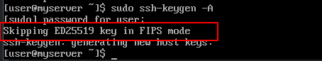

If you want to verify this, you can run `sudo ssh-keygen -A` in the server.

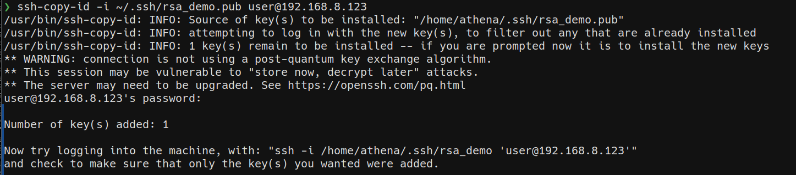

I can then copy my public key to the server by running `ssh-copy-id -i ~/.ssh/key_demo.pub user@192.168.8.123`.

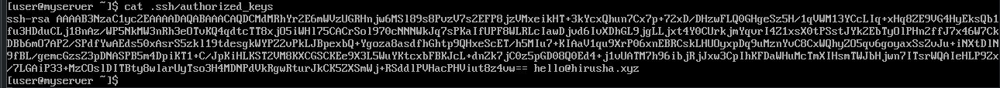

The above command will add my public key to a new line in the `~/.ssh/authorized_keys` to the `user` account in `myserver`. You can also add it manually but using the `ssh-copy-id` is the standard way of performing that action.

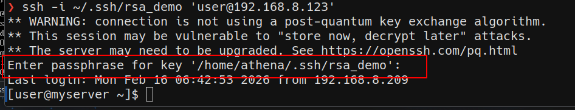

Now, when I try to log in, I will only get prompted to enter the passphrase for my key. This will ensure that even if private key gets stolen, the attacker would still need to know your passphrase to login.

Before proceeding any further, I will set up SELinux by running `sudo dnf install policycoreutils-python-utils -y`. This should make tools like `semanage` and others available to me.

I will now be hardening the SSH access. Do note that this is not everything as we will be coming back to this later.

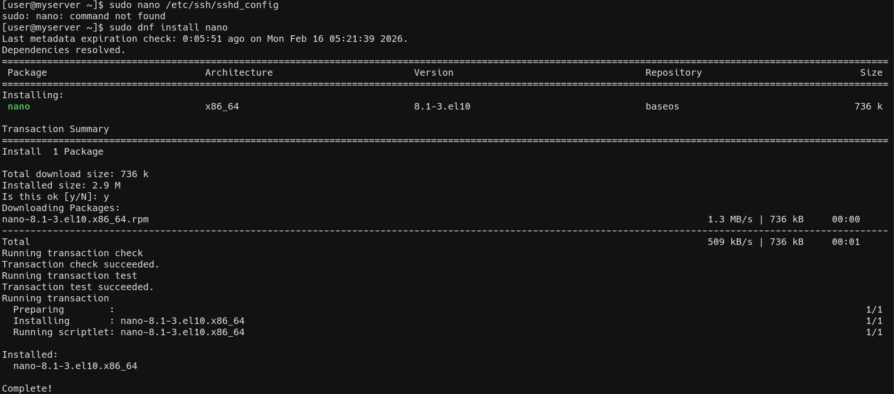

When attempting to  open `/etc/ssh/sshd_config`, I discovered that I don't have `nano` installed. Therefore, I went ahead and installed it by running `sudo dnf install nano`. Then, I will open the `sshd_config` file `nano` by running `nano /etc/ssh/sshd_config`. TODO Click here to open the sshd_config I settled with at this stage. There are a lot of parameters available in the sshd_config, you can refer to the [official documentation](https://man7.org/linux/man-pages/man5/sshd_config.5.html) to configure them according to your needs.

I don't plan to use IPv6, therefore, I will disable it. Since I changed my port from the default `22` to `6722`, I should run `semanage port -a -t ssh_port_t -p tcp 6722` to tell SELinux about this change. I am planning to use PAM in the future. But I will keep it disabled for now until I set other things up.

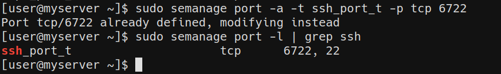

I ran `sudo semanage port -l | grep ssh` to verify that it has been added.

After that, to ensure that SSH won't break, I ran `sudo restorecon -R /home/user/.ssh`. SELinux labels every file and directory with a context. If these permissions are set incorrectly, SSH will not read the `authorized_keys` or other files inside `.ssh/` correctly - therefore, breaking SSH and public key authentication. This command will ensure that the labels match what sshd expects.

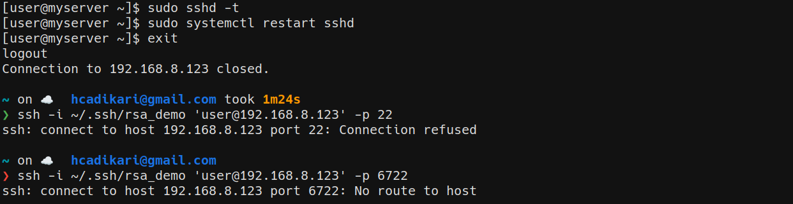

And just like that, I broke ssh. I am not removing this part out fixing the blog post. Again, this is not a tutorial, this is my journey.

