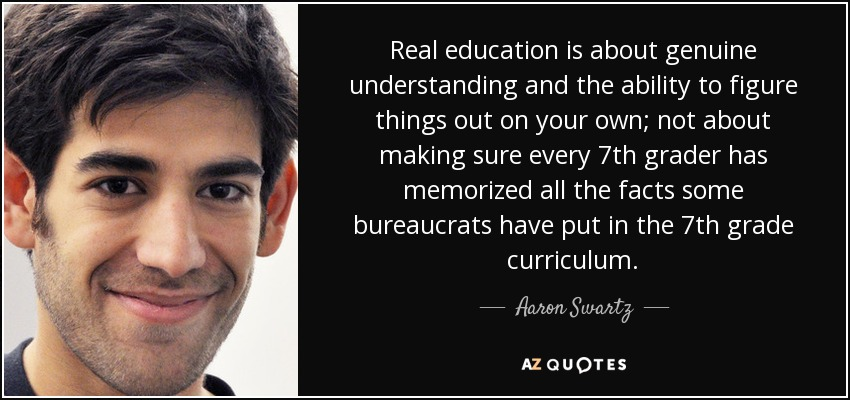

A collection of study resources for high school exams - Ordinary Levels and Advanced Levels for multiple syllabi.

<!--truncate-->

## Introduction

Sections:

- [Sri Lankan General Certificate of Education (GCE) Advanced Level](#sri-lankan-general-certificate-of-education-gce-advanced-level)
- [Pearson Edexcel IAL (International Advanved Levels)](#pearson-edexcel-ial-international-advanved-levels)
- [Pearson Edexcel IGCSE (International General Certificate of Secondary Education)](#pearson-edexcel-igcse-international-general-certificate-of-secondary-education)

For the Sri Lankan General Certificate of Education (GCE) Advanced Level Examinations, past papers were not easily accessible at all. This is a free-of-charge examination conducted by the government, and anyone who has successfully passed the Sri Lankan General Certificate of Education (GCE) Ordinary Level examination can sit for it. Yet, the resources are very hard to access. Despite the government's lack of interest and the "tuition class culture" failing to produce a textbook, they apparently also don’t care about students having easy access to past papers. There are third-party websites that host these, but they are filled with ads, and the content is put behind a paywall. The original government website that students intend to use doesn't have past papers before 2015 for English medium papers. I don’t exactly know whether this is discrimination or just their utter lack of interest. This was as of mid-2023. I don't exactly know whether they've updated them. So, after exploring hundreds of different third-party sites, I found this content inside a Telegram channel with approximately 3,000-ish members.  

For Pearson Edexcel IAL and IGCSE, most of them aren’t my resources or hosted by me. This site just links to them. Also, everything here was found either from publicly visible Reddit posts or Discord servers with thousands of members.

I started collecting these resources and making them publicly available without any advertisements and for free for the first time in early 2023. All of these resources were collected over a relatively large amount of time. The reason I did this was to help out my friends. This blog post says it was written on January 1st, 2023, but it's not. This was written somewhere in Q1 of 2023.

## Sri Lankan General Certificate of Education (GCE) Advanced Level

### Mathematics

#### Guide (Optional)

:::info FOR SINHALA MEDIUM

Looking for a top A/L Maths class in Sinhala? Ajantha Dissanayake’s lessons are well-structured and easy to follow. He teaches in Nugegoda, Kandy, Kurunegala, and online.

Watch his lessons [here](https://www.youtube.com/@ajanthadissanayakeofficial8370/videos). This is just my opinion, not an endorsement.

:::

:::info FOR ENGLISH MEDIUM

Join an English medium class you’re comfortable with and also try Ajantha Dissanayake's Sinhala theory class. His teaching, notes, and planning are unmatched.

Switching between Sinhala and English can be tough, but it’s worth it. Give it a shot!

:::

#### Past Papers

2000

- [Applied](https://mega.nz/file/Aq4GxLhZ#wL_oPXO2M8CVwpYH0M_9buAnQfyt0SvQiwohhAuqRHo)
- [Applied Marking Scheme](https://mega.nz/file/12gyFSJC#jNPUV9IPbqwYPY4qNJW9SK0PyDcRCeMNO9GgGEq7-7o)
- [Pure](https://mega.nz/file/AjpCjK6D#CGzZa-FO8o8Hut9FDYyDnJnRUG5BT4iDMzyDg0od9lQ)
- [Pure Marking Scheme](https://mega.nz/file/k6gCQBhS#CEv0b_gI0M1IM3fHwMm6gWMZ99wh9bLchjBOrYs84BM)

2001

- [Applied](https://mega.nz/file/g6A2VBwD#eVd-h6p5bqc7eJSA--eTskxLbTPjUaXknp7KZcTbcG8)
- [Applied Marking Scheme](https://mega.nz/file/9ip1TAxS#3Q7r4DKbS-TTToxk6Ocpn4IxkFbhZ9CWKqCyTgPKfQk)
- [Pure](https://mega.nz/file/g2wH1KoY#skp47ZDWse0y-GF7WZTPNzDcPv8esyrIkzdx6rHyJUs)
- [Pure Marking Scheme](https://mega.nz/file/pypFBQJQ#d2_TwCutSA2Yy9xp-LejlkLDy-myDEnFN2ZTuQT3iiY)

2002

- [Applied](https://mega.nz/file/M7ZDBQLD#XOMC9yz0epwCP3zJjGcdXCHNkAJGFOGRfA44H2e6ydw)
- [Applied Marking Scheme](https://mega.nz/file/JioUVT5D#GGzT2wV_qc0362icsIq8PmcDnUSVh1JJFy0Vj6JRBxo)
- [Pure](https://mega.nz/file/x75HSbKS#e_RE4oEL3yKAPBAzmylqsQUoHzboXSAoQZDci-3WEVk)
- [Pure Marking Scheme](https://mega.nz/file/NnRSjLKJ#UlGQZYSbdylG-f7JsZmcIu60yrzbSGkDovHiZNyQ2GM)

2003

- [Applied](https://mega.nz/file/trojQDYS#d__9vJRnrbxHMHkY0SWKiCFTzPSgd2G_w1NPv-lWQvI)
- [Applied Marking Scheme](https://mega.nz/file/Uzh0QBoZ#JZlvLCdpK1aq6TZbS21RJCpbA8H_yazwMLyzgYht5xo)
- [Pure](https://mega.nz/file/si4nSC7Q#LI5lteH4-nlfo6pSATtl0dX0S217is3qhiR67YJuVRQ)
- [Pure Marking Scheme](https://mega.nz/file/MrQXUBaQ#N12Lantl7-wPFqVLqM8y5UIs9YKDnXqvELTLuP8sEEI)

2004

- [Applied](https://mega.nz/file/wq4nDIbJ#afDsdnHTl7xDsOzE8HCOOGeeJ7nuBzIIEMG-BKMkSnI)
- [Applied Marking Scheme](https://mega.nz/file/FqZ0FDDK#D8N7s4d_i7FZ4V_UFstKWLHylHrxI5ZhvYsdBdqS8NQ)
- [Pure](https://mega.nz/file/UqxjBKDD#EIBnHSK-RUUkmT-qGLxOf6G5ZKJ3_QqQ_kqXjiz2aY4)
- [Pure Marking Scheme](https://mega.nz/file/BmoWwYgT#ehOyeTym9TVIryIsTlE3sL79gGn135cjdAbeObdIlU4)

2005

- [Applied](https://mega.nz/file/h6ZBBbza#SSFcLIlbtB2Z2DiVdAwQbUpBQQM4QvAVIbnnQpEqFeo)
- [Applied Marking Scheme](https://mega.nz/file/5q5zxBSC#Fjkiuq4qlV3f-CUoxIaueqVBFeBb18KWtKua7dZhCjY)
- [Pure](https://mega.nz/file/l7QwHLzZ#hDTG0yTuoNy8rnDiXzywaa1kQ75-8ZZ3DZg7QbNVpck)
- [Pure Marking Scheme](https://mega.nz/file/tm5A3JYC#fJPCqBjWxW3UxmMznZhmUz5BkEq8bez6cq_giovwSgM)

2006

- [Applied](https://mega.nz/file/QuYSSbLQ#tkXY5__2dbC9C_vjViQMTM0ev20rSjFKSJoLWoOLoto)
- [Applied Marking Scheme](https://mega.nz/file/EqwzDDgR#cWi6HdEb5wQFV-Q0EhKm7GKr4fcnIoVZz1-XvFuq-AU)
- [Pure](https://mega.nz/file/RjgjgaqS#FSqYnmAoAzUbJ8m6XkdrdQezDH7gLqwRCvhCTB3eg2A)
- [Pure Marking Scheme](https://mega.nz/file/M2wilCDY#yt7LzDHjUmLmAhww69-c6xlvp_2QV6m_YS1Elb994m0)

2007

- [Applied](https://mega.nz/file/BjY3FSyC#Xg-N-Eirmt_BWhBnTmNSMzPi9dAwpV9DyMSi3gaw3l0)
- [Applied Marking Scheme](https://mega.nz/file/hiR3yRwC#bsEyyl4hNTvbA1t9EKEA0iTV8Ogj0v5p6JErj6POIAI)
- [Pure](https://mega.nz/file/g64HHYLK#URZQ6Lk414eaEvLyBeII-mPeu6V47GSfHpcr-xgaIEA)
- [Pure Marking Scheme](https://mega.nz/file/0m4jTIzS#m2bKlA4ITAYrh-wdlWbDlnw5KNIzZlg9NMq5QyZNl_8)

2008

- [Applied](https://mega.nz/file/wrAGwZTJ#7ZndAvue5yUoOJMo-Zpx4mxGACqoDRonSBgnzQSlgUM)
- [Applied Marking Scheme](https://mega.nz/file/QzgAXaxI#pUilmnLepNtqUGYXBOWb6ptVGggth4en0infsOz1NfY)
- [Pure](https://mega.nz/file/tuo0hIwL#PZ4KnneqozZDUIa-fUI3FBoyg8D99F-8sUaUndiQaMM)
- [Pure Marking Scheme](https://mega.nz/file/wioGgCAD#JPcZoANfoe1bydd09l6YCwHuBnAJquNuBNvQ6Ai9Md0)

2009

- [Applied](https://mega.nz/file/B7wDkDSY#it7_iODBjsCWh-7U-HtfHwlhYdeCsxteWrml2hWNhMA)
- [Applied Marking Scheme](https://mega.nz/file/8nBVUZSZ#iPwuBnEfG8_xdoOTl_2bTFMFsVEdJCupo-yOphMLmyM)
- [Pure](https://mega.nz/file/8m5DSYKQ#F2qiETOFEgs3u5MZnrXCk09ALlceBIPT1SWqMXqUezE)
- [Pure Marking Scheme](https://mega.nz/file/96RixICb#mYOZVjMovxRDp3SP1A48OaxdkClhQlEye0dboKyX8WI)

2010

- [Applied](https://mega.nz/file/t3RXlLZa#cwibQYOeT8MSoILwqv1dXrIpw2vILFJ7q-ME0KvRmRs)
- [Applied Marking Scheme](https://mega.nz/file/kyYjFRxB#Nnm9hcilR1kANGjK498hZ96HlVJyEvUiV9lwC5fk1z4)
- [Pure](https://mega.nz/file/IvwDyLbT#3gEO6i-AcuEEOf93xoSfSRiQNR_IMNHzVb-Doz9V0iA)
- [Pure Marking Scheme](https://mega.nz/file/Zv5nAZ5a#ost_V3Rd_2qRMLEq-arO_oaSNdyjh7LT8OobeLveavg)

2011

- [Applied](https://mega.nz/file/1vJDwZba#29sv7tlQdnStvglKlO4DPIbweXxJJaaIqc2xty4TIHE)
- [Applied Marking Scheme](https://mega.nz/file/8uBUmQrA#7cv2zs3IYFfBHHCT5ZKoNjK0TbKE-XLjhA4PJ6Pa624)
- [Pure](https://mega.nz/file/Q7AFAQ6Q#XBU8X8uOtcPRof8hB5Bg4hFgNznhRRxkya7oZe8eiE4)
- [Pure Marking Scheme](https://mega.nz/file/16oz1ISA#VoAqo7GK8pacWEmcCBbnPHbU8Y4F-_bIE_97LLlITR8)

2012

- [Applied](https://mega.nz/file/d7AEXL7K#mQGf2DdlWSZ1XY-q-zXO3xoDmx_6rOtxplhb5Vb5Dm0)
- [Applied Marking Scheme](https://mega.nz/file/hnwhjT6b#k6gNFT2berUKlbhDtqst-5oxCaGav1WFqPE37BiS3Jc)
- [Pure](https://mega.nz/file/83IUHD4Y#BKeMFCGP5n2M43AvUol1_HjqP8-55dz16il9qz1uE_U)
- [Pure Marking Scheme](https://mega.nz/file/02pDhZbI#xKGKc1ErTd4VTYhPAFdAFVcfQlP-1x6iIFM03SnzoQI)

2013

- [Applied](https://mega.nz/file/wrwUVSwS#CT7V35GMOrIBRY30ERAyvMCEHcjqJJ_ZkeqwQSPpTs0)
- [Applied Marking Scheme](https://mega.nz/file/56ZngCTR#AL5aQBybNitUJzdtM0kX_gAwmHnVhTZvJ6zsG7bJkoE)
- [Pure](https://mega.nz/file/Z3AzzQBC#JyspyfnXoqxPhozwSUPXTXWz3cLlyULcDvkgpTZaFfk)
- [Pure Marking Scheme](https://mega.nz/file/UvZBQIxT#h6rRwFJN61hfWYPiLHxre0vGlLhCh-ueRAZ4edczY1Y)

2014

- [Applied](https://mega.nz/file/UihUDDwK#6ePa6freCaVKuSZ-XijiHdu-M54b-nF0vNUNBa_WkmQ)
- [Applied Marking Scheme](https://mega.nz/file/Ei52VBzT#NVUJuzO-4MLj6sw302TJ3Gi7uK83Ni0pHK-bXW9ospk)
- [Pure](https://mega.nz/file/snIUQLTT#PWHL1QRh5Jq3doeccxQo8CBOnEZYeWeixeq5q49MLds)
- [Pure Marking Scheme](https://mega.nz/file/4yhmgaQK#MjETFEqWT0yVdhgWelksMlY2rbkZ7Oq6AsAiO9KndbM)

2015

- [Applied](https://mega.nz/file/omphQaYT#upsuvmLQ06xPFUk5fXZYdUQbrZ4bUUgSh1quTH77IQw)
- [Applied Marking Scheme](https://mega.nz/file/ArhllTKZ#0H5u6BFUZvJ_zYzIZ0njAVecdKSPs_MBarBYtc6PRXg)
- [Pure](https://mega.nz/file/AqhHWYqb#NXXN4oqlSlgEKjxUfk4YFmwj-_5IUMsb9FZX8QP37uk)
- [Pure Marking Scheme](https://mega.nz/file/Z64CCJQL#YURxcySb6vOki00YtQLpTRPSnh6kOYSfkNENQwM44I4)

2016

- [Applied 1](https://mega.nz/file/Rngw2IIQ#2jsW15otv6FZraS8QAJQAZQQj_iXAwa6Sw5LEne6r2k)
- [Applied 2](https://mega.nz/file/N3QDUZpI#oy9ZStRjaIFr7TKfW8T4aLgtDfCEfwEp6C-DizbA_m8)
- [Applied Marking Scheme](https://mega.nz/file/o3YwHKBZ#jENotV6A2TW3_dDBC2xexwm-cqqAU3nFd-rtdIImygM)
- [Pure](https://mega.nz/file/IiRjhA5Q#HeZhAo3e9fBz44N_q1w7K102H40GJqqw8TQ7fmESAqg)
- [Pure Marking Scheme](https://mega.nz/file/BzBiwIbQ#DmDrQ6hKp0OGOKsIMV9qkPqdifLJVTURtYNtywOVfVw)

2017

- [Applied 1](https://mega.nz/file/R6gAjK7Z#JEzUpuXEl-0Z8kBPtbDmgezudb-euJaCix61a14yd6A)
- [Applied 2](https://mega.nz/file/82hEWYIS#ZfLtwHt672yfEkPJBIhj9hlbMzHIfy2qA7iplgFcmDk)
- [Applied Marking Scheme](https://mega.nz/file/huQUWY6R#7L9phEjAA7Q5rag2E8k5hSBf_Ae7R1GDxuI-H6PmHEQ)
- [Pure](https://mega.nz/file/UjwhTQrb#UjiPkwuvhIhVKi5F4XHaGU28usNYQ-SeKVW4ctnEFyo)
- [Pure Marking Scheme](https://mega.nz/file/U6xz3BJZ#zau4ng_-ouV5fxInFmxpdgo6dS-ZpeA2gtnTUWqf6F8)

2018

- [Applied 1](https://mega.nz/file/pihAVRDI#sgjjV11jPW981qxpJ6x8BIspaX6_HxJTCGXdr6O2HWo)
- [Applied 2](https://mega.nz/file/oyQiWB4K#IzRmCAupjNIRLB4yS2VhNW7EXFL88VihBZxJhBRLzGI)
- [Applied Marking Scheme](https://mega.nz/file/Unh0VRjD#ZOeNLSh2esiFJC4F1OwpLhKLRrVU4APgK5N73fB8WiQ)
- [Pure](https://mega.nz/file/Au4UFCRA#kgcfNDwdqs_rrgcp02_AYg3mP_9Arq0RPixzkCUSUy4)
- [Pure Marking Scheme](https://mega.nz/file/A74A3CxT#zFAPxSzJ6xlp1CTIgQwhGoA7lWAQEmTYI6B4GnjJM-Y)

2019

- [Applied 1](https://mega.nz/file/pyBkWRzb#yFU9wQN3JprSlfmT-XHkJuKeAgSvw8Wg7pAxTdt3FYs)
- [Applied 2](https://mega.nz/file/hnAUHayI#SJS9kQoht1hwfFOGxqFc5LEFQDmD_0-Wl8278_OuL4s)
- [Applied Marking Scheme](https://mega.nz/file/9u4SjbgC#hhD6DhrIZYyvWOpWPu-6jrV-5Wuqcq3EA-a3htMmG7E)
- [Pure](https://mega.nz/file/N2QA0CZD#5XGgCLFoNtWkwV-I1pEvWQ8d8jUTaKWetbYYcYCplRU)
- [Pure Marking Scheme](https://mega.nz/file/9nhFXYrY#rxcha1wqeGJp2-oYSlHS-kkv9o94tIj3H2YpaPy6Fq8)

2020

- [Applied 1](https://mega.nz/file/RrhDDYpT#lX1cS-gHN0D99OJ-NGfeslO3xp2rVrdqMQT4jBkz5bg)
- [Applied 2](https://mega.nz/file/Bq51UZ4B#V_YtdkqbLjTJ5P0NeLPyaOhIHi-XSND2w5j0pPpd1ds)
- [Applied Marking Scheme](https://mega.nz/file/RvR0jZwC#ALJ2g65B3ZdW1VRNV4-ApPUdQ1h9jGHJtZbmIdCXzuk)
- [Pure](https://mega.nz/file/Qv4U1bDC#I698yfacPcZQ4VUtr0A64x3qNyZbzpv_4Sct8JM-FNk)
- [Pure Marking Scheme](https://mega.nz/file/svYjxJgb#DHZTS4G-5TZHAgN89x42PXpyVF0rET0nbHbnu-9thPk)

### Physics

#### Resource Books

- [Unit 1](https://mega.nz/file/R3JkAaQb#wMJ3JMSSMnqVK1i84qmMyeUpeDRK-zFpx0IVA2OoBBA)
- [Unit 2](https://mega.nz/file/VnIDXYJJ#kkJHL7iV3BpV4NavrIXzAGqofEGTaradWXILbUCOKqE)
- [Unit 3](https://mega.nz/file/B7gwXDoK#yPH6oRdtR2WA-rg36gjNXeQeWImCSOVgKN8c9obTgzg)
- [Unit 4](https://mega.nz/file/B6Ak1DCA#w0W4562er50oKvWcNBvoNFSLfWB-Xo9CMjWet6Ri5DI)
- [Unit 5](https://mega.nz/file/JuwyTbbI#zKwXRRcV5RPhhSNxr0moXpnHW1Qe1UC_1QEvv3xB7yM)
- [Unit 6](https://mega.nz/file/VnYGAB6Y#6JUPFi14r6w5sn8fDyKIYJRi59EqsJtCRZEQ6YZumfc)
- [Unit 7](https://mega.nz/file/5nA2WQqJ#W0jM9lIxPTyF8YPYJBghtitF7w0_EpqW4KjGzOJ_RQU)
- [Unit 8](https://mega.nz/file/c7QzhADK#oOd3dP-AS2p5uazvmqT_OXh_VmTYqbGO8LSk8hIb8yU)
- [Unit 9](https://mega.nz/file/I2RSUArD#jEu36Zy3c0q7lhxWXp4TRH6HyI_WYV5fKNRBK1-Bb_o)
- [Unit 10](https://mega.nz/file/knJ2zawI#oZWXJSblAosaopfqXLpHkZuk_LnomqOxDIg9kMt5buo)
- [Unit 11](https://mega.nz/file/FnZD0CQA#jGnT-CG69FWJqp7WyNZpo7ZDQ1qYV3UKUJgwv6o51vQ)

#### Classified MCQ

- [Current Electricity](https://mega.nz/file/R2A3hBST#cFiUXjPvRX4y8tRzZ0khOOowXa5L41KRNcHqM9MKAj4)
- [Electromagnetism](https://mega.nz/file/IrpllDRB#BL3MEXf58dXY1Y8M3iLC1IGE_WgUbFblme6LxKMDykU)
- [Electronics](https://mega.nz/file/57hnVTKb#Rv7KFojouuG7xPWiQ4Wv9U52ttG4U9gyPp-NeglpL5A)
- [Eletrostatic Force Field](https://mega.nz/file/h2xHnaAY#Y-ZBlh4mBsZ_pOthMrsoQiI24UtbcQqPBtzhHqAYu4Q)
- [Gravitational Field](https://mega.nz/file/R6glFZCa#yhUyLnyz5n36AKrxRPCLR-rJCEzNH1K8VIw7RaKszAc)
- [Heat](https://mega.nz/file/gjhQFY6I#SOZlsVWDvHTOzA8h4Fhgcx69fXMtl7QZv-FBxWZquWM)
- [Mechanics](https://mega.nz/file/c2gl3TTR#eaW08DMFhxeasvZJ9RnS57393OaS_vZ9BJEZ_MsqI2w)
- [Matter & Radiation](https://mega.nz/file/93IGgRTa#BjGIYG4UYCa650tZtoHGIsAyOVRyFQ4TwiODGNLMBWA)
- [Measurements](https://mega.nz/file/IrpjwLoY#u7ZS_UMT405aeDv5alEEIXrVLEvlI1-dvBIjgWU-DI0)
- [Oscillations & Waves](https://mega.nz/file/d2QGGCgJ#ljTVyF4fKGvQIFYI1Na82KDE9RnsHKPlti-wCRMo4S4)
- [Properties Of Matter](https://mega.nz/file/5jRHnS4I#MWV630CfzRyoq7hia3lptoUuA0NhdeoIr1zBhp2s4Mw)

#### Classified Essay

- [Current Electricity](https://mega.nz/file/0u5H1BIB#Sxkt0w9sb6AKfkrSqdJir1Y5N4-NSuB11Zfp1PWFAWA)
- [Elasticity](https://mega.nz/file/JnYXQRQY#4zreD3iyw0mDFg2Wmz5eH0j7qt3g6d9iuPFhtuCyCC8)
- [Electric Field](https://mega.nz/file/pyol1TzI#O59fGPXWzIErRe4yLJBO7KQmZgTB3lQAorI-Ia0qshs)
- [Electro Magnetic Induction](https://mega.nz/file/AyABCSQa#6T5SqQb8wbb3zKCJvQhd2pjtYcS0xSkBj0HbLIEqMJU)
- [Electronics](https://mega.nz/file/E2IH2SjY#we7rMX_A3b1wWfKwvHyNCymznracuOoyOZYTkRxEPHc)
- [Mechanics](https://mega.nz/file/w2BxVSTJ#3bVMNxxqUFnBjDo062XUFl9_WmCh8Ear2t-CiHKGjJk)
- [Gravitational Field](https://mega.nz/file/h24j1aCJ#8cDW7u1OiMHrqAM1Lvx8sE7v-JWKXTJ1m8OwPRD31uI)
- [Heat](https://mega.nz/file/NuBxWIoT#heBKdRRfTcJNOTRn-Y4ytIQK5Urc6n-ybGXxPgTH9NY)
- [Matter And Radiation](https://mega.nz/file/lioGhSRS#Qc3eR-ENI4w4QHPbAg3P9pR7j5JCnvRfCm_dytUg1kE)
- [Optics](https://mega.nz/file/tjhkTQJJ#cqymBGzo54biu4F6km3dbGxvDluqOWCj0VmObqDDagI)
- [Sound](https://mega.nz/file/96wHXAbS#sLSRdd58a2MzPvUD7gMYdMDbefLRJ_geJGKq8StrY3g)
- [Surface Tension](https://mega.nz/file/FiJmQazb#oakESUM2y3tfs8KJINY_Qcih-YVn9PPDR7qbxZKXgdQ)
- [Viscosity](https://mega.nz/file/FuIW3ZKZ#O_0BM99pVKA3DsGrEu5Lbz2faeckGjUu00ntr0I6JGo)

#### Past Papers

1990

- [Essay Paper](https://mega.nz/file/M6xkRKqI#HIqm6XT5hwMaecBVfE6sZUsYDlXnrv7e5Tgcem-nNdo)
- [MCQ Paper](https://mega.nz/file/kjB2AJKC#PK8LVH5NKAqq0s3_zhDATyhtZfrntkspZFpPox_zPF8)
- Marking Scheme (missing)

1991

- [Essay Paper](https://mega.nz/file/Ru4VlTjJ#ROZx4_8T_qMUbmVy9DRjnuY32UmXuzxeZopcH3AWYjc)
- [MCQ Paper](https://mega.nz/file/w7JCSZTZ#KSGkG7Im0IYNDL7qzoydfyj2eIZhQ8_PlKTEkzM45Zg)
- Marking Scheme (missing)

1992

- [Essay Paper](https://mega.nz/file/ZjgGkI7T#gscndqMDc6Q9EFreASRPfI9VE9p-8e8F-ASEK9jgiSo)
- [MCQ Paper](https://mega.nz/file/JiQn3ALa#mzH9Aaz3k1sLa4-MQtMzQx-dd-6jDvwU4HuKgRcesZU)
- Marking Scheme (missing)

1993

- [Essay Paper](https://mega.nz/file/o2AhXJZI#5CjMCx7K9oovuh2L6G1w74HY2VdJWr71rk42w9igv80)
- [MCQ Paper](https://mega.nz/file/kj4QgZ6K#h06DlwWbgNPq8vGIQx9XN4KPeO32ZHiiA7PunoLBkko)
- [Marking Scheme](https://mega.nz/file/RmhW0RBY#9Laip3VTAEPlhuqHzNxmAEf-mhl1ktPxwX2kHuEubGA)

1994

- [Essay Paper](https://mega.nz/file/5y4EXJqD#p1OhC9bVajeXeNt1aVt9xyppZFTDz3-QXlf_EThjPh8)
- [MCQ Paper](https://mega.nz/file/JmR0gI6S#l4ckBxiVUfcW-0Xgwim2OYOG7yXKXuiPH9Lxup1tW0s)
- Marking Scheme (missing)

1995

- [Essay Paper](https://mega.nz/file/IqhEGAJC#gwbq3laOdcFkZiyzCdtbivsdqVzq4sU8qsdD5__1P0o)
- [MCQ Paper](https://mega.nz/file/9mwnXZiB#byt8FSxjdJWp6yC5y0TGj8LcPqrKdnunoJvG73-dC6I)
- [Marking Scheme](https://mega.nz/file/UjwwjCDb#1NAMkjSCpqQVQz6qvTrIr6g2BH_G2fQxd0AK5Lu6W3k)

1996

- [Essay Paper](https://mega.nz/file/ciAFkarS#KGmYmObkE-F-DazF8rqKbdTOBKVv7bXz0u6P5MpypKM)
- [MCQ Paper](https://mega.nz/file/AzJHCDYY#dy4wG32BZOelzjQna9KLlcnGaJMIsvmUZ9Ta4X-Atd0)
- [Marking Scheme](https://mega.nz/file/UvhFQJaQ#hSMCbqslYPvmrbwR74Bd1zfSwt88vc66SQdm31rJZD8)

1997

- [Essay Paper](https://mega.nz/file/dj4SEJAD#bAXBVjdIOcxQMMiC8wngBsSyAnfV2YVlaAym9G_cHzU)
- [MCQ Paper](https://mega.nz/file/E35ykL4D#mcO30TRs21d-6s-cs98174z6dqfqjSBEkiVNqs0WpHo)
- Marking Scheme (missing)

1998

- [Essay Paper](https://mega.nz/file/JigEBSJQ#H6QoTonH_8peOo47QEP0y7NPzGz_7dG83IxE3byaFDE)
- [MCQ Paper](https://mega.nz/file/AuYESSba#CrxfCTCfT11cbg0HL6cSUmpyhKWttILeEL5JirQSVSc)
- [Marking Scheme](https://mega.nz/file/0v5RFSrL#HxlPENCDnnermmwPBh3yEkTPXvRuitlNy5fE5qH3ZgA)

1999

- [Essay Paper](https://mega.nz/file/w7Zx1IZL#O7qa_8yudIS4gWI2--rTyF19uGsS5fpA6-X-TSpWXRg)
- [MCQ Paper](https://mega.nz/file/03wRFYzC#NqPAjsvpGuaVoN_5xf723lnLRg2yuPvPDaxXN56m8yM)
- Marking Scheme (missing)

2000

- [Essay Paper](https://mega.nz/file/5zgwGaRD#PWyOasLhDIXkhR2xptCYSfCJoCgKQ3YuAfRPkLkteA0)
- [MCQ Paper](https://mega.nz/file/l6RzjCKI#0CUfKzKTP3BfEskPBVAkzDigFlCnrwL4Sz5JUqv6nLc)
- [Marking Scheme](https://mega.nz/file/lrYyADxJ#b3IO-7O7O7A_Xap7kUOWHiXVB72G79NyKPUSWkDE1FI)

2001

- [Essay Paper](https://mega.nz/file/UvgmzZxb#axv9RvLM5wdf6jJ0He_Bbr11weEiMne8VI-6RVn7yL8)
- [MCQ Paper](https://mega.nz/file/RioEWCra#wYhbUx1mTDVC_WmWxptZ6teGA11iUAdLaHT90JqVy3U)
- [Marking Scheme](https://mega.nz/file/x7gHhILa#U4CIJHZOUNDui_vO3uTVwF4elatZ2k41btYlmN-4ftY)

2002

- [Essay Paper](https://mega.nz/file/97BzXYCD#GKA1b9qUHuUEmI4RVD9hUvt3MbsDelU73qNTaNtj2J4)
- [MCQ Paper](https://mega.nz/file/AzpQATra#ervGMqHNYuG3a3b1m0313G16opyRMzeFlzAKwtX7nRw)
- [Marking Scheme](https://mega.nz/file/tnoHmRYJ#z2JZ35bPh4vw6ezBUXyN42b6JZnnvnRpKd1kgdnS7vA)

2003

- [Essay Paper](https://mega.nz/file/E6JjTKgI#EjrXM69POE7EFJuUZQgVsdqAVJkRGatI7LZqvWKmVZQ)
- [MCQ Paper](https://mega.nz/file/wj41BLBI#AWmL5g4M30MdlbEp7VqiWy9Csn-_tHuC9RGNaVfn2Rk)
- [Marking Scheme](https://mega.nz/file/EvZEGbzb#LJvfFs83r_9fbLzMCl5wT6Ha1lgW55SMYJAVZ4BEnKA)

2004

- [Essay Paper](https://mega.nz/file/xmwTQTAJ#I__r5tMQiR4KlNY8iXLjmQK_McZ8jmKeVhTBWplStIo)
- [MCQ Paper](https://mega.nz/file/AnBhiQgJ#dVefeyjeJe70u4peS3se1-2urhMypYr1Dq4SfMpVRhc)
- [Marking Scheme](https://mega.nz/file/BuwUTLAZ#gN0Krcst4JPgVEPzVQOQH8ccbMi7VcxcSSvsY1b_Lfc)

2005

- [Essay Paper](https://mega.nz/file/1qxWDD5J#apEQ1HrBqgoKy2o_PTMBEnRqCj0DRXcO0i2maCT1I08)
- [MCQ Paper](https://mega.nz/file/tqAQSC4J#qNEfouwueZngantBYUg_orfCQVaMUNu9RITkt-pklW8)
- [Marking Scheme](https://mega.nz/file/k7gQBSiK#SceAmvDWgZiIWPFtZa9LACFurjNzIxV_v9miuYWkfVE)

2006

- [Essay Paper](https://mega.nz/file/grpiQJzZ#AqzFqtyw17u0-DUYhwrdgl43EyBTwgh3dmiLZkKi9IQ)
- MCQ Paper (missing)
- [Marking Scheme](https://mega.nz/file/V6BlmAzA#AHEs6gjdxn8Tm0ExxuDhtSvX1e2WzHaVkW3XwRnhIhU)

2007

- [Essay Paper](https://mega.nz/file/Z2ZRECrZ#9cjUSNEbcg4JjZCs-ge4namrh478Nr8JXP1DBMXsDrQ)
- [MCQ Paper](https://mega.nz/file/x6gnQBoB#5TJbs5OEZoCJfbu9kx133Y3krAenlWLedljDWmNhgh8)
- [Marking Scheme](https://mega.nz/file/9zQH0RSZ#J8fHZeFPA-iBiNJgPLvD0gEmxD1ixPVMIURVEKQQMLU)

2008

- [Essay Paper](https://mega.nz/file/9uwUCayB#uxnAP3THrO2nBUwiAA7LZ3iEr3Pl0CvREW7RPmmZD1s)
- [MCQ Paper](https://mega.nz/file/xiB0EYaa#p5Aey1fQVcVltUpa7OQdhBdfz7G43VAzpAYh8I1ohAY)
- [Marking Scheme](https://mega.nz/file/h3ZhUaRT#sw5aMzZcfH_ieZinWtRpYGjNB7FGwiXZWtNee9u287E)

2009

- [Essay Paper](https://mega.nz/file/lmgXhJoQ#r10zeIkZwKkTHDeIqClkVUQF6b-8pON5e5CwnLL9vWc)
- [MCQ Paper](https://mega.nz/file/RrgSTDIJ#rlpHvGTo53rN-GF_yQ-P-jdudbQdvZ5YVcPtehSWNHs)
- [Marking Scheme](https://mega.nz/file/Q7RQGJZb#GWc41f-Smxub50xZP4k-6n7CM8xCTGYmjiue_6lG6HE)

2010

- [Essay Paper](https://mega.nz/file/83YWXapa#6qEVEzIKOwSQlN5xQsvY5K0dNZ3nU6vlPqcV-99sE5c)
- [MCQ Paper](https://mega.nz/file/U2QmmCjT#7q6nww3etWgxZFcMqF8-Luq3mT7QDlqq8pvvm_ZAB9s)
- [Marking Scheme](https://mega.nz/file/BiIHmJzK#T92QPop6EWqMsov3QEK9Hlr_LJaF02qr3sXJVe15JBo)

2011

- [Essay Paper](https://mega.nz/file/ln5wwCJT#N_jlwMURQPo7YN-3J5PakOiM9NxpKdZfnA3zXCycWt8)
- [MCQ Paper](https://mega.nz/file/gvwylYaB#uJqGaug7DK3kn38Lh4IXv1fmCfUmeZE5ugpoyNjauac)
- [Marking Scheme](https://mega.nz/file/o6JSFBDQ#sItPnX8J2jsMxUOZ81cdUmOKubO1ozKitznKBQqaYVo)

2012

- [Essay Paper](https://mega.nz/file/hvgnwRTL#_zuq2zDHtPqTwjKlXuCGorEd5AFtYbKAyh2CK9Cc9Kw)
- [MCQ Paper](https://mega.nz/file/FmA2nKrK#QyrjMHzx-0kK-Y32KVIeyz8gpGQJ_JyqHLYEVB7_QHI)
- [Marking Scheme](https://mega.nz/file/Q3I3UC7D#7v5z_motjqOrjiO5_1YQYR_DrY0SS3bxugwYSq7JCzg)

2013

- [Essay Paper](https://mega.nz/file/drgnXTTS#DHuoiOrf-VS2Wt4zNZ-T1UFgR4wQrMO2rV2teI4SQtg)
- [MCQ Paper](https://mega.nz/file/QmwChaSL#GUMKtNUlh6BY6dtrQrSGas6bb6JG1uJDSMlxWk8WKqg)
- [Marking Scheme](https://mega.nz/file/xv5SzSzC#qxUAwa0xHY2IA4v7CE5M3qtAgzzUWfzJW91Reuo_trU)

2014

- [Essay Paper](https://mega.nz/file/Yq4wVJAB#Kr0Mp5L9utRRzGZWz-FUNM2wsVpo7jK1gWvHLPZ657Y)
- [MCQ Paper](https://mega.nz/file/x2wDwL4K#mylvDPFjRZ7z5Q1Lv9RoCJlckjM9Bqlm5lerDosV70Y)
- [Marking Scheme](https://mega.nz/file/czZmyLQJ#7HQ6-hsHzRKhUHWhC3KYEKTBAIub13pPCxYfmoa04W4)

2015

- [Essay Paper](https://mega.nz/file/N6QTxQKS#2fmSY3zYlrozHZiEW8AC28ZgMs3vWZHP774RWoPgUlE)
- [MCQ Paper](https://mega.nz/file/07ZFxIwC#QpMSG2jG998EWJHc3YVHnTVPxwBbNlUGUSoOIs7BHjE)
- [Marking Scheme](https://mega.nz/file/UyhQkCia#eVHBV2KxtckgxvXrX1L29a0wVE6wbzML4Due9PEc40w)

2016

- [Essay Paper](https://mega.nz/file/trJTQCyD#2ND76qb1869D0weHS_9-Xa6ZEqiACtMvN1cDgdWcvUo)
- [MCQ Paper](https://mega.nz/file/QywRyRKQ#IVZFtljIECYnh_BN1_C72FRRjn-iqsV_SKqcmVnWaL0)
- [Marking Scheme](https://mega.nz/file/smJHwS7b#5YeL7kxV4nx2FucnolTidxMeVIcr7K85NlG7eXUnURk)

2017

- [Essay Paper](https://mega.nz/file/Ymo2HCiB#79iIWHHiMD9hZS6vPQgy_13-3YD5Sv5Mj4wvPllBgOw)
- [MCQ Paper](https://mega.nz/file/VqYDVIBC#BOIYxWHP3iZuMBdXK2yRbBIqwrfeeUeLO3BzMLIW6K4)
- [Marking Scheme](https://mega.nz/file/xj5UxZbL#ftStXWwyUItsZ9_3BoL0AelxK49an6eHFdtbqtNq6qQ)

2018

- [Essay Paper](https://mega.nz/file/kr5SwYDL#4cWS6phrv-W77U3uRlrzjZzgWIWUSzRvv9rHJFoMpzY)
- [MCQ Paper](https://mega.nz/file/FjwjkAZB#s6IjD2cIeGH-Kv0ZTKKhViuKg4iNIG3q9VbxsR4mctQ)
- [Marking Scheme](https://mega.nz/file/ljg3CKoI#i6KwD2Oh2_KeZx_Ajv0_jXDp2uVXzGm3RA2fLrS5gPI)

2019

- [Essay Paper](https://mega.nz/file/VqpxCaCb#X6wNF2y-VAbLhmKUMLUJqn9iVvr4NcVqVjbdXwxcdmM)
- [MCQ Paper](https://mega.nz/file/dyZjGAIT#aDJ2M8f10-2g6vEbWL-ABNdmcDwvkvrJoUl1ljfHOgI)
- [Marking Scheme](https://mega.nz/file/Z7BATTTK#eADWHZi_0D-Kz5DK5AMlDL4tnOEMXMiCKjvAAAggQLA)

2020

- [Essay Paper](https://mega.nz/file/N2whgAgC#NwPR8gJgSPy1A6GYmAeCIu0ZSQv5_as8gCuqgGcEsD8)
- [MCQ Paper](https://mega.nz/file/86Aywb6J#dmWa5Tay1KSiBK2CLqYzWl7IA8i0z8K-1xlv1xmB5QM)
- [Marking Scheme](https://mega.nz/file/AqwAWaDA#usKLReCrDA0u5otMQutGzyspLxPB1JbYRyNJWMdlyEA)

### Chemistry

#### Resource Books

- [Unit 1,2,3](https://mega.nz/file/huhSjCrZ#nN59yIN25qvdZSAFVhOeSsftefKfjq12EZeCSEM7s84)
- [Unit 4,5](https://mega.nz/file/s64zlTAT#MEUuHdpL-01DaUUQLsevyqG9GCcKol7Q987I6B1FIVY)
- [Unit 6](https://mega.nz/file/wvpFWKrb#RMpHh6taHK1AOEewPBgZHVmHE6OQacZQ9P4M5w8EfS8)
- [Unit 7,8,9,10](https://mega.nz/file/hyAmlIQI#ze9nQmJPONm3FIvhc-_ulbVo7ElsmynO0kgTQVb-T-w)
- [Unit 11,12,13](https://mega.nz/file/kigXBIQR#sEnO3LGb5PyfToxWjjA25LK-c7H1nZmXHsS3lddC6Ug)
- [Unit 14](https://mega.nz/file/U2RVEK4T#zRLxJaWSlV27EKYMk5xX-3rM8svfPf3tWYGV_DA4Mns)

#### Classified MCQ

By topic:

- [Atomic Structure](https://mega.nz/file/4vpGCDwB#yrYX0VWVjFzKfQt7bcL1tHsE-RAAMOF8V8nlbQpbZYg)
- [Chemical Calculations](https://mega.nz/file/kmxgHazR#mB_pquxPAkHyonI95hHX0JZ19m_PAnc_gKz6Dyri3KI)
- [Electro Chemistry](https://mega.nz/file/BnxnUYKQ#wgrcw08amPb81tg7T_P70a-w1nA7p3k-pVyYYMwuCgs)
- [Energetics](https://mega.nz/file/cuIHDZxB#4A4xe8QBy8FOODXU7bKQZVYBH0OQZ6OCFOhKOhJWggY)
- [Environmental](https://mega.nz/file/kjg2CCCZ#N66KmGlyH1fYIj4GGy9UVBhILncszmvSOMeRPfjwzko)
- [Equilibrlum](https://mega.nz/file/9v5XBK7Z#8DMifOpnc5qk6x-U9j2hFN5ZYoTdgCnSZ9LnepXxzfo)
- [Gas State](https://mega.nz/file/gvpGhRgK#SN-Rdb-vcr0z9b6mJ5Oq_SF4QBtfxoHeOz6d2S-dYZo)
- [Industrial Chemistry](https://mega.nz/file/M6oh1QjZ#22WfH8EPEn4TkxG52H2MVZ0ppr4PVVvivJfH37ktVTo)
- [Inorganic](https://mega.nz/file/xzAHHATA#Dyjrs7THoCwwXGy-4sJJFfhyIB-utExTnLh5OME63Og)
- [Kinetic Chemistry](https://mega.nz/file/9iwCwSLJ#0O8Jsw4qO2DsoxbuGeSUtFlxkoSIyIa_9peOVMGd3sg)
- [Organic](https://mega.nz/file/onAXjKKY#VHBsYt37HX4IrH3ZZndrnKVUlwKKcEslxs0pWRelqZQ)
- [Structure and Bonds](https://mega.nz/file/0mp22ZQD#lbDreje4f-Upeh2aFMv5NFSztz-zOs5a6MEzvmBgPPs)

By year:

- [2000](https://mega.nz/file/RvhGkRzR#Fq9Ewu-r69BgzCpP7JLhy7C2_1tW-Gq3CUaSgsVd4Qc)
- [2001](https://mega.nz/file/guoHjYTZ#4zfMYWZQ75K8edzWQdEcIUWVi9dx8UQkojFh31pYbu0)
- [2002](https://mega.nz/file/BqgEHKbJ#hDt0s7VfsJ5XMWBVZ7CNBrq_OGDrc_crjUdPByVtM3U)
- [2004](https://mega.nz/file/F74nzTBC#L4d6yt7tMyx0k-01ezsnGTGURZykAZTQv7GSyn4UwKI)
- [2005](https://mega.nz/file/12RwwZTZ#jgHYsZ09JZH7eM8ovGzL9g-5FV64RBA7RE12SNpEiBA)
- [2006](https://mega.nz/file/w2ZxSYoK#r-QPVezL5OLo41CHrcBIsTv2jy1fAPMYobGy3eaP2ko)
- [2007](https://mega.nz/file/EugjxR7B#doEkvx3LkOnhOKn-eqIGJtW-muGtLOa2134emtw_xXc)
- [2008](https://mega.nz/file/BnQgXKIA#cbtm0gVkXh6ux7yI0oqV4ZMmc5AaKS3t-mr1LDY1lbo)
- [2009](https://mega.nz/file/NypRCJBQ#TfefLzXmqsLKmNgFyYrQtH747EGvmpUcqfAYMbVJMLo)
- [2010](https://mega.nz/file/p65FxabL#e0jNK63VupOW3uK4Jmh2YYjMG3fzSKbDTKlR3aZuV9I)
- [2011](https://mega.nz/file/snQkwYzI#CWYqk7laAyg_1Hl4wLvxVSU2rq9O_CevbRygxgU2H7o)
- [2012](https://mega.nz/file/pzpyBaLa#VHRXJzYKP3XsfZx-_nbwkizKWFUWa-j52AgRlu9WKzQ)
- [2013](https://mega.nz/file/ViJmgBCY#B5SMldljkD1eR-BduUaSVlRFah9CyMLtNBU9pB1psoU)
- [2014](https://mega.nz/file/d7A2jYaZ#oGI6T_8_sb5lysxl2LbA8I9ym7qQzOMbwlAayBSlab0)
- [2015](https://mega.nz/file/x2hH0RRD#3oNBp3QTBv_fKTts8X1WhYCzh3UEDEoeSHBsj5LDVGA)
- [2016](https://mega.nz/file/FqxhjJhB#WrTn_h9xCVTaOIGM-pYMq_rDhsGLFIIG6i0TwhP7Sm8)
- [2017](https://mega.nz/file/QupC3QgD#bdT6nETXnF6leHmrN5ha6v-jio40TnY0TwjoaBWIikI)
- [2018](https://mega.nz/file/Bmx2ELgR#PAY6RFfDPNRlVHcXREAAUgD0mvCXgCw9pa82b9KokkQ)
- [2019](https://mega.nz/file/JqoTWZ7Y#3VdzSfpeRvgAWX1ZyDT-YZaoQDkKbtJ2TmSgYzbZsmU)

#### Classified Structured

- [Unit 1](https://mega.nz/file/l7RETZza#_KwXILXd20SkkNZx6uvzKbFPVKIt-MMtCAvk3xCODpw)
- [Unit 2](https://mega.nz/file/46JCxTgL#oNhG16lswOS-f3jSsena23F00t-uxvMbaj1sBFS9Uhc)
- [Unit 3](https://mega.nz/file/dvoXhRBK#ktMOSgCGwtdi0Xf1c74WQydOCjzOOo2jATk8zQR4D1c)
- [Unit 4](https://mega.nz/file/hqwxhYiQ#JNxTWNKtDRmmhTKKUrdOH4127cIJMcmxiPoGCa0VGtg)
- [Unit 5,6](https://mega.nz/file/x34mUagQ#YxhD1mcMnMbWACeaAbqV_ZVc2gTh8tywH8TugBRVHBM)
- [Unit 7,8,9,10,11](https://mega.nz/file/B6ZCBSZb#85H2Kv9d6eh1LzZXqBDRuXT1DwTisFiejt70keGoEAw)
- [Unit 12](https://mega.nz/file/YqZ2BRSR#-O4_sW7zztqYQfdcbYS7wZ5cQEdRiTFQ_-ypaljmCPo)
- [Unit 13](https://mega.nz/file/tr5Q2Yab#zqs3k-MdDK1R7bPwd7UOi7b9v_sbbIHGJm7fXsyqZw8)
- [Unit 15](https://mega.nz/file/YrQxQR6D#yZePA6UrHocf2PX3kAoA3uMtkEZxofMIDlYg46ny8ZI)

#### Classified Structured Answers

- [Unit 1](https://mega.nz/file/lm4lgBBS#hKsT7VLp5nhjE7Li4bVJsRvqMduPFuKjUcZIB1MgXIY)
- [Unit 2](https://mega.nz/file/c7YmBR6S#uZ4X7qh82kmgcTEWfdJlvn0-2p-o4DiIZ8N7zXdI3yE)
- [Unit 3](https://mega.nz/file/Mi41BDwK#GmqRunZNwA07yjGv3JSaboTIQdRF7rtzrPuTB2HwNTg)
- [Unit 4](https://mega.nz/file/12pjjbTS#j29md38B5Zt6vFSVVst3tkagwyBVqXr_l3dHa_S44cA)
- [Unit 5](https://mega.nz/file/siJgQTRK#ZQOP9AwCz7RnhPThoerTk19z_FT83Q7XnoNwomAN_pQ)
- [Unit 6](https://mega.nz/file/Znw2EKIC#oNsNLUMyO1xLE7Jg19mf9gbruf7-s68c1wwih6bZbnI)
- [Unit 7,8,9,10,11](https://mega.nz/file/0jZGAKzQ#biUAmW1o_7DHrZf_uLSvHltb7jNG--2HKUeKxEShCNw)
- [Unit 12](https://mega.nz/file/4vg2zaCQ#vTiUC9ybUrAHgv8WODVZZbEdlR8Pwt7X-lfNdKF2XOw)
- [Unit 13](https://mega.nz/file/c3gWAIya#BZq9Ww9SzXQMh7R94GSJwNZ51Qe1S7-ZX3sGvA_oNOs)
- [Unit 15](https://mega.nz/file/wvhDXADR#YV4bLTP1uirSYK1jYE3iBlENUXAEDhHqTkllumdkSH8)

#### Past Papers

2000

- [Essay Paper](https://mega.nz/file/xiJWgBJD#O2puV3L3gcxESP0SYjBUMGUfpaX0_0n5p_lbfxATEig)
- [MCQ Paper](https://mega.nz/file/BnAxTaoZ#etJWm-L7noPpw_-3trWsiC0DU69L94Vb5k_XtrpLfjU)
- [Marking Scheme](https://mega.nz/file/8iZgWDyJ#H3WI5lWETbAJSiFd5cHXy91LgsXdJa6j9tZE9yaDYk4)

2001

- [Essay Paper](https://mega.nz/file/1iBBRTKA#8UMZKNoON5rvoslBPYvC0aotFekpEnA3lpqSn7_BluI)
- [MCQ Paper](https://mega.nz/file/s6hF2ZKR#2cBjgkUZ4tBYRU4nDpmhORaBlUt02YNPZi467ecWo8Y)
- [Marking Scheme](https://mega.nz/file/k3xTHZ7J#W_IPI99D874C4OHLpE6bbxlmfrSaJvmeguAnmcaNiPY)

2002

- [Essay Paper](https://mega.nz/file/k6YXWISY#ZZpZeRaSD758Xsw5JhX_actRQW0VnR3BSs644exQF8o)
- [MCQ Paper](https://mega.nz/file/Ji5HGY6I#CnTWW58af_KOwuCn2r97-Wxa8-aKSIGanz8FBNZI1ss)
- Marking Scheme (missing)

2003

- [Essay Paper](https://mega.nz/file/w7ghRRwT#s1WR3CSu3i5-bc3P_sgFzzLuHxvg4bEHJe-tRg5sqM0)
- [MCQ Paper](https://mega.nz/file/I6AGAIzT#8a_6f1Evl1vKZgWi4J3sLaH6S72azUeCpcfpzucX2WU)
- [Marking Scheme](https://mega.nz/file/QnokmDjI#_u_gA9x95dD3uSbfXxJ1O7qbpFMnvGQYXlGn8KtBcoY)

2004

- [Essay Paper](https://mega.nz/file/E6BQ2KBS#FRDCvwJcfaMG_XePe9WHNEgod9wZqRCoerjVmtvzKs0)
- [MCQ Paper](https://mega.nz/file/l7YEDAxQ#IrmfDMzmE2yzMXjs7pYvOc385747lRgbvIX0H2Ic4c0)
- [Marking Scheme](https://mega.nz/file/Ai4GAJyB#t2EdnTYNuIESqetjms1iEJHu0jPa4p7Q5C5aToisaLw)

2005

- [Essay Paper](https://mega.nz/file/U3QySKLA#pD2lTAeTM9yrqo9b5c6lU8VHKEUbmlSuEabXO74eQkY)
- [MCQ Paper](https://mega.nz/file/hvoHzDRB#Z8ow_fKCSj6Jn8_02fdzMl2dfDUl4yJhp0ksi1RfF3s)
- Marking Scheme (missing)

2006

- [Essay Paper](https://mega.nz/file/A7gXAKLJ#ZWdE4yXN9XRmyEb52BipOspfPIyHQTi7fdJVFjBRsxY)
- [MCQ Paper](https://mega.nz/file/Fi5jESwZ#dvBF2pNcJU_WOT4f3Rhv8YqG8hhx2iLsXah3SjDlwQY)
- [Marking Scheme](https://mega.nz/file/onR32boT#dc4gg3JNhWYzhdZe6RkAiOOsnG7hJevYNGcnPDoDuOI)

2007

- [Essay Paper](https://mega.nz/file/k3ZxzCob#PdwOqk8YPznTBbFFHrQPszowKMtBAoLkJjf8QTnY4E0)
- [MCQ Paper](https://mega.nz/file/s75ADSjR#KPcWlLFG5ztIk7XY7CCzlj7jYQDehGGF9aOxjJHnaxQ)
- [Marking Scheme](https://mega.nz/file/JromlKzR#EYedZT6eUVfRLctKwBtLNEeH6rM2We8PVl_oIBdO0QY)

2008

- [Essay Paper](https://mega.nz/file/U6gxVTQR#hfIx5zzJ5lWj3Oo5Dw5GVuSPL05R-F6zFG2RdfyV-w4)
- [MCQ Paper](https://mega.nz/file/U7RQ3KrD#fl2_MHhR22TWWmfZB8rj1DwDPc-z2ac7z-o5IB4o-nc)
- [Marking Scheme](https://mega.nz/file/k2QXRZBA#h_fOmFYE8IFfwMH9oXiodB94UdPPvn63nEOtWz3vD7s)

2009

- [Essay Paper](https://mega.nz/file/ZmxlGBQZ#rzAkTrbYymp_4kF5kY_iysi0674GiFmWYgd5uTEk3ME)
- [MCQ Paper](https://mega.nz/file/5v420RyR#4_TFO9SSFibwMCok_eUqeBsauUlJv46XkIdonw3Y2iI)
- [Marking Scheme](https://mega.nz/file/ojYlRIyD#cX18srxAfbTZXfx_f_6F5buOWcLBVcL2dq_eGscWCCM)

2010

- [Essay Paper](https://mega.nz/file/supxEZxL#BDsszsdoIpl8ITlRqRacNw_1VJ2-A5xZvVgIUs_Uuac)
- [MCQ Paper](https://mega.nz/file/M7wzTRKS#g4VB2FGadcjsJWsp4f-PWTtIesmgRRyZeY6fnEDMQcA)
- [Marking Scheme](https://mega.nz/file/JzQkCbIQ#e6oXQ3k23fwBWUe0-rJN466Jo1QA9C3R-GCI2DefYvI)

2011

- [Essay Paper](https://mega.nz/file/xvxiQYBB#DyT2P8dNSp0v2qfr95PAqGOv_Q5RreoWnxp2aaAzMkE)
- [MCQ Paper](https://mega.nz/file/huoQxKSZ#1ZGTg5q1twmvltfJMCU73TN5Jr4sWrRmOm5DNK8YfBg)
- [Marking Scheme](https://mega.nz/file/h2x21KSS#Gx1Tpz6icArM3BO8viRTjK0pVRkP-oOV1gcP-9Qxwbs)

2012

- [Essay Paper](https://mega.nz/file/grAhlTyY#Aad_7x3wEURhVQJOYVJmk0xu9ExMZpFA9R-dy9AxHLQ)
- [MCQ Paper](https://mega.nz/file/ozhwABLB#Dfv97nx9JotjgR7iFXsKyk3VY7-1Nel9x5iixAW9W4E)
- [Marking Scheme](https://mega.nz/file/FuQQgBAQ#-pDuLMBGh3HwGLbz8PDbzFA2VS9g8fq7baj5Pb-UfX0)

2013

- [Essay Paper](https://mega.nz/file/Ayh11TiJ#WHCgQfQ78zhlApp0K8aAzt0t83of-c_vZD80XKIGoy4)
- [MCQ Paper](https://mega.nz/file/g7YnkIoa#33iqenwBP_zLFVYuKQRtZp3zRJACZeW-1nKDNEf5RNc)
- [Marking Scheme](https://mega.nz/file/UnhRQb7A#4lraL4AksKkFzhsesMj9ujkCeuAvYfdscpixqhtfOwU)

2014

- [Essay Paper](https://mega.nz/file/Ayh11TiJ#WHCgQfQ78zhlApp0K8aAzt0t83of-c_vZD80XKIGoy4)
- [MCQ Paper](https://mega.nz/file/wrZiBApL#P04zj_JHKb9SFzolloSiXmnESiJiBBFBNS5lMEJ92Rc)
- [Marking Scheme](https://mega.nz/file/0mhFCDCQ#Uw8Ol3qSQbMwxeOsYxzKrx4wJ1B0-AwXQJdxEYUwTic)

2015

- [Essay Paper](https://mega.nz/file/1uIikLhC#evpe7-aYWrNVd-spil2r6Y9ZTRGE4OV8GwGdyhmDdj8)
- [MCQ Paper](https://mega.nz/file/YjBBHbjB#RR3DVB9b0oGsvKxmU86noZUGegZ3RpVSVReEuYsSdk4)
- [Marking Scheme](https://mega.nz/file/l7J1WJjS#WYWWnZHe-iYON-KTIvykNK-822MjMqupFI7Yn_2RziM)

2016

- [Essay Paper](https://mega.nz/file/hrwE3b5C#ZUnhNw-1JITpEniKwkxU4fj3zSLEOYEZJTGss7R7LHQ)
- [MCQ Paper](https://mega.nz/file/RywihQyZ#99ZCQVT85SpA_QgPATn0kuX3chCJeJCPAPoEkuz46bU)
- [Marking Scheme](https://mega.nz/file/liBUFJSQ#8Bkj9NTAGK1hJPP0fq_Asamf8HClA9nnqGArl189vso)

2017

- [Essay Paper](https://mega.nz/file/F64WUThS#ZlRgTstEW60jSMgC8xbcB6gBy14pdLaLgHfaPYAhwGs)
- [MCQ Paper](https://mega.nz/file/VuIU0Kab#vxJq6LBAYCs2Ivu7KYyUiAXNR7Fw0X_6bf46RUcdS2U)
- [Marking Scheme](https://mega.nz/file/xrg2xTaA#qNLE0yXSiQvyJQFAjbcNMrnpXG9X6Fbx-WeVUmJhM5I)

2018

- [Essay Paper](https://mega.nz/file/dr43QQJL#gX-5Dyt9GxI0y__VSue-cdaGoNpvmip_CeRf-9JJWsk)
- MCQ Paper (missing)
- [Marking Scheme](https://mega.nz/file/NmhX2T7L#DDXTf0D3rhDmzUdtRvSFGps0YJny2tEoOX9RL2cIjvU)

2019

- [Essay Paper](https://mega.nz/file/luoV1IiS#08Srk1OyyR73xJ75spBwxHX0tOBCri6G0Ewwnh_q6aQ)
- [MCQ Paper](https://mega.nz/file/pyBwibqD#sa4EPCTz2AwUiOaU55n76teh-9Kqh1m_FudJn4YtCEU)
- [Marking Scheme](https://mega.nz/file/IixiQbxC#Yqbp6MA1F2XtDrjDc0fVGrkoqoAVRy8z0Wsrgn9K_BI)

2020

- [Essay Paper](https://mega.nz/file/4mgXADaR#Q8ogXRi9EgZNmADJ6BNcEL8VHwHoQ2lKx6J2dhtcLNg)
- [MCQ Paper](https://mega.nz/file/FnpUzBZT#xz0Y294FLkozYaglg2MZorcuZi5tKqrgdKk4EuId_t0)
- [Marking Scheme](https://mega.nz/file/4iJXUY5D#4OslTD3ubOdxnQJ4IHdJZQIlGQHrcNiv8mVJ1bk9z8k)

### Biology

#### Resource Books

- [Unit 1](https://mega.nz/file/12wxnIxR#DdaigTYN_1XZh7l4RiS_4kzegM8b3qYqh-pbhojyFxg)
- [Unit 2](https://mega.nz/file/83xjnCLJ#6LHoYLz5_oOMmghJmCkN8vumwhhH2WtEk5vMR6DLSlI)
- [Unit 3](https://mega.nz/file/5mx1RZDT#JZxDL1AoHoUc8aJRfJrwMe_gNsFNZoQBSWip5qAppxM)
- [Unit 4](https://mega.nz/file/cvYQCRxD#Ynl0ApnVEyWAnz3cOzVxRrsOyD1q6Rg8eUAt6NKUs1Q)
- [Unit 5](https://mega.nz/file/xuIDXI7L#QyiUyrlC-O4paGLYKHccy25HCnSro54Y8ip-Wj7srtY)
- [Unit 5 - II](https://mega.nz/file/smgwkaRB#gDa-iS7uWUB-ezg5lSq7MbWnAORCkN29QC-tJsD-06s)
- [Unit 6](https://mega.nz/file/MzgTzCQQ#5r1cpZ1IvuUbH0oO1ihwJTur24sZrDlM4LNzUWaM0Zk)
- [Unit 7](https://mega.nz/file/c6wVmTAZ#3aMDkSw0V9eM2wP0Jd5REqfEuU68IWH0C5dBYUX_tUI)
- [Unit 8](https://mega.nz/file/Y3hkBSob#p7J2aSHQx3VPU8tsd4ASwyE3YGyjrS_7ZLR3KY9E34Q)
- [Unit 9](https://mega.nz/file/kjIzhKjQ#a6JsVDknBRkjuTKeP7g0SCHJnzkbBoyWqEKXvkMISAM)
- [Unit 10](https://mega.nz/file/Z2Yn3J6J#_juwZn7fkM3qzBZFOsW3TCPXJOsgIVbPjqmasnx5o88)

#### Classified MCQ

- [Unit 2](https://mega.nz/file/djB03bxa#D6aQmT7LQ2WRbsF_ivZMkmDO1pKW87h991FRMoJRkpw)
- [Unit 3](https://mega.nz/file/lvQXhDCR#tNiVHoHMATA8ub0HP_bAJ5qW7e0nm837gacsTkoPpiU)
- [Unit 4](https://mega.nz/file/MmhFCYRT#4x-GClX2SRjuJZbDO0E44Q2vSA8Dhg4I18jH3Lpp1D8)
- [Unit 5](https://mega.nz/file/MuwwFIYa#agXxFH3m83PuBLjgUWFsuAhD0mXEbzQ8fZhKTtda66w)
- [Unit 6](https://mega.nz/file/ov4FlKjb#VX21G1Vgfi-NMzz8rD_UZZgFND7enaZOFwpcJEKtOSY)
- [Unit 7](https://mega.nz/file/A3RVBCYR#UeuY8vi_O-u3L8zddj8ccu1YlmftN_oB0LwqhqUErGc)
- [Unit 8](https://mega.nz/file/cq5kHT7I#quO8jTb6nXhCtdN_LzQ9klNvkuK1BnyLAbboY0Jzojc)
- [Unit 9](https://mega.nz/file/cmJU3LYA#9KsYCFeP9OTRLQ4STNWBi8hqZrjyCT44-wh3QCVSvCA)
- [Unit 10](https://mega.nz/file/N2pyHIRS#_B08Nb_1Qm0odiJOCLCxVPURld6DgUMEydNjcElGAlM)

#### Past Papers

2000

- [Essay Paper](https://mega.nz/file/JuonGBiD#PsvBDZ5l4qQnH-jUoxV7OggUYcWS1HW0OsgmbsfhBwE)
- [MCQ Paper](https://mega.nz/file/8rwnxb7b#h_O1mA59x2qRpMSXhBKvx37o8Lg7iDuxm5acxpMiEFI)
- [Marking Scheme](https://mega.nz/file/t34ilIII#x0pZEdu_t3CCS7BpAfrxXoWZwGx1tIAsZ0rsqCyC61M)

2001

- [Essay Paper](https://mega.nz/file/5vQmwDZY#wRzdY_NSpqjYwdKLE2voiQeItxHNSN3JNwU-40-iUSQ)
- [MCQ Paper](https://mega.nz/file/8yBhmT5b#UDr2yn3UpBi9RBhK-zh03NHjvYKPSh658-kvAHK03aE)
- [Marking Scheme](https://mega.nz/file/RihlmSBC#v2k7xs9xn8H0CO9e-WeIFm31cAV60uovBG7BoFQQl0c)

2002

- [Essay Paper](https://mega.nz/file/d3hn0RgD#pyG0hCpDAkFH3cJ_O--hXeRkfPRosOHWbQwGqzLGnWY)
- [MCQ Paper](https://mega.nz/file/sygSHYiY#HXibjjQdCF9s3A6jeGpszOzdB_UOVa_eHTvLVeqpCks)
- [Marking Scheme](https://mega.nz/file/Mm5ACQCK#OxnNfD4Xe4d_2ShIBfWfkXKsVk6FtT2PBBeVcdIN4zQ)

2003

- [Essay Paper](https://mega.nz/file/J6YHkCzQ#C94cRo2ZUDvy4_7DsMxfbQDbS0X00O9tJhgrz9BzN1w)
- [MCQ Paper](https://mega.nz/file/IjYDCDKb#E48wrz-riaIeqK9gTXe2KcGToisavUf4yqAsdvCOeSQ)
- [Marking Scheme](https://mega.nz/file/ciR3VBBS#bFpvRyrvA7qbo5-WOgJc0blyOgDhIRuLYGqKGyj6y0w)

2004

- [Essay Paper](https://mega.nz/file/5vI2TJgY#VWg__KGbjSoMyPjspieQSAqhwpzxGfdRDgQ1bGMcjUE)
- [MCQ Paper](https://mega.nz/file/c7pXUBhC#lNw6UWobow-6L7PA8t6VCr9OOXTeNIOW7ZY_Ri_Tmrk)
- [Marking Scheme](https://mega.nz/file/NyAASJ4S#FuZK99Eyd5r3kFG__RvVFaezrrR06nBk_q-YLX43MRk)

2005

- [Essay Paper](https://mega.nz/file/4uxlWTSS#PVOea5bmJ3gNpKZ9ZJ8AoYI6u9onzzftOPaNK-Lbmek)
- [MCQ Paper](https://mega.nz/file/hzQ3lYLQ#0CCjqPjOPCSjBl6Eaa-Go6WF9nHop27HiZnwVrQFQAE)
- [Marking Scheme](https://mega.nz/file/Yq4CCSqA#387hOAcCcVLzTaAJK45myPxjt5c0kDbQR74TbPywVDA)

2006

- [Essay Paper](https://mega.nz/file/QmYCVbCY#qsoY595AK4RhTts63Y2OZPZzsMRfXmkS_Gev1L2EkOo)
- [MCQ Paper](https://mega.nz/file/pqJzRaJJ#RC65EtIQ-UxtEYTDGD2hBLBzDJ4PCs5E3Yu3DZ8zQhU)
- [Marking Scheme](https://mega.nz/file/5nA1kZhB#MRM5n3bkSXX5fSaM7WLfDN9DhJJsup0Ax6MOMBKSk3k)

2007

- [Essay Paper](https://mega.nz/file/8npknLKQ#RGl4SR-unmw-15BgjEuI3mm9NLtfnznkWsI0HsUP0Ic)
- [MCQ Paper](https://mega.nz/file/R6hVRRjZ#bmjemj9a8FocoKQ3s8JzHcTDYwNBWDwW4XsjcxHvYl0)
- [Marking Scheme](https://mega.nz/file/A2JEwTCJ#7_015ZDdMv-04xTqUsseNrfGx7lu7gdp_vx-nBsCZNE)

2008

- [Essay Paper](https://mega.nz/file/NrhGyRyL#elhrDrZZk-FwxDyjl_fFdOW8RgYmrbPIH6tcAF84RD4)
- [MCQ Paper](https://mega.nz/file/l7Bi2RrQ#R83xnhsdQgROHtcDrsqAQZB6qqfsKDguGJK-HAoxWRs)
- [Marking Scheme](https://mega.nz/file/czZCjYhD#C4G5uJHla0eqBXR2tA-CWVo9r5vDjbAQm7t_1k7-8fU)

2009

- [Essay Paper](https://mega.nz/file/cjxEBKjL#f1Nmu3da0jurpf3NcYN01P19GEipcP_r0tGiEHzB8-Q)
- [MCQ Paper](https://mega.nz/file/Mi53ACJQ#jdMUtQ9PQYQBirTO5UKGCtrDex7xyhdbxVDdx0jTqYg)
- [Marking Scheme](https://mega.nz/file/0vZ2VbRI#4HG4FB_b1BKELbDeDj8qMZkOuYz1o-zoMKMUpyZIYBY)

2010

- [Essay Paper](https://mega.nz/file/JnAnwaYL#L3ibR2eRcampuh_YFzZbmaHiRfqsTkKsObcKnvghgh8)
- [MCQ Paper](https://mega.nz/file/Y3p2iJYQ#ZGSG84X-PtCKS6VCd9JuxaCtUjEL4oG1w0HcBTJuQ2o)
- [Marking Scheme](https://mega.nz/file/MiQigBoZ#VX6PH9rWlVX2g8W0R_KaRvaf0qJRdMBp9lrm6WbL1Fc)

2011

- [Essay Paper](https://mega.nz/file/smAjCQTB#XBggZltEo12pWggBXPEerDvZv_MfBSQEnFb_hqVm86o)
- [MCQ Paper](https://mega.nz/file/Mjg1kbKJ#DHSSFOi3aFVcfRhic1ehF5EIF-srRYWH_DlOp0lPVs4)
- [Marking Scheme](https://mega.nz/file/Q6p3mCCA#alQSGYLaus38KGBwNhh0uOmfVW2DObODhi5uPzMY-u4)

2012

- [Essay Paper](https://mega.nz/file/8uRijTBL#eZdksLV6DeGRjt5Nvg_JSukXQuGt5Kg1ieLcCxXT2wc)
- [MCQ Paper](https://mega.nz/file/JyoxkLLZ#RtainWf1oJyQapvQn6Ul9ILifMCjPZ1i4aYk_g2hmbg)
- [Marking Scheme](https://mega.nz/file/lzJ0FAyA#Zgsi2wHboOfNeqSFErTF3Uxt2KQQIqB-E8MkoQnWmug)

2013

- [Essay Paper](https://mega.nz/file/wyZVSbiJ#29pYWJ7YjHsDpIpy_GDMF_EQ4Yrf210YgqmaZxS2nwU)
- [MCQ Paper](https://mega.nz/file/hjhAlDCC#poDlIYoTzX6x9bXPQI4zKKjZkBQSAXaM66kKZUXwG30)
- [Marking Scheme](https://mega.nz/file/QqhgyCAa#Ufv-EYP94g2cCwqjE0JdLxO2SWLb_8gH1D9ALVzwMGg)

2014

- [Essay Paper](https://mega.nz/file/Zqw2hJwb#F6wcN-dgGuazGXnVTu4UFb3ZeuSS9Af1HIHXVFA8whM)
- [MCQ Paper](https://mega.nz/file/IqxVDYYL#6TOfqZH3XYbNiK9r6f6gaoGMETbkq1C3CweH1uXORp4)
- [Marking Scheme](https://mega.nz/file/pvgTCSRR#T2VthxH0pBNuQ-AgZhz8nq_zA4xxTqaBHd7AkGZeEgY)

2015

- [Essay Paper](https://mega.nz/file/56IQhTQD#vWOW2G6RM95Npn12foOj8Me5zpvHzEt_ALZzoYaXoRY)
- [MCQ Paper](https://mega.nz/file/BngkGKQR#QPW0UP38afjsG7bRfWUY2ILQwTVR9IcAPZ1OlYcbXQU)
- [Marking Scheme](https://mega.nz/file/935yhLJL#JfUQVvZFJCbqdL7AeRwJjmQiXCXQ4x-V14UirgpnVCs)

2016

- [Essay Paper](https://mega.nz/file/U7BGGZyZ#U4z1fw5YizFmMu0CEqtrdLDxyyQNZcxzOaaor7zBQYA)
- [MCQ Paper](https://mega.nz/file/oyxg2DQa#YO-qe6dv3ybKxtS4JAfZAefbEVmPdZmppTv7SQ4dOhs)
- [Marking Scheme](https://mega.nz/file/InQ2CIBY#b-byta5mb06GFJQ_eu2hnb35GtjY2DV-n718U-4Ic48)

2017

- [Essay Paper](https://mega.nz/file/oyQSBbAT#YIu5irpa_nXndctQg4aK91xAVoS4XRDJqz3gDBuVa08)
- [MCQ Paper](https://mega.nz/file/86ARkZpI#9EEYySeeFQZ8607FjRUiRHlGwn7gdh5z6hfKeBkk8Cw)
- [Marking Scheme](https://mega.nz/file/NyAHULSA#eqTHYeB7mLUh1pGLgXyIT0G3HO0cLMwm542QFrYatSI)

2018

- [Essay Paper](https://mega.nz/file/5moE1LTQ#FLOof53LWAyZi3QRZzYJdWBF2fLMSYYsMY4oBOC9a3I)
- [MCQ Paper](https://mega.nz/file/tnIShABL#CsBGMW4pBfG4tsvCa_dLxIUwSv27GK4Y13wsLNILxeM)
- [Marking Scheme](https://mega.nz/file/tvxiEa7R#diGgdq4I2cxSPNMlQNosaMAveyhbYvV-p5FwlzZXbSk)

2019

- [Essay Paper](https://mega.nz/file/9vx0FSDY#b5co9354BlcakGGuLkbbgnlm-TsscZLPXZYzRSUxEu4)
- [MCQ Paper](https://mega.nz/file/dvolDTab#j0w3um7Vwd31CdMcSxdmplL2Ti8Q_N1PEXvJph8rChE)
- [Marking Scheme](https://mega.nz/file/VrYnXLLY#lDpXD_YVKx9KGTtk64bcHoDUjB_FBfKyBWL5uURR9ts)

2020

- [Essay Paper](https://mega.nz/file/Jv5DQBwR#oRL9A3OAk4ReG3Erq9p6-wkdgSaKNwPd20SAwc-rS7k)
- [MCQ Paper](https://mega.nz/file/k3IkWLAA#GufXJKQulHIep82_1AB3ThMqZLsZpBh2idy9-eZLv-8)
- [Marking Scheme](https://mega.nz/file/4uRxEYyT#QkXNkdb9IPvvDthkyJ5gWBL38eZTQnv1YpBjPj-acT0)

## Pearson Edexcel IAL (International Advanved Levels)

### Mathematics

:::tip tip

[Click here](#resources) to view this awesome collection of resources, or click the links below:
- [AS Level Resource Collection](https://drive.google.com/drive/folders/1zdctBrmBvbS6eK0pUOXiZuonyzrl_zHb)
- [A2 Level Resource Collection](https://drive.google.com/drive/folders/1-Vc4VryLTIBMCm-pKuCgUQvkOrIaXPNr)

:::

#### Books

- [Pure Mathematics 1: (P1)](https://mega.nz/file/PhtD2DDI#tj1NAXmZrLmTi3IkshvwAIwKvLFlUmh3VxhDX_G54Zg)
- [Pure Mathematics 2: (P2)](https://mega.nz/file/HwkT2JRa#5iVNstc5Lv71u76c8XY0R64WDZLUb4Vk-4JIuttEwMY)
- [Pure Mathematics 3: (P3)](https://mega.nz/file/i4MRRa7b#T6NuZlAPVqdzK7hZ1z9i5nraALTfbgCqhKAVdSei1iE)
- [Pure Mathematics 4: (P4)](https://mega.nz/file/il0HGBYK#RfoKzUXthvgmSYXIx7eMrhE1AT63-oisXmfFAH5ZCvY)
- [Decision Mathematics 1: (D1)](https://mega.nz/file/mgM31STA#V3GkN6wAs8mot4_bl3BKHb5Ce5Qrs1rTjPNDBWy5J1c)
- [Statistics 1: (S1)](https://mega.nz/file/X98R3bbA#rjGJQBndDKnuN5KWEi8Uo9S_kt3lmApDq9pFLFfOYz8)
- [Statistics 2: (S2)](https://mega.nz/file/z5klBBgT#1MdvBZ6g_WTDWuH3thlLHm0bLO9V0BwjvkAuFMVYwX8)
- [Statistics 3: (S3)](https://mega.nz/file/XoVHUQTD#AQFolzcGIddiIF0WDKM8MzCy1hryeApjF-L8I8h9E44)
- [Mechanics 1: (M1)](https://mega.nz/file/CkNDQQCT#VI_zUTftBUx3Wu5lMlKWirNa-t5Zb9DXSJ53DJvNNYs)
- [Mechanics 2: (M2)](https://mega.nz/file/St113BjZ#zaEzffRh0GUMzB2sTmuXU1tATdt_TE-7rVuw54sfGmI)
- [Mechanics 3: (M3)](https://mega.nz/file/719BFBZQ#gSPyuDSn2oy6xs9Gzd2op9iC6Bb6QVpbUO9TwGgz3F4)
- [Further Pure Mathematics 1: (F1)](https://mega.nz/file/yhEnEIJJ#GY9BVHbwEClZBtmWmoE5wMLqF2f3Jvf_0WV8Ua3GvDY)
- [Further Pure Mathematics 2: (F2)](https://mega.nz/file/79UHxKYD#nxlXwGcGvOYBrGfujvTjUVsZ1KjRD-35dFzD-1LC_1I)
- [Further Pure Mathematics 3: (F3)](https://mega.nz/file/m0NF1KKY#vJvL7mDjDCxZsGqLScbgnJBXjt4nCby44LDAcC_vNjc)

#### Resources

Collections

- [AS Level Resource Collection](https://drive.google.com/drive/folders/1znSggOp_IbMbQQPpseEYGM4akyT_08EV?usp=drive_link)
- [A2 Level Resource Collection](https://drive.google.com/drive/folders/107BEVqltvaHhkhs_AaNiQVpQhNtEQCix?usp=drive_link)

Save My Exams

- [Notes](https://drive.google.com/drive/folders/1wN55o4kSc3B9cJyAUS8FVne5Z3ioAo54) (All)
- 

Other

- [P1 Notes](https://drive.google.com/file/d/1mYqTlLcmQ0AjldQY7b2U3pddXWXw4-z3/view?usp=drive_link)
- [P2 Notes](https://drive.google.com/file/d/1Px-fq2FXh-jlszUcwL2BHDzliwgmvpKB/view?usp=drive_link) 

YouTube Channels

- [Exam solutions](https://www.youtube.com/@ExamSolutions_Maths) (All units)
- [Maths deity](https://www.youtube.com/@MathsDeity)
- [Mr Hassan's math channel](https://www.youtube.com/@MrHassaansMathsChannel)
- [Bicen maths](https://www.youtube.com/@BicenMaths)
- [TL maths](https://www.youtube.com/@TLMaths)
- [Mindful maths](https://www.youtube.com/@MindfulMaths)
- [Aninda Kumar](https://www.youtube.com/@Aninda_Kumar)
- [ukmathsteacher](https://www.youtube.com/@schoolmaths)
- [Hegarty maths](https://www.youtube.com/@HEGARTYMATHS)
- [MrArnoldsMaths](https://www.youtube.com/@MrArnoldsMaths)
- [Snaprevise](https://www.youtube.com/@snaprevise)
- [PIBYME_Maths](https://www.youtube.com/@PIBYME)
- [GcseMathTutor](https://www.youtube.com/@TheGCSEMathsTutor)
- [Hegarthy Maths](https://www.youtube.com/@HEGARTYMATHS)
- [Eddie woo](https://www.youtube.com/@misterwootube)

Notes

1. [Revisely](https://www.revisely.co.uk/alevel/maths/edexcel/)
2. [StudyWise](https://studywise.co.uk/a-level-revision/maths/)
3. [MathGenie](https://www.mathsgenie.co.uk/newalevel.html)
4. [Physics & Maths Tutor](https://www.physicsandmathstutor.com/maths-revision/)

### Physics

:::tip tip

[Click here](#resources) to view this awesome collection of resources, or click the links below:
- [AS Level Resource Collection](https://drive.google.com/drive/folders/1zdctBrmBvbS6eK0pUOXiZuonyzrl_zHb)
- [A2 Level Resource Collection](https://drive.google.com/drive/folders/1-Vc4VryLTIBMCm-pKuCgUQvkOrIaXPNr)

:::

#### Books

- [Physics Student Book 1: (IAS)](https://mega.nz/file/z09jTJ7Q#Ytc1vdIhGGV_7BVZ0Ei1tRtvQ_pDWZZ3ZTWbIdZE4RA)
- [Physics Student Book 2: (IAL)](https://mega.nz/file/noExxIaJ#YGy9x13PWJWUgevjAK4PFlJhg7Wl7lPBb_upoa3C7HI)
- [Edexcel IAL Physics Lab Book:](https://mega.nz/file/H9VQECSB#4DCPKYWMrwZcAtfCbm0XAhWBoilvCXjzy98-yUwYXX4)
- [Edexcel Physics CGP Year 1 AS Level book:](https://mega.nz/#!atMQnIxC!wnuwOwqr0-XtSLNiJFm9X8dH2_Wadur-7-aTmd7qRVs)
- [Edexcel Physics CGP Year 2 (A2) book:](https://mega.nz/#!7wMCjA5A!6zt7OFENYFrtPFNCw5nDVVgnvV44aSprzxMWGeK1HTk) 

#### Resources

Collections

- [AS Level Resource Collection](https://drive.google.com/drive/folders/1zdctBrmBvbS6eK0pUOXiZuonyzrl_zHb)
- [A2 Level Resource Collection](https://drive.google.com/drive/folders/1-Vc4VryLTIBMCm-pKuCgUQvkOrIaXPNr)

Save My Exams

- [Unit 1](https://drive.google.com/file/d/1zsFRaZqWnBADPH-hV09T0Lu8wwSKWVOO/view?usp=drive_link)
- [Unit 2](https://drive.google.com/file/d/1OYk5DhpcXiU7HQo3j3dwDqgNM7mk703D/view?usp=drive_link)
- [Unit 3](https://drive.google.com/file/d/1GNsQS2jYK3rnIrNdzUfq3NMIXl0gTK8r/view?usp=drive_link)
- [Unit 4](https://drive.google.com/file/d/1GNsQS2jYK3rnIrNdzUfq3NMIXl0gTK8r/view?usp=drive_link)
- [Unit 5](https://drive.google.com/file/d/1z9D565duhR-vbJHQbbQz1fdt68fhQCpy/view?usp=drive_link)
- [Unit 6](https://drive.google.com/file/d/1vY16IvTF7obQyLnKrb4LMLVjNs30iJlI/view?usp=drive_link)
- [Questions (AS Level)](https://drive.google.com/drive/folders/1L63zwy0TVZp6zUsvegzbIFwrvQLJrGNp)
- [Questions (A2 Level)](https://drive.google.com/drive/folders/1LFSB29N-DNZltSsqZ2kqx3wuYA2WuFjU)
- [Questions with Marking Schemes (Mixed)](https://drive.google.com/drive/folders/1T2QjBkCjqEWyUd_-KCy-RgbbCvM_-W2r)

YouTube

- specifically related to Edexcel IAL 

    - [Physics A-Level (U123456)](https://youtube.com/playlist?list=PLkocNW0BSuEFkzB_ps8kIX-5lIS-MFV_g) - Study Guides
    - [Naturalsciencesolution](https://www.youtube.com/@naturalsciencesolution3400) - Past Paper discussions

- for understanding concepts

    - [Physics Online](https://www.youtube.com/@PhysicsOnline)
    - [Science Shorts](https://www.youtube.com/@ScienceShorts)
    - [Nutshell Physics](https://www.youtube.com/@nutshellphy)
    - [ZPhysics](https://www.youtube.com/@zhelyo_physics)
    - [SnapRevise](https://www.youtube.com/@snaprevise)
    - [DrPhysicsA](https://www.youtube.com/@DrPhysicsA)
    - [ETPhysics](https://www.youtube.com/@ETphysics)
    - [MedDude](https://www.youtube.com/@MedDudee)
    - [Teaching Circle](https://www.youtube.com/@PhysicswithNausherAlam)
    - [Khan Academy](https://www.youtube.com/@khanacademy)

Notes

- [Revisely](https://www.revisely.co.uk/alevel/physics/edexcel/)
- [StudyWise](https://studywise.co.uk/a-level-revision/physics/)
- [isaacphysics](https://isaacphysics.org/concepts)
- [Physics & Maths Tutor](https://www.physicsandmathstutor.com/physics-revision/a-level-edexcel-ial/)

Theres more information like questions and stuff. You can find them [here](https://github.com/hirusha-adi/hirusha/blob/old-site-early2025-docusaurus/src/pages/study/edexcel-ial/physics.md).

### Chemistry

#### Books

- [AS Level](https://mega.nz/file/C9MjRAqQ#amW9Bkr8rmack8I46h_E_uNo5vpuDr679MOHNvPkp94)
- [A2 Level](https://mega.nz/file/jpcj1KBJ#dPNHvCO3fAFJo68vytI8GjMLQ4C5nYyu1KjyYOeao-c)
- [Edexcel IAL Chemistry Lab Book](https://mega.nz/file/3xUQTILL#9hjL6b88F7K-aMLmB_Pi0Nr1zeN5Hlj_5-zocIct60Y)
- [CGP A-Level Chemistry: Edexcel Year 1 & 2 Complete Revision & Practice](https://mega.nz/file/S88hXQYI#nU7osk0HL27tBoOZzQfNn_ItscFtmOjqkuMwmLfrXGM)

#### Save My Exams

- [Unit 1](https://mega.nz/file/N2YiELBD#j5vERS7-i4PSSNPXo1QdgpfXYE2DaNWKMcgmSW1ShWU)
- [Unit 2](https://mega.nz/file/83ZhjaiZ#Ny5ZAyIT_grFfVjylx7grZypsJChtr7l8XiekXwcLh4)
- [Unit 3](https://mega.nz/file/RvRzXLzb#BxZ1VKLJeU9AdnQ01b68FhSSbzUcS7bWhA39ljmQHuw)
- [Unit 4](https://mega.nz/file/liBAUZ7Y#BR6CO8tgy5Dms4KqzIfMb2iGmK5q-BLO2FyoAYqtOus)
- [Unit 5](https://mega.nz/file/w6gGjKwD#h44_keC50yRhtyZyCUV3j1DfM50IdHvGOxtq9u_L3IY)
- [Questions with Marking Schemes](https://drive.google.com/drive/folders/1shOhQEJFuODfc24uTkGR7LtciwQNCShv)

#### Other

- [AS Level Notes + Other](https://drive.google.com/drive/folders/12pS7OM9uJnsiycNLOAag92_XY1ARFJYj)
- [1 - formulae equations and amount of substance](https://mega.nz/file/Uzg0UADC#Gz4ZnEUf6GZ8WR5yi30FoOVFXArTUZmU7cYC1KOF2Rw)
- [2 - atomic structure and periodic table](https://mega.nz/file/UmJnFRiQ#1WYTKvzf9vMI3ObUFLzWs8QP0XlLSY58KO9s6lr6ygw)
- [3 - bonding](https://mega.nz/file/s2RwmY7I#FZfdxQNEBD94VrdBjg_ek5IeSXKDZvZy9vNHmhAlRt0)
- [4 - introductory organic chemistry and alkanes](https://mega.nz/file/su4mQToQ#W4Ql80zy5Da04D1qre25sI3CprAlvkj4_WUF_cR84KM)
- [5 - alkenes](https://mega.nz/file/xzoBlaaA#Mbv_OXteUMmzh__LzhlrBVAaYpCxaqcopN0EQpS1Yvk)

You can find more information [here](https://github.com/hirusha-adi/hirusha/blob/old-site-early2025-docusaurus/src/pages/study/edexcel-ial/chemistry.md).

### Biology

#### Books

- [Biology Student Book 1: (IAS)](https://mega.nz/file/qpUnwKBb#1XbDWrBXq9UOF2dfzQAohkUt1rJqtUkC_OPnKUCNdBs)
- [Biology Student Book 2: (IAL)](https://mega.nz/file/GsdH2Ipa#FRctPm9vcUbm_HO_5C_dWvle849sAPg41Bwo2lYDfhQ)
- [Edexcel IAL Biology Lab Book:](https://mega.nz/file/bgdUwCYI#9mQn1GWUs2HqzwjbcqiZmW18zNdNyJQJRUqJgk5s588)
- [Edexcel CGP A-Level Biology: Edexcel A-Level Year 1 & 2](https://mega.nz/#!OhM2XChS!NC9HmbXcVctzPIRbRuhKFUN-t5sZq74NOaWiAFes9jM)

#### Resources

Collection

- [AS Level Resource Collection](https://drive.google.com/drive/folders/1zhcNg61OMWPz27tgAdEYgUrNxb2axlva?usp=drive_link)
- [A2 Level Resource Collection](https://drive.google.com/drive/folders/1-fd8OrVlilTq-0awF3iCA8v_xywxRW6A?usp=drive_link)

Save My Exams

- [Revision Notes](https://drive.google.com/drive/folders/1z55uWV1tnnKfg12bpyt6Tw3u6lBjHF-3) (8 files)
- [Questions (AS Level)](https://drive.google.com/drive/folders/1LEljkyGlN_L7iV8J1JLSm3qBlA5jBlcN)
- [Questions (A2 Level)](https://drive.google.com/drive/folders/1LJ4rD6HjlcRx9j9_HHnQFmJGUnntD0U0)

YouTube

- [Bio U4](https://youtube.com/playlist?list=PLM3KZVmGHyMFY0bukzTVr8DL4MP35w5kv)
- [Biorach](https://www.youtube.com/@BioRach)
- [Snap Revise](https://www.youtube.com/@snaprevise)
- [Crashcourse](https://www.youtube.com/@crashcourse)
- [Amoeba sisters](https://www.youtube.com/@AmoebaSisters)

Notes

- [The Biology Vailt](https://sites.google.com/view/thebiologyvault/ias-resources/biology)
- [Physics & Maths Tutor](https://www.physicsandmathstutor.com/biology-revision/a-level-edexcel-ial/)
- [Revisely](https://www.revisely.co.uk/alevel/biology/edexcel/)
- [StudyWise](https://studywise.co.uk/a-level-revision/biology/)
- [A Start Biology](http://astarbiology.com/a-level/edexcel/notes/)

## Pearson Edexcel IGCSE (International General Certificate of Secondary Education)

### Mathematics

Past Papers

- [from Pearson's Website](<https://qualifications.pearson.com/en/support/support-topics/exams/past-papers.html?Qualification-Family=International-GCSE&Qualification-Subject=Mathematics%20A%20(2016)&Status=Pearson-UK:Status%2FLive&Specification-Code=Pearson-UK:Specification-Code%2Figcse16-mathsA%22%20OR%20category:%22Pearson-UK:Specification-Code%2Figcse16-mathsa>)
- [from SaveMyExams](https://www.savemyexams.com/igcse/maths/edexcel/-/pages/past-papers/)

Quizes

- SaveMyExams
  - [Past Paper Topic Questions](https://www.savemyexams.co.uk/igcse/maths/edexcel/-/pages/topic-questions-pdf/)
  - [Topic Questions](https://www.savemyexams.co.uk/igcse/maths/edexcel/18/topic-questions/)
  - [Bronze-Silver-Gold Questions](https://www.savemyexams.co.uk/igcse/maths/edexcel/-/pages/bronze-silver-gold-questions/)
- [Cognito](https://cognitoresources.org/resources/gcse/qsbytopic/maths)

Youtube Videos

- [Science with Hazel's Playlist](https://www.youtube.com/watch?v=WA6RlXyBZEg&list=PLwhU4dGC-zFFNz9K_nvLhNVv4FRQZ70Zl)
- [Yacine Koucha's Playlist](https://www.youtube.com/watch?v=vawjkdARqlk&list=PLroe1AylKFTKRb6dkW2E0KvCNRy7-8UGU)
- [The GCSE Maths Tutor's Playlists](https://www.youtube.com/@TheGCSEMathsTutor/playlists)
- [The GCSE Maths Tutor's Revision 1](https://www.youtube.com/watch?v=8A3crqKb13I)
- [The GCSE Maths Tutor's Revision 2](https://www.youtube.com/watch?v=o9VuZhCqR2U)

### Physics

SaveMyExams Revision Notes

- [All Notes Combined](https://mega.nz/file/E6RmHA4K#e2kYr2XlxGYowpgGHdk-iT7-8HUAg1X2ceJSJBUQbB0)
- [1. FORCES & MOTION](https://mega.nz/folder/AyIWwCyJ#3_uqSfLjeb2hokYbd9qr-g)
- [2. ELECTRICITY](https://mega.nz/folder/wmIEURYA#OMipRZM2VExAzYJonPetAg)
- [3. WAVES](https://mega.nz/folder/AqxHWTDA#nj0kNP0ZeXvkkVZ_0KR8tQ)
- [4. ENERGY RESOURCES & ENERGY TRANSFERS](https://mega.nz/folder/N7xRmQRA#8qiY-Optft6zL_7ASOHDLw)
- [5. SOLIDS, LIQUIDS & GASES](https://mega.nz/folder/0mAUzK6S#XisYZXGQKhHQEvI6lC58Hg)
- [6. MAGNETISM & ELECTROMAGNETISM](https://mega.nz/folder/5nA0jZKB#OCTNTH05CoDzAAfZB7Nz5w)
- [7. RADIOACTIVITY & PARTICLES](https://mega.nz/folder/4mZRHT4S#xkutxtYQoFFXU0IH46nHYg)
- [8. ASTROPHYSICS](https://mega.nz/folder/hyhmBRxb#Kyqg9q_-MrS8lOl_0zA8sw)

Past Papers

- [from Pearson's Website](<https://qualifications.pearson.com/en/support/support-topics/exams/past-papers.html?Qualification-Family=International-GCSE&Qualification-Subject=Physics%20(2017)&Status=Pearson-UK:Status%2FLive&Specification-Code=Pearson-UK:Specification-Code%2Figcse17-physics>)
- [from SaveMyExams](https://www.savemyexams.com/igcse/physics/edexcel/-/pages/past-papers/)

Quizes

- SaveMyExams
  - [Topical Questions (Interactive)](https://www.savemyexams.co.uk/igcse/physics/edexcel/19/topic-questions/)
  - [Topic Questions (PDF)](https://www.savemyexams.co.uk/igcse/physics/edexcel/19/topic-questions/pdf-list/)
  - [Past Paper Questions](https://www.savemyexams.co.uk/igcse/physics/edexcel/-/pages/topic-questions/)
- [Cognito](https://cognitoresources.org/resources/gcse/qsbytopic/physics/edexceligcse)

Youtube Videos

- [Quick Revision - Paper 1](https://www.youtube.com/watch?v=9rP_kXumNdo)
- [Quick Revision - Paper 2](https://www.youtube.com/watch?v=P8M5MBrQFlg)
- [Cognito's Playlist](https://www.youtube.com/watch?v=JGwcDCeYRYo&list=PLidqqIGKox7UVC-8WC9djoeBzwxPeXph7)
- [Ben Ryder's Playlist](https://www.youtube.com/watch?v=6GYx9c_NQTU&list=PL824F0FA17CE3947A)

### Chemistry

SaveMyExams Revision Notes

- [All Notes Combined](https://mega.nz/file/guhWhAiS#dxji8B0rQZK14VBISPicPDRqeRf1K-sOEzV49iAef0I)
- [1. PRINCIPLES OF CHEMISTRY](https://mega.nz/folder/ZuJnFRxL#wjgTEJBvnUM4oGTXBb6SwQ)
- [2. INORGANIC CHEMISTRY](https://mega.nz/folder/o2gmXLbK#O3b-tINOWEAZ_Ird8aHpPw)
- [3. PHYSICAL CHEMISTRY](https://mega.nz/folder/xrZX2STT#pmxqFL0Vhyw0-Txn3hEkvQ)
- [4. ORGANIC CHEMISTRY](https://mega.nz/folder/suZh1Kaa#8Hbuva-e4YQdzSnx1F-YBQ)

Past Papers

- [from Pearson's Website](<https://qualifications.pearson.com/en/support/support-topics/exams/past-papers.html?Qualification-Family=International-GCSE&Qualification-Subject=Chemistry%20(2017)&Status=Pearson-UK:Status%2FLive&Specification-Code=Pearson-UK:Specification-Code%2Figcse17-chemistry>)
- [from SaveMyExams](https://www.savemyexams.com/igcse/chemistry/edexcel/-/pages/past-papers/)

Quizes

- SaveMyExams
  - [Topical Questions (Interactive)](https://www.savemyexams.co.uk/igcse/chemistry/edexcel/19/topic-questions/)
  - [Topic Questions (PDF)](https://www.savemyexams.co.uk/igcse/chemistry/edexcel/19/topic-questions/pdf-list/)
  - [Past Paper Questions](https://www.savemyexams.co.uk/igcse/chemistry/edexcel/-/pages/topic-questions/)
- [Cognito](https://cognitoresources.org/resources/gcse/qsbytopic/chemistry/edexceligcse)

Youtube Videos

- [Quick Revision - Paper 1](https://www.youtube.com/watch?v=gByp8y6SEtE)
- [Quick Revision - Paper 2](https://www.youtube.com/watch?v=V89LfW12JOo)
- [Cognito's Playlist](https://www.youtube.com/watch?v=fN8kH9Vvqo0&list=PLidqqIGKox7WeOKVGHxcd69kKqtwrKl8W)
- [Yi MakesItEasy's Playlist](https://www.youtube.com/watch?v=C4msRJ7AcS4&list=PLS-TIpNmaiIDs8nFo79YU6wRAvYM-8CiF)
- [Primrose Kitten's Playlist](https://www.youtube.com/watch?v=hs9DIOqzgRg&list=PL7O6CcKg0HaE8cH9xNR0vNX1MksFgckHd)
- [Jahrukh's Playlist](https://www.youtube.com/watch?v=X7pqpz_eor8&list=PLE5zhNsPvV3PqaIktl_7csXrnkb9bbEw0)

### Biology

SaveMyExams Revision Notes

- [All Notes Combined](https://mega.nz/file/Mqx1CZDZ#fkNRMuKdPWBXWCNFF5ZhaqXQp1R8WNnvDFh03MP5ciA)
- [1. THE NATURE & VARIETY OF LIVING ORGANISMS](https://mega.nz/folder/BvxB3ZgS#lNPnNx75sPE3ib6CrevPRA)
- [2. STRUCTURE & FUNCTION IN LIVING ORGANISMS](https://mega.nz/folder/xrgQRbqB#F4UOS_1_uQ2SfAbEP8SoSA)
- [3. REPRODUCTION & INHERITANCE](https://mega.nz/folder/w7BhRTwR#FPU1BTQAZvntzZ82nuH-_w)
- [4. ECOLOGY & THE ENVIRONMENT](https://mega.nz/folder/I3oxxS6I#lsBBt7bvBZ1PaC3TLpg5fg)
- [5. USE OF BIOLOGICAL RESOURCES](https://mega.nz/folder/dn4nGBYY#NtJ4HGfUrqlynIahl2CHLQ)

Past Papers

- [from Pearson's Website](<https://qualifications.pearson.com/en/support/support-topics/exams/past-papers.html?Qualification-Family=International-GCSE&Qualification-Subject=Biology%20(2017)&Status=Pearson-UK:Status%2FLive&Specification-Code=Pearson-UK:Specification-Code%2Figcse17-biology>)
- [from SaveMyExams](https://www.savemyexams.com/igcse/biology/edexcel/-/pages/past-papers/)

Quizes

- SaveMyExams
  - [Interactive](https://www.savemyexams.co.uk/igcse/biology/edexcel/19/topic-questions/)
  - [PDF](https://www.savemyexams.co.uk/igcse/biology/edexcel/-/pages/topic-questions/)
- [Cognito](https://cognitoresources.org/resources/gcse/qsbytopic/biology/edexceligcse)

Youtube Videos

- [revision Hub's Playlist](https://www.youtube.com/watch?v=bX3dusGHGDg&list=PLxemOu1G_P7joe1eh7w6z9jx3ZPpwYvBv)
- [Mr Exham Biology's Playlist](https://www.youtube.com/watch?v=oGI7rd6nCO0&list=PLhwQ_-6xAMHugUT7lD13V-K3G3aGu6d56)
- [Primrose Kitten's Playlist](https://www.youtube.com/watch?v=raNBE_C1A4w&list=PL7O6CcKg0HaEgJ69ORzV_C_aQje7DXWlV)
- [Science with Hazel's Paper 1 Guide](https://www.youtube.com/watch?v=REDhrBFnQ_M)
- [Science with Hazel's Paper 2 Guide](https://www.youtube.com/watch?v=ygxNEqdNnlQ)
- [Cognito's Playlist](https://www.youtube.com/watch?v=Xzy4Ze93G3g&list=PLidqqIGKox7X5UFT-expKIuR-i-BN3Q1g)

## Legal Disclaimer

**LEGAL DISCLAIMER**

The content provided on this website, including but not limited to text, images, videos, documents, and external links, is for educational and informational purposes only. The website owner does not claim ownership of any copyrighted material unless explicitly stated. Any third-party content shared, embedded, or linked to from this site is the intellectual property of its respective owners, and all copyright laws apply.

**FAIR USE NOTICE**

This website may contain copyrighted material, the use of which has not always been specifically authorized by the copyright owner. Such material is made available for educational purposes, research, commentary, criticism, and news reporting as allowed under the "fair use" provisions of copyright law (17 U.S.C. §107). If you are a copyright owner and believe that your work has been used improperly, please contact us with a detailed request, and we will promptly address your concerns.

**LIMITATION OF LIABILITY**

The website owner assumes no responsibility or liability for any unauthorized use of copyrighted material by third parties. Users accessing, sharing, or downloading any content from this website do so at their own risk and are encouraged to verify the legality of their actions. The website owner is not responsible for any legal consequences resulting from the misuse or misinterpretation of content.

**EXTERNAL LINKS DISCLAIMER**

This website may contain links to external sites that are not under the control of the website owner. We do not endorse, guarantee, or assume responsibility for the accuracy, legality, or completeness of content hosted on third-party websites. Users should review the terms and conditions of any external sites they visit.

**COPYRIGHT INFRINGEMENT NOTICE**

If you believe that content on this website infringes upon your copyright, please send a written notification to our designated contact with the following information:

1. A description of the copyrighted work that you claim has been infringed.
2. The specific location (URL) of the allegedly infringing content.
3. Your contact information, including name, address, phone number, and email.
4. A statement affirming that you have a good faith belief that the use of the material is not authorized by the copyright owner, its agent, or the law.
5. A statement, under penalty of perjury, that the information in the notification is accurate and that you are the copyright owner or authorized to act on their behalf.

Upon receiving a valid copyright infringement claim, we will review and take appropriate action, which may include removal of the content in question.

**CHANGES TO THIS DISCLAIMER**

The website owner reserves the right to modify this legal disclaimer at any time without prior notice. Users are encouraged to review this page periodically to stay informed of any updates.

By using this website, you acknowledge and agree to the terms outlined in this legal section.

---

Last updated on 31/3/2025.
